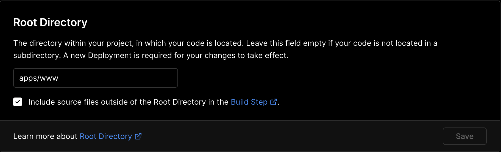
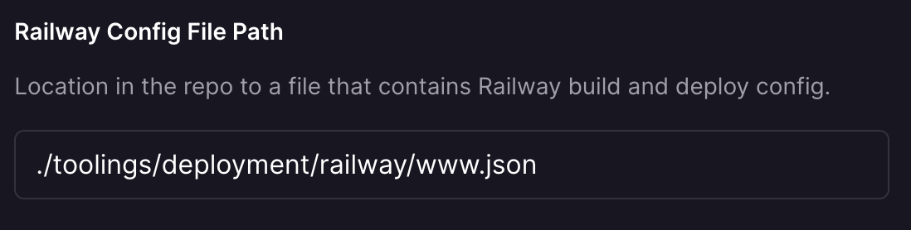
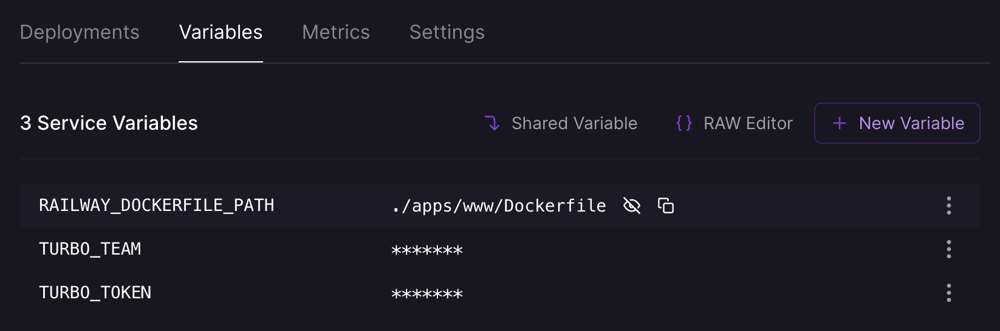
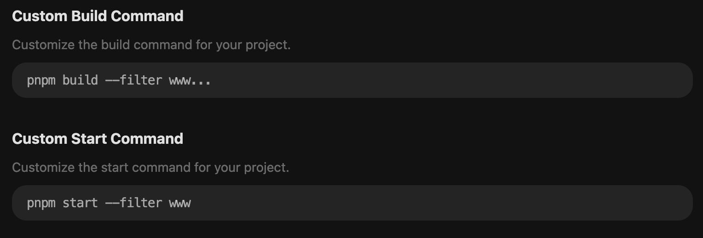

# Chia1104.dev

[](https://chia1104.dev)
[](https://nextjs.org/)
[](LICENSE)
[](https://github.com/chia1104/chia1104.dev)

> This project is actively under development.

A modern full-stack personal website and content management system built with Next.js and Hono, featuring a monorepo architecture powered by Turborepo.

## ✨ Features

### Frontend

- 🚀 **Next.js 16** with App Router and React 19
- 🎨 **Tailwind CSS 4** for styling
- 🎭 **Framer Motion** for animations
- 🌐 **next-intl** for internationalization
- 🎯 **HeroUI** - Modern React component library
- 📊 **Vercel Analytics & Speed Insights**

### Backend

- 🔥 **Hono** - Fast, lightweight backend service
- 🔐 **Better Auth** - Modern authentication solution
- 🌧️ **Drizzle ORM** - Type-safe database operations
- 🗄️ **PostgreSQL** - Primary database
- 💾 **Redis/Upstash** - Caching and rate limiting
- 📨 **Resend** - Email delivery

### Content & AI

- 📄 **MDX** with [Fumadocs](https://fumadocs.vercel.app/) for rich content
- 📝 **Custom CMS** for content management
- 🧠 **AI Integration** - Vector search and text generation
- 🤖 **OpenAI, Anthropic, Google GenAI, Deepseek & Ollama** support

### Developer Experience

- 📦 **Turborepo** - High-performance monorepo build system
- 🧪 **Vitest** - Fast unit testing
- 🎭 **Playwright** - End-to-end testing
- ✍️ **Husky & Lint Staged** - Pre-commit hooks
- 🔍 **Oxlint** - Fast ESLint-compatible linting
- 📐 **TypeScript 6** - Type safety
- 🐳 **Docker** - Containerization support

## 🔨 Tech Stack


## 🚀 Deploy your own

### Vercel

[](https://vercel.com/new/clone?repository-url=https%3A%2F%2Fgithub.com%2FChia1104%2Fchia1104.dev)

- Create a new project on Vercel, select the `apps/www` (or `apps/dash`) folder as the root directory:



### Railway

[](https://railway.app/template/QTqT7m?referralCode=HYbEt0)

- Overwrite the `railway.json` file with the following content (recommended):



- or add the following environment variables:



### Zeabur

you can deploy `www`, `dash` and `service` applications to Zeabur, and make sure that the services name are `www`, `dash` and `service` respectively.



## 🏗️ Project Structure

```bash
chia1104.dev/
├── apps/
│   ├── www/              # Main website (Next.js 16)
│   ├── dash/             # Admin dashboard (Next.js 16)
│   ├── service/          # Backend API service (Hono + Nitro)
│   └── gateway/          # Nginx gateway configuration
├── packages/
│   ├── ai/               # AI integrations (OpenAI, Anthropic, Google, Deepseek, Ollama)
│   ├── api/              # tRPC/ORPC routes and external API clients
│   ├── auth/             # Better Auth configuration
│   ├── contents/         # MDX content management
│   ├── db/               # Drizzle ORM schemas and migrations
│   ├── editor/           # Editor components (Monaco)
│   ├── i18n/             # Internationalization configuration
│   ├── kv/               # Redis/Upstash key-value store
│   ├── meta/             # Project metadata
│   ├── shaders/          # Three.js shaders and WebGL effects
│   ├── tailwind/         # Tailwind CSS configuration
│   ├── themes/           # Theme management and design tokens
│   ├── ui/               # Shared React components
│   └── utils/            # Shared utilities
├── tests/
│   └── www-e2e/          # Playwright end-to-end tests
└── toolings/
    ├── eslint/           # ESLint configuration
    ├── tsconfig/         # TypeScript configurations
    ├── vitest/           # Vitest test configurations
    └── scripts/          # Build and deployment scripts
```

## 🎉 Getting Started

### Prerequisites

- **Node.js** >= 22
- **pnpm** 10.32.1
- **Docker** (optional, for containerized deployment)
- **PostgreSQL** database
- **Redis** instance (optional, for caching)

### Installation

Clone the repository:

```bash
git clone https://github.com/chia1104/chia1104.dev.git
cd chia1104.dev
```

Install dependencies:

```bash
pnpm install
```

Set up environment variables - create `.env` files in the respective app directories (`apps/www`, `apps/dash`, `apps/service`) based on the `.env.example` files.

Initialize the database:

```bash
# Start PostgreSQL and Redis with Docker
pnpm db:up

# Run database migrations
pnpm db:migrate

# (Optional) Seed the database
pnpm db:seed
```

### Development

**Run all applications:**

```bash
pnpm dev
```

**Run specific applications:**

```bash
# Main website (localhost:3000)
pnpm dev:www

# Dashboard (localhost:3001)
pnpm dev:dash

# Backend service
pnpm dev:service
```

### Testing

```bash
# Run unit tests
pnpm test

# Run tests in watch mode
pnpm test:watch

# Run end-to-end tests
pnpm test:e2e

# Generate coverage report
pnpm test:cov
```

### Building

```bash
# Build all applications
pnpm build

# Build specific applications
pnpm build:www
pnpm build:dash
pnpm build:service
```

### Docker Deployment

```bash
# Build Docker images
docker build -f Dockerfile.www -t chia1104-www .
docker build -f Dockerfile.dash -t chia1104-dash .
docker build -f Dockerfile.service -t chia1104-service .

# Run containers
docker run -p 3000:3000 chia1104-www
docker run -p 3001:3001 chia1104-dash
docker run -p 8080:8080 chia1104-service
```

### Useful Commands

```bash
# Lint code
pnpm lint

# Format code
pnpm format

# Type check
pnpm type:check

# Database studio
pnpm db:studio

# Clean workspace
pnpm clean:workspaces
```

## 📚 Key Technologies

### Authentication

- **Better Auth** - Modern, type-safe authentication library
- Email/password authentication
- OAuth providers support
- Session management with Redis

### Database & ORM

- **Drizzle ORM** - Lightweight TypeScript ORM
- **PostgreSQL** - Relational database
- Type-safe queries and migrations
- Database connection pooling

### API Layer

- **tRPC** - End-to-end typesafe APIs
- **ORPC** - Type-safe RPC alternative
- **Hono** - Ultrafast web framework
- Type inference from server to client
- Built-in validation with Zod

### UI Components

- **HeroUI** - Modern React component library
- **Tailwind CSS 4** - Utility-first CSS framework
- **Framer Motion** - Animation library
- Custom design system

### Content Management

- **Fumadocs** - Documentation framework
- **MDX** - Markdown with JSX
- Syntax highlighting with Shiki
- Math equations with KaTeX

## 🤝 Contributing

Contributions are welcome! Please feel free to submit a Pull Request.

1. Fork the repository
2. Create your feature branch (`git checkout -b feature/amazing-feature`)
3. Commit your changes following [Conventional Commits](https://www.conventionalcommits.org/):
   - `feat: add new feature`
   - `fix: resolve a bug`
   - `docs: update documentation`
   - `refactor: restructure code without behavior change`
   - `test: add or update tests`
   - `chore: maintenance tasks (deps, tooling, etc.)`
4. Push to the branch (`git push origin feature/amazing-feature`)
5. Open a Pull Request

## 📝 License

This project is licensed under the MIT License - see the [LICENSE](LICENSE) file for details.

## 👤 Author

### Chia1104

- Website: <https://chia1104.dev>
- GitHub: [@chia1104](https://github.com/chia1104)
- Email: <yuyuchia7423@gmail.com>

## ⭐ Show your support

Give a ⭐️ if this project helped you!
