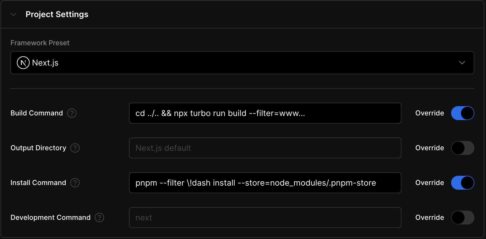

# Chia1104.dev

[](https://vercel.com/chia1104/chia1104/deployments)
[](https://nextjs.org/)
[](LICENSE)
[](https://github.com/chia1104/chia1104.dev)

> The project is still under development.

This is my personal website, a monorepo managed using Turborepo. The development is based on the app structure of NextJS, with the use of TailwindCSS and Typescript. For backend functionalities, PostgreSQL and Redis are utilized to store articles and limit API traffic.

Finally, the website is deployed to the Zeabur platform using Docker, and GitHub Actions are used for integration testing.

## 🔨 Languages and Tools


## 🌐 Deployments

### www

- [Vercel](https://chia1104.dev/)
- [Zeabur](https://chia1104.zeabur.app/)
- [Railway](https://chia1104.up.railway.app/)

### dash

- [Zeabur](https://dash.chia1104.dev/)
- [Railway](https://dash-chia1104.up.railway.app/)

## 🚀 Deploy your own

### Vercel

[](https://vercel.com/new/clone?repository-url=https%3A%2F%2Fgithub.com%2FChia1104%2Fchia1104.dev)

1. Create a new project on Vercel, select the `apps/www` folder as the root directory:


2. Apply the following settings:



| Command         | Script                                                                                 |
|-----------------| -------------------------------------------------------------------------------------- |
| Build Command   | `cd ../.. && npx turbo run build --filter www...`                                      |
| Install Command | `pnpm --filter \!dash --filter \!"./tests/*" install --store=node_modules/.pnpm-store` |

### Railway

[](https://railway.app/template/QTqT7m?referralCode=HYbEt0)

1. Add the following environment variables:


### Zeabur

you can deploy `www`, `dash` and `backend` applications to Zeabur, and make sure that the services name are `www`, `dash` and `backend` respectively.


## 🏗️ Project Structure

```bash
chia1104.dev
├── apps
│   ├── backend (NestJS, microservices)
│   ├── dash (NextJS)
│   └── www (NextJS)
├── packages
│   ├── api (tRPC API, for nextjs)
│   ├── auth (AuthJS)
│   ├── utils (shared utilities)
│   ├── ui (shared components)
│   └── db (prisma orm)
├── config
│   ├── tailwind-config (tailwind config)
│   └── tsconfig (base, nextjs, react)
└── tests
    ├── www-e2e (playwright e2e tests)
    └── dash-e2e (WIP)
```

## 🎉 Get Started

You can run the following commands to initialize the project.

```bash
make init
```

Runs the app in the development mode.

Open <http://localhost:3000> to view it in your browser.

```bash
pnpm dev:www
```

Testing the app.

```bash
pnpm test && pnpm test:e2e
```

Build the docker image

```bash
docker build -f ./apps/www/Dockerfile -t web:v2 .
docker run -p 8080:8080 web:v2
```
