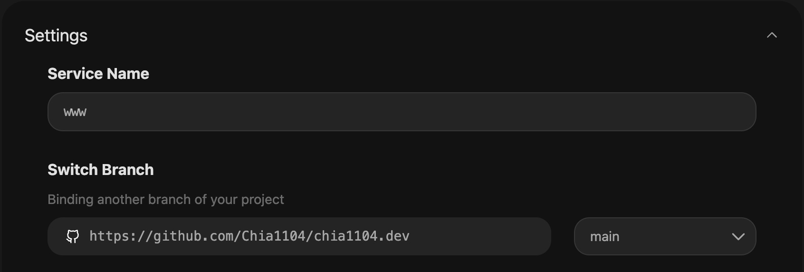

# Chia1104.dev

[](https://chia1104.dev)
[](https://nextjs.org/)
[](LICENSE)
[](https://github.com/chia1104/chia1104.dev)

> The project is still under development.

This is my personal website, developed using Next.js for both the front-end and back-end, with Hono as the back-end service. All projects are managed using Turborepo.

## ✨ Features

- 🚀 Next.js 14 with App Router
- 🔥 Hono - backend services
- 📦 Monorepo - using [Turborepo](https://turbo.build/)
- 📄 MDX - using [Fumadocs](https://fumadocs.vercel.app/) for MDX components
- 📝 CMS - custom CMS for managing content
- 🎨 Tailwind CSS styles
- 🧪 Vitest - unit tests
- 🎭 Playwright - end-to-end tests
- ✍️ Husky & Lint Staged - format code before committing
- 🔒 Auth.js - authorization
- 🌧️ Drizzle - ORM
- 🗄️ Redis - for caching
- 🧠 PG vector search - AI vector search (WIP)
- ✏️ AI editor - for text generation (WIP)

## 🔨 Languages and Tools


## 🚀 Deploy your own

### Vercel

[](https://vercel.com/new/clone?repository-url=https%3A%2F%2Fgithub.com%2FChia1104%2Fchia1104.dev)

- Create a new project on Vercel, select the `apps/www` (or `apps/dash`) folder as the root directory:


### Railway

[](https://railway.app/template/QTqT7m?referralCode=HYbEt0)

- Overwrite the `railway.json` file with the following content (recommended):


- or add the following environment variables:


### Zeabur

you can deploy `www`, `dash` and `service` applications to Zeabur, and make sure that the services name are `www`, `dash` and `service` respectively.



## 🏗️ Project Structure

```bash
chia1104.dev
├── apps
│   ├── service (Hono)
│   ├── dash (NextJS)
│   └── www (NextJS)
├── packages
|   ├── ai (AI vector search / text generation)
│   ├── api (tRPC API)
│   ├── auth (AuthJS)
│   ├── cache (Redis cache)
│   ├── contents (MDX functionality)
│   ├── db (Drizzle orm)
│   ├── tailwind (tailwind config and css files)
│   ├── ui (shared components)
│   └── utils (shared utilities)
└── tests
    └── www-e2e (playwright e2e tests)
```

## 🎉 Get Started

You can run the following commands to initialize the project.

```bash
make init
```

Runs the app in the development mode.

Open <http://localhost:3000> to view it in your browser.

```bash
pnpm dev:www
```

Testing the app.

```bash
pnpm test && pnpm test:e2e
```

Build the docker image

```bash
docker build -f ./apps/www/Dockerfile -t www .
docker run -p 8080:8080 www
```
