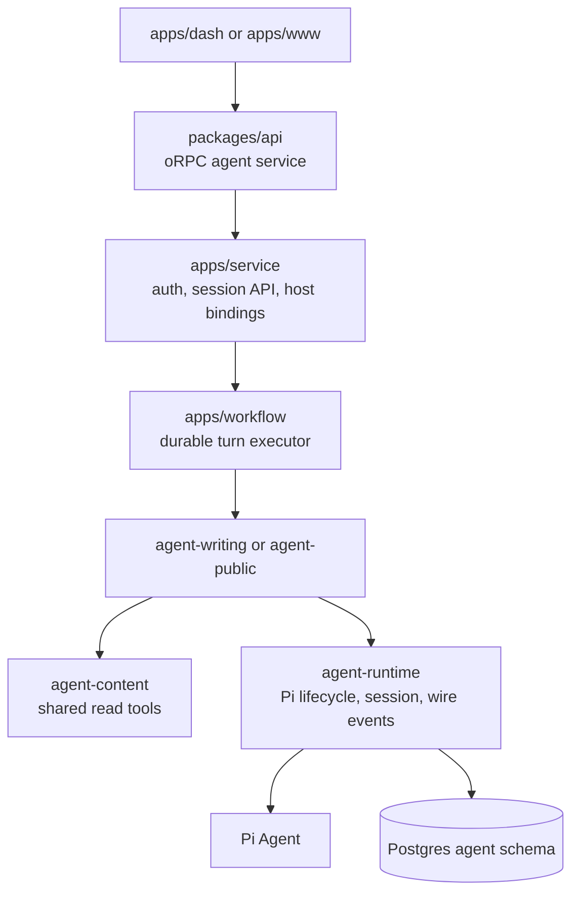
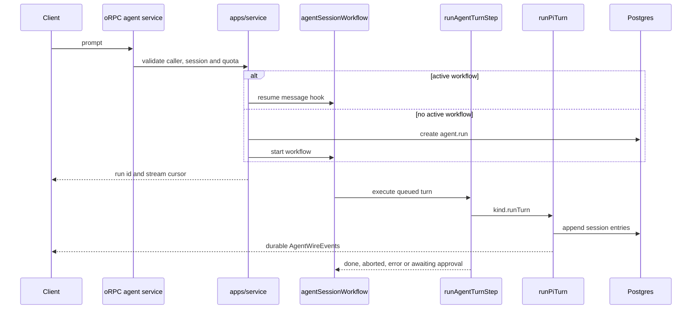
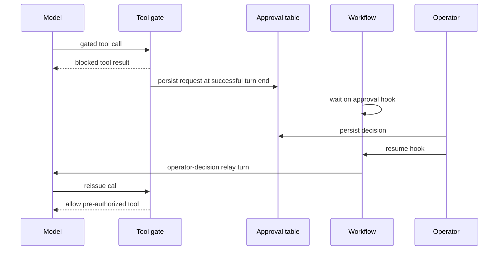

# Agent architecture and turn flow

> Status: as-built
>
> Last updated: 2026-09-01
>
> 中文版：[docs/agent-architecture.zh.md](./agent-architecture.zh.md)
>
> Related: [RAG architecture](./rag-architecture.md), [workflow deployment](./workflow-deployment.md)

This document starts with the system boundaries, then follows one turn through durability, approvals, streaming and maintenance.

## 1. System overview

The stack is Pi-first. Pi's `Agent` runs provider and tool loops; `@chia/agent-runtime` adds the durable session tree, context projection, compaction, navigation and client event contract. There is no engine-neutral adapter.

Two agent kinds ship:

- `writing`: the dashboard's authoring agent, restricted to the configured operator.
- `public`: the public site's reading agent, available to guest sessions.



| Layer                       | Owner                                           | Responsibility                                                |
| --------------------------- | ----------------------------------------------- | ------------------------------------------------------------- |
| Transport and orchestration | `packages/api`, `apps/service`, `apps/workflow` | Auth, oRPC, workflow control, streams and host ports          |
| Execution                   | `@chia/agent-runtime`                           | Pi lifecycle, persistence, approvals, models and wire events  |
| Shared content              | `@chia/agent-content`                           | Read-only blog tools, `ContentReadPort` and `ProfileReadPort` |
| Domain                      | `@chia/agent-writing`, `@chia/agent-public`     | Prompts, tools, policy, model allowlist and domain ports      |
| Client                      | `@chia/agent-elements`                          | Session store, queries and shared chat UI                     |

The stable client boundary is `AgentWireEvent`, not an interchangeable model engine. Pi-specific names and types remain explicit inside the runtime.

## 2. Agent kinds and host boundaries

`agent.session.kind` is the persisted domain discriminator. Session requests resolve it from the database; client input may only confirm it. A caller cannot run an existing session through another kind's tools.

Each host provides an `AgentKindDefinition`:

- `apps/service/src/agents/` binds API-time capabilities, state and credentials.
- `apps/workflow/src/agents/` binds execution-time ports and `runTurn`.
- `packages/api/orpc/services/agent/` owns generic session, run, approval, maintenance, usage and admin behavior.

The oRPC context receives an `agentFactory` built from eager `minTier` values and dynamic definition loaders. Guards can reject callers before loading a domain package or provider SDK. Dynamic imports provide module caching; the factory keeps no definition registry or service cache.

`AgentKindService` contains only behavior shared by every kind. A future kind-specific procedure gets its own `agent.<kind>.*` contract and port rather than widening the generic service.

### Access model

Every agent route resolves a `CallerTier`. Kind and session guards compare that tier with the persisted kind's `minTier` and verify ownership.

| Kind      | Minimum tier | Content visibility                                | Mutable domain state |
| --------- | ------------ | ------------------------------------------------- | -------------------- |
| `writing` | `Root`       | Configured author's drafts and published content  | Drafts and memory    |
| `public`  | `Guest`      | Configured author's published content and profile | None                 |

The generic layer does not carry an admin identity. The writing binding reads the configured author when its content port needs it; the public binding never receives that identity or a write-capable port.

The public kind has only the shared content-read tools, no approval tier, web access, memory or draft. House usage is restricted to a small cheap-model allowlist; native BYOK providers may remain open because the visitor pays for them. Its per-turn budget limits tool calls, repeats and duration.

## 3. Durable state and session tree

The transcript is a tree. `agent.session_entry.parentId` links a branch and `agent.session.leafEntryId` selects the active leaf. `seq` records persistence order across all branches and is safe because each session has one writer at a time.

`PgSessionStorage` implements the runtime's `SessionTree`; tests use `InMemorySessionTree`. Pi session entries are stored as opaque JSON, and retired entry types are ignored rather than migrated. Kind-specific state uses extension tables instead of nullable columns on the shared session row.

```text
agent.session            kind, settings and active leaf
agent.session_entry      transcript tree nodes
agent.run                durable run and turn marker
agent.tool_approval      approval state and audit trail
agent.writing_session    writing-specific state
agent.writing_draft      locale-specific staging buffer
agent.memory             cross-session memory
agent.kind_config        operator kind overrides
agent.task_config        operator task overrides
agent.usage_ledger       provider-call cost ledger
agent.quota_config       quota and running-turn limits
```

Server-side conversational state is durable. The client derives its view from server detail and wire events:

| State                                   | Storage                       |
| --------------------------------------- | ----------------------------- |
| Transcript and branches                 | Postgres session tree         |
| Draft and memory                        | Postgres domain tables        |
| Approvals and run metadata              | Postgres agent tables         |
| Message inbox, pauses and event streams | Workflow backend              |
| Client request state                    | TanStack Query                |
| Client live turn state                  | One zustand store per session |

## 4. One turn



### Durable driver

Each session workflow owns one deterministic `agentMessageHook`. `getConflict()` registers it before the first turn and prevents two active workflows from owning the same session inbox. Resumed hook payloads are durable workflow events consumed in order.

A message submitted during a running turn waits for the current turn and approval handshake to finish. Enqueue is refused while approval is undecided, while a new workflow has not registered its hook, or for the reserved `/end` sentinel.

One workflow may drive up to 200 turns. Workflow functions handle orchestration only; database, provider, timer and network operations stay inside steps. `runAgentTurnStep` has `maxRetries = 0` because a turn may already have appended entries or performed an approved side effect. Provider retries stay inside Pi; retrying a failed turn requires a new user message.

Starts, hook resumes and cancellations cross the authenticated `WorkflowControl` contract from `service` to the single workflow process. Status and stream reads use the shared World storage. See [workflow deployment](./workflow-deployment.md).

### Runtime lifecycle

The production path is:

```text
runAgentTurnStep → kind.runTurn → runPiTurn → new Agent
```

`runPiTurn`:

1. Projects the active branch into model messages and resolves the caller-scoped model.
2. Installs the turn budget, approval gate, volatile context, state-change hook, abort signal and event mapper.
3. Persists each completed user, assistant and tool-result message before emitting its wire event.
4. Runs Pi and classifies provider, host, abort and budget failures.
5. Persists approval requests atomically after a successful provider turn.
6. Auto-compacts only successful turns with no pending approval.
7. Emits terminal events and flushes the durable writer.

Host hook failures are recorded as internal errors and abort the turn. The model must never continue without required host state such as volatile context.

### Prompt layering

The system prompt contains stable rules, skill indexes and approval posture. The public kind also renders the author's published profile into it, one locale under a character cap, because the profile is bounded and changes only when the operator edits it. Turn-specific data such as the clock, draft state and saved memories enters through Pi's context hook as a final volatile user message. It is recomputed for every provider request and never persisted.

This keeps the provider's cached prefix stable and prevents changing context from accumulating in the transcript.

### Turn budget

Every kind supplies an `AgentTurnBudget` because Pi continues while the model emits tool calls.

| Limit              | Result when crossed                                                   |
| ------------------ | --------------------------------------------------------------------- |
| `maxRepeats`       | Return a tool error for repeated identical calls.                     |
| `maxToolCalls`     | Refuse later tools and ask the model to answer from existing results. |
| `hardMaxToolCalls` | Abort with `budget_exhausted`.                                        |
| `maxDurationMs`    | Abort provider generation when the deadline expires.                  |

Budget checks run before approval checks, so a refused call cannot create an approval request.

## 5. Approval and abort

### Durable approval handshake

Approval never waits on an in-memory promise. A gated call ends the current turn and resumes through the workflow later.



A call is allowed when its tier needs no approval, the session auto-approves that tier, the call ID was approved, or the tool is pre-authorized for the relay turn. Decisions are written before the hook resumes. Rejections also create a relay turn so the model can respond to the operator's comment.

Requests are persisted as one batch only after the provider turn succeeds. A failed turn leaves no undecided rows and never parks the workflow on an unresolvable hook. Relay messages are marked as operator decisions so clients render them as notices rather than user-authored prompts.

The live stream may announce a request before persistence so the UI can render it promptly, but the card remains locked until `run:end{awaiting_approval}` or a reloaded pending row confirms it. Any other terminal state retracts the tentative request.

### Abort path

Cancelling a workflow run does not interrupt a step already executing. Each session run therefore has a small durable abort-controller workflow parked on a hook. The turn step subscribes to its stream and passes the resulting `AbortSignal` to Pi and host ports.

Abort resumes the controller, waits for the turn's `run:end` within a deadline, then cancels the session workflow and marks its run row. Partial assistant output is persisted as aborted; approvals and compaction do not run. A later prompt starts a new workflow over the existing transcript.

## 6. Events, streaming and reconnect

Clients receive a bounded event contract:

```text
run:start · user · assistant:start · assistant:delta · assistant:end
tool:start · tool:update · tool:end
approval:request · approval:resolved
session:compacted · session:rewound · state:changed · error · run:end
```

Key invariants:

- `messageId` is the persisted session-entry ID in both live and replayed events.
- History and live turns fold through the same `applyEvent` reducer.
- Compaction changes model context, not visible history; transcript replay still walks the full leaf ancestry.
- Every started tool receives a terminal event. Replay closes interrupted calls as aborted.
- Wire errors expose only a classified kind; provider and host details stay in server logs.
- `tool:end.details` is clipped before durable storage; the model reads the original tool content.

Each run has a coarse event stream and a batched delta stream. Coarse events flush pending deltas first. A turn cursor records both stream positions so reconnecting does not append old deltas to a transcript already loaded from Postgres.

### Rejoining a running turn

The server is authoritative. On mount, the client loads `agent.sessions.get`; if the session reports an active turn, it attaches through `agent.sessions.chat`.

`agent.run.metadata.turn` stores:

- `seqBefore`: the newest persisted entry before the turn.
- The first coarse and delta stream positions for the turn.
- A `running` marker.

While running, `get` replays only entries through `seqBefore` and `attach` supplies later events. This split prevents duplicates during refresh. The marker is maintained by acceptance and the turn step because the Workflow SDK reports hook-waiting and step-running workflows with the same status.

## 7. Compaction, navigation and forks

Maintenance operates on the session tree without constructing an `Agent`.

| Operation | Behavior                                                                                                                   |
| --------- | -------------------------------------------------------------------------------------------------------------------------- |
| Compact   | Appends Pi's summary and retained tail as the new leaf. No-op branches are rejected without a model call.                  |
| Navigate  | Moves the active leaf in place and may summarize the abandoned branch.                                                     |
| Fork      | Copies a branch into a new session and preserves the source session. Kind state is copied through `definition.state.fork`. |

Navigate, fork and manual compaction are refused while a turn runs or approval is pending. They serialize with prompt and approval acceptance through one per-session Postgres advisory lock. A new `agent.run` row is created before the workflow starts, so maintenance sees the lease immediately.

Maintenance model calls have their own deadline and run inside the lock transaction. Timeout cancels the model call and rolls back all changes. Queries inside the transaction remain sequential because they share one connection.

Kind state is not versioned with transcript entries. Rewinding keeps the current writing draft; forking copies the draft as it exists at fork time, not as it existed at the target entry.

Automatic compaction runs only after a successful turn without pending approvals. A compaction failure does not fail the completed turn.

## 8. Identity, models and usage

### Guest identity

Better Auth's anonymous plugin creates a real user row for a guest. That row can own sessions, approvals and usage. When the guest signs in, `transferAgentOwnership` moves those records before the anonymous row is removed, so authentication does not reset quota.

Routes using the normal session guard still require a signed-in account. Agent routes opt into guest callers through `callerPolicy`.

### Models and credentials

`Models` is created per caller and turn. BYOK providers are registered only when that caller supplies a key. The selected model and Pi stream function use the same credential-bearing collection; process-wide default model functions are forbidden.

Each domain owns its model allowlist. One-shot tasks may use the session model or a pinned house model, but never borrow unrelated ambient credentials.

### Usage ledger and quota

Every billed provider call creates one `agent.usage_ledger` row, including turns, compaction, branch summaries, titles and lesson extraction. Cost is stored in integer micro-dollars with the provider ID, so house spend and BYOK spend remain one ledger with different filters. Ledger rows survive session deletion.

Usage recording is best-effort and outside the response critical path. A failed ledger insert is logged and loses at most one call in the user's favor.

`Root` is unlimited. Other tiers share a weekly house-spend allowance and a running-turn cap. Quota is checked under the session lock before accepting any model call; prompt and approval acceptance also take a per-user advisory lock before counting active turns across sessions.

The limit is soft: a call may start while allowance remains and exceed it by at most that turn's bounded cost. Before reading usage or enforcing the running cap, the service reconciles stale turn markers against the Workflow World.

## 9. Writing domain and memory

The writing kind composes host-owned ports:

| Port          | Responsibility                                |
| ------------- | --------------------------------------------- |
| `ContentPort` | Read author content and commit staged drafts. |
| `WebPort`     | Search and fetch through Firecrawl.           |
| `MemoryPort`  | Persist and retrieve cross-session memory.    |
| `DraftStore`  | Stage locale-specific changes before commit.  |

Only commit-tier tools write live feed data and require approval. Draft and memory writes are reversible. Destructive deletion and image upload are not agent tools.

Web search returns snippets; `fetch_url` performs one page scrape and records the page through `MemoryPort`. Host ports receive the turn abort signal. There is no direct outbound fetch in the domain package.

### Memory lifecycle

`agent.memory` stores:

| Kind     | Meaning                                      | Activation                      |
| -------- | -------------------------------------------- | ------------------------------- |
| `source` | A page read by `fetch_url`, keyed by URL     | Active immediately              |
| `fact`   | A cited conclusion saved by the model        | Active immediately              |
| `lesson` | A writing preference extracted from feedback | Pending until operator approval |

Every memory write goes through `packages/api/memories/write.ts` and schedules RAG indexing when needed. Only live, active memory is indexed. See [RAG architecture](./rag-architecture.md#6-agent-memory-resource).

Facts and sources reach the model only through visible `search_memory` and `get_memory` tool calls. The volatile context lists bounded identifiers for memories saved in the current session. Active lesson titles are always included because they are standing preferences.

`memoryConsolidationWorkflow` runs after a successful `commit_draft` turn or by dashboard request. It reads operator messages and assistant prose, excludes tool results, and produces at most three pending lessons. Unreviewed model output never becomes a standing prompt instruction.

### Content visibility

Visibility is fixed when the host constructs `ContentReadPort`:

- `author` can read the configured author's drafts and published content.
- `public` can read only published content and cannot widen that filter.

The public kind receives the public port and never receives `WebPort` or write capabilities. Its `ProfileReadPort` is built the same way: the host lists only the configured author's published profile rows, and the kind renders them into the system prompt rather than exposing a tool.

## 10. Operator configuration

Three override sources are stored separately:

| Source                | Row                  | Controls                                                |
| --------------------- | -------------------- | ------------------------------------------------------- |
| Agent kind definition | `agent.kind_config`  | New-session defaults and kind-specific preferences      |
| `AGENT_TASKS`         | `agent.task_config`  | Model, prompt and exposed parameters for one-shot tasks |
| Quota defaults        | `agent.quota_config` | Weekly allowance, time zone and running-turn cap        |

Kind defaults are copied when a session is created; later edits do not mutate existing sessions. Kind `config` is loaded every turn, so preference changes apply on the next turn. Safety boundaries such as tool tiers, approval requirements, turn budgets and model allowlists remain in code.

Tasks cover title generation, compaction, branch summaries and lesson extraction. A task may default to the session model or a house model. Operator-pinned task models always use the house catalogue.

Admin writes are validated against their code definition before persistence. API views return `default`, `override` and `effective` values so the dashboard does not reimplement resolution rules.

## 11. Adding an agent kind

1. Add `@chia/agent-<kind>` with prompts, tools, policy, model allowlist and domain ports. Compose `@chia/agent-content` when it reads the blog.
2. Add an extension table only when the kind has persisted state.
3. Add service and workflow bindings with matching `minTier` values and dynamic loaders.
4. Implement `runTurn` through the domain's `run<Kind>Turn`; register any one-shot tasks in `AGENT_TASKS`.
5. Reuse `runPiTurn`, wire events, approvals, session storage and durable workflow plumbing.

Do not add an engine adapter, capability plugin system or provider-neutral handle until a second execution engine creates a concrete requirement.

## 12. Reference map

| Concern                               | Location                                                                                              |
| ------------------------------------- | ----------------------------------------------------------------------------------------------------- |
| Pi turn, approval, budget, compaction | `packages/agent-runtime/src/pi/`                                                                      |
| Session tree and Postgres storage     | `packages/agent-runtime/src/session/`                                                                 |
| Wire schema, replay and fold          | `packages/agent-runtime/src/wire/`                                                                    |
| Shared content tools                  | `packages/agent-content/src/`                                                                         |
| Writing and public domains            | `packages/agent-writing/src/`, `packages/agent-public/src/`                                           |
| Kind bindings and tasks               | `packages/agent-host/src/`, `apps/service/src/agents/`, `apps/workflow/src/agents/`                   |
| Generic oRPC agent service            | `packages/api/orpc/services/agent/`                                                                   |
| Workflow and turn step                | `apps/workflow/src/workflows/agent-session.workflow.ts`, `apps/workflow/src/steps/agent-turn.step.ts` |
| Database schema                       | `packages/db/src/schemas/agent.schema.ts`                                                             |
| Shared client                         | `packages/agent-elements/src/`                                                                        |
