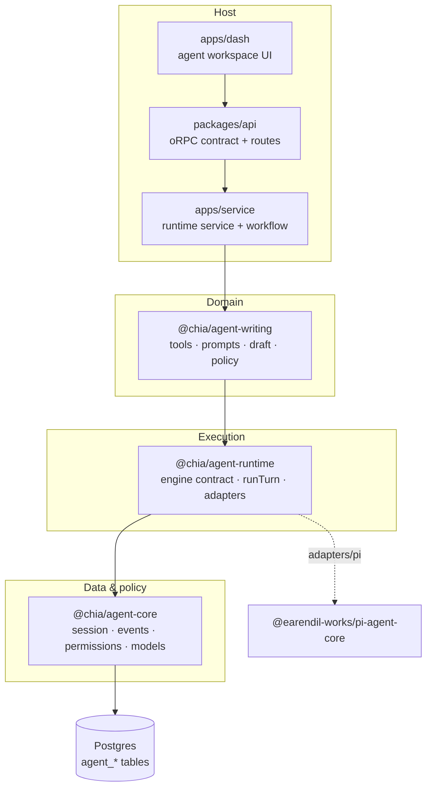
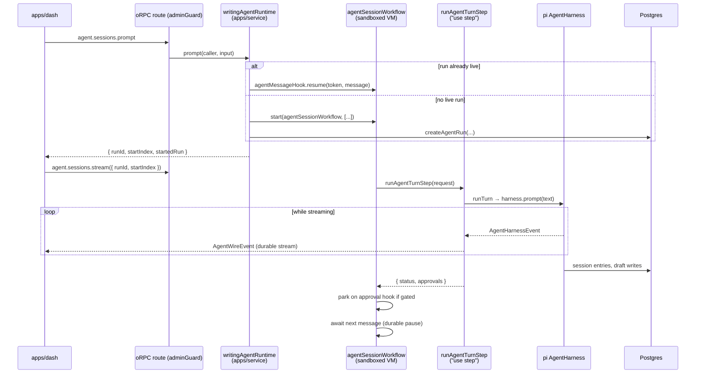
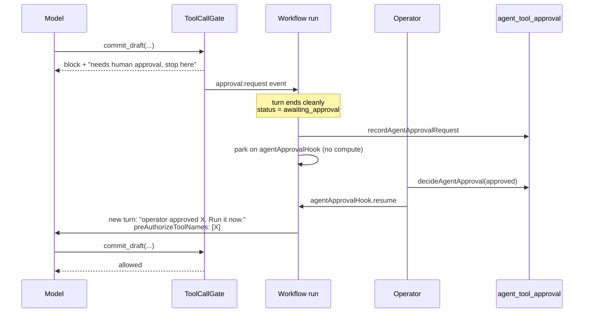

# Agent Architecture & Turn Flow

> Status: as-built
> Last updated: 2026-07-31
> 中文版：[docs/agent-architecture.zh.md](./agent-architecture.zh.md)
> Related: [docs/rag-architecture.md](./rag-architecture.md), [plans/service-transport-unification-plan.md](../plans/service-transport-unification-plan.md)

This document describes how the agent stack in this repo is layered, how one turn executes end to
end, where every piece of state lives, and what it takes to add a second agent kind.

The only agent kind shipped today is **`writing`** — a blog authoring assistant that lives in the
admin dashboard. Everything generic about it has been pushed down into shared packages so that the
next kind is a sibling package, not an edit to the core.

## 1. Layering

Four layers, each with a single reason to exist:

| Layer                 | Package / app                               | Owns                                                                               | Must not know                      |
| --------------------- | ------------------------------------------- | ---------------------------------------------------------------------------------- | ---------------------------------- |
| **Data & policy**     | `@chia/agent-core`                          | Session tree over Postgres, wire event contract, approval gate, model registration | What an agent is _for_             |
| **Execution**         | `@chia/agent-runtime`                       | Engine contract, turn lifecycle, provider adapters, client transports              | Any specific domain, any DB schema |
| **Domain (one kind)** | `@chia/agent-writing`                       | Tools, prompts, skills, draft staging buffer, tier policy, model allowlist         | Transport, auth, durable execution |
| **Host**              | `apps/service`, `packages/api`, `apps/dash` | Wiring, oRPC routes, durable workflow, auth, UI                                    | pi internals                       |



pi (`@earendil-works/pi-agent-core` / `pi-ai`) is the harness the runtime currently adapts. It is
deliberately quarantined: `packages/agent-core/src/session/index.ts` re-exports the pi symbols
other code needs, and the only place that constructs an `AgentHarness` is
`packages/agent-runtime/src/adapters/pi.ts:70`. pi is on 0.x and churns; nothing outside those two
files should have to care.

## 2. Key concepts

### 2.1 Agent kind

`agent_session.kind` is a string registry key (`"writing"` today). It selects three things:

- the oRPC-facing runtime implementation (`registerAgentRuntime(kind, impl)`)
- the workflow step's turn handler (`AGENT_TURN_HANDLERS` in `apps/service/src/steps/agent-turn.step.ts:880`)
- the extension row that holds kind-specific session state (`writing_agent_session`)

Session-scoped requests resolve the kind **from the persisted row**, never from client input — a
client cannot drive an existing session through another kind's tools by passing a different key
(`packages/api/orpc/routes/agent.route.ts:30`).

### 2.2 Tool tiers

Tiers are per-kind policy, so `@chia/agent-core` types them as plain strings. The writing agent
narrows them to three, in increasing blast radius:

| Tier     | Meaning                                           | Approval | Bumps `state:changed` |
| -------- | ------------------------------------------------- | -------- | --------------------- |
| `read`   | Pure reads and outbound fetches. Nothing changes. | no       | no                    |
| `draft`  | Writes to the staging buffer only. Reversible.    | no       | yes                   |
| `commit` | Writes `feed` / `feed_translation` / `content`.   | **yes**  | yes                   |

An unknown tool name falls back to the _most restrictive_ tier for this kind
(`packages/agent-writing/src/policy.ts:19`). The point of injecting the policy is that another kind
picks its own fallback rather than inheriting `commit`.

### 2.3 `AgentPolicy`

The seam that used to be a module-level lookup table of the writing agent's tool names. A kind
supplies `tierOf`, `labelOf`, `requiresApproval`, `changesState`, `summarize` and a `stateScope`;
core consumes it for classification, gating and event mapping
(`packages/agent-core/src/types.ts:38`).

### 2.4 Session tree

The transcript is a **tree**, not a flat log: `agent_session_entry.parentId` points at the previous
entry on the branch, `agent_session.leafEntryId` marks the active leaf. That is what makes "rewind
three steps and rewrite from another angle" possible, and it is the shape pi's `SessionStorage` port
expects. `@chia/agent-core/session` implements that port over these tables.

## 3. Data model

```
agent_session                 -- generic; discriminated by `kind`
├── id (uuidv7, app-generated) -- opaque: ids travel through model context and the event stream
├── user_id, kind, title
├── provider_id / model_id / thinking_level
├── active_tool_names          -- null = every registered tool is active
├── auto_approve  jsonb        -- tiers pre-approved for the whole session
├── runtime_config / config_version
└── leaf_entry_id              -- active leaf of the session tree

agent_session_entry            -- one tree node; (session_id, id) PK, `seq` for insertion order
agent_run                      -- one execution; partial unique index enforces one active per session
agent_pending_message          -- steer / followUp queue; rows kept after consumption
agent_tool_approval            -- (session_id, tool_call_id) PK; the durable audit trail

writing_agent_session          -- 1:1 extension: target_feed_id, feed_meta
writing_agent_draft            -- (session_id, locale) PK: meta jsonb + content
```

Two deliberate choices:

- **Extension tables, not nullable columns.** A second kind adds a sibling of
  `writing_agent_session` instead of widening the shared table.
- **Opaque `payload` jsonb on entries.** Entry types mirror the harness's own union
  (`message`, `compaction`, `modelChange`, `label`, …). Storing them opaquely lets the harness
  evolve its entry types without a migration.

## 4. One turn, end to end



### 4.1 Enqueue (`prompt`)

`packages/api/orpc/routes/agent.route.ts` → `apps/service/src/services/agent-runtime.service.ts:424`.

The route is behind `adminGuard()`, which pins to the configured admin id — a logged-in non-admin
cannot reach these procedures at all. Ownership is then **re-checked** against
`agent_session.user_id`, because the session id arrives from client input: the guard proves who is
calling, not what they may open.

The runtime then either resumes the session's live run through its message hook, or starts a fresh
one. Three refusals happen here rather than deeper down, because each would otherwise look to the
operator like their message silently vanished:

| Condition                      | Why it is refused                                                             |
| ------------------------------ | ----------------------------------------------------------------------------- |
| An approval is still undecided | The run is parked on the _approval_ hook; a message would sit unread          |
| The hook is not registered yet | `createHook()` commits on first suspend, so there is a window after `start()` |
| `text === "/end"`              | Reserved sentinel that ends the session's run                                 |

`prompt` returns as soon as the message is accepted, along with the stream cursor
(`startIndex` = current tail + 1) so the client tails _this_ turn instead of replaying the session.

### 4.2 Durable driver (`agentSessionWorkflow`)

One durable run per session, capped at `MAX_TURNS_PER_RUN = 200`. The run is a _driver_, not the
conversation store: it waits for the next message, executes a turn as a step, and parks on an
approval hook when a gated tool is refused.

The workflow function runs in a **sandboxed VM** — no Node built-ins, no native `fetch`, no
`Date.now()`. Everything real happens in the step; only plain data crosses the boundary. That is
also why hook payload schemas live in `apps/service/src/workflows/hooks/agent.hooks.ts` (pure zod +
`defineHook`) and hook tokens are deterministic (`agent:msg:<sessionId>`,
`agent:approve:<sessionId>:<toolCallId>`) — a request holding only ids can reconstruct them without
a lookup.

What the run buys that an in-process registry could not:

- a turn survives a deploy or restart mid-flight
- an approval can be granted a day later, with no compute burned while parked
- stream replay is durable, so a reconnecting client sees the whole turn

### 4.3 The turn step

`runAgentTurnStep` validates the session and caller, resolves the kind's handler, builds the ports
(`PgSessionRepo`, `PgDraftStore`, `PgPendingMessageStore`, content port), loads already-approved
tool call ids, and calls `writingAgentRuntime.runTurn(...)`.

**`maxRetries = 0`, on purpose.** A turn is not replayable: by the time it fails it may already have
written to the draft buffer, appended to the session tree, or (with `autoApprove`) committed. pi
already retries the _provider_ request internally, which is where transient failures actually live.
A failure surfaces as an `error` event plus `run_failed`; the operator re-prompts and pi rebuilds
context from whatever the partial turn persisted.

### 4.4 `runTurn`

`packages/agent-runtime/src/runtime.ts:63` is the engine-neutral lifecycle:

1. create the engine handle via the kind's `createEngine`
2. emit `run:start` and the `user` event
3. start a 1 s interval that drains the pending-message queue into the engine
4. `prompt(text)` or `promptFromTemplate(name, args)`
5. stop draining, map each `ApprovalRequest` through `toApproval` and `persistApproval`
6. emit `run:end` with `done` | `awaiting_approval` | `error`
7. dispose the engine, then `flushEvents()`

A failed drain never kills the turn — a durable store leaves the message queued for the next tick.

### 4.5 Streaming

Two durable streams per run:

| Stream            | Contents                                                   | Write pattern                                      |
| ----------------- | ---------------------------------------------------------- | -------------------------------------------------- |
| default namespace | coarse events (`tool:*`, `assistant:end`, `approval:*`, …) | one durable write each; few, all matter for replay |
| `agent:deltas`    | `assistant:delta` batches                                  | batched on an ~80 ms window                        |

Every `write()` is a durable write and a turn produces thousands of deltas, so deltas live on their
own namespace: a reconnecting client can replay the coarse transcript cheaply and opt into the
typing animation only if it wants it. A coarse event flushes the delta buffer first, so the two
streams stay consistent with each other.

`stream()` races reads from both readers (rather than draining one then the other) so deltas stay
interleaved with the coarse events they belong to; an exhausted side is swapped for a never-settling
promise so it cannot win the race again
(`apps/service/src/services/agent-runtime.service.ts:501`).

The streams are **not** closed at the end of a turn — a run executes many turns.
`closeAgentStreamsStep` closes them once, when the run itself ends.

## 5. The approval handshake

pi's `tool_call` hook contract is "return `{ block: true, reason }` to refuse", and the refusal
comes back to the model as an error tool result. That is used as the approval handshake **instead of
blocking the harness on an in-memory promise**: a turn parked on a deferred cannot survive a deploy,
whereas a refused tool call leaves the session tree consistent and resumable.



The gate lets a call through on any of four grounds
(`packages/agent-core/src/permissions.ts:57`):

1. its tier does not require approval
2. its tier is in the session's `autoApprove`
3. its `toolCallId` is in `approvedToolCallIds`, read back from `agent_tool_approval`
4. its tool name is in `preAuthorizedToolNames` — this turn only

(4) is what makes the "approve and run" path cost one extra turn instead of a second refusal round.
The decision is **persisted before** the run is woken, so it outlives the run and the gate can read
it back if the run is replaced.

Rejection is not silence: the workflow runs one more turn telling the agent it was declined, with
the operator's comment, so it can acknowledge instead of stopping mid-thought.

## 6. Wire events

`packages/agent-core/src/events.ts` is the single narrowing point between the harness and any
client. pi's `AgentHarnessEvent` is not safe to forward — it carries whole `Model` objects,
`partial` assistant snapshots on every delta, and unbounded tool `details`.

```
run:start · user · assistant:start · assistant:delta · assistant:end
tool:start · tool:update · tool:end
approval:request · approval:resolved
session:compacted · state:changed · error · run:end
```

Two functions matter beyond the schema:

- **`createEventMapper`** — pi event → wire events. Stateful per turn (pi's assistant messages carry
  no id, so it assigns one and accumulates text/thinking into a single `assistant:end`). Create one
  per run; never share.
- **`foldEvents` / `applyEvent`** — folds a live stream _or_ a replayed transcript
  (`entriesToWireEvents`) into the same view model, so the dashboard has exactly one rendering path
  for history and for live output.

`state:changed` is bump-only: it carries a scope (`"draft"`) and a revision, and the client refetches
rather than diffing domain state over the wire.

### 6.1 TanStack AI transport

`@chia/agent-runtime/transports/tanstack-ai` maps the wire events onto the AG-UI event subset
TanStack AI's React client consumes, so `agent.sessions.chat` can drive a standard chat UI. `chat`
is a single procedure that performs the action (prompt or approve), then returns the mapped stream
from the exact cursor the action produced.

## 7. The writing agent

### 7.1 Tools

| Tier     | Tool                                                                                     |
| -------- | ---------------------------------------------------------------------------------------- |
| `read`   | `search_posts` (Algolia or semantic), `get_post`, `list_posts`, `list_tags`, `fetch_url` |
| `draft`  | `read_draft`, `patch_draft_meta`, `write_draft_content`, `edit_draft_content`, `slugify` |
| `commit` | `commit_draft`, `set_published`                                                          |

Registration order is intentional — it is the order pi lists tools to the model, which nudges the
natural workflow: ground yourself, draft, then commit.

`TOOL_TIER_BY_NAME` / `TOOL_LABEL_BY_NAME` live in their own module
(`packages/agent-writing/src/tools/registry.ts`) rather than being derived from the tool objects, so
the permission gate and the event mapper can classify a call without constructing tools — which
would need ports, which would need a database.

Deliberately absent from `commit`: delete, hard-delete and image upload. The agent has no business
removing posts, and presigned uploads stay a human action.

### 7.2 Draft staging buffer

The agent never edits the live blog. It writes to `writing_agent_draft` +
`writing_agent_session.feedMeta`, and `commit_draft` promotes that buffer through the existing feed
procedures. Opening a session against an existing post seeds the buffer from it
(`seedFromPost`), so the agent edits real content instead of guessing at it.

`tagSlugs` is recorded but **not** committed — there is no tag write path in the repo yet, so the
agent proposes tags for a human to apply.

`edit_draft_content` requires a byte-exact `oldString` and raises `EditNotAppliedError` otherwise;
`withLineNumbers` is how the model reads the body back before editing it.

### 7.3 Prompts, skills, templates

`systemPrompt` is passed as a **callback**, not a string, so pi re-evaluates it per turn. Two
sections are therefore always current:

- **Current session** — what is being edited, the site and draft default locale, slug, type, and
  per-locale body size plus which metadata fields are missing. Without it the model burns a tool
  round-trip at the start of every turn just to orient itself.
- **Approval** — different text depending on whether `commit` is in `autoApprove`. When it is not,
  the prompt tells the model the refusal error is _expected_, and that it must not retry or route
  around the gate.

Skills (`mdx-authoring`, `zh-tw-tone`, `en-tone`, `seo-metadata`, `bilingual-parity`) are listed in
the system prompt and read on demand. Prompt templates are operator shortcuts: `/new-post`,
`/translate`, `/seo-pass`, `/rewrite-section`, `/fact-check`.

### 7.4 Model allowlist

`WRITING_MODEL_IDS` is narrow on purpose — a long-horizon authoring agent with write access to the
blog is a bad place to discover that a cheap model ignores tool schemas. Ordered best-first; the
head is the default (`anthropic/claude-sonnet-5`). Ids arrive from a client-supplied setting, so
anything outside the list is rejected even when the gateway would serve it.

The provider is pi-ai's first-class `vercelAIGatewayProvider()`, which talks Anthropic's native
messages API against the same gateway and `AI_GATEWAY_API_KEY` the rest of the repo uses — so native
thinking and prompt caching fidelity are preserved (an OpenAI-compatible shim would have lost both).

### 7.5 Ports

`@chia/agent-writing` declares what it needs from the host and implements none of it:

- **`ContentPort`** — `searchPosts`, `getPost`, `listPosts`, `listTags`, `fetchPage`, `commitDraft`,
  `setPublished`. Implemented in `apps/service/src/services/agent-content.port.ts` against the
  repo's existing repositories and feed services. It does no authorization of its own — `adminGuard`
  already ran.
- **`DraftStore`** — the staging buffer. `PgDraftStore` in production, `InMemoryDraftStore` in tests.

That split is why the tools are testable without a database, and why Algolia/S3/auth concerns never
leak into the domain package.

## 8. Statelessness

There is no in-process registry anywhere. Every piece of state is durable:

| State                      | Home                                                      |
| -------------------------- | --------------------------------------------------------- |
| transcript                 | `agent_session_entry` (queried directly by the dashboard) |
| draft buffer               | `writing_agent_session` + `writing_agent_draft`           |
| approval decisions         | `agent_tool_approval`                                     |
| steering / follow-up queue | `agent_pending_message`                                   |
| turn execution metadata    | `agent_run`                                               |
| pauses + event stream      | the workflow backend                                      |

That is why a mid-turn deploy is survivable, why an approval can be granted a day later, and why the
service can be replicated across instances without a coordination layer.

## 9. Session maintenance

`compact` and `navigate` (rewind) use a **maintenance engine**
(`AgentDefinition.createMaintenanceEngine`): a session and a model, and nothing else — no tools, no
skills, no system prompt, no approval gate, no event subscriptions. Compaction runs on pi's own
`SUMMARIZATION_SYSTEM_PROMPT` and branch summaries on `generateBranchSummary`, so neither can read
the agent's system prompt; building all of that only to discard it was waste. Both mutate the tree,
so both refuse while a run's status is `running`. A merely _live_ run is not enough to refuse on:
parked on the message hook is the normal idle state.

`navigate` returns the whole rebuilt transcript, because changing the branch invalidates the
client's view entirely.

### 9.1 Automatic compaction

Beyond the manual `agent.sessions.compact`, `runTurn` calls `compactIfNeeded()` **at the end of
every turn**. The engine decides for itself, using pi's `estimateContextTokens` and `shouldCompact`
against `contextWindow - reserveTokens`, and reports `null` when it declined. The threshold lives in
the adapter rather than the runtime on purpose: estimating context tokens needs the engine's own
accounting (provider usage where available, a heuristic otherwise), and a second copy of that
arithmetic upstream would drift from it.

Two guards are load-bearing. **Nothing is compacted while an approval is pending** — the horizon
would move out from under the run that resumes later — and **a failed turn keeps its history**,
because a compacted transcript cannot be diagnosed. A compaction failure never takes the turn down
with it; the next turn boundary retries.

After the turn rather than before it: the user never waits on a summarisation call to see their
first token, and the assistant message that just landed carries the provider's own usage, which is
the most accurate signal available. The `session:compacted` event rides the existing stream, so no
client change was needed.

## 10. Steering and follow-up

`AgentHarness.steer()` is a method, not a callback, so a message arriving over HTTP mid-turn cannot
reach the running harness. The transport writes a row to `agent_pending_message`; the turn's drain
loop claims it (atomically, marking it consumed) and replays it into the harness as
`steer()` — interrupts the current turn — or `followUp()` — waits until the turn would otherwise
stop. Rows are kept after `consumedAt` so the transcript can explain why the agent changed course.

The claim marks rows consumed _before_ they are delivered, so anything the harness refuses is
**released back** onto the queue — pi rejects `steer()` on an idle harness, which is exactly what
happens when a turn finishes between the claim and the hand-off. A released message surfaces in the
next turn rather than vanishing.

### 10.1 Wake-up channel

Polling alone means a steer waits up to one drain interval to be noticed. When the cache is Redis, a
payload-free notification on `agent:pending:<sessionId>` tells the running turn to drain now
(`apps/service/src/services/agent-pending-notifier.ts`).

It is strictly an accelerator. The message is already durable in Postgres before the notification is
published, so a dropped notification costs latency and nothing else — which is why the poller stays
at its full rate and why the channel carries no payload. Any other cache provider gets a `null`
notifier and behaves exactly as before.

One subtlety in the drain loop: at most one drain runs at a time, but a notification arriving _after_
the in-flight drain has already claimed its rows cannot simply be coalesced away, or the new message
would wait for the next poll and the channel would buy nothing. Such a request sets a flag and the
drain re-runs when it settles; teardown follows that chain to its end before disposing the engine.

## 11. Adding a second agent kind

Nothing in `@chia/agent-core` or `@chia/agent-runtime` should need to change.

1. **New package** `@chia/agent-<kind>`: tool set, prompts, skills, tier union, `AgentPolicy`, model
   allowlist, domain ports, and a `createEngine` that binds them to an adapter
   (`@chia/agent-runtime/adapters/pi`, or a new one).
2. **Wrap it** with `createAgentRuntime(definition)` for the shared turn lifecycle.
3. **Extension table** for kind-specific session state, `1:1` on `agent_session.id`.
4. **Host wiring** in `apps/service`: a sibling of `agent-runtime.service.ts` that implements the
   `AgentRuntime` port and calls `registerAgentRuntime(kind, impl)` at module load.
5. **Turn handler** registered in `AGENT_TURN_HANDLERS`. Static registration is intentional —
   workflow steps are deployment-versioned bundles, and the workflow function stays free of domain
   imports.

The oRPC contract, the dashboard's event fold, the approval flow and the durable run are all reused
as-is.

## 12. Reference

| Concern                    | File                                                                     |
| -------------------------- | ------------------------------------------------------------------------ |
| Wire events + fold         | `packages/agent-core/src/events.ts`                                      |
| Approval gate              | `packages/agent-core/src/permissions.ts`                                 |
| Session tree over Postgres | `packages/agent-core/src/session/pg-storage.ts`, `pg-repo.ts`            |
| Turn lifecycle             | `packages/agent-runtime/src/runtime.ts`                                  |
| Engine contract            | `packages/agent-runtime/src/engine.ts`                                   |
| pi adapter                 | `packages/agent-runtime/src/adapters/pi.ts`                              |
| TanStack AI transport      | `packages/agent-runtime/src/transports/tanstack-ai.ts`                   |
| Writing policy / tiers     | `packages/agent-writing/src/policy.ts`, `src/types.ts`                   |
| Writing tools              | `packages/agent-writing/src/tools/`                                      |
| System prompt / skills     | `packages/agent-writing/src/prompts/`                                    |
| Durable run                | `apps/service/src/workflows/agent-session.workflow.ts`                   |
| Turn step + event writer   | `apps/service/src/steps/agent-turn.step.ts`                              |
| Transport glue             | `apps/service/src/services/agent-runtime.service.ts`                     |
| oRPC contract / routes     | `packages/api/orpc/contracts/agent.contract.ts`, `routes/agent.route.ts` |
| Schema                     | `packages/db/src/schemas/agent.schema.ts`                                |
| Dashboard UI               | `apps/dash/src/components/agent/`                                        |
