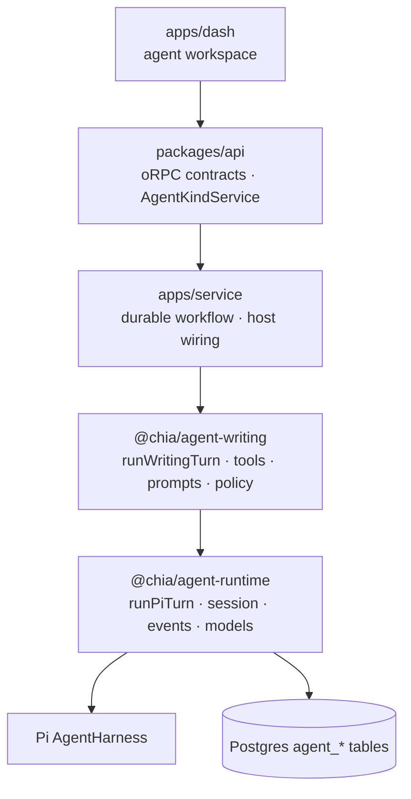
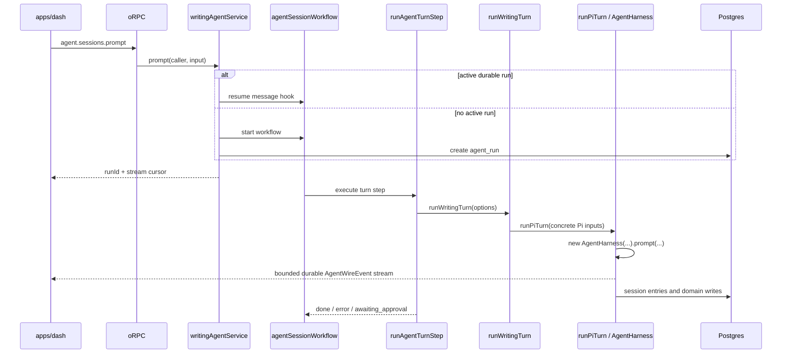

# Agent Architecture & Turn Flow

> Status: as-built
> Last updated: 2026-08-14
> 中文版：[docs/agent-architecture.zh.md](./agent-architecture.zh.md)
> Related: [docs/rag-architecture.md](./rag-architecture.md)

The agent stack is Pi-first. Pi's `AgentHarness`, session tree, tool hooks, model APIs and
compaction semantics are the concrete execution foundation; there is no harness-neutral engine
contract or adapter layer. The only shipped agent kind is `writing`, the dashboard's blog authoring
assistant.

## 1. Layers

| Layer        | Package / app                               | Owns                                                                                                                                             |
| ------------ | ------------------------------------------- | ------------------------------------------------------------------------------------------------------------------------------------------------ |
| Pi execution | `@chia/agent-runtime`                       | Pi turn lifecycle, session persistence, models/providers, approval hook, bounded wire events, pending-message ports and client transport mapping |
| Domain       | `@chia/agent-writing`                       | Writing tools, prompts, skills, model allowlist, policy, draft staging and domain ports                                                          |
| Host         | `apps/service`, `packages/api`, `apps/dash` | DB/KV/credentials, durable workflow and streams, oRPC service port, auth and UI                                                                  |



`@chia/agent-runtime` is deliberately modular, but those modules are not provider-neutral
facades. Names such as `runPiTurn`, `createPiWireEventMapper` and `createPiToolCallGate` state the
real dependency directly. The stable boundary is the bounded `AgentWireEvent` contract sent to
clients, not an interchangeable harness API.

## 2. Agent kind and host service

`agent_session.kind` is a domain discriminator (`writing` today), not a harness discriminator. It
selects:

- the host implementation registered through `registerAgentKindService(kind, service)`;
- the durable step handler in `AGENT_TURN_HANDLERS`;
- the kind-specific extension row, such as `writing_agent_session`.

Session-scoped requests resolve kind from the persisted session. Client input can only cross-check
it, so a caller cannot drive a writing session through another kind's tools.

`packages/api/orpc/agent-service.ts` defines `AgentKindService`. This is a valid host dependency
inversion: `packages/api` cannot own workflow handles, DB access or credentials, so `apps/service`
registers `writingAgentService` at startup. It is unrelated to the removed harness abstraction.

## 3. Policy, sessions and data

### Tool policy

`AgentPolicy` supplies `tierOf`, `labelOf`, `requiresApproval`, `changesState`, `summarize` and an
optional state scope. Tiers remain strings because each domain owns its own vocabulary. Writing
uses:

| Tier     | Meaning                          | Approval | `state:changed` |
| -------- | -------------------------------- | -------- | --------------- |
| `read`   | Reads and outbound fetches       | no       | no              |
| `draft`  | Reversible staging-buffer writes | no       | yes             |
| `commit` | Writes live feed/content data    | yes      | yes             |

Unknown writing tools fall back to the most restrictive tier.

### Session tree and tables

The transcript is a tree. `agent_session_entry.parentId` points to the previous entry on a branch,
and `agent_session.leafEntryId` selects the active leaf. `PgSessionStorage` implements Pi's
`SessionStorage` over these tables, enabling rewind and alternate branches.

```text
agent_session                  generic settings, kind and active leaf
agent_session_entry            Pi session-tree nodes; seq is insertion order
agent_run                      durable execution metadata; one active run per session
agent_pending_message          steer/follow-up queue
agent_tool_approval            durable approval request and audit trail
writing_agent_session          writing-specific 1:1 state
writing_agent_draft            per-locale staging buffer
```

Entry payloads are opaque JSON matching Pi's session-entry union. Kind-specific state uses
extension tables instead of widening the shared session table.

## 4. One turn



### Enqueue and durable driver

The oRPC route is protected by `adminGuard`, then the session guard rechecks ownership. The host
service either resumes the live workflow through its message hook or starts a new run. It rejects a
message while approval is undecided, before the message hook is registered, or when the text is the
reserved `/end` sentinel.

One durable workflow run drives up to 200 turns. The workflow itself runs in a sandboxed VM; DB,
provider, timers and network work stay inside steps, and only plain data crosses the boundary. This
allows turns, approval waits and stream replay to survive process restarts.

`runAgentTurnStep` has `maxRetries = 0`. A whole turn is not replay-safe after it may have appended
session entries or performed approved writes. Provider retry belongs inside Pi. A failed turn emits
an error, keeps its partial transcript, and is retried only by a new operator message.

### Concrete execution path

There is one production path:

```text
runAgentTurnStep → runWritingTurn → runPiTurn → new AgentHarness
```

`runWritingTurn` creates the writing tool context, resolves a model from the caller's credential-
bearing `Models`, and supplies tools, skills, templates, dynamic system prompt and writing policy.

`runPiTurn` owns the complete lifecycle:

1. clamp thinking level to the resolved model and construct one harness for the turn;
2. install the Pi tool-call approval hook and Pi-to-wire event mapping;
3. start serialized pending-message polling and optional notification wake-ups;
4. emit `run:start` and the user event, then invoke prompt or prompt template;
5. stop and await the entire drain chain;
6. persist approval snapshots;
7. auto-compact only after a successful turn with no pending approvals;
8. emit the terminal error/end events, unsubscribe, then flush the durable writer.

## 5. Approval handshake

Pi's tool hook blocks a gated call with a tool error. That refusal is intentional: the turn ends in
a consistent state instead of waiting on an in-memory promise that would be lost on deploy.

```mermaid
sequenceDiagram
    participant M as Model
    participant G as createPiToolCallGate
    participant WF as Workflow
    participant OP as Operator
    participant DB as agent_tool_approval

    M->>G: commit tool call
    G-->>M: blocked; stop and await approval
    G->>DB: persist request
    WF->>WF: park on approval hook
    OP->>DB: persist decision
    OP->>WF: resume hook
    WF->>M: acknowledgement/execution turn
    M->>G: re-issued call
    G-->>M: allowed when pre-authorized
```

A call is allowed when its tier needs no approval, its tier is session-auto-approved, its call id
was durably approved, or its tool name is pre-authorized for this turn. The decision is stored
before the workflow is resumed. Rejections also receive a follow-up turn so the agent can
acknowledge the operator's comment.

## 6. Wire events and streaming

`packages/agent-runtime/src/pi/events.ts` is the live narrowing point. Raw Pi events may carry full
model
objects, repeated partial snapshots and unbounded details; clients receive only:

```text
run:start · user · assistant:start · assistant:delta · assistant:end
tool:start · tool:update · tool:end
approval:request · approval:resolved
session:compacted · state:changed · error · run:end
```

- `createPiWireEventMapper` maps live Pi events and is stateful per turn.
- `entriesToWireEvents` rebuilds history from persisted Pi entries.
- `applyEvent` / `foldEvents` give live and replayed events one dashboard rendering path.
- `@chia/agent-runtime/transports/tanstack-ai` maps the bounded events to the AG-UI subset used by
  TanStack AI.

Each run has a coarse durable event stream and a separately batched delta namespace. A coarse event
flushes queued deltas first. Readers race both streams so deltas remain interleaved with their
coarse events. Streams close only when the durable run ends, not after each turn.

## 7. Pending messages

An HTTP request cannot call methods on a harness running in another step or process. The host first
writes a durable row to `agent_pending_message`; `runPiTurn` claims rows and calls `steer()` or
`followUp()` on its local harness.

Claim marks rows consumed before delivery. If Pi rejects a handoff, the undelivered tail is released
back to the queue. Drains are serialized. A notification received during an active drain requests
one more drain, preventing a lost wake-up. Teardown waits for that chain to settle.

Redis notification is only a latency accelerator. It carries no payload, can fail without failing
the turn, and never replaces polling; the durable truth remains Postgres.

## 8. Compaction and navigation

Maintenance uses concrete operations, not a fake turn-capable handle:

- `compactPiSession` creates a minimal Pi harness and calls `compact()`;
- `navigatePiSession` creates a minimal Pi harness and calls `navigateTree()`;
- writing wrappers resolve the model through the writing allowlist, then call those operations.

No tools, prompts, approvals, pending drains or subscriptions are constructed for maintenance.
Manual compact and navigate are refused while a turn is running. Navigation returns the entire
rebuilt transcript because changing the active branch invalidates the current view.

At a successful turn boundary, `compactPiHarnessIfNeeded` uses Pi's context-token estimation and
threshold. Failed turns and turns awaiting approval are never auto-compacted. Compaction failure is
non-fatal and can be retried at the next clean boundary.

## 9. Models and credentials

`Models` is created per caller/turn. BYOK providers are registered only when that caller supplied a
key, preventing Pi from falling back to unrelated ambient provider keys. The selected model is
resolved from the same credential-bearing collection passed into `AgentHarness`.

The writing package owns its model allowlist. The gateway, OpenAI and Anthropic catalogues come
from Pi; the domain decides which `(providerId, modelId)` pairs it permits.

## 10. Writing domain and durable state

The writing agent reads published content through `ContentPort`, writes drafts through
`DraftStore`, and only commit-tier tools promote staged data to live feed/content tables. Tool order
encourages the model to read, draft and then commit. Destructive deletion and image upload are not
available agent tools.

The dynamic system prompt is recomputed per turn so current draft/session and approval state remain
accurate. Skills and prompt templates live under `packages/agent-writing/src/prompts/`.

There is no in-process conversational state. The process-level kind-to-service map contains only
implementations; all mutable state is durable:

| State                    | Home                                           |
| ------------------------ | ---------------------------------------------- |
| Transcript               | `agent_session_entry`                          |
| Draft                    | `writing_agent_session`, `writing_agent_draft` |
| Approval decisions       | `agent_tool_approval`                          |
| Steering/follow-up queue | `agent_pending_message`                        |
| Run metadata             | `agent_run`                                    |
| Pauses and event streams | workflow backend                               |

## 11. Adding another agent kind

Another domain kind uses the same concrete Pi runtime:

1. add `@chia/agent-<kind>` with tools, prompts, skills, policy, model allowlist and domain ports;
2. add its extension table when it needs kind-specific persisted state;
3. implement `AgentKindService` in `apps/service` and register it by kind;
4. register a durable turn handler that calls the new domain's `run<Kind>Turn`;
5. reuse `runPiTurn`, wire events, approval semantics and durable stream plumbing.

Do not add a harness adapter, engine factory, capability plugin system or provider-neutral handle
until a concrete second execution foundation requires a different seam.

## 12. Reference

| Concern                      | File                                                                                   |
| ---------------------------- | -------------------------------------------------------------------------------------- |
| Pi turn lifecycle            | `packages/agent-runtime/src/pi/turn.ts`                                                |
| Pi approval hook             | `packages/agent-runtime/src/pi/tool-gate.ts`                                           |
| Compaction / maintenance     | `packages/agent-runtime/src/pi/compaction.ts`, `pi/maintenance.ts`                     |
| Wire schema / fold / replay  | `packages/agent-runtime/src/wire/`                                                     |
| Live Pi event mapping        | `packages/agent-runtime/src/pi/events.ts`                                              |
| Models/providers             | `packages/agent-runtime/src/models.ts`                                                 |
| Session over Postgres        | `packages/agent-runtime/src/session/`                                                  |
| Pending-message ports        | `packages/agent-runtime/src/ports.ts`                                                  |
| TanStack AI transport        | `packages/agent-runtime/src/transports/tanstack-ai.ts`                                 |
| Writing composition          | `packages/agent-writing/src/runtime.ts`                                                |
| Writing tools/prompts/policy | `packages/agent-writing/src/tools/`, `src/prompts/`, `src/policy.ts`                   |
| Host service port            | `packages/api/orpc/agent-service.ts`                                                   |
| Host implementation          | `apps/service/src/services/agent.service.ts`                                           |
| Durable workflow / step      | `apps/service/src/workflows/agent-session.workflow.ts`, `src/steps/agent-turn.step.ts` |
| oRPC contract/routes         | `packages/api/orpc/contracts/agent.contract.ts`, `routes/agent.route.ts`               |
| Database schema              | `packages/db/src/schemas/agent.schema.ts`                                              |
| Dashboard UI                 | `apps/dash/src/components/agent/`                                                      |
