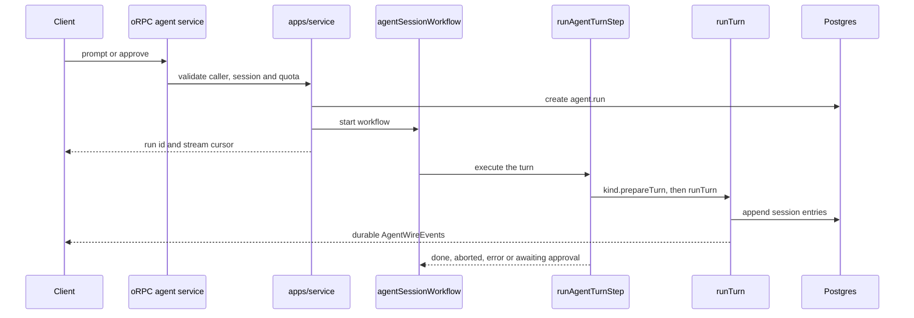
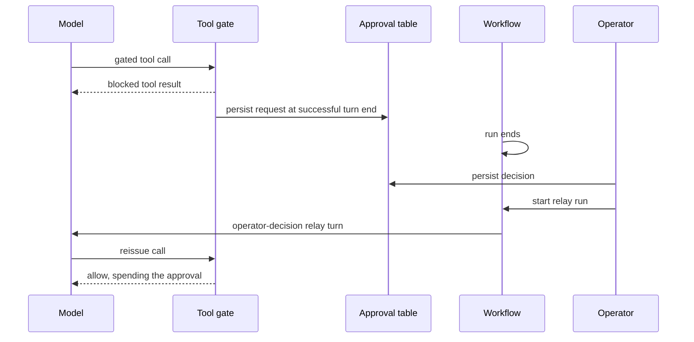

# Agent architecture and turn flow

> Status: as-built
>
> Last updated: 2026-09-24
>
> 中文版：[docs/agent-architecture.zh.md](./agent-architecture.zh.md)
>
> Related: [RAG architecture](./rag-architecture.md), [workflow deployment](./workflow-deployment.md)

This document starts with the system boundaries, then follows one turn through durability, approvals, streaming and maintenance.

## 1. System overview

The stack is Pi-first. Pi's `Agent` runs provider and tool loops; `@chia/agent-runtime` adds the durable session tree, context projection, compaction, navigation and client event contract. There is no engine-neutral adapter.

Two agent kinds ship:

- `writing`: the dashboard's authoring agent, restricted to the configured operator.
- `public`: the public site's reading agent, available to guest sessions.


| Layer                       | Owner                                                | Responsibility                                                |
| --------------------------- | ---------------------------------------------------- | ------------------------------------------------------------- |
| Transport and orchestration | `packages/services`, `apps/service`, `apps/workflow` | Auth, oRPC, workflow control, streams and host ports          |
| Execution                   | `@chia/agent-runtime`                                | Pi lifecycle, persistence, approvals, models and wire events  |
| Shared content              | `@chia/agent-content`                                | Read-only blog tools, `ContentReadPort` and `ProfileReadPort` |
| Domain                      | `@chia/agent-writing`, `@chia/agent-public`          | Prompts, tools, policy, model policy and domain ports         |
| Client                      | `@chia/agent-elements`                               | Session store, queries and shared chat UI                     |

The stable client boundary is `AgentWireEvent`, not an interchangeable model engine. Pi-specific names and types remain explicit inside the runtime; kinds declare tools and prompts in the runtime's own vocabulary and never import Pi.

## 2. Agent kinds and host boundaries

`agent.session.kind` is the persisted domain discriminator. Session requests resolve it from the database; client input may only confirm it. A caller cannot run an existing session through another kind's tools.

`apps/service` hosts an `AgentKindDefinition`; `apps/workflow` hosts an `AgentKindExecutor`, the same definition plus `prepareTurn`:

- `apps/service/src/agents/` binds API-time capabilities, state and credentials.
- `apps/workflow/src/agents/` binds execution-time ports. `prepareTurn` returns the kind's tools, prompts, budget, preflight and approval key, and an optional `settle` that runs after the turn; the step resolves the model and supplies the session, events, usage and approval persistence to `runTurn` itself.
- `packages/services/agent/` owns generic session, run, approval, maintenance, usage and admin behavior.

The oRPC context receives an `agentFactory` built from eager `minTier` values and dynamic definition loaders. Guards can reject callers before loading a domain package or provider SDK. Dynamic imports provide module caching; the factory keeps no definition registry or service cache.

`AgentKindService` contains only behavior shared by every kind. A future kind-specific procedure gets its own `agent.<kind>.*` contract and port rather than widening the generic service.

### Access model

Every agent route resolves a `CallerTier` (`@chia/auth/tier`). Kind and session guards compare that tier with the kind's floor and verify ownership. The floor is the definition's `minTier` raised by the operator's `kind_config.min_tier` override; an override can never lower it, so a kind is never opened wider than its code was written for.

| Kind      | Definition floor | Content visibility                                | Mutable domain state    |
| --------- | ---------------- | ------------------------------------------------- | ----------------------- |
| `writing` | `Root`           | Configured author's drafts and published content  | Shared draft and memory |
| `public`  | `Guest`          | Configured author's published content and profile | Reader reports          |

Better Auth's `get-session` carries `access`: the session's own tier, its dashboard level and the floor of every hosted kind. Frontends decide what to render from it; guards never read it and grade the caller on every request.

The generic layer does not carry an admin identity. The writing binding reads the configured author when its content port needs it; the public binding never receives that identity or a write-capable port.

The public kind has the shared content-read tools and no approval tier, memory or draft; web access is a per-turn grant described below. Without a key of their own a visitor may run only the model pinned as the kind default; a visitor who brought a gateway or vendor key may pick any model that key reaches, because they pay for it. Its per-turn budget limits tool calls, repeats and duration.

A kind may `screen` a typed message before the model runs. The public kind grades the visitor's words and any selected text through the `GuardProvider` seam (`@chia/ai/guard/provider`, off unless `GUARD_PROVIDER` is set): a message at or above `GUARD_THRESHOLD` as an injection attempt or an inappropriate request ends the turn as `refused` and is never persisted, so it cannot steer a later turn from the transcript. The screen fails open after three seconds; the kind's blast radius is bounded by its ports and quota, not by the guard. Thresholds and question wording change only with a `guard-eval` run before and after.

The host grants the public kind `WebPort` for one turn only when the operator's `webAccess` is on, a guard provider is configured and the session's owner is a signed-in account, never a guest. Its `web_search` and `fetch_url` are the kind's own, not the writing kind's: a page is read only if this turn's search returned it, so neither a visitor nor an injected page can aim a fetch at a URL of their choosing; searches and pages are capped per turn because Firecrawl requests are outside the usage ledger; results and pages pass `checkDocument` before the model reads them and are withheld when flagged or when the guard fails; what passes is quoted between a random boundary as untrusted text. Chat markdown renders a model-emitted image as a confirm-first link, since an image would otherwise load its URL unasked.

A signed-in owner also gets `ReportPort` for the turn, bound to that owner and session. `report_issue` files one `feed_report` row per turn against a published post: the passage, the reader's claim, the model's assessment and the corrected wording when either could give one, all stored as quoted text the operator reviews. It changes nothing a visitor reads, and a reader may file a bounded number of reports per day. A guest's prompt says corrections need a signed-in visitor instead of carrying the tool. Filing a report starts a workflow that runs the `report.triage` task, a tool-less call on the house model that stores a verdict and exact replacements checked against the published body, then emails the operator in plain text. Neither step touches the draft; a failed triage still sends the email.

## 3. Durable state and session tree

The transcript is a tree. `agent.session_entry.parentId` links a branch and `agent.session.leafEntryId` selects the active leaf. `seq` records persistence order across all branches and is safe because each session has one writer at a time.

`PgSessionStorage` implements the runtime's `SessionTree`; tests use `InMemorySessionTree`. The runtime owns the entry types and the context projection; both mirror Pi's so a branch reads exactly as it would under Pi's harness. Session entries are stored as opaque JSON, and retired entry types are ignored rather than migrated. Kind-specific state uses extension tables instead of nullable columns on the shared session row.

```text
agent.session            kind, settings and active leaf
agent.session_entry      transcript tree nodes
agent.run                durable run and turn marker
agent.tool_approval      approval state and audit trail
agent.writing_session    the writing kind's extension row
agent.writing_session_draft  the shared drafts a session has worked on, each with the revision it last saw
agent.memory             cross-session memory
agent.kind_config        operator kind overrides
agent.task_config        operator task overrides
agent.usage_ledger       provider-call cost ledger
agent.quota_config       quota and running-turn limits
```

Server-side conversational state is durable. The client derives its view from server detail and wire events:

| State                                     | Storage                       |
| ----------------------------------------- | ----------------------------- |
| Transcript and branches                   | Postgres session tree         |
| Shared draft and memory                   | Postgres domain tables        |
| Approvals and run metadata                | Postgres agent tables         |
| Turn runs, abort pauses and event streams | Workflow backend              |
| Client request state                      | TanStack Query                |
| Client live turn state                    | One zustand store per session |

## 4. One turn



### Durable driver

Every turn is its own workflow run. A prompt and an operator's decision on a gated call each start a run that executes one `runAgentTurnStep` and ends; nothing parks between turns, a run's journal is one turn long, and the session's conversation lives entirely in Postgres. Workflow functions handle orchestration only; database, provider, timer and network operations stay inside steps. `runAgentTurnStep` has `maxRetries = 0` because a turn may already have appended entries or performed an approved side effect. Provider retries stay inside Pi; retrying a failed turn requires a new user message.

One turn at a time. A prompt is refused while a turn is running: admission checks quota and the running cap, and a turn run behind this one would execute after its cost landed without being checked again. It is also refused while an approval is undecided.

Acceptance commits before the workflow is told. The new run row is the record, written under the session lock as the session's lease; delivery follows outside the lock transaction, because a workflow command cannot be rolled back. `createAgentRun` closes the session's previous run row, and a previous run still alive in the World is cancelled. A start the workflow service refused before executing fails the row; a start whose result is unknown keeps the lease, because the workflow may be running. The step then claims its run under the session lock: the row must still be the session's active run, then the marker is written and the workflow run id bound in one transaction, so a bind the service could not write is repaired by the executor and abort and reconcile find the run. A run cancelled, failed or replaced meanwhile executes nothing. Reconciliation closes a dead run only while it still carries the workflow run id the verdict was read against, so a lease the executor claimed in between is left alone. A step that throws leaves its marker running, because the run ends and closes the row. The row records the turn's outcome: `failed` for an error or a thrown step, `cancelled` for an abort, `completed` otherwise; the executor's claim is recorded on the marker, so a closed row also says whether the model ever ran. A bind that fails is followed by an abort on the id only that request holds; the row is failed only once the turn was seen to end, otherwise the lease keeps the session blocked.

Starts, abort resumes and cancellations cross the authenticated `WorkflowControl` contract from `service` to the single workflow process. Status and stream reads use the shared World storage. See [workflow deployment](./workflow-deployment.md).

### Runtime lifecycle

The production path is:

```text
runAgentTurnStep → kind.prepareTurn → runTurn → new Agent
```

A kind declares its tools with `defineTool` from `@chia/agent-runtime/tools`: a zod schema for the parameters and an `execute` closed over the turn's ports that returns the text the model reads and the `details` clients render. A tool's spec (name, description, parameters) is importable without ports, which is what capability listings read. Label, tier and the kind state a successful call changes are the policy's `toolInfo`; `state:changed` follows that declaration, never the tier. The runtime binds each tool to Pi's `AgentTool` for the turn: the zod schema becomes the JSON Schema Pi validates and coerces against, an optional parameter is offered to the model as nullable and a `null` it sends is dropped, and the arguments are parsed with zod before `execute`.

`runTurn`:

1. Appends the operator's message to the tree, then projects the active branch into model messages.
2. Installs the turn budget, approval gate, volatile context, state-change hook and abort signal.
3. Persists each completed assistant and tool-result message before emitting its wire event.
4. Continues Pi's `Agent` from the branch and classifies provider, host, abort and budget failures.
5. Persists approval requests atomically after a successful provider turn.
6. Auto-compacts only successful turns with no pending approval.
7. Emits terminal events and flushes the durable writer.

Host hook failures are recorded as internal errors and abort the turn. The model must never continue without required host state such as volatile context.

### Prompt layering

The system prompt contains stable rules, skill indexes and approval posture. The public kind also renders the author's published profile into it, one locale under a character cap, because the profile is bounded and changes only when the operator edits it. Turn-specific data such as the clock, draft state and saved memories enters through Pi's context hook as a final volatile user message. It is recomputed for every provider request and never persisted.

This keeps the provider's cached prefix stable and prevents changing context from accumulating in the transcript.

### Turn budget

Every kind supplies an `AgentTurnBudget` because Pi continues while the model emits tool calls.

| Limit              | Result when crossed                                                   |
| ------------------ | --------------------------------------------------------------------- |
| `maxRepeats`       | Return a tool error for repeated identical calls.                     |
| `maxToolCalls`     | Refuse later tools and ask the model to answer from existing results. |
| `hardMaxToolCalls` | Abort with `budget_exhausted`.                                        |
| `maxDurationMs`    | Abort provider generation when the deadline expires.                  |

Budget checks run before approval checks, so a refused call cannot create an approval request.

## 5. Approval and abort

### Durable approval handshake

Approval never waits on an in-memory promise or a parked run. A gated call ends the turn and its run; the operator's decision starts a run of its own.



A call is allowed when its tier needs no approval, the session auto-approves that tier, or an unspent approval exists for its approval key. The key is the kind's identity for the call, never the call id, because the re-issued call carries a new one. The writing kind pins `commit_draft` to the content hash of the draft the operator saw and `set_published` to the feed and target state, so a call for another draft, or for a draft edited after the decision, is gated again. An approval is spent durably before the call runs and is good for exactly one call. The hash it was granted for travels with the call: `commit_draft` applies that content and the apply service locks the draft row and checks its hash in the transaction that writes the feed, so a draft that changed between the decision and the write is refused with `CONFLICT`. Under session auto-approve the call commits the content it read itself, under the same lock.

A decision is written once, on a pending row, in the transaction that writes the relay run's row and names that run on the decision. `approve` on a decided row delivers the recorded decision again only when its relay run never executed, that is the row closed with the marker still unclaimed; a relay the executor claimed, whatever it ended as, or whose fate is still unknown, starts nothing. Rejections also create a relay turn so the model can respond to the operator's comment.

One request per turn: a second gated call in the same turn is refused without being recorded, so one decision answers one request. The request is persisted only after the provider turn succeeds; a failed turn leaves no undecided rows. Relay messages are marked as operator decisions so clients render them as notices rather than user-authored prompts.

The live stream may announce a request before persistence so the UI can render it promptly, but the card remains locked until `run:end{awaiting_approval}` or a reloaded pending row confirms it. Any other terminal state retracts the tentative request.

### Abort path

Cancelling a workflow run does not interrupt a step already executing. Each turn run therefore has a small durable abort-controller workflow parked on a hook. The turn step subscribes to its stream and passes the resulting `AbortSignal` to Pi and host ports.

Abort resumes the controller, waits for the turn's `run:end` within a deadline, then cancels the run and marks its row. Partial assistant output is persisted as aborted; approvals and compaction do not run.

## 6. Events, streaming and reconnect

Clients receive a bounded event contract:

```text
run:start · user · assistant:start · assistant:delta · assistant:end
tool:start · tool:update · tool:end
approval:request · approval:resolved
session:compacted · session:rewound · state:changed · error · run:end
```

Key invariants:

- `messageId` is the persisted session-entry ID in both live and replayed events.
- `user` events carry the operator's text and their labelled attachments; the block the model read for those attachments lives only in the persisted message.
- History and live turns fold through the same `applyEvent` reducer.
- Compaction changes model context, not visible history; transcript replay still walks the full leaf ancestry.
- Every started tool receives a terminal event. Replay closes interrupted calls as aborted.
- Wire errors expose only a classified kind; provider and host details stay in server logs.
- `tool:end.details` is clipped before durable storage; the model reads the original tool content.
- A durable stream write that fails is logged and does not fail the turn: its entries and side effects are already durable, and a client that misses the event reloads the session.

Each run has a coarse event stream and a batched delta stream. Coarse events flush pending deltas first. A turn cursor records both stream positions so reconnecting does not append old deltas to a transcript already loaded from Postgres.

### Rejoining a running turn

The server is authoritative. On mount, the client loads `agent.sessions.get`; if the session reports an active turn, it attaches through `agent.sessions.chat`.

`agent.run.metadata.turn` stores:

- `seqBefore`: the newest persisted entry before the turn.
- The first coarse and delta stream positions for the turn.
- A `running` marker.

While running, `get` replays only entries through `seqBefore` and `attach` supplies later events. This split prevents duplicates during refresh. The marker is maintained by acceptance and the turn step because the Workflow SDK reports a run winding down and a step executing with the same status.

## 7. Compaction, navigation and forks

Maintenance operates on the session tree without constructing an `Agent`.

| Operation | Behavior                                                                                                                   |
| --------- | -------------------------------------------------------------------------------------------------------------------------- |
| Compact   | Appends Pi's summary and retained tail as the new leaf. No-op branches are rejected without a model call.                  |
| Navigate  | Moves the active leaf in place and may summarize the abandoned branch.                                                     |
| Fork      | Copies a branch into a new session and preserves the source session. Kind state is copied through `definition.state.fork`. |

Navigate, fork and manual compaction are refused while a turn runs or approval is pending. They serialize with prompt and approval acceptance through one per-session Postgres advisory lock. A new `agent.run` row is created before the workflow starts, so maintenance sees the lease immediately.

Maintenance model calls have their own deadline and run inside the lock transaction. Timeout cancels the model call and rolls back all changes except the usage ledger row, which is written on a connection outside the transaction because the call was billed. Queries inside the transaction remain sequential because they share one connection.

Kind state is not versioned with transcript entries. Rewinding keeps the current drafts; forking copies the session's draft references, so both sessions keep working on the same shared rows.

Automatic compaction runs only after a successful turn without pending approvals. A compaction failure does not fail the completed turn.

## 8. Identity, models and usage

### Guest identity

Better Auth's anonymous plugin creates a real user row for a guest. That row can own sessions, approvals and usage. When the guest signs in, `transferAgentOwnership` moves those records before the anonymous row is removed, so authentication does not reset quota.

Routes using the normal session guard still require a signed-in account. Agent routes opt into guest callers through `callerPolicy`.

### Models and credentials

A model ref names a provider and that provider's id (`vercel-ai-gateway` + `anthropic/claude-sonnet-5`, or `anthropic` + `claude-sonnet-5`), so it also names who pays. The gateway runs on the house key or, when the caller brought one, on their gateway key; a native provider exists only on the caller's own key. Nothing is inferred from which keys happen to be present.

`Models` is created per caller and turn from the request's credentials, and every policy decision receives the same credentials as key presence (`AgentModelAccess`). Native providers are registered only when that caller supplies the key. The selected model and Pi stream function use the same credential-bearing collection; process-wide default model functions are forbidden.

Each domain owns its model policy, decided per ref and caller. One-shot tasks run on the house gateway key, never on a caller's key.

A session row names a model only when the caller chose one. `null` columns mean the session follows the kind's effective default, read per turn, so a default is never copied onto a row and an operator's change reaches every unpinned session on its next turn. A pinned model the catalogue or the caller's keys no longer serve refuses the turn as `model_unavailable`, and the client offers another choice.

### Usage ledger and quota

Every billed provider call creates one `agent.usage_ledger` row, including turns, compaction, branch summaries, titles and lesson extraction. Cost is stored in integer micro-dollars with the provider ID and a `credential_source` (`house`, `byok-gateway`, `byok-native`), so house spend and BYOK spend remain one ledger with different filters. Quota counts `house` rows only; the provider ID never decides who paid. Ledger rows survive session deletion.

Usage recording is best-effort and outside the response critical path. A failed ledger insert is logged and loses at most one call in the user's favor.

`Root` is unlimited. Other tiers share a weekly house-spend allowance and a running-turn cap. Quota is checked under the session lock before accepting any model call; prompt and approval acceptance also take a per-user advisory lock before counting active turns across sessions.

The limit is soft: a call may start while allowance remains and exceed it by at most that turn's bounded cost. Before reading usage or enforcing the running cap, the service reconciles stale turn markers against the Workflow World.

## 9. Writing domain and memory

The writing kind composes host-owned ports:

| Port          | Responsibility                                      |
| ------------- | --------------------------------------------------- |
| `ContentPort` | Read author content, apply the draft, publish.      |
| `WebPort`     | Search and fetch through Firecrawl.                 |
| `GitHubPort`  | Read the repositories the kind config allows.       |
| `MemoryPort`  | Persist and retrieve cross-session memory.          |
| `DraftStore`  | Read and write the author's shared drafts with CAS. |

Only commit-tier tools write live feed data and require approval. Draft and memory writes are reversible. Destructive deletion and image upload are not agent tools.

Web search returns snippets; `fetch_url` performs one page scrape and records the page through `MemoryPort`. The model sees a bounded head of the page; a cut result names the source memory and the heading paths it did not fully show, so the rest is read with `get_memory` instead of a second fetch. Host ports receive the turn abort signal. There is no direct outbound fetch in the domain package.

### Connectors

A connector is one external system the agent reads: a port in `@chia/agent-writing/ports`, a required key under `WritingToolContext.connectors`, a tool group named after it, and the operator's scope for it in the kind config. There is no connector registry; adding one is adding a port, and the host cannot build the turn until it binds it. GitHub is the first: the `github_*` tools read only the repositories listed in `githubRepos`, the host port enforces that allowlist before any request, and a ref resolved in a turn stays pinned to its commit for the rest of that turn so trees and files agree and citations carry a sha. The Octokit instance comes from `@chia/integrations/github/client` with the token as an option; only `apps/workflow` holds it.

### Shared draft

`feed_draft` is the working copy of one post, shared by the dashboard editor, the MCP tools and the writing agent. A feed has at most one draft; a draft without a feed is a post not yet created. `feed` rows change only when a draft is applied, so draft writes never start feed indexing.

Every write runs in one transaction that locks the draft row, and is guarded field by field rather than on the draft's revision: a patch carries what the caller last saw of each field it writes, a field still holding that value is written, one already holding the new value is left alone, and one holding anything else rejects the whole patch with `CONFLICT`. A write therefore lands beside another writer's change to a different field or locale. The editor sends bodies as exact edits derived from its own diff, placed against the current text, so two changes to different paragraphs of one body both land; it carries its local edits onto whatever the draft holds after a save, a watched change or a rejected write, and asks the operator only about a field both sides changed. A caller that cannot name a base, such as the MCP update tool, guards the whole call with `expectedRevision`. The agent's `edit_draft_content` and `replace_section` are string replacements matched under the lock against the current body, exactly first and then ignoring whitespace at line edges and typographic quote or dash style (`MatchMode` in `@chia/utils/text`), never by word content; a section is addressed by the heading path `@chia/ai/embeddings/markdown` derives from the parsed body; `write_draft_content` is guarded by what the model has seen of each field, where a read replaces that view and a write adds only what it wrote, so it fails instead of overwriting an operator edit the model never read. `feed_draft.content_hash` names what the draft holds, while `revision` only orders writes. `feed_draft_revision` rows are immutable snapshots of two kinds. Applying a draft is the commit: the row is written in the transaction that writes the feed, `feed_draft.applied_revision_id` points at it, and a draft has unapplied work while its hash differs from that commit's. Apply, restore and discard act on an `expectedHash`. Safety points are what the write path keeps by itself: the state a write replaces is kept when the writer changes hands, when the newest row is older than ten minutes, or before a whole-draft replacement, so between two consecutive rows only the later row's author wrote. Unpinned safety points are capped per draft; commits and pinned rows are never pruned.

The agent is not bound to a draft. Every draft tool takes a `draftId`: `list_drafts` and `open_draft` find or create one, and the operator hands one over as a prompt attachment (`{ type: "draft", id }`). The kind's `attach` validates attachments under the session lock before the turn is queued; the runtime renders them as the first text block of the persisted user message and labels them on the `user` wire event, so live and replayed transcripts agree. On the client, `@chia/agent-elements/context` is where a host page registers what it has open; the session store attaches those records to every prompt, suggestion and slash command, so the model sees the open draft whichever way the operator started the turn.

### Selections

`agentAttachmentInputSchema` in `@chia/agent-runtime/wire/schema` is the one definition of what a prompt may carry: a `draft` by id, a published `feed` by id and locale, a reader `report` by id, or a `selection` holding the selected text (capped at 4000 characters) and its source. The post page provides its `feed` for as long as it is mounted, the way the editor provides its draft, so every prompt sent beside a post carries it and the model treats a question that names nothing else as being about that post. A source is a draft with locale and line range, from the editor, or a published feed with locale and heading trail, from the public site. Which of these a kind admits is that kind's `attach`: the writing kind takes drafts the caller owns and records them against the session, and reports, whose status it leaves to the operator so asking about one never queues it for resolution; the public kind takes published feeds and selections from them, and refuses an unpublished id before the turn is queued. Each kind's `renderAttachments` quotes the text for the model with where it came from, so the writing model can pass it byte-exact to `edit_draft_content` and the public model can read the section through `get_post`. The selected text is not checked against the row: the editor flushes its autosave before sending, and the model re-reads the draft anyway.

On the public site, `@chia/agent-elements/selection` measures a DOM selection and floats the trigger and menu; with a coarse pointer the trigger sits at the bottom of the viewport instead, clear of the native selection toolbar. The menu offers fixed questions only, because a guest's weekly allowance is small and the passage plus a known question is what the model needs. The editor adds its entries to Monaco's own context menu under an `editorHasSelection` precondition, so nothing floats over the text: presets that send a turn, and one that attaches the selection for the operator to ask about in the composer. An action either provides the selection as a one-off context item (`once`, withdrawn after the next prompt carries it) or files an `AgentContextRequest` on the context store. The session mounted under the same `AgentContextProvider` sends a pending request as soon as it can prompt, which is how a page can start a turn while the drawer is still closed or the session still hydrating. The same host receives the session's `tool:start` and `tool:end` events through `onToolEvent`, which is how the editor shows what the agent is doing to an open draft and refreshes it when a draft-tier call settles; `feeds.draft:watch` over Postgres NOTIFY remains the authority on the row, because MCP clients and sessions that are not mounted write it too.

`agent.writing_session_draft` records each draft a session has worked on and the highest revision it observed when its turn ended. The next turn's volatile context lists the session's recent drafts and, per draft, the fields that differ from the newest state kept at or before that mark as "operator edits since your last turn", so the model re-reads before editing. A writer changing hands keeps the state it takes over, so a draft the agent wrote last is compared from exactly where it left it. Discarding a draft deletes it and its session rows; a tool call that still names it gets a not-found error.

### Memory lifecycle

`agent.memory` stores:

| Kind     | Meaning                                  | Activation                      |
| -------- | ---------------------------------------- | ------------------------------- |
| `source` | A page read by `fetch_url`, keyed by URL | Active immediately              |
| `fact`   | A cited conclusion saved by the model    | Active immediately              |
| `lesson` | A writing preference the operator taught | Pending until operator approval |

Every memory write goes through `packages/services/memory/write.service.ts` and schedules RAG indexing when needed. Only live, active memory is indexed. See [RAG architecture](./rag-architecture.md#6-agent-memory-resource).

A source records every fetch in `fetched_at`, while its `updated_at` moves only when the page's content does. A fact shares its source's `source_url`, and is stale once that source's `updated_at` is later than its own: staleness is derived at read time, never stored. Both reach the model on every hit and read, so it knows how old a page is and when a fact must be checked again. Nothing re-fetches on a schedule; a change is noticed only when some turn fetches the URL again.

Facts and sources reach the model only through visible `search_memory` and `get_memory` tool calls. The volatile context lists bounded identifiers for memories saved in the current session. Active lesson titles are always included because they are standing preferences.

A lesson has two authors and one gate. The model proposes one in the turn with `propose_lesson` when the operator corrects it, declines a commit with a reason or states a standing preference; `memoryConsolidationWorkflow` proposes the rest afterwards. Both land as `pending`, and unreviewed model output never becomes a standing prompt instruction. A proposal may supersede an active lesson; approving it archives the one it replaces in the same transaction, so two versions of a preference never stand in one prompt, and is refused when another approved revision already replaced that lesson. A proposal that revises a pending lesson replaces it at once: the pending row is archived and the revision inherits what it superseded and its reinforcements, so one proposal per preference waits for review. Pointing `supersedes` at anything else is refused with what to do instead. When a later session's feedback repeats a pending lesson the run reinforces it instead of adding one, and the review queue orders by that count.

The workflow is incremental. `agent.writing_session` keeps the leaf entry and time the last run read up to; a run reads operator messages and assistant prose after that leaf, plus what the operator changed in the shared drafts since that time, read as line diffs between consecutive kept states and the draft as it stands, excludes tool results and the rendered attachment block, and moves the mark with a compare-and-set on the values it read before it writes a proposal, so two runs that overlap on one session write one set. The host schedules a run after every writing turn: at once when the turn committed, otherwise after an idle delay, cancelling the run the previous turn left waiting so one waits per session. `feeds.draft:apply` starts a run for every session that worked on the draft, so a commit from the editor or MCP also closes the loop. The dashboard can start one by hand.

### Content visibility

Visibility is fixed when the host constructs `ContentReadPort`:

- `author` can read the configured author's drafts and published content.
- `public` can read only published content and cannot widen that filter.

The public kind receives the public port and never receives content write capabilities; `WebPort` and `ReportPort` reach it only through the per-turn grants in §2. Its `ProfileReadPort` is built the same way: the host lists only the configured author's published profile rows, and the kind renders them into the system prompt rather than exposing a tool.

## 10. Operator configuration

Three override sources are stored separately:

| Source                | Row                  | Controls                                                |
| --------------------- | -------------------- | ------------------------------------------------------- |
| Agent kind definition | `agent.kind_config`  | New-session defaults and kind-specific preferences      |
| `AGENT_TASKS`         | `agent.task_config`  | Model, prompt and exposed parameters for one-shot tasks |
| Quota defaults        | `agent.quota_config` | Weekly allowance, time zone and running-turn cap        |

House model ids are written once, by role, in `@chia/ai/house-models`; kinds and tasks reference a role through `houseModel`. Kind defaults are copied when a session is created; later edits do not mutate existing sessions. The effective default model of a kind is also the model a keyless caller of that kind may run, so pinning it in the dashboard is the operator's cost boundary. Kind `config` is loaded every turn, so preference changes apply on the next turn. Safety boundaries such as tool tiers, approval requirements, turn budgets and model policies remain in code.

Tasks cover title generation, compaction, branch summaries, lesson extraction, post summaries and report triage. A task may default to the session model or a house model. Operator-pinned task models always use the house catalogue.

Admin writes are validated against their code definition before persistence. API views return `default`, `override` and `effective` values so the dashboard does not reimplement resolution rules.

## 11. Adding an agent kind

1. Add `@chia/agent-<kind>` with prompts, tools, policy, model policy and domain ports. Compose `@chia/agent-content` when it reads the blog.
2. Add an extension table only when the kind has persisted state.
3. Add service and workflow bindings with matching `minTier` values and dynamic loaders.
4. Implement `prepareTurn` through the domain's `prepare<Kind>Turn`; register any one-shot tasks in `AGENT_TASKS`.
5. Reuse `runTurn`, wire events, approvals, session storage and durable workflow plumbing.

Do not add an engine adapter, capability plugin system or provider-neutral handle until a second execution engine creates a concrete requirement.

## 12. Pi's durable harness

Pi 0.85 ships a second execution path beside the `Agent` class: `createAgentHarness`, a durable operation runtime over its own storage contract. This runtime does not use it. The note below records why, and what an integration would look like, so the next Pi upgrade can re-evaluate instead of re-deriving.

The harness is designed to be host-scheduled. Its lane API reduces to four durable primitives, and each maps onto a seam this runtime already has:

| Harness primitive  | This runtime                                               |
| ------------------ | ---------------------------------------------------------- |
| `accept`           | `agent.run` creation under the lock and the workflow start |
| `drive`            | `runAgentTurnStep`                                         |
| `requestAbort`     | The per-run abort-controller workflow                      |
| `inspectExecution` | Turn-marker reconciliation against the Workflow World      |

`drive` returns `settled`, `waiting: retry` with `notBefore`, or `waiting: deferred` with a poll interval, so provider retries and deferred responses become workflow sleeps rather than in-process waits.

What an integration would change:

- Every transition rewrites the complete operation state, so a turn step becomes resumable and `maxRetries = 0` can go.
- Tool calls get intent, effect and settlement commits, `replay: "safe" | "never"` and invocation-scoped memos; assistant stream frames are persisted for partial recovery.
- `message_end` carries the entry id, replacing the id `runTurn` picks at `message_start`; `LaneSnapshot` with `reduceLaneSnapshot` replaces the coarse and delta stream cursor for reconnect.
- The approval handshake is unchanged: the `before_tool` hook blocks with `terminate` exactly as the tool gate does now.
- A Postgres `Storage` and `SessionRepo` must be written; upstream ships only Memory, JSONL and SQLite. `@earendil-works/pi-agent-core/harness/session/testing` exports the conformance suites to validate one. Entries already match Pi's union; values, lists and the harness usage ledger are new tables.
- Most of `packages/agent-runtime/src/turn.ts` and `src/pi/` is replaced by lane calls. `AgentWireEvent` stays the client boundary with a mapper over `HarnessEvent`.

Do not start until all of these hold upstream: the storage format is declared stable with a migration mechanism (its spec marks format 4 as pre-stabilization, changeable in place), `Storage` interface changes appear in the changelog, the open harness work packages (forks, `watchSession`, remote mutation transport) are closed, and `experimental/pico3`, a task-scheduler design that may replace the lane runtime, is either promoted or dropped. Then write the Postgres backend against the conformance suite first and swap `runAgentTurnStep` to `accept` plus `drive` second.

As of Pi 0.87.1 none of these hold: format 4 is still pre-stabilization with R11 migrations unimplemented, harness session code changes without changelog entries, WP08 forks are in progress, `watchSession` throws `SliceNotImplemented`, the RemoteSession transport (C1) is undecided, and pico3 is a design under discussion.

## 13. Reference map

| Concern                            | Location                                                                                              |
| ---------------------------------- | ----------------------------------------------------------------------------------------------------- |
| Turn, approval, budget, compaction | `packages/agent-runtime/src/turn.ts`, `src/turn/`, `src/compaction.ts`                                |
| Pi binding for turns and tools     | `packages/agent-runtime/src/pi/`                                                                      |
| Session tree and Postgres storage  | `packages/agent-runtime/src/session/`                                                                 |
| Wire schema, replay and fold       | `packages/agent-runtime/src/wire/`                                                                    |
| Shared content tools               | `packages/agent-content/src/`                                                                         |
| Writing and public domains         | `packages/agent-writing/src/`, `packages/agent-public/src/`                                           |
| Kind bindings and tasks            | `packages/agent-host/src/`, `apps/service/src/agents/`, `apps/workflow/src/agents/`                   |
| Generic oRPC agent service         | `packages/services/agent/`                                                                            |
| Workflow and turn step             | `apps/workflow/src/workflows/agent-session.workflow.ts`, `apps/workflow/src/steps/agent-turn.step.ts` |
| Database schema                    | `packages/db/src/schemas/agent.schema.ts`                                                             |
| Shared client                      | `packages/agent-elements/src/`                                                                        |
