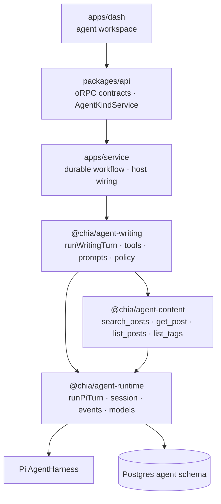
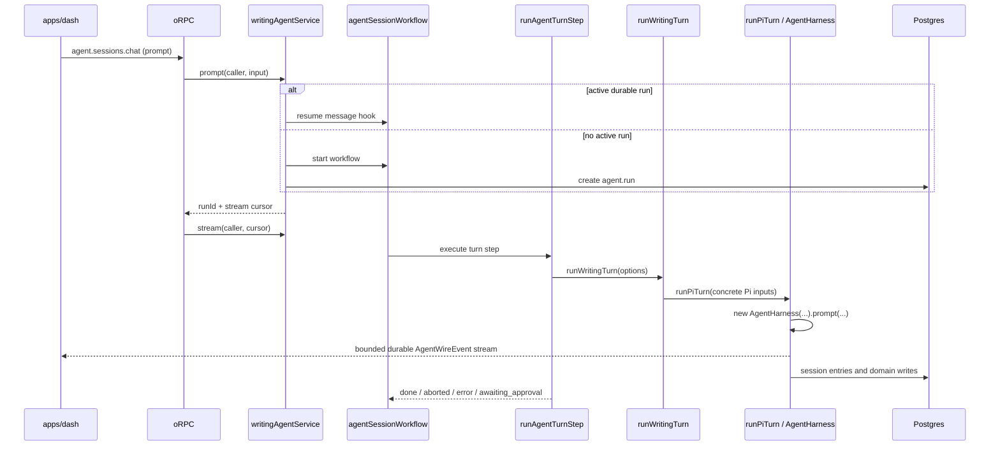

# Agent Architecture & Turn Flow

> Status: as-built
> Last updated: 2026-08-20
> 中文版：[docs/agent-architecture.zh.md](./agent-architecture.zh.md)
> Related: [docs/rag-architecture.md](./rag-architecture.md)

The agent stack is Pi-first. Pi's `AgentHarness`, session tree, tool hooks, model APIs and
compaction semantics are the concrete execution foundation; there is no harness-neutral engine
contract or adapter layer. The only shipped agent kind is `writing`, the dashboard's blog authoring
assistant.

## 1. Layers

| Layer        | Package / app                               | Owns                                                                                                                      |
| ------------ | ------------------------------------------- | ------------------------------------------------------------------------------------------------------------------------- |
| Pi execution | `@chia/agent-runtime`                       | Pi turn lifecycle, session persistence, models/providers, approval hook, bounded wire events and client transport mapping |
| Shared tools | `@chia/agent-content`                       | Read-only content tools every reading kind composes, their `ContentReadPort`, names, labels and summaries                 |
| Domain       | `@chia/agent-writing`                       | Writing tools, prompts, skills, model allowlist, policy, draft staging and domain ports                                   |
| Host         | `apps/service`, `packages/api`, `apps/dash` | DB/KV/credentials, durable workflow and streams, oRPC service port, auth and UI                                           |



`@chia/agent-runtime` is deliberately modular, but those modules are not provider-neutral
facades. Names such as `runPiTurn`, `createPiWireEventMapper` and `createPiToolCallGate` state the
real dependency directly. The stable boundary is the bounded `AgentWireEvent` contract sent to
clients, not an interchangeable harness API.

## 2. Agent kind and host service

`agent.session.kind` is a domain discriminator (`writing` today), not a harness discriminator. It
selects:

- the host implementation the request context carries in `agentKinds[kind]`;
- the durable step handler in `AGENT_TURN_HANDLERS`;
- the kind-specific extension row, such as `agent.writing_session`.

Session-scoped requests resolve kind from the persisted session. Client input can only cross-check
it, so a caller cannot drive a writing session through another kind's tools.

`packages/api/orpc/services/agent.service.ts` defines `AgentKindService`. This is a valid host dependency
inversion: `packages/api` cannot own workflow handles, DB access or credentials, so `apps/service`
puts `{ writing: writingAgentService }` on every request context (`createORPCContext`). It is
unrelated to the removed harness abstraction.

### Who may use a kind

Access is a property of the kind, not of the routes. Every agent route runs `callerGuard()`, which
only resolves the caller's `CallerTier`; the agent guards (`agentKindGuard` for creation and
capability listings, `agentSessionGuard` for session-scoped requests) then compare that tier with
the kind's `AgentKindService.minTier`. Any tier below `Session` is refused first — a session row has
an owner, so an anonymous or API-key caller has no one to be. `list` with no kind returns only the
kinds the caller may use.

The service receives an `AgentServiceCaller`: the resolved `Caller` (tier, session, configured
`adminId`) plus `userId`. Nothing agent-generic carries an admin identity — the writing kind sets
`minTier: Root`, which is what makes its caller _be_ the configured author, and reads
`getAdminId()` itself where its content port needs it. A public kind sets `minTier: Session` and
never sees an admin id.

## 3. Policy, sessions and data

### Tool policy

`AgentPolicy` supplies `tierOf`, `labelOf`, `requiresApproval`, `changesState`, `summarize` and an
optional state scope. Tiers remain strings because each domain owns its own vocabulary. Writing
uses:

| Tier     | Meaning                          | Approval | `state:changed` |
| -------- | -------------------------------- | -------- | --------------- |
| `read`   | Reads and outbound fetches       | no       | no              |
| `draft`  | Reversible staging-buffer writes | no       | yes             |
| `commit` | Writes live feed/content data    | yes      | yes             |

Unknown writing tools fall back to the most restrictive tier.

### Session tree and tables

The transcript is a tree. `agent.session_entry.parentId` points to the previous entry on a branch,
and `agent.session.leafEntryId` selects the active leaf. `PgSessionStorage` implements Pi's
`SessionStorage` over these tables, enabling rewind and alternate branches.

```text
agent.session                  generic settings, kind and active leaf
agent.session_entry            Pi session-tree nodes; seq is insertion order
agent.run                      durable execution metadata; one active run per session
agent.tool_approval            durable approval request and audit trail
agent.writing_session          writing-specific 1:1 state
agent.writing_draft            per-locale staging buffer
```

Entry payloads are opaque JSON matching Pi's session-entry union. Kind-specific state uses
extension tables instead of widening the shared session table.

### Session title

`agent.session.title` is the operator's handle for a session: `null` until named, then either
the operator's own name (`settings:update`) or one condensed from their first prompt. The turn
step names an untitled session alongside its first operator turn (`titleSession` in
`apps/service/src/steps/agent-turn.step.ts`): `generateSessionTitle` in
`@chia/agent-runtime/pi/title` asks the house gateway's cheap model — never the session's own,
which may be BYOK — and falls back to the prompt's first line when the model fails, so a title
always lands. Two invariants: the write is `setAgentSessionTitleIfUnset` (`WHERE title IS NULL`),
so a rename made while the first turn runs wins over the generated title; and the turn's `run:end`
is held back until the title settles (bounded by `SESSION_TITLE_TIMEOUT_MS`), so the client's
turn-end refresh of the session list already sees it. Operator-decision relay turns never title.

## 4. One turn



### Enqueue and durable driver

The oRPC route resolves the caller's tier, then the session guard checks ownership and the kind's
`minTier`. The host service persists a message into the live workflow's event log through its
reusable message hook, or starts a new run. The workflow registers that inbox with `getConflict()` before its first turn, so
messages submitted during a running turn wait durably and become later turns after the current turn
and any approval handshake finish. Enqueue is refused while approval is undecided, while a new
workflow has not registered its hook yet, or when the text is the reserved `/end` sentinel.

One durable workflow run drives up to 200 turns. The workflow itself runs in a sandboxed VM; DB,
provider, timers and network work stay inside steps, and only plain data crosses the boundary. This
allows turns, approval waits and stream replay to survive process restarts.

`runAgentTurnStep` has `maxRetries = 0`. A whole turn is not replay-safe after it may have appended
session entries or performed approved writes. Provider retry belongs inside Pi. A failed turn emits
an error, keeps its partial transcript, and is retried only by a new operator message.

### Concrete execution path

There is one production path:

```text
runAgentTurnStep → runWritingTurn → runPiTurn → new AgentHarness
```

`runWritingTurn` creates the writing tool context, resolves a model from the caller's credential-
bearing `Models`, and supplies tools, skills, templates, the stable system prompt, the volatile
turn context and the writing policy.

`runPiTurn` owns the complete lifecycle:

1. clamp thinking level to the resolved model and construct one harness for the turn;
2. install one `tool_call` hook composing the turn budget and the approval hook (budget first —
   Pi keeps the last defined hook result, so they cannot be two handlers), the `context` hook
   that appends the volatile block, the host abort signal, the turn deadline, and Pi-to-wire
   event mapping;
3. emit `run:start` and the user event, then invoke prompt or prompt template;
4. read the resolved assistant message: `stopReason: "error"` is a classified provider failure,
   `"aborted"` ends the turn as aborted; a thrown harness or hook error is `internal`;
5. after a successful provider turn, atomically persist all approval snapshots and then emit their
   `approval:request` events;
6. auto-compact only after a successful turn with no pending approvals;
7. emit the terminal error/end events, unsubscribe, then flush the durable writer.

### Turn budget

Pi's loop has no step limit: it runs while the assistant message carries tool calls, so a model
that re-issues the same call would run until the operator aborts. Every kind therefore passes an
`AgentTurnBudget` (`writingTurnBudget` in `@chia/agent-writing/policy`) and `createPiTurnBudget`
(`packages/agent-runtime/src/pi/turn-budget.ts`) enforces it on the `tool_call` hook, ahead of the
approval gate:

| Limit              | Crossing it                                                                                                                                                                       |
| ------------------ | --------------------------------------------------------------------------------------------------------------------------------------------------------------------------------- |
| `maxRepeats`       | the same tool with identical arguments that many times in a row — refused with a tool error telling the model the result will not change                                          |
| `maxToolCalls`     | every further call refused with a tool error asking the model to answer from what it has                                                                                          |
| `hardMaxToolCalls` | the model called through the refusals — the harness is aborted and the turn ends `error{budget_exhausted}`                                                                        |
| `maxDurationMs`    | wall-clock for the model's generation — same abort and error; cleared once the reply resolves, so the host work after it (approval persistence, compaction) is never failed by it |

Refusals speak to the model through the tool result, the channel the approval gate already uses,
so a model that complies finishes the turn normally. The two aborts go through the same host-failure
path as a failed volatile-context read: the failure is recorded, the harness aborted, and the turn
ends as that error rather than as `aborted`. Per-user and per-session quotas are not here — they
belong at enqueue time, in the kind service.

### Prompt layering

The system prompt is stable for a session — rules, skills index, approval posture — because it
heads every provider request and a changed prefix invalidates the cached system prompt, tool
schemas and transcript behind it. Everything that changes turn to turn (draft state, the clock)
is the **volatile context**: appended as the last user message of each provider request through
Pi's `context` hook, never persisted, so it is always current and never accumulates in the
transcript. Anything the model must see fresh belongs there, not in the system prompt.

### Abort

Nothing in the workflow SDK reaches a step already executing — cancelling the run only stops it
from being scheduled again — so a stop travels through a second, tiny durable run: the session
run's **abort controller** (`apps/service/src/workflows/agent-abort.workflow.ts`). `prompt` starts
it before the session run and passes its `{ id, runId }` in the session run's request (and into
`agent.run.metadata`); it parks on `agentAbortHook` and, when resumed, writes one message to its
own stream. Each turn step subscribes to that stream by run id — no lookup, so there is exactly one
controller per session run — hands the resulting `AbortSignal` to `runPiTurn`, and releases the
subscription when the turn ends. `abort` resumes the hook first, then cancels the session run and
marks the `agent.run` row `cancelled`; `completeAgentRunStep` resumes it too, so a finished run does
not leave a controller parked until its TTL. Firing the signal aborts the harness at once, mid-generation included: Pi cancels the
in-flight provider stream, the partial reply is persisted as `aborted`, and the turn ends with
`run:end{aborted}`; no approvals are persisted and no compaction runs. Delivery is the SDK's own
durable stream, so it works from any process — no registry, no timer, no second channel. The next
prompt starts a fresh session run over the persisted transcript. An expired controller (TTL) never
aborts a turn; readers ignore `expired` and the next turn starts a new one.

### Host failures inside Pi hooks

Pi turns a hook that throws into an assistant message with `stopReason: "error"`, which would be
classified like a provider failure. The hooks `runPiTurn` installs therefore catch their own
errors, record them as a host failure and abort the harness; the turn then fails as `internal`. A
volatile-context read that fails ends the turn this way rather than letting the model act without
seeing the current state.

## 5. Approval handshake

Pi's tool hook blocks a gated call with a tool error. That refusal is intentional: the turn ends in
a consistent state instead of waiting on an in-memory promise that would be lost on deploy.

```mermaid
sequenceDiagram
    participant M as Model
    participant G as createPiToolCallGate
    participant R as runPiTurn
    participant WF as Workflow
    participant OP as Operator
    participant DB as agent.tool_approval

    M->>G: commit tool call
    G-->>R: emit approval:request at once
    G-->>M: blocked; stop and await approval
    R->>DB: atomically persist collected requests at turn end
    R-->>WF: run:end{awaiting_approval}
    WF->>WF: park on approval hook
    OP->>DB: persist decision
    OP->>WF: resume hook
    WF->>R: relay turn (text from formatOperatorDecision, plus the decision)
    R-->>OP: approval:resolved, then user{origin: operator-decision}
    M->>G: re-issued call
    G-->>M: allowed when pre-authorized
```

A call is allowed when its tier needs no approval, its tier is session-auto-approved, its call id
was durably approved, or its tool name is pre-authorized for this turn. The decision is stored
before the workflow is resumed. Rejections also receive a follow-up turn so the agent can
acknowledge the operator's comment.

`approval:request` is announced the moment the gate refuses, so the client swaps the tool card for
the approval card while the model is still writing its hand-back. Persistence still waits for the
provider turn to succeed and writes the whole batch atomically, so a provider or persistence failure
returns an `error` turn with no undecided approval rows and the workflow never waits for a hook it
cannot resume. The client keeps the card locked until `run:end{awaiting_approval}` (or a reloaded
pending row) — a decision sent before the row exists would have nothing to land on — and retracts
announced-but-unpersisted cards on any other `run:end`.

The relay turn is a real user message to the model — that is what makes it act — but the operator
did not type it. `AgentTurnMessage.decision` marks it: the turn emits `approval:resolved` before
`user`, and the `user` event carries `origin: "operator-decision"` so the client renders a notice
rather than a user bubble. Replay cannot see the marker, so the text itself is recognisable
(`wire/operator-decision.ts`), and the session detail lists every approval row — pending rows
restore the prompt on reload, decided rows close their card the way the live stream did.

## 6. Wire events and streaming

`packages/agent-runtime/src/pi/events.ts` is the live narrowing point. Raw Pi events may carry full
model
objects, repeated partial snapshots and unbounded details; clients receive only:

```text
run:start · user · assistant:start · assistant:delta · assistant:end
tool:start · tool:update · tool:end
approval:request · approval:resolved
session:compacted · state:changed · error · run:end
```

- `createPiWireEventMapper` maps live Pi events and prefixes assistant ids with a unique turn id.
- `entriesToWireEvents` rebuilds history from persisted Pi entries and uses each entry id as the
  stable assistant identity. A persisted assistant message with `stopReason: "error"` replays as
  the same `error` event the live turn emitted.
- `error` carries a `kind` (`auth · quota · rate_limited · context_overflow · budget_exhausted ·
provider · internal`) so a client can say what to do next; `describeAgentError` is the shared headline.
- `tool:end.details` is clipped by `clipDetails` before it reaches the wire — long strings, arrays,
  wide objects and deep nesting are shortened in place, shape preserved — because every coarse
  event is a durable write that is replayed to every reconnecting client. The model reads the
  tool's `content`, never this copy.
- `applyEvent` / `foldEvents` give live and replayed events one client rendering path.
- `agent.sessions.chat` is the only turn transport: it enqueues the prompt or approval decision
  through the kind service, then tails the run's durable stream from the returned cursor and emits
  the wire events as-is, ending at that turn's `run:end`. History arrives through
  `agent.sessions.get` as the same wire events, so the client folds both with one reducer.
- `@chia/agent-elements` is that client: a zustand store per session (`createAgentSessionStore`)
  that folds live turns with `applyEvent` and owns prompt/approval streaming, over the host's
  TanStack `QueryClient` for everything request/response (session detail, models, settings,
  abort — `./queries`), plus the HeroUI elements (thread, composer, approval card, model picker,
  session tabs) both frontends compose. It takes the contract-typed `client.agent` and nothing
  app-specific.

Each run has a coarse durable event stream and a separately batched delta namespace. A coarse event
flushes queued deltas first. Readers race both streams so deltas remain interleaved with their
coarse events. Streams close only when the durable run ends, not after each turn.

### Rejoining a running turn

The chat is server-authoritative: on mount the session store hydrates from `agent.sessions.get`
and, when `run.status` is `running`, rejoins the turn through `agent.sessions.chat` with
`{ type: "attach" }`. A stream that ends with `run:end` only refreshes the session detail (the
view it built is kept, and the marker below may lag the terminal event by a moment, so that read
is retried briefly); a stream that breaks earlier rebuilds from `get` and re-attaches with backoff. The turn step maintains `agent.run.metadata.turn`
— the session leaf before the turn, the first coarse stream index it writes, and `running`, set
before the handler and cleared in its `finally`. The workflow SDK cannot supply that last bit: a
run parked on its message hook is `running` to the SDK just like one executing a step, so
`run.status`, `attach` and the compact/rewind guard all read the marker instead. `get` cuts the
replayed transcript after that leaf while a turn is running, and `attach` tails the stream from
that index; both key off the same marker, so a reload mid-turn shows every message exactly once
and finishes the turn in place. `prompt` seeds the marker on a fresh run, because its first turn
can reach the step before the run row exists.

## 7. Durable message inbox

Each session workflow creates one deterministic, reusable `agentMessageHook`. Before the first Pi
step, the workflow awaits `getConflict()`. That registers the hook in the workflow backend and
prevents two active runs from owning the same session inbox.

When an active run receives a prompt, the service resumes this hook directly. Every payload becomes
a durable `hook_received` event, so no Postgres pending table, Redis Pub/Sub, process-local queue or
timer polling is needed. The workflow consumes one event at a time in event-log order and invokes
`runAgentTurnStep` for it.

The Pi harness still lives entirely inside one opaque step, so a queued message does not interrupt
the turn currently generating. It becomes a normal new turn after the current turn and any approval
handshake finish. This is the deliberate product semantic that lets the workflow event log be the
only message queue.

## 8. Compaction and navigation

Maintenance uses concrete operations, not a fake turn-capable handle:

- `compactPiSession` creates a minimal Pi harness and calls `compact()`;
- `navigatePiSession` creates a minimal Pi harness and calls `navigateTree()`;
- writing wrappers resolve the model through the writing allowlist, then call those operations.

No tools, prompts, approvals or subscriptions are constructed for maintenance.
Manual compact and navigate are refused while a turn is running. Navigation returns the entire
rebuilt transcript because changing the active branch invalidates the current view.

At a successful turn boundary, `compactPiHarnessIfNeeded` uses Pi's context-token estimation and
threshold. Failed turns and turns awaiting approval are never auto-compacted. Compaction failure is
non-fatal and can be retried at the next clean boundary.

## 9. Models and credentials

`Models` is created per caller/turn. BYOK providers are registered only when that caller supplied a
key, preventing Pi from falling back to unrelated ambient provider keys. The selected model is
resolved from the same credential-bearing collection passed into `AgentHarness`.

The writing package owns its model allowlist. The gateway, OpenAI and Anthropic catalogues come
from Pi; the domain decides which `(providerId, modelId)` pairs it permits.

## 10. Writing domain and durable state

The writing agent reads content through `ContentPort` — `@chia/agent-content`'s `ContentReadPort`
plus the writes — reaches the web through `WebPort` (`web_search` for discovery, `fetch_url` to
read a page), stages drafts through `DraftStore`, and only commit-tier tools promote staged data
to live feed/content tables. Tool order encourages the model to read, draft and then commit.
Destructive deletion and image upload are not available agent tools.

`WebPort` is host-implemented on Firecrawl (`apps/service/src/services/agent-web.port.ts`,
`FIRECRAWL_API_KEY`). Search returns snippets only — no per-result scrape — so a call has a
fixed cost; `fetch_url` is one scrape per page, main content as markdown, and is how the model
reads a source it chose. There is no direct outbound fetch in the agent path.

### Content visibility

The read tools cannot widen what they see: visibility is fixed when the host builds the port
(`apps/service/src/services/content-read.port.ts`). An `author` port sees the configured author's
drafts; a `public` port scopes every detail read to `published: true` and answers a request for
drafts with nothing rather than overriding the filter. Search needs no branch — the chunk index is
published-only for every caller. The writing agent's port is `author`; a public kind builds
`public` and never gets a `WebPort`.

`buildSystemPrompt` is the stable system prompt; `buildTurnContext` is the volatile block with the
draft state and current time (see §4). Skills and prompt templates live under
`packages/agent-writing/src/prompts/`. The system prompt carries only the skills _index_ (name
and description); the model loads a skill's full text with the `read_skill` tool (tier `read`).
That tool is the only read path — Pi's own convention of reading `SKILL.md` from disk has no file
tool behind it here — and it leaves a tool call in the thread, so the operator can see which rules
were consulted.

The draft store's merge semantics (`undefined` leaves a field alone, `null` clears it) live once in
`draft/operations.ts`; both `PgDraftStore` and `InMemoryDraftStore` go through it, so the store the
tests run against cannot diverge from the one production uses.

There is no in-process conversational state. The process-level kind-to-service map contains only
implementations; all mutable state is durable:

| State                                   | Home                                           |
| --------------------------------------- | ---------------------------------------------- |
| Transcript                              | `agent.session_entry`                          |
| Draft                                   | `agent.writing_session`, `agent.writing_draft` |
| Approval decisions                      | `agent.tool_approval`                          |
| Run metadata                            | `agent.run`                                    |
| Message inbox, pauses and event streams | workflow backend                               |

## 11. Adding another agent kind

Another domain kind uses the same concrete Pi runtime:

1. add `@chia/agent-<kind>` with tools, prompts, skills, policy, model allowlist and domain ports —
   composing `contentReadTools` from `@chia/agent-content` when it reads the blog, with the tool
   context extending `ContentToolContext`;
2. add its extension table when it needs kind-specific persisted state;
3. implement `AgentKindService` in `apps/service` — including the `minTier` it admits — and add it
   to the `agentKinds` map;
4. register a durable turn handler that calls the new domain's `run<Kind>Turn`;
5. reuse `runPiTurn`, wire events, approval semantics and durable stream plumbing.

Do not add a harness adapter, engine factory, capability plugin system or provider-neutral handle
until a concrete second execution foundation requires a different seam.

## 12. Reference

| Concern                      | File                                                                                           |
| ---------------------------- | ---------------------------------------------------------------------------------------------- |
| Pi turn lifecycle            | `packages/agent-runtime/src/pi/turn.ts`                                                        |
| Pi approval hook             | `packages/agent-runtime/src/pi/tool-gate.ts`                                                   |
| Turn budget                  | `packages/agent-runtime/src/pi/turn-budget.ts`                                                 |
| Error classification         | `packages/agent-runtime/src/pi/errors.ts`                                                      |
| Details clipping             | `packages/agent-runtime/src/wire/clip.ts`                                                      |
| Abort controller             | `apps/service/src/workflows/agent-abort.workflow.ts`, `src/services/agent-abort-controller.ts` |
| Compaction / maintenance     | `packages/agent-runtime/src/pi/compaction.ts`, `pi/maintenance.ts`                             |
| Wire schema / fold / replay  | `packages/agent-runtime/src/wire/`                                                             |
| Live Pi event mapping        | `packages/agent-runtime/src/pi/events.ts`                                                      |
| Models/providers             | `packages/agent-runtime/src/models.ts`                                                         |
| Session over Postgres        | `packages/agent-runtime/src/session/`                                                          |
| Tool-authoring helpers       | `packages/agent-runtime/src/tools.ts`                                                          |
| Content read tools / port    | `packages/agent-content/src/`, `apps/service/src/services/content-read.port.ts`                |
| Writing composition          | `packages/agent-writing/src/runtime.ts`                                                        |
| Writing tools/prompts/policy | `packages/agent-writing/src/tools/`, `src/prompts/`, `src/policy.ts`                           |
| Host service port            | `packages/api/orpc/services/agent.service.ts`                                                  |
| Host implementation          | `apps/service/src/services/agent.service.ts`                                                   |
| Durable workflow / step      | `apps/service/src/workflows/agent-session.workflow.ts`, `src/steps/agent-turn.step.ts`         |
| Durable message inbox        | `apps/service/src/workflows/hooks/agent.hooks.ts`                                              |
| oRPC contract/routes         | `packages/api/orpc/contracts/agent.contract.ts`, `routes/agent.route.ts`                       |
| Database schema              | `packages/db/src/schemas/agent.schema.ts`                                                      |
| Client store and elements    | `packages/agent-elements/src/store.ts`, `src/*.tsx`                                            |
| Dashboard UI                 | `apps/dash/src/components/agent/`                                                              |
