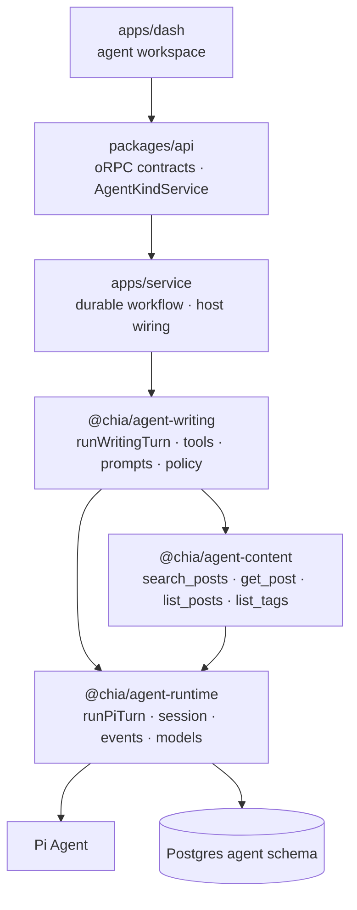
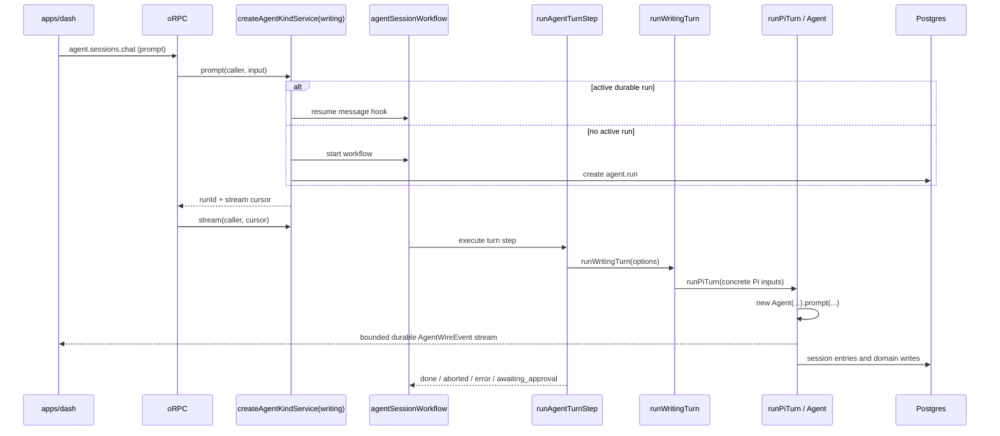

# Agent Architecture & Turn Flow

> Status: as-built
> Last updated: 2026-08-27
> 中文版：[docs/agent-architecture.zh.md](./agent-architecture.zh.md)
> Related: [docs/rag-architecture.md](./rag-architecture.md)

The agent stack is Pi-first. Pi's `Agent` is the execution engine — the provider loop, tool
execution, hooks and model APIs — and `@chia/agent-runtime` owns everything durable around it: the
session tree, its projection into the model's context, compaction, navigation and forks. There is
no engine-neutral contract or adapter layer. The only shipped agent kind is `writing`, the
dashboard's blog authoring assistant.

## 1. Layers

| Layer        | Package / app                               | Owns                                                                                                                      |
| ------------ | ------------------------------------------- | ------------------------------------------------------------------------------------------------------------------------- |
| Pi execution | `@chia/agent-runtime`                       | Pi turn lifecycle, session persistence, models/providers, approval hook, bounded wire events and client transport mapping |
| Shared tools | `@chia/agent-content`                       | Read-only content tools every reading kind composes, their `ContentReadPort`, names, labels and summaries                 |
| Domain       | `@chia/agent-writing`                       | Writing tools, prompts, skills, model allowlist, policy, draft staging and domain ports                                   |
| Host         | `apps/service`, `packages/api`, `apps/dash` | DB/KV/credentials, durable workflow and streams, oRPC service port, auth and UI                                           |



`@chia/agent-runtime` is deliberately modular, but those modules are not provider-neutral
facades. Names such as `runPiTurn`, `createPiWireEventMapper` and `createPiToolCallGate` state the
real dependency directly. The stable boundary is the bounded `AgentWireEvent` contract sent to
clients, not an interchangeable engine API.

## 2. Agent kind and host service

`agent.session.kind` is a domain discriminator (`writing` today), not a harness discriminator. It
selects:

- the `AgentKindDefinition` in `apps/service/src/agents/registry.ts` (`AGENT_KINDS`), which both
  the request context's `agentKinds[kind]` service and the durable turn step resolve;
- the kind-specific extension row, such as `agent.writing_session`, behind `definition.state`.

Session-scoped requests resolve kind from the persisted session. Client input can only cross-check
it, so a caller cannot drive a writing session through another kind's tools.

`packages/api/orpc/services/agent.service.ts` defines `AgentKindService`. This is a valid host dependency
inversion: `packages/api` cannot own workflow handles, DB access or credentials, so `apps/service`
puts one service per registered kind on every request context (`createORPCContext`). It is
unrelated to the removed harness abstraction.

The service itself is generic. `apps/service/src/agents/service.ts` (`createAgentKindService`)
implements the whole port — session rows, durable runs, prompt/attach/stream, abort, approvals,
compaction and rewind — over an `AgentKindDefinition` (`@chia/agent-host/kind`), and the turn step
(`runKindTurn`) resolves the same definition for the Pi side. A kind is one file in
`apps/service/src/agents/` (`writing.ts`) that binds its domain package to the host's ports and
supplies only what differs: `minTier`, `label`/`description`, defaults, replay policy, the model
allowlist (`assert`/`list`/`resolve`), its operator `config` schema, capabilities, its 1:1
`state` row (`create`/`load`/`summary`/`detail`) and `runTurn`. Compaction and rewind are not
the kind's: the generic service runs Pi's own operations with a model the compaction task
resolves (§8). The registry entry restates `minTier` eagerly for the guards and loads the
definition with a dynamic import, so the domain package and provider SDKs stay off the boot path.

`AgentKindService` is the shape every kind shares and never grows for one kind. A procedure only
one kind has gets its own contract namespace (`agent.<kind>.*`), its own port interface in
`packages/api`, and its implementation beside that kind's definition — it does not go on the
shared port or through the generic delegate. Today there is none: the writing draft rides on the
session detail (`state.detail`), which is all the dashboard reads.

### Who may use a kind

Access is a property of the kind, not of the routes. Every agent route runs `callerGuard()`, which
only resolves the caller's `CallerTier`; the agent guards (`agentKindGuard` for creation and
capability listings, `agentSessionGuard` for session-scoped requests) then compare that tier with
the kind's `AgentKindService.minTier`. Any tier below `Guest` is refused first — a session row has
an owner, so an anonymous or API-key caller has no one to be. `list` with no kind returns only the
kinds the caller may use.

The service receives an `AgentServiceCaller`: the resolved `Caller` (tier, session, configured
`adminId`) plus `userId`. Nothing agent-generic carries an admin identity — the writing kind sets
`minTier: Root`, which is what makes its caller _be_ the configured author, and reads
`getAdminId()` itself where its content port needs it. A public kind sets `minTier: Guest` (or
`Session`, to ask for a sign-in) and never sees an admin id.

### Guests

A visitor who has not signed in can still own sessions: better-auth's `anonymous()` plugin
(`@chia/auth/server`) mints a real user row, marked `user.isAnonymous`, when the client calls
`signIn.anonymous()`. `callerPolicy` grades that session as `CallerTier.Guest` — above
`Anonymous` because there is someone to own things and meter, below `ApiKey` because nothing
else is proven. `sessionPolicy` alone still refuses a guest, so every `authGuard` route means a
signed-in person as before; only `callerPolicy` opts in (`allowAnonymous`). When a guest later
signs in, the plugin's `onLinkAccount` runs `transferAgentOwnership` before the guest row is
deleted: their sessions, approvals and ledger rows move to the account, so signing in never
resets a quota.

`agent.usage.me` (`agentUsageStandingSchema`) is the caller's own standing for any
session-bearing tier: allowance, spend, the current week, running turns and the cap — `null`
limits for the operator — through the `agentUsage` port (`AgentUsageService`), which
`apps/service` binds to `readAgentUsageStanding` in `@chia/agent-host/quota`.

## 3. Policy, sessions and data

### Tool policy

`AgentPolicy` supplies `tierOf`, `labelOf`, `requiresApproval`, `changesState`, `summarize` and an
optional state scope. Tiers remain strings because each domain owns its own vocabulary. Writing
uses:

| Tier     | Meaning                          | Approval | `state:changed` |
| -------- | -------------------------------- | -------- | --------------- |
| `read`   | Reads and outbound fetches       | no       | no              |
| `draft`  | Reversible staging-buffer writes | no       | yes             |
| `commit` | Writes live feed/content data    | yes      | yes             |

Unknown writing tools fall back to the most restrictive tier.

### Session tree and tables

The transcript is a tree. `agent.session_entry.parentId` points to the previous entry on a branch,
and `agent.session.leafEntryId` selects the active leaf. `PgSessionStorage` implements the
runtime's `SessionTree` contract (`packages/agent-runtime/src/session/tree.ts`) over these tables,
enabling rewind and alternate branches; `InMemorySessionTree` is the same contract for tests.

```text
agent.session                  generic settings, kind and active leaf
agent.session_entry            session-tree nodes (`SessionEntry`); `seq` is persistence order, all branches
agent.run                      durable execution metadata; one active run per session
agent.tool_approval            durable approval request and audit trail
agent.writing_session          writing-specific 1:1 state
agent.writing_draft            per-locale staging buffer
agent.memory                   long-term memory across sessions (§10); indexed into `resource_chunk`
agent.kind_config              operator overrides of a kind's defaults and config (§13)
agent.task_config              operator overrides of a task's model, prompt and parameters (§13)
agent.usage_ledger             one row per provider call made for a user; survives the session
agent.quota_config             operator override of the weekly allowance and its zone (§3, §13)
```

Entry payloads are opaque JSON. The `SessionEntry` union in `session/entries.ts` mirrors Pi's
entry shapes, so Pi's own context projection reads them directly (`buildBranchContext` in
`session/context.ts`) and rows of retired entry types are ignored rather than migrated. Two orders
live on the tree: `parentId` is the conversation, `seq` is the order entries were persisted in
across every branch. `appendEntry` returns the entry with the `seq` it landed on, and "everything
persisted before this point" is `seq <= n` whichever branch is active — which is what the turn
marker (§6) records. `seq` is a table-wide serial taken at insert, sound only because a session
has one writer at a time: one active run, and acceptance and maintenance serialised on the
session lock (§8). The
projection is a pure function of the branch: a turn's provider request is the previous projection
plus the entries it appended, which is what keeps the provider's cached prefix valid from turn to
turn. Kind-specific state uses extension tables instead of widening the shared session table.

### Usage ledger

Every provider call made on a user's behalf lands one row in `agent.usage_ledger`: the turn's
replies, auto and manual compaction, branch summaries, the session title and lesson extraction —
whoever paid for it. `provider_id` says whose bill it was (the house gateway, or a BYOK key), so a
quota that only counts house spend is a filter, not a second ledger. The row carries pi's own
`usage` (input, output, cache read/write, reasoning) and its `cost.total` as integer
micro-dollars: metering is by cost, never by raw tokens, because a cached read costs a tenth of
an uncached one and a long conversation re-sends its whole transcript every turn.

The numbers are not read back from `session_entry`, although every assistant message carries
them there: entries cascade with their session, so a user who deleted a session would erase what
they spent; the payload is opaque and indexed per session, not per user and period; and a side
job has no entry at all. The ledger row keeps `session_id` as `set null` and is attributed to
the session's owner, which is also who an anonymous visitor becomes once they have a user row.

The runtime reports, the host writes. `runPiTurn`, `compactSession` and `navigatePiSession`
take an `AgentUsageListener` (`@chia/agent-runtime/types`) and call it with the model that
answered, its usage and the entry id — after that entry has landed, so a row never precedes
what it accounts for; `completeText` and `generateSessionTitle` report what they were billed
whatever they replied, since an aborted stream is still charged. Every host path binds the
listener to `recordAgentUsage` (`@chia/agent-host/usage`): the turn step (turn, its
auto-compaction, the title), the generic service's maintenance operations (manual compaction,
branch summary — on the session lock's transaction) and the lesson step. The write is never on
the critical path: a call the provider did not bill is not a row, and a failed insert is logged
and dropped, bounding the loss to one call in the user's favour.

### Usage quota

The quota is a property of the caller's tier, read from the ledger. `Root` — the operator, who
pays the bill — is never limited; every other tier draws on one shared weekly allowance of
**house** spend: `sumAgentUsageCost` over the week, filtered to the gateway provider, so a
BYOK call is recorded but is the user's own bill. `@chia/agent-host/quota` owns it:
`AGENT_QUOTA_DEFAULTS` is $0.30 a week in the server's own zone; the operator's
`agent.quota_config` row overrides either from the dashboard (`agent.admin.quota.*`, §13);
`weekPeriod` is Monday 00:00 to Monday 00:00 in that zone, computed from `Intl` so a DST week
is 167 or 169 hours rather than a wrong day; and `assertWithinAgentQuota` throws
`QUOTA_EXCEEDED` (402, `{ limitMicros, usedMicros, resetAt, timeZone }`) once the week's spend
has reached the limit.

It is checked where a model call is accepted and nowhere else: `prompt` and `approve` (a
decision starts a relay turn), `compact`, and `navigate` with `summarize` — each under the
session lock, before anything is queued or persisted, so a refused approval stays pending for
when the week turns over. The limit is soft: a call is accepted while anything remains, so the
last one may overrun by at most one turn, which the kind's turn budget bounds. A limit of `0`
closes the agent to every limited tier.

Beside the allowance, a **running-turn cap** (`maxRunningTurns`, default 3, same row) bounds
what one limited caller can put on the single-replica runner at once: `prompt` and `approve`
count the user's active runs whose turn marker is `running` (`countRunningAgentTurns`) and
refuse with `TOO_MANY_REQUESTS` (`{ runningTurns, maxRunningTurns }`) at the cap. The count
is taken under the user's own advisory lock (`lockAgentUser`, always after the session lock,
on the same transaction), so two prompts on two sessions cannot both pass on the same reading.
A message queued behind a turn already running on its session adds no running turn.

### Session title

`agent.session.title` is the operator's handle for a session: `null` until named, then either
the operator's own name (`settings:update`) or one condensed from their first prompt. The turn
step names an untitled session alongside its first operator turn (`titleSession` in
`apps/workflow/src/steps/agent-turn.step.ts`): `generateSessionTitle` in
`@chia/agent-runtime/pi/title` asks the `session.title` task's model (§13) — the house
gateway's cheap model unless the operator pinned another, never the session's own, which may be
BYOK — and falls back to the prompt's first line when the model fails, so a title always lands. Two invariants: the write is `setAgentSessionTitleIfUnset` (`WHERE title IS NULL`),
so a rename made while the first turn runs wins over the generated title; and the turn's `run:end`
is held back until the title settles (bounded by `SESSION_TITLE_TIMEOUT_MS`), so the client's
turn-end refresh of the session list already sees it. Operator-decision relay turns never title.

## 4. One turn



### Enqueue and durable driver

The oRPC route resolves the caller's tier, then the session guard checks ownership and the kind's
`minTier`. The host service persists a message into the live workflow's event log through its
reusable message hook, or starts a new run. The workflow registers that inbox with `getConflict()` before its first turn, so
messages submitted during a running turn wait durably and become later turns after the current turn
and any approval handshake finish. Enqueue is refused while approval is undecided, while a new
workflow has not registered its hook yet, or when the text is the reserved `/end` sentinel.

One durable workflow run drives up to 200 turns. The workflow itself runs in a sandboxed VM; DB,
provider, timers and network work stay inside steps, and only plain data crosses the boundary. This
allows turns, approval waits and stream replay to survive process restarts.

`runAgentTurnStep` has `maxRetries = 0`. A whole turn is not replay-safe after it may have appended
session entries or performed approved writes. Provider retry belongs inside Pi. A failed turn emits
an error, keeps its partial transcript, and is retried only by a new operator message.

The session API lives in `apps/service`; the workflow, its steps and the turn executor live in
`apps/workflow`. Starts, hook resumes and cancellations cross the authenticated `WorkflowControl`
contract to the single workflow process; run-state and durable-stream reads use the shared World
storage directly. `apps/workflow` stays single-replica because the installed Postgres World adapter
only deduplicates delivery in process. See `docs/workflow-deployment.md`.

### Concrete execution path

There is one production path:

```text
runAgentTurnStep → runWritingTurn → runPiTurn → new Agent
```

`runWritingTurn` creates the writing tool context, resolves a model from the caller's credential-
bearing `Models`, and supplies tools, templates, the stable system prompt, the volatile turn
context and the writing policy.

`runPiTurn` owns the complete lifecycle:

1. read the leaf and its branch, project the branch into messages (`buildBranchContext`), clamp
   the thinking level to the resolved model, bind the tool context, and construct one `Agent` for
   the turn — its stream function is the caller's own `Models`, never a process-wide default;
2. install `beforeToolCall` composing the turn budget and the approval gate (budget first — a call
   the budget refuses must never raise an approval), `transformContext` appending the volatile
   block, `afterToolCall` for state-change notices, the host abort signal, the turn deadline, and
   Pi-to-wire event mapping;
3. subscribe once: every `message_end` — user prompt, assistant reply, tool result — is appended to
   the tree under the turn's cursor _before_ its wire event is emitted, so a client never sees a
   message the tree lost;
4. emit `run:start` and the user event, then `prompt` with the operator's text or the expanded
   template;
5. read the last assistant message: `stopReason: "error"` is a classified provider failure,
   `"aborted"` ends the turn as aborted; a thrown error, or a host failure a hook recorded, is
   `internal`;
6. after a successful provider turn, atomically persist all approval snapshots and then emit their
   `approval:request` events;
7. auto-compact only after a successful turn with no pending approvals (`compactSessionIfNeeded`),
   announcing `session:compacted`;
8. emit the terminal error/end events, unsubscribe, then flush the durable writer.

### Turn budget

Pi's loop has no step limit: it runs while the assistant message carries tool calls, so a model
that re-issues the same call would run until the operator aborts. Every kind therefore passes an
`AgentTurnBudget` (`writingTurnBudget` in `@chia/agent-writing/policy`) and `createPiTurnBudget`
(`packages/agent-runtime/src/pi/turn-budget.ts`) enforces it in `beforeToolCall`, ahead of the
approval gate:

| Limit              | Crossing it                                                                                                                                                                       |
| ------------------ | --------------------------------------------------------------------------------------------------------------------------------------------------------------------------------- |
| `maxRepeats`       | the same tool with identical arguments that many times in a row — refused with a tool error telling the model the result will not change                                          |
| `maxToolCalls`     | every further call refused with a tool error asking the model to answer from what it has                                                                                          |
| `hardMaxToolCalls` | the model called through the refusals — the run is aborted and the turn ends `error{budget_exhausted}`                                                                            |
| `maxDurationMs`    | wall-clock for the model's generation — same abort and error; cleared once the reply resolves, so the host work after it (approval persistence, compaction) is never failed by it |

Refusals speak to the model through the tool result, the channel the approval gate already uses,
so a model that complies finishes the turn normally. The two aborts go through the same host-failure
path as a failed volatile-context read: the failure is recorded, the run aborted, and the turn
ends as that error rather than as `aborted`. Per-user and per-session quotas are not here — they
belong at enqueue time, in the kind service, reading the usage ledger (§3).

### Prompt layering

The system prompt is stable for a session — rules, skills index, approval posture — because it
heads every provider request and a changed prefix invalidates the cached system prompt, tool
schemas and transcript behind it. Everything that changes turn to turn (draft state, the clock,
the memories this session has saved) is the **volatile context**: appended as the last user message of each provider request through
Pi's `context` hook, never persisted, so it is always current and never accumulates in the
transcript. Anything the model must see fresh belongs there, not in the system prompt.

### Abort

Nothing in the workflow SDK reaches a step already executing — cancelling the run only stops it
from being scheduled again — so a stop travels through a second, tiny durable run: the session
run's **abort controller** (`apps/workflow/src/workflows/agent-abort.workflow.ts`). `prompt` starts
it before the session run and passes its `{ id, runId }` in the session run's request (and into
`agent.run.metadata`); it parks on `agentAbortHook` and, when resumed, writes one message to its
own stream. Each turn step subscribes to that stream by run id — no lookup, so there is exactly one
controller per session run — hands the resulting `AbortSignal` to `runPiTurn`, and releases the
subscription when the turn ends. `abort` resumes the hook first, then cancels the session run and
marks the `agent.run` row `cancelled`; `completeAgentRunStep` resumes it too, so a finished run does
not leave a controller parked until its TTL. Firing the signal aborts the run at once, mid-generation included: Pi cancels the
in-flight provider stream, the partial reply is persisted as `aborted`, and the turn ends with
`run:end{aborted}`; no approvals are persisted and no compaction runs. A tool already executing
only receives the signal — Pi waits for it to return — so `abort` tails the turn's own durable
stream from the marker's `streamIndex` until `run:end` (bounded by `ABORT_SETTLE_TIMEOUT_MS`)
before cancelling the run: the client rebuilds the transcript the moment `abort` returns, and
every entry is appended before its wire event, so `run:end` means the stopped turn has landed
whole. Delivery is the SDK's own
durable stream, so it works from any process — no registry, no timer, no second channel. The next
prompt starts a fresh session run over the persisted transcript. An expired controller (TTL) never
aborts a turn; readers ignore `expired` and the next turn starts a new one.

### Host failures inside Pi hooks

Pi folds a hook that throws into its own error surface — an error tool result for
`beforeToolCall`, an assistant message with `stopReason: "error"` for `transformContext` — which
would be classified like a provider failure. The hooks `runPiTurn` installs therefore catch their
own errors, record them as a host failure and abort the run; the turn then fails as `internal`. A
volatile-context read that fails ends the turn this way rather than letting the model act without
seeing the current state.

## 5. Approval handshake

Pi's tool hook blocks a gated call with a tool error. That refusal is intentional: the turn ends in
a consistent state instead of waiting on an in-memory promise that would be lost on deploy.

```mermaid
sequenceDiagram
    participant M as Model
    participant G as createPiToolCallGate
    participant R as runPiTurn
    participant WF as Workflow
    participant OP as Operator
    participant DB as agent.tool_approval

    M->>G: commit tool call
    G-->>R: emit approval:request at once
    G-->>M: blocked; stop and await approval
    R->>DB: atomically persist collected requests at turn end
    R-->>WF: run:end{awaiting_approval}
    WF->>WF: park on approval hook
    OP->>DB: persist decision
    OP->>WF: resume hook
    WF->>R: relay turn (text from formatOperatorDecision, plus the decision)
    R-->>OP: approval:resolved, then user{origin: operator-decision}
    M->>G: re-issued call
    G-->>M: allowed when pre-authorized
```

A call is allowed when its tier needs no approval, its tier is session-auto-approved, its call id
was durably approved, or its tool name is pre-authorized for this turn. The decision is stored
before the workflow is resumed. Rejections also receive a follow-up turn so the agent can
acknowledge the operator's comment.

`approval:request` is announced the moment the gate refuses, so the client swaps the tool card for
the approval card while the model is still writing its hand-back. Persistence still waits for the
provider turn to succeed and writes the whole batch atomically, so a provider or persistence failure
returns an `error` turn with no undecided approval rows and the workflow never waits for a hook it
cannot resume. The client keeps the card locked until `run:end{awaiting_approval}` (or a reloaded
pending row) — a decision sent before the row exists would have nothing to land on — and retracts
announced-but-unpersisted cards on any other `run:end`.

The relay turn is a real user message to the model — that is what makes it act — but the operator
did not type it. `AgentTurnMessage.decision` marks it: the turn emits `approval:resolved` before
`user`, and the `user` event carries `origin: "operator-decision"` so the client renders a notice
rather than a user bubble. Replay cannot see the marker, so the text itself is recognisable
(`wire/operator-decision.ts`), and the session detail lists every approval row — pending rows
restore the prompt on reload, decided rows close their card the way the live stream did.

## 6. Wire events and streaming

`packages/agent-runtime/src/pi/events.ts` is the live narrowing point. Raw Pi events may carry full
model
objects, repeated partial snapshots and unbounded details; clients receive only:

```text
run:start · user · assistant:start · assistant:delta · assistant:end
tool:start · tool:update · tool:end
approval:request · approval:resolved
session:compacted · session:rewound · state:changed · error · run:end
```

- A message's `messageId` is its session-entry id, live and replayed alike. `runPiTurn`
  reserves the id when a message starts (the operator's prompt up front, before Pi has started
  it) and appends the entry under that id, and `createPiWireEventMapper` asks the turn for it
  — so the client can hand any message id back as a rewind or fork target, and a transcript
  rebuilt after a reload names the same messages identically.
- `entriesToWireEvents` rebuilds history from persisted Pi entries. A persisted assistant
  message with `stopReason: "error"` replays as the same `error` event the live turn emitted;
  a `branch_summary` entry replays as `session:rewound`, so a rewind that kept a summary stays
  visible where it happened.
- A tool call is only ever `running` between its `tool:start` and `tool:end`, and both sides
  guarantee the end arrives. Pi persists a call's result right after the assistant message that
  issued it, so replay closes any call whose result is not the next thing on the branch — a turn
  stopped mid-execution, a process that died, a fork cut at the assistant message — with
  `tool:end{aborted}`, and skips the calls of a message that ended `error` or `aborted`, which
  Pi never executed and the live turn never showed. `run:end` closes whatever the live turn left
  running the same way. `aborted` is its own status, not `isError`: the tool did not fail, it
  never finished.
- `error` carries a `kind` (`auth · quota · rate_limited · context_overflow · budget_exhausted ·
provider · internal`) so a client can say what to do next; `describeAgentError` is the shared headline.
- `tool:end.details` is clipped by `clipDetails` before it reaches the wire — long strings, arrays,
  wide objects and deep nesting are shortened in place, shape preserved — because every coarse
  event is a durable write that is replayed to every reconnecting client. The model reads the
  tool's `content`, never this copy.
- `applyEvent` / `foldEvents` give live and replayed events one client rendering path.
- `agent.sessions.chat` is the only turn transport: it enqueues the prompt or approval decision
  through the kind service, then tails the run's durable stream from the returned cursor and emits
  the wire events as-is, ending at that turn's `run:end`. History arrives through
  `agent.sessions.get` as the same wire events, so the client folds both with one reducer.
- `@chia/agent-elements` is that client: a zustand store per session (`createAgentSessionStore`)
  that folds live turns with `applyEvent` and owns prompt/approval streaming, over the host's
  TanStack `QueryClient` for everything request/response (session detail, models, settings,
  abort — `./queries`), plus the HeroUI elements (thread, composer, approval card, model picker,
  session tabs, message actions) both frontends compose. It takes the contract-typed
  `client.agent` and nothing app-specific.

Each run has a coarse durable event stream and a separately batched delta namespace. A coarse event
flushes queued deltas first. Readers race both streams so deltas remain interleaved with their
coarse events. Streams close only when the durable run ends, not after each turn — so the two
streams keep growing across turns, and each is indexed on its own. A turn's cursor therefore holds
an index into both (`streamIndex`, `deltaStreamIndex` on the turn marker), captured as one past
each tail when the turn is accepted; tailing the deltas from anywhere earlier would re-append
text to messages the client already holds from the transcript.

### Rejoining a running turn

The chat is server-authoritative: on mount the session store hydrates from `agent.sessions.get`
and, when `run.status` is `running`, rejoins the turn through `agent.sessions.chat` with
`{ type: "attach" }`. A stream that ends with `run:end` only refreshes the session detail (the
view it built is kept, and the marker below may lag the terminal event by a moment, so that read
is retried briefly); a stream that breaks earlier rebuilds from `get` and re-attaches with backoff. The turn step maintains `agent.run.metadata.turn`
— the newest entry `seq` before the turn (`seqBefore`), the first coarse stream index it writes,
and `running`, set before the handler and cleared in its `finally`. The workflow SDK cannot supply that last bit: a
run parked on its message hook is `running` to the SDK just like one executing a step, so
`run.status`, `attach` and the compact/rewind guard all read the marker instead. `get` replays only
entries with `seq <= seqBefore` while a turn is running, and `attach` tails the stream from that
index; both key off the same marker, so a reload mid-turn shows every message exactly once and
finishes the turn in place. A seq rather than the pre-turn leaf id: after a rewind the leaf is
not the newest entry, and a cut by seq needs no guess about which branch the marker sits on. `prompt` and `approve` write the marker themselves when they
accept a turn — on a fresh run as part of its lease (§8), on a parked run before waking the hook —
so a turn counts as running from the moment it is accepted; the step rewrites the same values
when it starts. A message queued behind a turn that is already running is the one case marked
only when its own step begins.

## 7. Durable message inbox

Each session workflow creates one deterministic, reusable `agentMessageHook`. Before the first Pi
step, the workflow awaits `getConflict()`. That registers the hook in the workflow backend and
prevents two active runs from owning the same session inbox.

When an active run receives a prompt, the service resumes this hook directly. Every payload becomes
a durable `hook_received` event, so no Postgres pending table, Redis Pub/Sub, process-local queue or
timer polling is needed. The workflow consumes one event at a time in event-log order and invokes
`runAgentTurnStep` for it.

The Pi agent still lives entirely inside one opaque step, so a queued message does not interrupt
the turn currently generating. It becomes a normal new turn after the current turn and any approval
handshake finish. This is the deliberate product semantic that lets the workflow event log be the
only message queue.

## 8. Compaction and navigation

Maintenance operates on the session tree directly; no `Agent` is built:

- `compactPiSession` runs Pi's `prepareCompaction` and `compact` over the branch and appends the
  compaction entry — summary, retained tail, usage — as the new leaf;
- `navigatePiSession` moves the leaf (to a user message's parent when the target is a user
  message, so it can be re-asked), summarises the entries left behind into a `branch_summary`
  under the new leaf with Pi's `generateBranchSummary` when asked, and records a label without
  moving the leaf onto it;
- forks (`PgSessionRepo.fork`) copy into a new session row: the whole tree with the source's leaf when
  no target is given; otherwise the branch below the target, from the newest compaction down —
  `at` includes the target, `before` (a user message only) stops at its parent so it can be re-asked.
  The row records its lineage (`forkedFromSessionId`, `forkedFromEntryId`), which the session
  list carries so the tabs can show where a branch came from;
- the generic service calls both directly, with the model the `session.compaction` or
  `session.branch-summary` task resolves (§13): by default the session's own, through the kind's
  `models.resolve` and the caller's credential-bearing collection, or a house model the operator
  pinned — in which case the session's model, and any BYOK key it needs, is never touched.

No tools, prompts, approvals or subscriptions are constructed for maintenance.

The two operations answer two different questions. **Navigate** (`agent.sessions.navigate`) is a
rewind in place: one session, the leaf moves, and the branch left behind stays in the tree but
out of view — the client shows one active branch and nothing else. **Fork**
(`agent.sessions.fork`) keeps both: the copy lands in a new session, the source is untouched,
and the operator moves between them through the session tabs. The generic service implements
both: navigation through `navigatePiSession`, forking through `repo.fork` plus
`definition.state.fork`, which copies the kind's state row and — for writing — the draft, with
the same compensation as `createSession` when it fails.

Both are refused (`CONFLICT`) while a turn is running and while an approval is undecided: the
run is parked on the approval hook, and the relay turn its decision would start lands on
whatever branch is active then, answering a call that is no longer on it. Manual compaction
shares the guard. The guard is only as good as its ordering, so accepting a turn (`prompt`,
`approve`) and maintenance serialize on a per-session Postgres advisory lock
(`withAgentSessionLock`), and a fresh run's `agent.run` row is written **before** its workflow
is started — the row's own id stands in for the workflow run id until `start` returns and the
two are bound (`bindAgentRunExternalId`), and an unbound row older than a minute is treated as
dead. Maintenance that takes the lock after a prompt therefore already sees a running turn, and a
prompt that arrives during maintenance waits for its writes to land. Everything under the lock
runs on the lock's own connection (the transaction's `tx`), so an operation never waits for a
second pool connection while holding one. Marker writes and run completion address the row by
its own id, carried into the workflow as `runId`: a step of a run that was cancelled and
replaced can never reach the run that replaced it. Navigation returns the whole
session detail, not just events, because
changing the active branch invalidates every view the client held and the client folds a
detail the same way it folds `get`.

Kind state is not versioned against the transcript. A rewind leaves the writing draft as the
abandoned branch last left it, and a fork copies the draft as it stands now, not as it was at
the target; the dialogs say so, and the seam for a per-entry snapshot is `AgentKindState`.

At a successful turn boundary, `compactSessionIfNeeded` uses Pi's context-token estimation and
threshold against the session model's window, and summarises with the same compaction-task model
(`RunPiTurnOptions.compactionModel`) as a manual compaction would. Failed turns and turns
awaiting approval are never auto-compacted. Compaction failure is non-fatal and can be retried
at the next clean boundary.

## 9. Models and credentials

`Models` is created per caller/turn. BYOK providers are registered only when that caller supplied a
key, preventing Pi from falling back to unrelated ambient provider keys. The selected model is
resolved from the same credential-bearing collection the turn binds the `Agent`'s stream function
to — never `setDefaultStreamFn`, which is process-wide.

The writing package owns its model allowlist. The gateway, OpenAI and Anthropic catalogues come
from Pi; the domain decides which `(providerId, modelId)` pairs it permits.

## 10. Writing domain and durable state

The writing agent reads content through `ContentPort` — `@chia/agent-content`'s `ContentReadPort`
plus the writes — reaches the web through `WebPort` (`web_search` for discovery, `fetch_url` to
read a page), remembers across sessions through `MemoryPort`, stages drafts through `DraftStore`,
and only commit-tier tools promote staged data to live feed/content tables. Tool order encourages
the model to read, draft and then commit. Destructive deletion and image upload are not available
agent tools.

`WebPort` is host-implemented on Firecrawl (`apps/workflow/src/services/agent-web.port.ts`,
`FIRECRAWL_API_KEY`). Search returns snippets only — no per-result scrape — so a call has a
fixed cost; `fetch_url` is one scrape per page, main content as markdown, and is how the model
reads a source it chose. There is no direct outbound fetch in the agent path. Both tools hand
the turn's abort signal to the port; the Firecrawl SDK cannot cancel a request, so the port
settles with the signal's reason at once and lets the request run out its timeout in the
background — a stopped turn ends as soon as the signal fires instead of when the page arrives.

### Memory

`agent.memory` is the one table that outlives a session. Three kinds with three lifecycles:
a `source` is a page `fetch_url` read (URL, title, the page text up to 64k characters), a
`fact` is a distilled, cited
claim the model chose to keep with `save_memory`, and a `lesson` is a writing preference
extracted from the operator's feedback. `MemoryPort` (`@chia/agent-writing/ports`) is
implemented entirely by the host (`apps/workflow/src/services/agent-memory.port.ts`): writes go
through `packages/api/memories/write.ts`, which takes the index hook as a required argument the
way `feeds/write.ts` does, and every write that changes a row schedules
`indexResourceWorkflow` for the `agent_memory` resource type (`docs/rag-architecture.md`
§2.4) — a `source` revisit whose text is unchanged schedules nothing unless the index is older
than the row (`isResourceIndexedSince`), which is how a hook that once failed, on a first
visit or after a change, gets a second chance. Only live, `active`
memories are indexed: a pending lesson is unreviewed and the index is agent context.
`save_memory` sits in the `draft` tier — reversible, invisible to the blog — and only ever
writes a `fact`.

`fetch_url` records every page it reads as a `source` — URL, title, and the whole page text
(bounded at 64k characters) — through the same port, keyed on the URL so a revisit refreshes
rather than duplicates. A whole page rather than an excerpt because the RAG pipeline is built
for documents: sections with heading paths for search, an outline card for "what is this page
about", and `get_memory` degrading a long page the way `get_post` does. The
trail is written after the fetch and can never fail it: the model's result is identical with
or without it. The volatile context (§4) lists what the current session has saved, one
bounded line per memory with its id, so the model neither saves twice nor forgets it can
`get_memory` what it already has — a `source` by its host and path, never by its title, which
is the fetched page's own and would otherwise be restated on every request.

A `fact` or `source` reaches the model through tools, never through the system prompt:
`search_memory` is resource search scoped to `sourceTypes: ["agent_memory"]` with
`includeUnpublished: true`, the two flags that must be set together because every memory chunk
is indexed `published: false`, and `get_memory` reads one row. A retrieval is therefore a
visible tool call with a visible cost. The port's two list methods exist for the volatile
context, which holds nothing but ports.

A `lesson` is the one kind that is always on: the volatile context carries the titles of the
twenty most recently touched **active** lessons under `# Learned preferences`, because a
preference the model has to remember to look up is not a preference it follows. Lessons are
written by `memoryConsolidationWorkflow` (`apps/workflow/src/workflows/memory-consolidation.workflow.ts`),
started by the writing kind's `runTurn` after a turn that executed `commit_draft` ended `done`
— only then does the transcript hold the whole revision history — or by hand from the
dashboard (`memory.consolidate`). Its one step reads the session's raw entries through
`parentId`, past any compaction, keeps only the operator's messages and the assistant's prose
(never a tool result, so nothing a fetched page said can become a lesson), and asks the `writing.lessons` task's model (§13) — the house gateway's cheap model unless the operator pinned another — for at most three new lessons as JSON, with the task's prompt. Every lesson lands `pending` and
is injected nowhere until the operator approves it in the dashboard: no text that no human has
read can sit in every future prompt. The extraction helpers are pure and live in
`@chia/agent-writing/memory/lessons`; the step is `maxRetries = 0`, since a model failure is
already "no lessons" and a retry after a partial write would duplicate them.

The dashboard's memory page (`apps/dash/src/app/(workspace)/memory/`) is client-only oRPC
behind `adminGuard()` on every `memory.*` procedure, reads included: a memory is unpublished
research, and an active lesson is a standing instruction. Every write goes through
`memories/write.ts`, so editing, archiving or deleting re-indexes.

### Content visibility

The read tools cannot widen what they see: visibility is fixed when the host builds the port
(`packages/agent-host/src/content-read.port.ts`). An `author` port sees the configured author's
drafts; a `public` port scopes every detail read to `published: true` and answers a request for
drafts with nothing rather than overriding the filter. Search needs no branch — the chunk index is
published-only for every caller. The writing agent's port is `author`; a public kind builds
`public` and never gets a `WebPort`.

`buildSystemPrompt` is the stable system prompt; `buildTurnContext` is the volatile block with the
draft state and current time (see §4). Skills and prompt templates live under
`packages/agent-writing/src/prompts/`. The system prompt carries only the skills _index_ (name
and description); the model loads a skill's full text with the `read_skill` tool (tier `read`).
That tool is the only read path — Pi's own convention of reading `SKILL.md` from disk has no file
tool behind it here — and it leaves a tool call in the thread, so the operator can see which rules
were consulted.

The draft store's merge policy (`undefined` leaves a field alone, `null` clears it) is applied once
in `draft/operations.ts` through `@chia/utils/object`'s `mergeDefined`; both `PgDraftStore` and
`InMemoryDraftStore` go through it, so the store the tests run against cannot diverge from the one
production uses.

There is no in-process conversational state. The process-level kind-to-service map contains only
implementations; all mutable state is durable:

| State                                   | Home                                           |
| --------------------------------------- | ---------------------------------------------- |
| Transcript                              | `agent.session_entry`                          |
| Draft                                   | `agent.writing_session`, `agent.writing_draft` |
| Memory                                  | `agent.memory`, indexed into `resource_chunk`  |
| Approval decisions                      | `agent.tool_approval`                          |
| Run metadata                            | `agent.run`                                    |
| Message inbox, pauses and event streams | workflow backend                               |

## 11. Adding another agent kind

Another domain kind uses the same concrete Pi runtime:

1. add `@chia/agent-<kind>` with tools, prompts, skills, policy, model allowlist and domain ports —
   composing `contentReadTools` from `@chia/agent-content` when it reads the blog, with the tool
   context extending `ContentToolContext`;
2. add its extension table when it needs kind-specific persisted state;
3. add its `AgentKindDefinition` in `apps/service/src/agents/` — including the `minTier` it
   admits, its `label`/`description` and its operator `config` schema — and register it in
   `AGENT_KINDS`; the kind service, the turn step and the admin workspace pick it up from there;
4. have its `runTurn` call the new domain's `run<Kind>Turn`, and register any task of its own in
   `AGENT_TASKS` (§13);
5. reuse `runPiTurn`, wire events, approval semantics and durable stream plumbing.

Do not add an engine adapter, engine factory, capability plugin system or provider-neutral handle
until a concrete second execution foundation requires a different seam.

## 12. Reference

| Concern                      | File                                                                                                                 |
| ---------------------------- | -------------------------------------------------------------------------------------------------------------------- |
| Pi turn lifecycle            | `packages/agent-runtime/src/pi/turn.ts`                                                                              |
| Pi approval hook             | `packages/agent-runtime/src/pi/tool-gate.ts`                                                                         |
| Turn budget                  | `packages/agent-runtime/src/pi/turn-budget.ts`                                                                       |
| Error classification         | `packages/agent-runtime/src/pi/errors.ts`                                                                            |
| Details clipping             | `packages/agent-runtime/src/wire/clip.ts`                                                                            |
| Abort controller             | `apps/workflow/src/workflows/agent-abort.workflow.ts`, `apps/service/src/services/agent-abort-controller.service.ts` |
| Compaction / maintenance     | `packages/agent-runtime/src/pi/compaction.ts`, `pi/maintenance.ts`                                                   |
| Wire schema / fold / replay  | `packages/agent-runtime/src/wire/`                                                                                   |
| Live Pi event mapping        | `packages/agent-runtime/src/pi/events.ts`                                                                            |
| Models/providers             | `packages/agent-runtime/src/models.ts`                                                                               |
| Session tree contract        | `packages/agent-runtime/src/session/tree.ts`, `session/entries.ts`                                                   |
| Branch projection            | `packages/agent-runtime/src/session/context.ts`                                                                      |
| Session over Postgres        | `packages/agent-runtime/src/session/pg-storage.ts`, `session/pg-repo.ts`                                             |
| Tool-authoring helpers       | `packages/agent-runtime/src/tools.ts`                                                                                |
| Content read tools / port    | `packages/agent-content/src/`, `packages/agent-host/src/content-read.port.ts`                                        |
| Memory tools / port          | `packages/agent-writing/src/tools/memory.tool.ts`, `apps/workflow/src/services/agent-memory.port.ts`                 |
| Memory writes / indexing     | `packages/api/memories/write.ts`, `apps/service/src/services/agent-memory-indexing.service.ts`                       |
| Writing composition          | `packages/agent-writing/src/runtime.ts`                                                                              |
| Writing tools/prompts/policy | `packages/agent-writing/src/tools/`, `src/prompts/`, `src/policy.ts`                                                 |
| Host service port            | `packages/api/orpc/services/agent.service.ts`                                                                        |
| Kind registry / generic host | `apps/service/src/agents/registry.ts`, `agents/service.ts`, `packages/agent-host/src/kind.ts`                        |
| Writing kind binding         | `packages/agent-host/src/writing.ts`, `apps/service/src/agents/writing.ts`, `apps/workflow/src/agents/writing.ts`    |
| Task registry / resolution   | `packages/agent-host/src/tasks.ts`                                                                                   |
| Operator configuration       | `packages/agent-host/src/config.ts`, `apps/service/src/agents/admin.ts`, `packages/db/src/libs/agent/config.ts`      |
| Admin contract / port        | `packages/api/orpc/contracts/agent-admin.contract.ts`, `apps/service/src/factories/agent-admin.factory.ts`           |
| Durable workflow / step      | `apps/workflow/src/workflows/agent-session.workflow.ts`, `src/steps/agent-turn.step.ts`                              |
| Durable message inbox        | `packages/workflow-control/src/agent.hooks.ts`                                                                       |
| oRPC contract/routes         | `packages/api/orpc/contracts/agent.contract.ts`, `routes/agent.route.ts`                                             |
| Database schema              | `packages/db/src/schemas/agent.schema.ts`                                                                            |
| Client store and elements    | `packages/agent-elements/src/store.ts`, `src/*.tsx`                                                                  |
| Dashboard UI                 | `apps/dash/src/components/agent/`, `components/agents/` (kind and task configuration)                                |

## 13. Kinds, tasks and operator configuration

Two registries, both code, both overridable by the operator from the dashboard's agent
workspace (`agent.admin.*`, admin-only):

| Registry      | Where                                 | One entry is                                                                                  | Row                 |
| ------------- | ------------------------------------- | --------------------------------------------------------------------------------------------- | ------------------- |
| `AGENT_KINDS` | `apps/service/src/agents/registry.ts` | a conversational agent — tools, ports, policy, state row, `runTurn`                           | `agent.kind_config` |
| `AGENT_TASKS` | `packages/agent-host/src/tasks.ts`    | a one-shot model call beside a session — title, compaction, branch summary, lesson extraction | `agent.task_config` |

A third row, not a registry: `agent.quota_config` holds the operator's override of the weekly
allowance, its zone and the running-turn cap (`agent.admin.quota.*`, the workspace's "Usage
quota" card); the code default is `AGENT_QUOTA_DEFAULTS` in `packages/agent-host/src/quota.ts`
(§3).

A **task** is a model slot plus, where the call exposes them, a system prompt and sampling
parameters. How a task runs differs (`completeSimple`, Pi's `compact()`, `generateBranchSummary`)
and stays with the caller; what the operator chooses about it is the same, and `resolveAgentTask`
is the one place the definition and the row meet. A definition's `defaultModel` is either a
house gateway ref or `"session"` — the task runs on the model of the session it serves. A pinned
model is always a house gateway model, resolved on a credential-free collection: a side job is
never the operator's own bill, and lesson extraction runs in a workflow that carries no caller
credentials at all. A pinned model the catalogue no longer carries falls back to the default with
a warning, so a pi-ai upgrade degrades the task rather than the turn it rides beside. A task
whose default is `"session"` receives the session's model as a thunk and only resolves it when it
follows it, so a BYOK session's compaction can be pinned to a house model and run without the
key.

A **kind's** row holds the defaults a new session is created with (`providerId`/`modelId` as a
pair, `thinkingLevel`, `autoApprove`) and a `config` object the kind's own zod schema shapes
(`AgentKindDefinition.config`). Defaults are copied onto the session row at creation, so a
change never touches an existing session; `config` is read by the turn step on every turn
(`loadKindConfig`), so an edit reaches the next turn of every session. The schema is sent to the
dashboard as JSON Schema, so a new field is a schema change, not a contract change. Preferences
only: tool tiers, the approval policy, the turn budget and the model allowlist are safety
boundaries and stay in code. Writing's config is `instructions` — appended to the system prompt
under "Operator instructions", part of the stable prefix, so a change invalidates the provider's
cached prefix once and is then cached again.

Every admin write is validated against the definition it overrides before it lands: a kind's
model through the kind's `models.assert`, its `autoApprove` against the tiers its tools use, its
`config` through its schema; a task's model against the house catalogue, and a prompt or
parameters only where the task exposes them. A row can therefore only re-point what the code
already allows. Every view carries `code`/`default`, `override` and `effective` so the dashboard
can show a value, say whether it is overridden and offer to reset it without restating the
resolution rule.
