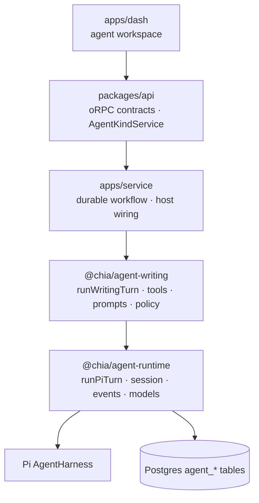
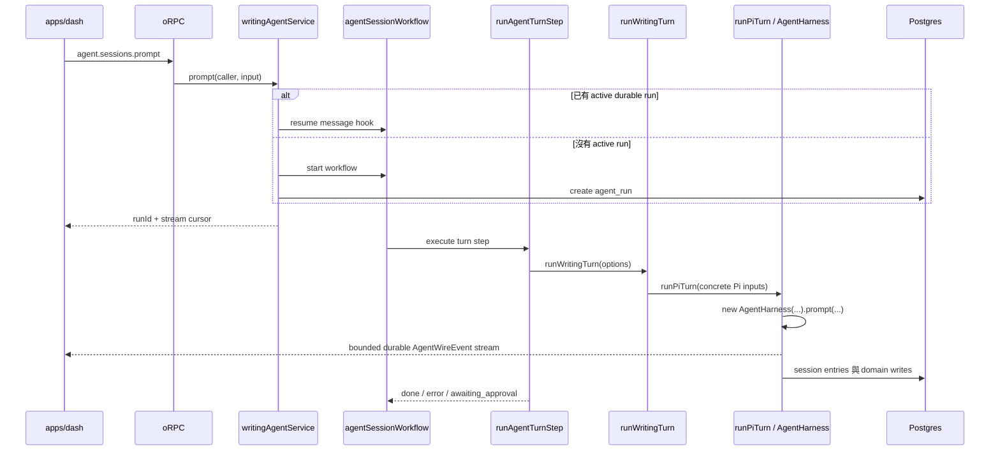
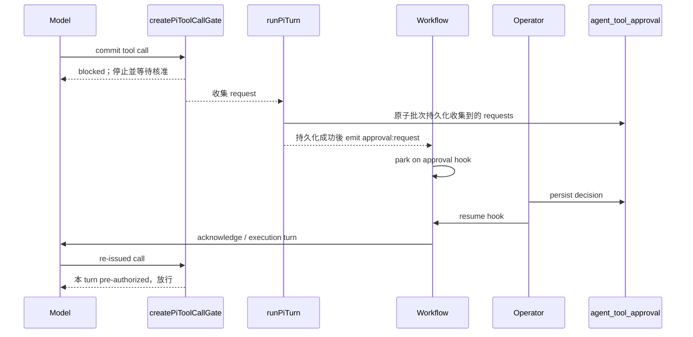

# Agent 架構與 Turn 流程

> 狀態：as-built
> 最後更新：2026-08-14
> English: [docs/agent-architecture.md](./agent-architecture.md)
> 相關文件：[docs/rag-architecture.md](./rag-architecture.md)

目前 agent stack 採 Pi-first：Pi 的 `AgentHarness`、session tree、tool hook、model API 與
compaction 語意就是具體的 execution foundation，不再以 harness-neutral engine contract 或
adapter 包裝。現在唯一上線的 agent kind 是 dashboard 裡的部落格寫作助理 `writing`。

## 1. 分層

| 層           | Package / app                               | 責任                                                                                                                 |
| ------------ | ------------------------------------------- | -------------------------------------------------------------------------------------------------------------------- |
| Pi execution | `@chia/agent-runtime`                       | Pi turn 生命週期、session persistence、models/providers、approval hook、受限 wire events 與 client transport mapping |
| Domain       | `@chia/agent-writing`                       | 寫作 tools、prompts、skills、model allowlist、policy、draft staging 與 domain ports                                  |
| Host         | `apps/service`、`packages/api`、`apps/dash` | DB/KV/credentials、durable workflow 與 stream、oRPC service port、auth、UI                                           |



`@chia/agent-runtime` 內部仍按關注點拆模組，但這些模組不是 provider-neutral facade。
`runPiTurn`、`createPiWireEventMapper`、`createPiToolCallGate` 的命名直接承認 Pi 依賴。真正
需要穩定的是送到 client 的受限 `AgentWireEvent`，不是可替換 harness 的假介面。

## 2. Agent kind 與 host service

`agent_session.kind` 是 domain discriminator（目前只有 `writing`），不是 harness
discriminator。它選擇：

- request context 上 `agentKinds[kind]` 帶的 host implementation；
- `AGENT_TURN_HANDLERS` 中的 durable step handler；
- `writing_agent_session` 這類 kind-specific extension row。

所有 session-scoped request 都從已持久化的 session 取得 kind；client 傳入的值只能交叉
驗證，不能拿另一個 kind 的 tools 去驅動既有 writing session。

`packages/api/orpc/agent-service.ts` 宣告 `AgentKindService`。這個 host port 應保留：
`packages/api` 不該擁有 workflow handles、DB 或 credentials，因此由 `apps/service` 在
`createORPCContext` 把 `{ writing: writingAgentService }` 放到每個 request context 上。它和已刪除的
harness abstraction 是不同層次的概念。

## 3. Policy、session 與資料

### Tool policy

每個 domain 以 `AgentPolicy` 提供 `tierOf`、`labelOf`、`requiresApproval`、
`changesState`、`summarize` 與 optional state scope。Tier 維持 string，因為其字彙由 domain
擁有。Writing agent 使用：

| Tier     | 意義                       | Approval | `state:changed` |
| -------- | -------------------------- | -------- | --------------- |
| `read`   | 讀取與 outbound fetch      | 不需要   | 否              |
| `draft`  | 可逆的 staging-buffer 寫入 | 不需要   | 是              |
| `commit` | 寫入正式 feed/content      | 需要     | 是              |

未知的 writing tool 會落到最嚴格的 tier。

### Session tree 與資料表

Transcript 是樹而不是 flat log。`agent_session_entry.parentId` 指向 branch 上一個 entry，
`agent_session.leafEntryId` 選定 active leaf。`PgSessionStorage` 把 Pi 的 `SessionStorage`
實作在這些表上，因此可以 rewind 並建立 alternate branch。

```text
agent_session                  共用 settings、kind、active leaf
agent_session_entry            Pi session-tree nodes；seq 是插入順序
agent_run                      durable execution metadata；每個 session 最多一個 active run
agent_tool_approval            durable approval 與 audit trail
writing_agent_session          writing-specific 1:1 state
writing_agent_draft            每個 locale 的 staging buffer
```

Entry payload 是符合 Pi session-entry union 的 opaque JSON。Kind-specific state 以 extension
table 表達，不把共用 session table 擴成大量 nullable columns。

## 4. 一個 turn 的完整路徑



### Enqueue 與 durable driver

oRPC route 先經過 `adminGuard`，session guard 再驗證 ownership。Host service 會透過 reusable
message hook 把訊息持久化到既有 workflow 的 event log，或建立新 run。Workflow 在第一個
turn 前以 `getConflict()` 註冊 inbox，因此 running turn 期間送入的訊息會排隊，等目前 turn
以及可能的 approval handshake 完成後成為下一個 turn。仍有 pending approval、workflow
尚在啟動而 hook 未註冊，或文字是保留的 `/end` sentinel 時會拒絕 enqueue。

每個 durable workflow run 最多驅動 200 turns。Workflow function 在 sandboxed VM 執行；
DB、provider、timer 與 network 都留在 step，跨 boundary 的只有 plain data。這讓 turn、
approval pause 與 stream replay 可以跨 deploy 或 process restart 存活。

`runAgentTurnStep` 的 `maxRetries = 0` 是刻意的：完整 turn 可能已寫入 session entry、draft
或執行已核准的 side effect，無法安全 replay。Provider retry 由 Pi 處理；turn 失敗後保留
partial transcript，等待 operator 重新 prompt。

### Concrete execution path

Production 只有一條執行路徑：

```text
runAgentTurnStep → runWritingTurn → runPiTurn → new AgentHarness
```

`runWritingTurn` 建立 writing tool context，從 caller credential 所屬的 `Models` resolve
model，並組合 tools、skills、templates、dynamic system prompt 與 writing policy。

`runPiTurn` 負責完整生命週期：

1. 依 resolved model clamp thinking level，每個 turn 建立一個 harness；
2. 安裝 Pi tool-call approval hook 與 Pi-to-wire event mapper；
3. emit `run:start`、user event，再呼叫 prompt 或 prompt template；
4. provider turn 成功後，原子批次持久化所有 approval snapshots，再 emit 對應的
   `approval:request`；
5. 只在成功且沒有 pending approval 時 auto-compact；
6. emit terminal error/end，解除 subscriptions，最後 flush durable writer。

## 5. Approval handshake

Pi tool hook 會用 tool error block 需要核准的 call。這個拒絕是刻意的 durable handshake：
turn 以一致狀態結束，不會停在 deploy 後就消失的 in-memory promise。



四種放行條件是：tier 不需核准、tier 在 session `autoApprove`、tool call id 已持久化核准，
或 tool name 僅在本 turn 被 pre-authorize。Decision 一定先寫 DB 再喚醒 workflow。Rejected
request 也會有一個後續 turn，讓 agent 回應 operator comment。

Approval request 只會在 provider turn 成功且整批 request 完成持久化後發布。Provider 或
persistence 失敗會回傳沒有 undecided approval rows 的 `error` turn，因此 workflow 不會等待
一個實際上無法 resume 的 hook。

## 6. Wire events 與 streaming

`packages/agent-runtime/src/pi/events.ts` 是 live narrowing point。Raw Pi event 可能攜帶完整
model、每個 delta 的 partial snapshot 與不受控 details；client 只收到：

```text
run:start · user · assistant:start · assistant:delta · assistant:end
tool:start · tool:update · tool:end
approval:request · approval:resolved
session:compacted · state:changed · error · run:end
```

- `createPiWireEventMapper`：live Pi event → wire event，並用唯一 turn id 作為 assistant id
  前綴。
- `entriesToWireEvents`：persisted Pi entries → replay history，使用 entry id 作為穩定的
  assistant identity。
- `applyEvent` / `foldEvents`：讓 live 與 replay 共用 dashboard rendering path。
- `@chia/agent-runtime/transports/tanstack-ai`：映射為 TanStack AI 使用的 AG-UI subset。

每個 run 有 coarse durable stream 與獨立 batch 的 delta namespace。Coarse event 會先 flush
pending deltas；reader 以 race 讀取兩邊以維持交錯順序。Stream 只在整個 durable run 結束時
關閉，不會每個 turn 關閉。

## 7. Durable message inbox

每個 session workflow 建立一個 deterministic、reusable `agentMessageHook`。Workflow 會在
第一個 Pi step 前 await `getConflict()`：這既把 hook 註冊到 workflow backend，也阻止兩個
active runs 同時擁有同一個 session inbox。

Active run 收到 prompt 時，service 直接 resume 這個 hook。每筆 payload 都成為 durable
`hook_received` event，因此不需要 Postgres pending table、Redis Pub/Sub、process-local queue
或 timer polling。Workflow 依 event-log 順序一次讀取一筆，再呼叫 `runAgentTurnStep`。

Pi harness 仍完整位於單一 step 裡，所以 queued message 不會中斷目前正在生成的 turn；它會
在目前 turn 與任何 approval handshake 結束後成為新的正常 turn。這是刻意選擇的產品語意，
也讓 workflow event log 成為唯一 message queue。

## 8. Compaction 與 navigation

Maintenance 使用 concrete operations，不再建立假裝能執行 turn 的 handle：

- `compactPiSession` 建立最小 Pi harness 後呼叫 `compact()`；
- `navigatePiSession` 建立最小 Pi harness 後呼叫 `navigateTree()`；
- writing wrappers 只透過 writing allowlist resolve model，再呼叫上述 operation。

Maintenance 不建立 tools、prompts、approval 或 subscriptions。Manual compact
與 navigate 在 turn running 時仍會被拒絕。Navigation 會回傳完整 rebuilt transcript，因為
active branch 改變後舊 view 已全部失效。

Turn 成功結束時，`compactPiHarnessIfNeeded` 使用 Pi 的 context token estimate 與 threshold。
Failed turn 或 awaiting approval 的 turn 不會 auto-compact；compaction failure 也不會讓成功的
turn 變成失敗。

## 9. Models 與 credentials

`Models` 依 caller/turn 建立。BYOK provider 只有 caller 提供 key 時才註冊，避免 Pi fallback
到 service 中為其他用途存在的 ambient provider key。Selected model 必須從同一個帶
credentials 的 collection resolve，並把該 collection 一起傳入 `AgentHarness`。

Writing package 擁有自己的 model allowlist。Gateway、OpenAI、Anthropic catalogues 由 Pi
提供；domain 決定允許哪些 `(providerId, modelId)` pair。

## 10. Writing domain 與 durable state

Writing agent 透過 `ContentPort` 讀正式內容、透過 `DraftStore` 寫 staging buffer；只有
commit-tier tool 會把 staged data 提升到正式 feed/content。刪除內容與圖片上傳不開放給
agent。Dynamic system prompt 每個 turn 都重新計算，讓 draft/session 與 approval 狀態保持
最新；skills 與 templates 位於 `packages/agent-writing/src/prompts/`。

Process 內沒有 conversational state。Kind-to-service map 只保存 implementation；所有 mutable
state 都是 durable：

| State                                | 儲存位置                                       |
| ------------------------------------ | ---------------------------------------------- |
| Transcript                           | `agent_session_entry`                          |
| Draft                                | `writing_agent_session`、`writing_agent_draft` |
| Approval decisions                   | `agent_tool_approval`                          |
| Run metadata                         | `agent_run`                                    |
| Message inbox、pauses、event streams | workflow backend                               |

## 11. 新增另一個 agent kind

新的 domain kind 共用相同 concrete Pi runtime：

1. 新增 `@chia/agent-<kind>`，包含 tools、prompts、skills、policy、model allowlist 與 domain ports；
2. 需要 kind-specific persistence 時新增 extension table；
3. 在 `apps/service` 實作 `AgentKindService` 並加進 `agentKinds` map；
4. 註冊呼叫新 domain `run<Kind>Turn` 的 durable turn handler；
5. 共用 `runPiTurn`、wire events、approval semantics 與 durable stream plumbing。

在真正出現第二種 execution foundation 且差異已知以前，不新增 harness adapter、engine
factory、capability plugin system 或 provider-neutral handle。

## 12. 參考位置

| Concern                      | File                                                                                   |
| ---------------------------- | -------------------------------------------------------------------------------------- |
| Pi turn lifecycle            | `packages/agent-runtime/src/pi/turn.ts`                                                |
| Pi approval hook             | `packages/agent-runtime/src/pi/tool-gate.ts`                                           |
| Compaction / maintenance     | `packages/agent-runtime/src/pi/compaction.ts`、`pi/maintenance.ts`                     |
| Wire schema / fold / replay  | `packages/agent-runtime/src/wire/`                                                     |
| Live Pi event mapping        | `packages/agent-runtime/src/pi/events.ts`                                              |
| Models/providers             | `packages/agent-runtime/src/models.ts`                                                 |
| Session over Postgres        | `packages/agent-runtime/src/session/`                                                  |
| TanStack AI transport        | `packages/agent-runtime/src/transports/tanstack-ai.ts`                                 |
| Writing composition          | `packages/agent-writing/src/runtime.ts`                                                |
| Writing tools/prompts/policy | `packages/agent-writing/src/tools/`、`src/prompts/`、`src/policy.ts`                   |
| Host service port            | `packages/api/orpc/agent-service.ts`                                                   |
| Host implementation          | `apps/service/src/services/agent.service.ts`                                           |
| Durable workflow / step      | `apps/service/src/workflows/agent-session.workflow.ts`、`src/steps/agent-turn.step.ts` |
| Durable message inbox        | `apps/service/src/workflows/hooks/agent.hooks.ts`                                      |
| oRPC contract/routes         | `packages/api/orpc/contracts/agent.contract.ts`、`routes/agent.route.ts`               |
| Database schema              | `packages/db/src/schemas/agent.schema.ts`                                              |
| Dashboard UI                 | `apps/dash/src/components/agent/`                                                      |
