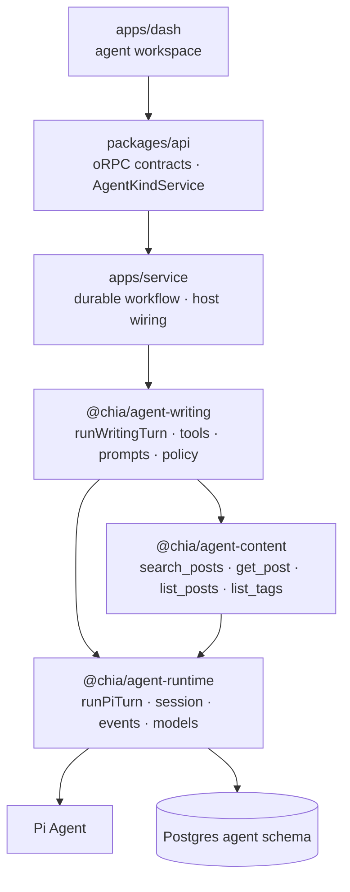
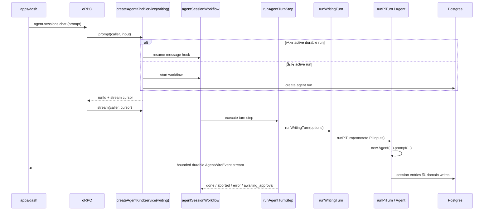
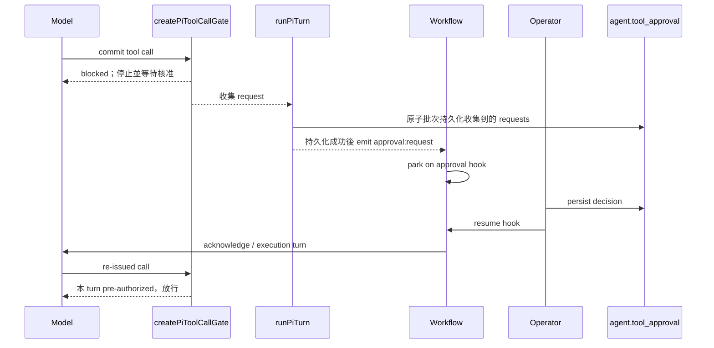

# Agent 架構與 Turn 流程

> 狀態：as-built
> 最後更新：2026-08-24
> English: [docs/agent-architecture.md](./agent-architecture.md)
> 相關文件：[docs/rag-architecture.md](./rag-architecture.md)

目前 agent stack 採 Pi-first：Pi 的 `Agent` 是執行引擎——provider loop、tool 執行、hook 與
model API——而 `@chia/agent-runtime` 擁有它周圍所有 durable 的東西：session tree、投影成
model context、compaction、navigation 與 fork。沒有 engine-neutral contract 或 adapter。
現在唯一上線的 agent kind 是 dashboard 裡的部落格寫作助理 `writing`。

## 1. 分層

| 層           | Package / app                               | 責任                                                                                                                 |
| ------------ | ------------------------------------------- | -------------------------------------------------------------------------------------------------------------------- |
| Pi execution | `@chia/agent-runtime`                       | Pi turn 生命週期、session persistence、models/providers、approval hook、受限 wire events 與 client transport mapping |
| Shared tools | `@chia/agent-content`                       | 所有會讀部落格的 kind 共用的唯讀 content tools、它們的 `ContentReadPort`、名稱、標籤與摘要                           |
| Domain       | `@chia/agent-writing`                       | 寫作 tools、prompts、skills、model allowlist、policy、draft staging 與 domain ports                                  |
| Host         | `apps/service`、`packages/api`、`apps/dash` | DB/KV/credentials、durable workflow 與 stream、oRPC service port、auth、UI                                           |
| Client       | `@chia/agent-elements`                      | 每個 session 一個 zustand store（fold wire events），以及兩個前端共用的 HeroUI chat elements                         |



`@chia/agent-runtime` 內部仍按關注點拆模組，但這些模組不是 provider-neutral facade。
`runPiTurn`、`createPiWireEventMapper`、`createPiToolCallGate` 的命名直接承認 Pi 依賴。真正
需要穩定的是送到 client 的受限 `AgentWireEvent`，不是可替換 engine 的假介面。

## 2. Agent kind 與 host service

`agent.session.kind` 是 domain discriminator（目前只有 `writing`），不是 harness
discriminator。它選擇：

- `apps/service/src/agents/registry.ts`（`AGENT_KINDS`）中的 `AgentKindDefinition`——request
  context 上的 `agentKinds[kind]` service 和 durable turn step 都從這裡解析；
- `agent.writing_session` 這類 kind-specific extension row，藏在 `definition.state` 後面。

所有 session-scoped request 都從已持久化的 session 取得 kind；client 傳入的值只能交叉
驗證，不能拿另一個 kind 的 tools 去驅動既有 writing session。

`packages/api/orpc/services/agent.service.ts` 宣告 `AgentKindService`。這個 host port 應保留：
`packages/api` 不該擁有 workflow handles、DB 或 credentials，因此由 `apps/service` 在
`createORPCContext` 把每個已註冊 kind 的 service 放到 request context 上。它和已刪除的
harness abstraction 是不同層次的概念。

Service 本身是 generic 的。`apps/service/src/agents/service.ts`（`createAgentKindService`）
在一個 `AgentKindDefinition`（`agents/kind.ts`）之上實作整個 port——session rows、durable runs、
prompt/attach/stream、abort、approvals、compaction 與 rewind——turn step（`runKindTurn`）在 Pi
那一側解析同一個 definition。一個 kind 就是 `apps/service/src/agents/` 下的一個檔案
（`writing.ts`），把 domain package 綁到 host 的 ports 上，只提供會不同的部分：`minTier`、
defaults、replay policy、model allowlist、capabilities、1:1 的 `state` row
（`create`/`load`/`summary`/`detail`）、`runTurn` 與 `maintenance`。registry entry 會 eager 地
重述 `minTier` 給 guard 用，definition 則用 dynamic import 載入，讓 domain package 和 provider
SDK 留在 boot path 之外。

`AgentKindService` 是所有 kind 共有的形狀，不會為了某一個 kind 而長大。只有單一 kind 才有的
procedure 要開自己的 contract namespace（`agent.<kind>.*`）、在 `packages/api` 宣告自己的 port
interface，實作放在該 kind 的 definition 旁邊——不掛在共用 port 上，也不經過 generic delegate。
目前還沒有這種 procedure：writing 的 draft 跟著 session detail（`state.detail`）走，dashboard
讀的也只有它。

### 誰可以使用某個 kind

存取權是 kind 的屬性，不是 route 的屬性。每條 agent route 都先跑 `callerGuard()`，它只解析呼叫者的
`CallerTier`；接著 agent guard（建立與能力列表用 `agentKindGuard`，session-scoped 請求用
`agentSessionGuard`）把這個 tier 和 kind 的 `AgentKindService.minTier` 比對。低於 `Session` 的 tier
一律先被拒絕——session row 有 owner，匿名或 API-key 呼叫者沒有可以「是」的人。沒帶 kind 的 `list`
只回傳呼叫者可用的 kind。

Service 收到的是 `AgentServiceCaller`：解析後的 `Caller`（tier、session、設定檔裡的 `adminId`）加上
`userId`。agent 的 generic 層不帶任何 admin 身分——writing kind 設 `minTier: Root`，這使得它的呼叫者
*就是*設定的作者，content port 需要時由 kind 自己讀 `getAdminId()`。公開 kind 設
`minTier: Session`，從頭到尾看不到 admin id。

## 3. Policy、session 與資料

### Tool policy

每個 domain 以 `AgentPolicy` 提供 `tierOf`、`labelOf`、`requiresApproval`、
`changesState`、`summarize` 與 optional state scope。Tier 維持 string，因為其字彙由 domain
擁有。Writing agent 使用：

| Tier     | 意義                       | Approval | `state:changed` |
| -------- | -------------------------- | -------- | --------------- |
| `read`   | 讀取與 outbound fetch      | 不需要   | 否              |
| `draft`  | 可逆的 staging-buffer 寫入 | 不需要   | 是              |
| `commit` | 寫入正式 feed/content      | 需要     | 是              |

未知的 writing tool 會落到最嚴格的 tier。

### Session tree 與資料表

Transcript 是樹而不是 flat log。`agent.session_entry.parentId` 指向 branch 上一個 entry，
`agent.session.leafEntryId` 選定 active leaf。`PgSessionStorage` 把 runtime 自己的
`SessionTree` 合約（`packages/agent-runtime/src/session/tree.ts`）實作在這些表上，因此可以
rewind 並建立 alternate branch；`InMemorySessionTree` 是同一合約的測試用實作。

```text
agent.session                  共用 settings、kind、active leaf
agent.session_entry            session-tree nodes（`SessionEntry`）；seq 是插入順序
agent.run                      durable execution metadata；每個 session 最多一個 active run
agent.tool_approval            durable approval 與 audit trail
agent.writing_session          writing-specific 1:1 state
agent.writing_draft            每個 locale 的 staging buffer
```

Entry payload 是符合 Pi session-entry union 的 opaque JSON。Kind-specific state 以 extension
table 表達，不把共用 session table 擴成大量 nullable columns。

### Session title

`agent.session.title` 是 operator 辨識 session 用的名稱：尚未命名時為 `null`，之後不是 operator
自己取的（`settings:update`），就是從第一則 prompt 精簡而來。Turn step 會在未命名 session 的第一個
operator turn 旁邊同時命名（`apps/service/src/steps/agent-turn.step.ts` 的 `titleSession`）：
`@chia/agent-runtime/pi/title` 的 `generateSessionTitle` 固定問 house gateway 的便宜模型——
不用 session 自己選的模型，那可能是 BYOK——模型失敗時退回 prompt 第一行，所以一定會有標題。
兩個 invariant：寫入走 `setAgentSessionTitleIfUnset`（`WHERE title IS NULL`），第一輪進行中
operator 的 rename 永遠贏過自動產生的標題；turn 的 `run:end` 會等到標題落地才寫出（上限
`SESSION_TITLE_TIMEOUT_MS`），client 在 turn 結束時重抓 session 列表就已經看得到。Operator
decision 的 relay turn 不命名。

## 4. 一個 turn 的完整路徑



### Enqueue 與 durable driver

oRPC route 先解析呼叫者的 tier，session guard 再驗證 ownership 與 kind 的 `minTier`。Host service 會透過 reusable
message hook 把訊息持久化到既有 workflow 的 event log，或建立新 run。Workflow 在第一個
turn 前以 `getConflict()` 註冊 inbox，因此 running turn 期間送入的訊息會排隊，等目前 turn
以及可能的 approval handshake 完成後成為下一個 turn。仍有 pending approval、workflow
尚在啟動而 hook 未註冊，或文字是保留的 `/end` sentinel 時會拒絕 enqueue。

每個 durable workflow run 最多驅動 200 turns。Workflow function 在 sandboxed VM 執行；
DB、provider、timer 與 network 都留在 step，跨 boundary 的只有 plain data。這讓 turn、
approval pause 與 stream replay 可以跨 deploy 或 process restart 存活。

`runAgentTurnStep` 的 `maxRetries = 0` 是刻意的：完整 turn 可能已寫入 session entry、draft
或執行已核准的 side effect，無法安全 replay。Provider retry 由 Pi 處理；turn 失敗後保留
partial transcript，等待 operator 重新 prompt。

### Concrete execution path

Production 只有一條執行路徑：

```text
runAgentTurnStep → runWritingTurn → runPiTurn → new Agent
```

`runWritingTurn` 建立 writing tool context，從 caller credential 所屬的 `Models` resolve
model，並組合 tools、templates、穩定的 system prompt、每次請求都重算的 volatile context 與
writing policy。

`runPiTurn` 負責完整生命週期：

1. 讀 leaf 與它的 branch，用 `buildBranchContext` 投影成 messages，依 resolved model clamp
   thinking level，綁定 tool context，為這個 turn 建立一個 `Agent`——它的 stream function 綁在
   caller 自己的 `Models` 上，絕不是 process-wide 的 default；
2. 安裝組合了 turn budget 與 approval gate 的 `beforeToolCall`（budget 先——被 budget 拒絕的
   呼叫絕不能產生 approval）、附加 volatile block 的 `transformContext`、發 state-change 通知的
   `afterToolCall`、host 的 abort signal、turn deadline，以及 Pi-to-wire event mapper；
3. 訂閱一次：每個 `message_end`——user prompt、assistant 回覆、tool result——都在 wire event
   送出**之前**以 turn 的 cursor 為 parent append 進 tree，client 不會看到 tree 沒存的訊息；
4. emit `run:start`、user event，再以 operator 的文字或展開後的 template 呼叫 `prompt`；
5. 檢查最後一則 assistant message：`stopReason: "error"` 是分類過的 provider 失敗，
   `"aborted"` 讓 turn 以 aborted 結束；拋出的例外或 hook 記下的 host failure 歸為 `internal`；
6. provider turn 成功後，原子批次持久化所有 approval snapshots，再 emit 對應的
   `approval:request`；
7. 只在成功且沒有 pending approval 時 auto-compact（`compactSessionIfNeeded`），並發
   `session:compacted`；
8. emit terminal error/end，解除 subscriptions，最後 flush durable writer。

### Turn budget

Pi 的 loop 沒有 step 上限：只要 assistant message 還帶 tool call 就繼續跑，所以一個不斷重發
同一個呼叫的模型會一直跑到 operator abort 為止。因此每個 kind 都要傳入 `AgentTurnBudget`
（writing 的是 `@chia/agent-writing/policy` 的 `writingTurnBudget`），由 `createPiTurnBudget`
（`packages/agent-runtime/src/pi/turn-budget.ts`）在 `tool_call` hook 上、approval gate 之前
執行：

| 上限               | 越過時                                                                                                                            |
| ------------------ | --------------------------------------------------------------------------------------------------------------------------------- |
| `maxRepeats`       | 同一個 tool 以完全相同的參數連續呼叫這麼多次——以 tool error 拒絕，告訴模型結果不會改變                                            |
| `maxToolCalls`     | 之後每個呼叫都以 tool error 拒絕，要模型用現有結果作答                                                                            |
| `hardMaxToolCalls` | 模型無視拒絕繼續呼叫——abort run，turn 以 `error{budget_exhausted}` 結束                                                           |
| `maxDurationMs`    | 模型生成階段的 wall-clock——同樣 abort 與 error；reply 一回來就清掉，之後的 host 工作（approval 持久化、compaction）不會被它判失敗 |

拒絕是透過 tool result 跟模型對話，與 approval gate 用的是同一條通道，所以會聽話的模型會正常
結束這一輪。兩種 abort 走的是與 volatile-context 讀取失敗相同的 host-failure 路徑：記下失敗、
abort run，turn 以該 error 結束而非 `aborted`。per-user 與 per-session 的配額不在這裡——
那屬於 enqueue 時的 kind service。

### Prompt 分層

System prompt 在一個 session 內是穩定的——規則、skills 索引、approval posture——因為它位於
每個 provider request 的最前面，一變就會讓 system prompt、tool schema 與其後整段 transcript
的 cached prefix 失效。每個 turn 會變的東西（draft 狀態、時鐘）是 **volatile context**：透過
Pi 的 `context` hook 附加為每個 provider request 的最後一則 user message，不持久化，因此永遠
是最新的，也不會累積在 transcript 裡。模型必須看到最新狀態的東西放這裡，不放 system prompt。

### Abort

Workflow SDK 沒有任何東西能碰到已經在執行的 step——取消 run 只是讓它不再被排程——所以 stop
是透過第二個很小的 durable run 送達：session run 的 **abort controller**
（`apps/service/src/workflows/agent-abort.workflow.ts`）。`prompt` 在開 session run 之前先開它，
並把 `{ id, runId }` 放進 session run 的 request（與 `agent.run.metadata`）；它停在
`agentAbortHook` 上，被 resume 時往自己的 stream 寫一則訊息。每個 turn step 直接以 run id 訂閱
那條 stream——不查詢，所以一個 session run 恰好一個 controller——把得到的 `AbortSignal` 交給
`runPiTurn`，turn 結束時釋放訂閱。
`abort` 先 resume 這個 hook，再取消 session run、把 `agent.run` 列標成 `cancelled`；
`completeAgentRunStep` 也會 resume 它，讓跑完的 run 不會留下一個停到 TTL 的 controller。Signal 一
觸發 run 立刻中止，生成到一半也一樣：Pi 取消進行中的 provider stream，部分回覆以 `aborted`
持久化，turn 以 `run:end{aborted}` 結束；不持久化 approval，也不 compaction。送達走的是 SDK 自
己的 durable stream，所以跨 process 也成立——沒有 registry、沒有 timer、沒有第二條 channel。下一
次 prompt 會在持久化的 transcript 上開新 session run。過期（TTL）的 controller 不會中止任何 turn；
reader 忽略 `expired`，下一個 turn 會建新的。

### Pi hook 裡的 host 失敗

Hook 拋錯時 Pi 會把它收進自己的錯誤表面——`beforeToolCall` 變成 error tool result、
`transformContext` 變成 `stopReason: "error"` 的 assistant message——跟 provider 失敗長得一樣。
因此 `runPiTurn` 安裝的 hook 都自己攔錯、記成 host failure 並中止 run，turn 以 `internal`
收尾。Volatile context 讀失敗就是這樣結束，而不是讓模型在看不到目前狀態的情況下繼續動作。

## 5. Approval handshake

Pi tool hook 會用 tool error block 需要核准的 call。這個拒絕是刻意的 durable handshake：
turn 以一致狀態結束，不會停在 deploy 後就消失的 in-memory promise。



四種放行條件是：tier 不需核准、tier 在 session `autoApprove`、tool call id 已持久化核准，
或 tool name 僅在本 turn 被 pre-authorize。Decision 一定先寫 DB 再喚醒 workflow。Rejected
request 也會有一個後續 turn，讓 agent 回應 operator comment。

Approval request 只會在 provider turn 成功且整批 request 完成持久化後發布。Provider 或
persistence 失敗會回傳沒有 undecided approval rows 的 `error` turn，因此 workflow 不會等待
一個實際上無法 resume 的 hook。

## 6. Wire events 與 streaming

`packages/agent-runtime/src/pi/events.ts` 是 live narrowing point。Raw Pi event 可能攜帶完整
model、每個 delta 的 partial snapshot 與不受控 details；client 只收到：

```text
run:start · user · assistant:start · assistant:delta · assistant:end
tool:start · tool:update · tool:end
approval:request · approval:resolved
session:compacted · session:rewound · state:changed · error · run:end
```

- 訊息的 `messageId` 就是它的 session entry id，live 與 replay 一致。`runPiTurn` 在訊息開始時
  預留 id（operator 的 prompt 在 Pi 開始之前就先預留），append entry 時用同一個 id；
  `createPiWireEventMapper` 向 turn 要這個 id——所以 client 可以把任何一則訊息的 id 交回去當
  rewind 或 fork 的目標，重整後 rebuild 的 transcript 也用同樣的 id 稱呼同樣的訊息。
- `entriesToWireEvents`：persisted Pi entries → replay history。`stopReason: "error"` 的持久化
  assistant message 會 replay 成與 live turn 相同的 `error` event；`branch_summary` entry 會
  replay 成 `session:rewound`，所以帶摘要的 rewind 會留在它發生的位置。
- `error` 帶 `kind`（`auth · quota · rate_limited · context_overflow · budget_exhausted · provider ·
internal`），
  讓 client 能提示下一步；`describeAgentError` 是共用的 headline。
- `tool:end.details` 上 wire 前會經過 `clipDetails`——長字串、陣列、寬物件與深巢狀就地縮短、
  保留形狀——因為每個 coarse event 都是 durable write，且會 replay 給每個重連的 client。模型
  讀的是 tool 的 `content`，不是這份副本。
- `applyEvent` / `foldEvents`：讓 live 與 replay 共用同一條 client rendering path。
- `agent.sessions.chat` 是唯一的 turn transport：透過 kind service enqueue prompt 或 approval
  decision，再從回傳的 cursor tail run 的 durable stream，原樣送出 wire events，到該 turn 的
  `run:end` 為止。History 由 `agent.sessions.get` 以同樣的 wire events 回傳，client 用同一個
  reducer fold 兩者。
- `@chia/agent-elements` 就是那個 client：每個 session 一個 zustand store
  （`createAgentSessionStore`）只管 live 這一段——用 `applyEvent` fold live turn、prompt/approval
  的 stream loop——request/response 的部分（session detail、models、settings、abort）走 host 的
  TanStack `QueryClient`（`./queries`），store 也是透過同一個 cache 讀寫 detail；再加上兩個前端
  共用的 HeroUI elements（thread、composer、approval card、model picker、session tabs、message
  actions）。它只吃 contract-typed 的 `client.agent`，不依賴任何 app。

每個 run 有 coarse durable stream 與獨立 batch 的 delta namespace。Coarse event 會先 flush
pending deltas；reader 以 race 讀取兩邊以維持交錯順序。Stream 只在整個 durable run 結束時
關閉，不會每個 turn 關閉。

### 重新接上執行中的 turn

Chat 是 server-authoritative：session store 在 mount 時從 `agent.sessions.get` hydrate，若
`run.status` 是 `running`，就用 `agent.sessions.chat` 的 `{ type: "attach" }` 接回那個 turn。
以 `run:end` 結束的 stream 只重新抓 session detail（保留它自己 fold 出來的 view；下面的
marker 可能比 terminal event 晚一點清掉，所以那次讀取會短暫重試）；更早斷掉的 stream 則從
`get` 重建並帶 backoff 重新 attach。Turn step 維護 `agent.run.metadata.turn`——turn 開始前的
session leaf、它要寫的第一個 coarse stream index，以及 `running`（進 handler 前設、`finally`
清）。最後這個 workflow SDK 給不了：對 SDK 來說停在 message hook 上的 run 和正在跑 step 的 run
都是 `running`，所以 `run.status`、`attach` 與 compact/rewind 的檢查都改讀這個 marker。Turn 執行
中時 `get` 把 replay 的 transcript 截在那個 leaf 之後，`attach` 則從那個 index tail stream；兩邊
用同一個 marker，所以在 turn 進行中重整頁面，每則訊息只會出現一次，turn 也會原地跑完。`prompt`
在開新 run 時會先種下 marker，因為第一個 turn 可能在 run row 建立前就到達 step。

## 7. Durable message inbox

每個 session workflow 建立一個 deterministic、reusable `agentMessageHook`。Workflow 會在
第一個 Pi step 前 await `getConflict()`：這既把 hook 註冊到 workflow backend，也阻止兩個
active runs 同時擁有同一個 session inbox。

Active run 收到 prompt 時，service 直接 resume 這個 hook。每筆 payload 都成為 durable
`hook_received` event，因此不需要 Postgres pending table、Redis Pub/Sub、process-local queue
或 timer polling。Workflow 依 event-log 順序一次讀取一筆，再呼叫 `runAgentTurnStep`。

Pi agent 仍完整位於單一 step 裡，所以 queued message 不會中斷目前正在生成的 turn；它會
在目前 turn 與任何 approval handshake 結束後成為新的正常 turn。這是刻意選擇的產品語意，
也讓 workflow event log 成為唯一 message queue。

## 8. Compaction 與 navigation

Maintenance 直接操作 session tree，不建立 `Agent`：

- `compactPiSession` 對 branch 跑 Pi 的 `prepareCompaction` 與 `compact`，把 compaction entry
  （summary、retained tail、usage）append 成新的 leaf；
- `navigatePiSession` 搬 leaf（目標是 user message 時搬到它的 parent，讓它可以重問），需要時
  用 Pi 的 `generateBranchSummary` 把被丟下的 entries 總結成新 leaf 底下的 `branch_summary`，
  label 則記錄下來但不讓 leaf 停在 label 上；
- fork（`PgSessionRepo.fork`）複製到新的 session row：沒指定目標時複製整棵樹並沿用來源的 leaf；
  指定目標時複製目標以下、從最近一次 compaction 起的 branch——`at` 包含目標，`before`（僅限
  user message）停在它的 parent，讓那句話可以重問。Row 上記錄血緣（`forkedFromSessionId`、
  `forkedFromEntryId`），session list 帶出來讓 tabs 能顯示分支來自哪裡；
- writing wrappers 只透過 writing allowlist resolve model，再呼叫上述 operation。

Maintenance 不建立 tools、prompts、approval 或 subscriptions。

兩個操作回答的是兩個不同的問題。**Navigate**（`agent.sessions.navigate`）是原地 rewind：同一個
session，leaf 往回搬，被丟下的 branch 留在樹裡但看不到——client 只顯示一條 active branch。
**Fork**（`agent.sessions.fork`）兩邊都留：複製落在新的 session，來源不動，operator 透過 session
tabs 在兩者之間切換。Generic service 在 kind 之上實作這兩者：navigation 走
`definition.maintenance`，fork 走 `repo.fork` 加 `definition.state.fork`——後者複製 kind 的 state
row，writing 的話連 draft 一起，失敗時的 compensation 與 `createSession` 相同。

兩者在 turn running 與 approval 未決時都會被拒絕（`CONFLICT`）：run 停在 approval hook 上，
決定之後啟動的 relay turn 會落在當時的 active branch，回覆一個已經不在 branch 上的 call。手動
compaction 共用同一個 guard。Navigation 回傳的是整份 session detail 而不只是 events，因為
active branch 改變後 client 手上的 view 全部失效，而 client fold 一份 detail 的方式跟 fold `get`
一模一樣。

Kind state 沒有隨 transcript 版本化：rewind 之後 writing draft 停在被丟下的 branch 最後的狀態，
fork 複製的是「現在」的 draft 而不是目標當時的；dialog 會講清楚，per-entry snapshot 的 seam 在
`AgentKindState`。

Turn 成功結束時，`compactSessionIfNeeded` 使用 Pi 的 context token estimate 與 threshold。
Failed turn 或 awaiting approval 的 turn 不會 auto-compact；compaction failure 也不會讓成功的
turn 變成失敗。

## 9. Models 與 credentials

`Models` 依 caller/turn 建立。BYOK provider 只有 caller 提供 key 時才註冊，避免 Pi fallback
到 service 中為其他用途存在的 ambient provider key。Selected model 必須從同一個帶
credentials 的 collection resolve；turn 把 `Agent` 的 stream function 綁在同一個 collection
上，絕不用 process-wide 的 `setDefaultStreamFn`。

Writing package 擁有自己的 model allowlist。Gateway、OpenAI、Anthropic catalogues 由 Pi
提供；domain 決定允許哪些 `(providerId, modelId)` pair。

## 10. Writing domain 與 durable state

Writing agent 透過 `ContentPort`（`@chia/agent-content` 的 `ContentReadPort` 加上寫入）讀內容、
透過 `WebPort`（`web_search` 找來源、`fetch_url` 讀頁面）連外、透過 `DraftStore` 寫 staging
buffer；只有 commit-tier tool 會把 staged data 提升到正式 feed/content。刪除內容與圖片上傳不
開放給 agent。`WebPort` 由 host 用 Firecrawl 實作（`apps/service/src/services/agent-web.port.ts`、
`FIRECRAWL_API_KEY`）：search 只回 snippet、不逐筆 scrape，所以每次呼叫成本固定；`fetch_url`
是一頁一次 scrape、回主要內容的 markdown，模型要讀哪一頁自己決定。Agent 路徑上沒有直接對外的
fetch。`buildSystemPrompt` 是穩定的
system prompt，`buildTurnContext` 是帶 draft 狀態與目前時間的 volatile block（見 §4）；skills
與 templates 位於 `packages/agent-writing/src/prompts/`。

### 內容可見性

Read tools 無法擴大自己能看到的範圍：可見性在 host 建 port 時就固定
（`apps/service/src/services/content-read.port.ts`）。`author` port 看得到設定作者的草稿；
`public` port 把每次 detail read 都限定在 `published: true`，被要求列草稿時回空而不是覆寫
filter。搜尋不需要分支——chunk index 對所有呼叫者都只含已發佈內容。Writing agent 的 port 是
`author`；公開 kind 建 `public`，而且永遠拿不到 `WebPort`。

Process 內沒有 conversational state。Kind-to-service map 只保存 implementation；所有 mutable
state 都是 durable：

| State                                | 儲存位置                                       |
| ------------------------------------ | ---------------------------------------------- |
| Transcript                           | `agent.session_entry`                          |
| Draft                                | `agent.writing_session`、`agent.writing_draft` |
| Approval decisions                   | `agent.tool_approval`                          |
| Run metadata                         | `agent.run`                                    |
| Message inbox、pauses、event streams | workflow backend                               |

## 11. 新增另一個 agent kind

新的 domain kind 共用相同 concrete Pi runtime：

1. 新增 `@chia/agent-<kind>`，包含 tools、prompts、skills、policy、model allowlist 與 domain ports——
   會讀部落格的 kind 從 `@chia/agent-content` 組合 `contentReadTools`，tool context 繼承
   `ContentToolContext`；
2. 需要 kind-specific persistence 時新增 extension table；
3. 在 `apps/service` 實作 `AgentKindService`（含它允許的 `minTier`）並加進 `agentKinds` map；
4. 註冊呼叫新 domain `run<Kind>Turn` 的 durable turn handler；
5. 共用 `runPiTurn`、wire events、approval semantics 與 durable stream plumbing。

在真正出現第二種 execution foundation 且差異已知以前，不新增 engine adapter、engine
factory、capability plugin system 或 provider-neutral handle。

## 12. 參考位置

| Concern                      | File                                                                                           |
| ---------------------------- | ---------------------------------------------------------------------------------------------- |
| Pi turn lifecycle            | `packages/agent-runtime/src/pi/turn.ts`                                                        |
| Pi approval hook             | `packages/agent-runtime/src/pi/tool-gate.ts`                                                   |
| Turn budget                  | `packages/agent-runtime/src/pi/turn-budget.ts`                                                 |
| Error classification         | `packages/agent-runtime/src/pi/errors.ts`                                                      |
| Details clipping             | `packages/agent-runtime/src/wire/clip.ts`                                                      |
| Abort controller             | `apps/service/src/workflows/agent-abort.workflow.ts`, `src/services/agent-abort-controller.ts` |
| Compaction / maintenance     | `packages/agent-runtime/src/pi/compaction.ts`、`pi/maintenance.ts`                             |
| Wire schema / fold / replay  | `packages/agent-runtime/src/wire/`                                                             |
| Live Pi event mapping        | `packages/agent-runtime/src/pi/events.ts`                                                      |
| Models/providers             | `packages/agent-runtime/src/models.ts`                                                         |
| Session tree contract        | `packages/agent-runtime/src/session/tree.ts`, `session/entries.ts`                             |
| Branch projection            | `packages/agent-runtime/src/session/context.ts`                                                |
| Session over Postgres        | `packages/agent-runtime/src/session/pg-storage.ts`, `session/pg-repo.ts`                       |
| Tool-authoring helpers       | `packages/agent-runtime/src/tools.ts`                                                          |
| Content read tools / port    | `packages/agent-content/src/`、`apps/service/src/services/content-read.port.ts`                |
| Writing composition          | `packages/agent-writing/src/runtime.ts`                                                        |
| Writing tools/prompts/policy | `packages/agent-writing/src/tools/`、`src/prompts/`、`src/policy.ts`                           |
| Host service port            | `packages/api/orpc/services/agent.service.ts`                                                  |
| Kind registry / generic host | `apps/service/src/agents/registry.ts`、`agents/kind.ts`、`agents/service.ts`                   |
| Writing kind binding         | `apps/service/src/agents/writing.ts`                                                           |
| Durable workflow / step      | `apps/service/src/workflows/agent-session.workflow.ts`、`src/steps/agent-turn.step.ts`         |
| Durable message inbox        | `apps/service/src/workflows/hooks/agent.hooks.ts`                                              |
| oRPC contract/routes         | `packages/api/orpc/contracts/agent.contract.ts`、`routes/agent.route.ts`                       |
| Database schema              | `packages/db/src/schemas/agent.schema.ts`                                                      |
| Client store 與 elements     | `packages/agent-elements/src/store.ts`, `src/*.tsx`                                            |
| Dashboard UI                 | `apps/dash/src/components/agent/`                                                              |
