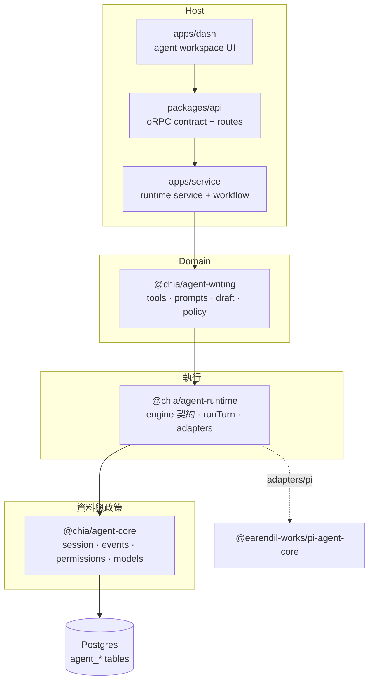
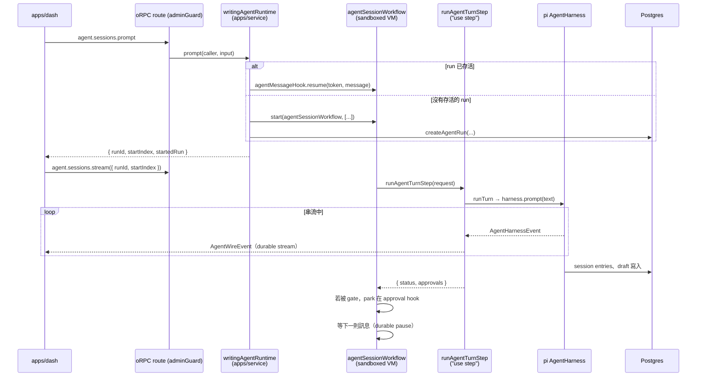
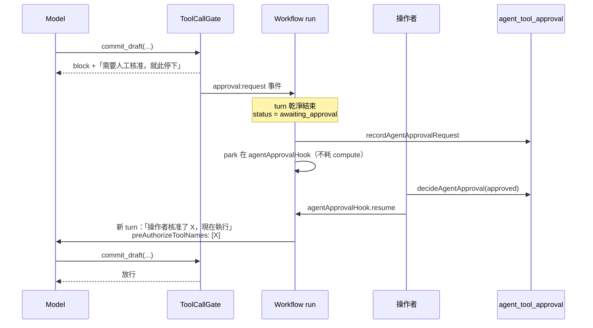

# Agent 架構與執行流程

> 狀態：現行架構（as-built）
> 最後更新：2026-07-31
> 英文版：[docs/agent-architecture.md](./agent-architecture.md)
> 相關文件：[docs/rag-architecture.md](./rag-architecture.md)、[plans/service-transport-unification-plan.md](../plans/service-transport-unification-plan.md)

本文件說明這個 repo 的 agent stack 如何分層、一個 turn 從頭到尾如何執行、每一份狀態存在哪裡，以及要新增第二種 agent kind 需要做什麼。

目前唯一上線的 agent kind 是 **`writing`**——住在 admin dashboard 裡的部落格寫作助手。所有通用的部分都已經下沉到共用套件，所以下一個 kind 是「新增一個 sibling 套件」，而不是「改 core」。

## 1. 分層

四層，每一層只有一個存在理由：

| 層級                    | 套件 / 應用                                 | 負責                                                                 | 不該知道                        |
| ----------------------- | ------------------------------------------- | -------------------------------------------------------------------- | ------------------------------- |
| **資料與政策**          | `@chia/agent-core`                          | Postgres 上的 session tree、wire event 契約、approval gate、模型註冊 | agent 是「做什麼用」的          |
| **執行**                | `@chia/agent-runtime`                       | engine 契約、turn 生命週期、provider adapters、client transports     | 任何特定 domain、任何 DB schema |
| **Domain（單一 kind）** | `@chia/agent-writing`                       | tools、prompts、skills、draft 暫存區、tier policy、模型 allowlist    | transport、auth、durable 執行   |
| **Host**                | `apps/service`、`packages/api`、`apps/dash` | 組裝、oRPC routes、durable workflow、auth、UI                        | pi 的內部細節                   |



pi（`@earendil-works/pi-agent-core` / `pi-ai`）是目前被 runtime 包起來的 harness。它是刻意被隔離的：`packages/agent-core/src/session/index.ts` 代為 re-export 其他程式需要的 pi 符號，而唯一會 `new AgentHarness` 的地方是 `packages/agent-runtime/src/adapters/pi.ts:70`。pi 還在 0.x、變動頻繁；除了這兩個檔案，其他地方不該需要在意。

## 2. 核心概念

### 2.1 Agent kind

`agent_session.kind` 是字串型的 registry key（目前只有 `"writing"`）。它決定三件事：

- 面向 oRPC 的 runtime 實作（`registerAgentRuntime(kind, impl)`）
- workflow step 裡的 turn handler（`apps/service/src/steps/agent-turn.step.ts:880` 的 `AGENT_TURN_HANDLERS`）
- 存放 kind 專屬 session 狀態的 extension row（`writing_agent_session`）

Session 層級的請求一律**從資料庫那一列解析 kind**，而不是信任 client 輸入——client 不可能靠傳另一個 key，把既有 session 導到別的 kind 的工具上（`packages/api/orpc/routes/agent.route.ts:30`）。

### 2.2 Tool tiers

Tier 屬於每個 kind 自己的政策，所以 `@chia/agent-core` 把它定義成單純的字串。Writing agent 把它收斂成三層，依「破壞半徑」遞增：

| Tier     | 意義                                         | 需要核准 | 觸發 `state:changed` |
| -------- | -------------------------------------------- | -------- | -------------------- |
| `read`   | 純讀取與對外 fetch，不改變任何可觀察狀態     | 否       | 否                   |
| `draft`  | 只寫入暫存區，可回復                         | 否       | 是                   |
| `commit` | 寫入 `feed` / `feed_translation` / `content` | **是**   | 是                   |

未知的 tool name 會 fallback 到這個 kind *最嚴格*的 tier（`packages/agent-writing/src/policy.ts:19`）。把 policy 做成注入式的重點在於：另一個 kind 可以自己選 fallback，而不是被迫繼承 `commit`。

### 2.3 `AgentPolicy`

這個 seam 以前是一張「寫作 agent 的 tool 名稱」module-level 查表。現在由 kind 提供 `tierOf`、`labelOf`、`requiresApproval`、`changesState`、`summarize` 與 `stateScope`；core 用它來做分類、gating 與事件對應（`packages/agent-core/src/types.ts:38`）。

### 2.4 Session tree

Transcript 是一棵**樹**，不是平坦的 log：`agent_session_entry.parentId` 指向同一條分支上的前一個 entry，`agent_session.leafEntryId` 標記目前的 leaf。這正是「退回三步、用另一個角度重寫」能成立的原因，也是 pi 的 `SessionStorage` port 預期的形狀。`@chia/agent-core/session` 就是在這些表上實作那個 port。

## 3. 資料模型

```
agent_session                 -- 通用；以 `kind` 區分
├── id (uuidv7，由應用產生)     -- 必須不可枚舉：id 會流經 model context 與事件串流
├── user_id, kind, title
├── provider_id / model_id / thinking_level
├── active_tool_names          -- null = 所有已註冊 tool 都啟用
├── auto_approve  jsonb        -- 整個 session 預先核准的 tiers
├── runtime_config / config_version
└── leaf_entry_id              -- session tree 目前的 leaf

agent_session_entry            -- 一個樹節點；(session_id, id) 為 PK，`seq` 保留插入順序
agent_run                      -- 一次執行；partial unique index 保證每個 session 只有一個 active
agent_pending_message          -- steer / followUp 佇列；消費後保留不刪
agent_tool_approval            -- (session_id, tool_call_id) PK；durable 的稽核軌跡

writing_agent_session          -- 1:1 extension：target_feed_id、feed_meta
writing_agent_draft            -- (session_id, locale) PK：meta jsonb + content
```

兩個刻意的取捨：

- **用 extension table，而不是加 nullable 欄位。** 第二個 kind 要新增 `writing_agent_session` 的 sibling，而不是把共用表越加越寬。
- **entry 的 `payload` 用不透明的 jsonb。** Entry 型別對應 harness 自己的 union（`message`、`compaction`、`modelChange`、`label`…）。不透明存放讓 harness 能演進 entry 型別而不需要 migration。

## 4. 一個 turn 的完整流程



### 4.1 入列（`prompt`）

`packages/api/orpc/routes/agent.route.ts` → `apps/service/src/services/agent-runtime.service.ts:424`。

Route 在 `adminGuard()` 之後，會 pin 到設定好的 admin id——已登入的非 admin 根本碰不到這些 procedure。接著還會**再次**比對 `agent_session.user_id`，因為 session id 是 client 輸入：guard 證明「誰在呼叫」，不代表「他可以開哪個 session」。

Runtime 接著決定是透過 message hook 喚醒該 session 存活中的 run，還是開一個新的。有三種拒絕發生在這一層，而不是更深處，因為每一種若放行，從操作者角度看都會像「訊息憑空消失」：

| 條件                | 為什麼拒絕                                                        |
| ------------------- | ----------------------------------------------------------------- |
| 還有未決的 approval | run 停在 _approval_ hook 上，新訊息會躺在那裡沒人讀               |
| hook 尚未註冊完成   | `createHook()` 在第一次 suspend 時才 commit，`start()` 後有空窗期 |
| `text === "/end"`   | 保留的 sentinel，用來結束該 session 的 run                        |

`prompt` 在訊息被接受後就立刻回傳，同時帶回 stream cursor（`startIndex` = 目前 tail + 1），讓 client 只 tail _這一個_ turn，而不是重播整個 session。

### 4.2 Durable driver（`agentSessionWorkflow`）

每個 session 一個 durable run，上限 `MAX_TURNS_PER_RUN = 200`。這個 run 是**驅動器**，不是對話儲存體：它等下一則訊息、以 step 形式執行一個 turn、在 gated tool 被拒時 park 在 approval hook 上。

Workflow function 跑在**沙箱 VM** 裡——沒有 Node built-ins、沒有原生 `fetch`、沒有 `Date.now()`。真正的工作都在 step 裡，跨界只傳純資料。這也是為什麼 hook 的 payload schema 放在 `apps/service/src/workflows/hooks/agent.hooks.ts`（純 zod + `defineHook`），以及為什麼 hook token 是決定性的（`agent:msg:<sessionId>`、`agent:approve:<sessionId>:<toolCallId>`）——只握有 id 的請求就能重建 token，不必查表。

這個 run 帶來的、in-process registry 做不到的好處：

- turn 能撐過部署或重啟
- approval 可以隔一天才給，park 期間不消耗任何 compute
- stream replay 是 durable 的，重連的 client 看得到整個 turn

### 4.3 Turn step

`runAgentTurnStep` 驗證 session 與 caller、解析出該 kind 的 handler、組出各個 port（`PgSessionRepo`、`PgDraftStore`、`PgPendingMessageStore`、content port）、載入已核准的 tool call id，然後呼叫 `writingAgentRuntime.runTurn(...)`。

**`maxRetries = 0`，這是刻意的。** 一個 turn 不可重播：失敗時它可能已經寫過暫存區、往 session tree 追加過 entry，或（在 `autoApprove` 下）已經 commit 了。pi 內部本來就會重試 _provider_ 請求，那才是暫時性失敗真正發生的地方。失敗會以 `error` 事件加上 `run_failed` 呈現；操作者重新下指令，pi 從那個半完成 turn 留下的內容重建 context。

### 4.4 `runTurn`

`packages/agent-runtime/src/runtime.ts:63` 是與 engine 無關的生命週期：

1. 透過該 kind 的 `createEngine` 建出 engine handle
2. 發出 `run:start` 與 `user` 事件
3. 啟動 1 秒間隔的 timer，把 pending-message 佇列 drain 進 engine
4. `prompt(text)` 或 `promptFromTemplate(name, args)`
5. 停止 drain，把每個 `ApprovalRequest` 經 `toApproval`、`persistApproval` 處理
6. 發出 `run:end`，reason 為 `done` | `awaiting_approval` | `error`
7. dispose engine，最後 `flushEvents()`

Drain 失敗絕不會終止 turn——durable store 會把訊息留在佇列裡等下一次。

### 4.5 串流

每個 run 有兩條 durable stream：

| Stream         | 內容                                                   | 寫入方式                                                 |
| -------------- | ------------------------------------------------------ | -------------------------------------------------------- |
| 預設 namespace | 粗粒度事件（`tool:*`、`assistant:end`、`approval:*`…） | 每個各一次 durable write；量少、每一個都對 replay 有意義 |
| `agent:deltas` | `assistant:delta` 批次                                 | 以約 80 ms 的視窗批次寫入                                |

每一次 `write()` 都是 durable write，而一個 turn 會產生數千個 delta，所以 delta 走自己的 namespace：重連的 client 可以便宜地重播粗粒度 transcript，只在需要打字動畫時才 opt-in。粗粒度事件寫入前會先 flush delta buffer，讓兩條 stream 彼此保持一致。

`stream()` 會 race 兩個 reader（而不是先抽乾一條再抽另一條），讓 delta 與它所屬的粗粒度事件保持交錯；抽乾的那一側會被換成一個永不 settle 的 promise，避免它再次贏得 race（`apps/service/src/services/agent-runtime.service.ts:501`）。

Stream **不會**在 turn 結束時關閉——一個 run 會執行很多 turn。`closeAgentStreamsStep` 只在 run 本身結束時關閉一次。

## 5. Approval 握手

pi 的 `tool_call` hook 契約是「回傳 `{ block: true, reason }` 表示拒絕」，而這個拒絕會以 error tool result 的形式回到 model。這被拿來當作 approval 握手，**而不是把 harness 卡在記憶體裡的 promise 上**：park 在 deferred 上的 turn 撐不過一次部署，而被拒絕的 tool call 會讓 session tree 保持一致且可續行。



Gate 在四種情況下放行（`packages/agent-core/src/permissions.ts:57`）：

1. 該 tier 本來就不需要核准
2. 該 tier 在 session 的 `autoApprove` 裡
3. 該 `toolCallId` 在 `approvedToolCallIds` 裡（從 `agent_tool_approval` 讀回）
4. 該 tool name 在 `preAuthorizedToolNames` 裡——只限這一個 turn

(4) 是讓「核准並執行」只多花一個 turn、而不是再走一次拒絕迴圈的關鍵。決定會在喚醒 run **之前**先持久化，所以它的壽命長於 run；即使 run 被替換掉，gate 也能把它讀回來。

拒絕不是沉默：workflow 會再跑一個 turn 告訴 agent 它被否決了，並附上操作者的留言，讓它能好好收尾，而不是話說一半就停住。

## 6. Wire events

`packages/agent-core/src/events.ts` 是 harness 與任何 client 之間唯一的收斂點。pi 的 `AgentHarnessEvent` 不能直接轉發——它夾帶整個 `Model` 物件、每個 delta 都附上 `partial` assistant 快照，以及沒有上限的 tool `details`。

```
run:start · user · assistant:start · assistant:delta · assistant:end
tool:start · tool:update · tool:end
approval:request · approval:resolved
session:compacted · state:changed · error · run:end
```

除了 schema，兩個函式值得注意：

- **`createEventMapper`**——pi 事件 → wire 事件。它**每個 turn 帶狀態**（pi 的 assistant message 沒有 id，所以 mapper 自己配一個，並累積 text/thinking 最後發出單一 `assistant:end`）。每個 run 建一個，絕不共用。
- **`foldEvents` / `applyEvent`**——把即時串流*或*重播的 transcript（`entriesToWireEvents`）折成同一個 view model，所以 dashboard 對「歷史」與「即時輸出」只有一條 render 路徑。

`state:changed` 只負責 bump：帶一個 scope（`"draft"`）與 revision，client 收到後自行 refetch，而不是把 domain 狀態 diff 到線上。

### 6.1 TanStack AI transport

`@chia/agent-runtime/transports/tanstack-ai` 把 wire events 對應到 TanStack AI React client 消費的 AG-UI 事件子集，讓 `agent.sessions.chat` 能驅動標準 chat UI。`chat` 是單一 procedure：先執行動作（prompt 或 approve），再從那個動作產生的確切 cursor 回傳對應後的串流。

## 7. Writing agent

### 7.1 Tools

| Tier     | Tool                                                                                     |
| -------- | ---------------------------------------------------------------------------------------- |
| `read`   | `search_posts`（Algolia 或語意）、`get_post`、`list_posts`、`list_tags`、`fetch_url`     |
| `draft`  | `read_draft`、`patch_draft_meta`、`write_draft_content`、`edit_draft_content`、`slugify` |
| `commit` | `commit_draft`、`set_published`                                                          |

註冊順序是刻意的——那就是 pi 列給 model 的順序，會把它推向自然的工作流：先站穩事實、再起草、最後 commit。

`TOOL_TIER_BY_NAME` / `TOOL_LABEL_BY_NAME` 放在獨立 module（`packages/agent-writing/src/tools/registry.ts`），而不是從 tool 物件推導，這樣 permission gate 與 event mapper 可以在不建構 tool 的情況下分類一次呼叫——建構 tool 需要 port，port 需要資料庫。

`commit` 刻意沒有的東西：刪除、硬刪除與圖片上傳。Agent 沒有理由刪文章，presigned 上傳留給人做。

### 7.2 Draft 暫存區

Agent 永遠不直接改線上的部落格。它寫入 `writing_agent_draft` + `writing_agent_session.feedMeta`，再由 `commit_draft` 透過既有的 feed procedure 把暫存內容升級上去。若 session 是針對既有文章開的，暫存區會從那篇文章 seed（`seedFromPost`），讓 agent 編輯真實內容而不是憑空猜測。

`tagSlugs` 會被記錄但**不會** commit——repo 目前沒有寫入 tag 的路徑，所以 agent 只是提出 tag 建議，交給人套用。

`edit_draft_content` 需要 byte 級精確的 `oldString`，否則會拋 `EditNotAppliedError`；`withLineNumbers` 就是 model 在編輯前把 body 讀回來的方式。

### 7.3 Prompts、skills、templates

`systemPrompt` 傳入的是 **callback** 而不是字串，所以 pi 每個 turn 都會重新求值。因此有兩段內容永遠是最新的：

- **Current session**——正在編輯什麼、站台與 draft 的預設 locale、slug、type，以及每個 locale 的 body 大小與缺哪些 metadata 欄位。少了它，model 每個 turn 開頭都要花一次 tool round-trip 只為了搞清楚自己在哪。
- **Approval**——依 `commit` 是否在 `autoApprove` 裡給出不同文字。不在的時候，prompt 會明確告訴 model：那個拒絕錯誤是*預期*的，不要重試、也不要繞過 gate。

Skills（`mdx-authoring`、`zh-tw-tone`、`en-tone`、`seo-metadata`、`bilingual-parity`）會列在 system prompt 裡，按需讀取。Prompt templates 是操作者的捷徑：`/new-post`、`/translate`、`/seo-pass`、`/rewrite-section`、`/fact-check`。

### 7.4 模型 allowlist

`WRITING_MODEL_IDS` 刻意窄——一個對部落格有寫入權、長時程運作的寫作 agent，不是拿來發現「便宜的模型會忽略 tool schema」的好地方。清單依優劣排序，第一個就是預設（`anthropic/claude-sonnet-5`）。model id 來自 client 可設定的欄位，所以清單外的一律拒絕，即使 gateway 願意服務。

Provider 用的是 pi-ai 內建的 `vercelAIGatewayProvider()`，它以 Anthropic 原生 messages API 對接與 repo 其他地方相同的 gateway 與 `AI_GATEWAY_API_KEY`——因此原生 thinking 與 prompt caching 的保真度都保住了（換成 OpenAI-compatible shim 兩者都會失去）。

### 7.5 Ports

`@chia/agent-writing` 宣告它需要 host 提供什麼，本身一個都不實作：

- **`ContentPort`**——`searchPosts`、`getPost`、`listPosts`、`listTags`、`fetchPage`、`commitDraft`、`setPublished`。在 `apps/service/src/services/agent-content.port.ts` 針對 repo 既有的 repository 與 feed service 實作。它本身不做授權——`adminGuard` 已經跑過了。
- **`DraftStore`**——暫存區。production 用 `PgDraftStore`，測試用 `InMemoryDraftStore`。

這個切法是 tool 能在沒有資料庫的情況下被測試的原因，也是 Algolia / S3 / auth 的關注點不會滲進 domain 套件的原因。

## 8. 無狀態

任何地方都沒有 in-process registry。每一份狀態都是 durable 的：

| 狀態                   | 存放位置                                        |
| ---------------------- | ----------------------------------------------- |
| transcript             | `agent_session_entry`（dashboard 直接查詢）     |
| draft 暫存區           | `writing_agent_session` + `writing_agent_draft` |
| approval 決定          | `agent_tool_approval`                           |
| steer / follow-up 佇列 | `agent_pending_message`                         |
| turn 執行 metadata     | `agent_run`                                     |
| 暫停點與事件串流       | workflow backend                                |

這正是「turn 進行中部署仍可存活」、「approval 可以隔天才給」、以及「service 可以跨 instance 複製而不需要協調層」的原因。

## 9. Session 維護

`compact` 與 `navigate`（rewind）用的是 **maintenance engine**（`AgentDefinition.createMaintenanceEngine`）：只帶 session 與 model，沒有 tools、skills、system prompt、approval gate 或事件訂閱。壓縮走 pi 自己的 `SUMMARIZATION_SYSTEM_PROMPT`，branch summary 走 `generateBranchSummary`，兩者都讀不到 agent 的 system prompt，所以那些東西建了也只是丟掉。兩者都會改動樹，所以只要 run 的 status 是 `running` 就一律拒絕。單純「run 還活著」不足以構成拒絕理由：park 在 message hook 上就是正常的閒置狀態。

`navigate` 會回傳整份重建後的 transcript，因為換分支會讓 client 的視圖整份失效。

### 9.1 自動壓縮

除了手動的 `agent.sessions.compact`，`runTurn` 會在**每個 turn 結束時**呼叫 `compactIfNeeded()`——engine 自行用 pi 的 `estimateContextTokens` + `shouldCompact` 判斷是否超過 `contextWindow - reserveTokens`，沒超過就回 `null`。閾值刻意留在 adapter 而不是 runtime：token 估算要用 engine 自己的帳（有 provider usage 就用，沒有才退回啟發式），runtime 再算一份只會漂移。

兩個守衛缺一不可：**有 approval 待決時不壓**（壓縮會把 horizon 移到之後才 resume 的 run 底下），**turn 失敗時不壓**（壓掉的 transcript 無法診斷）。壓縮失敗永遠不會拖垮 turn，下個 turn 邊界會再試。

選在 turn 之後而非之前，是因為使用者不必等一次 summarization call 才看到第一個 token，而且剛落地的 assistant message 帶著 provider 回報的 usage，是最準的訊號。`session:compacted` 事件走既有的串流路徑，client 不需要任何改動。

## 10. Steering 與 follow-up

`AgentHarness.steer()` 是方法而不是 callback，所以 turn 進行中經由 HTTP 抵達的訊息碰不到正在跑的 harness。Transport 會寫一列到 `agent_pending_message`；turn 的 drain 迴圈把它 claim 走（atomically，並標記 consumed），再重播進 harness：`steer()` 會打斷當前 turn，`followUp()` 則等到 turn 本來要停下時才插入。列在 `consumedAt` 之後仍保留，讓 transcript 能解釋 agent 為什麼改變方向。

claim 是**先標記 consumed 再投遞**，所以 harness 拒收的訊息會被**放回佇列**——pi 在 idle 狀態會拒絕 `steer()`，而那正是 turn 在 claim 與投遞之間結束時會發生的事。放回去的訊息會出現在下一個 turn，而不是憑空消失。

### 10.1 喚醒通道

只靠輪詢的話，一則 steer 最差要等一個 drain interval 才被看到。當 cache 是 Redis 時，`agent:pending:<sessionId>` 上一個**不帶 payload** 的通知會叫正在跑的 turn 立刻 drain（`apps/service/src/services/agent-pending-notifier.ts`）。

它純粹是加速層。訊息在通知發出前就已經持久化在 Postgres，所以掉一個通知只損失延遲、不損失資料——這也是輪詢維持原本頻率、以及通道不帶 payload 的理由。其他 cache provider 拿到的是 `null` notifier，行為與改動前完全相同。

drain 迴圈有一個細節：同時間只有一次 drain，但**通知在 in-flight drain 已經 claim 之後才到達**時不能直接併掉，否則新訊息要等下一次輪詢，這個通道就白做了。這種請求會設一個旗標，drain 結束後自動補跑一輪；teardown 會跟著這條鏈走到底才 dispose engine。

## 11. 新增第二種 agent kind

`@chia/agent-core` 與 `@chia/agent-runtime` 都不該需要改動。

1. **新套件** `@chia/agent-<kind>`：tool set、prompts、skills、tier union、`AgentPolicy`、模型 allowlist、domain ports，以及一個把它們綁到 adapter 上的 `createEngine`（`@chia/agent-runtime/adapters/pi`，或一個新的 adapter）。
2. **包起來**：用 `createAgentRuntime(definition)` 取得共用的 turn 生命週期。
3. **Extension table**：存放 kind 專屬 session 狀態，對 `agent_session.id` 做 1:1。
4. **Host 組裝**：在 `apps/service` 加一個 `agent-runtime.service.ts` 的 sibling，實作 `AgentRuntime` port，並在 module load 時呼叫 `registerAgentRuntime(kind, impl)`。
5. **Turn handler**：註冊進 `AGENT_TURN_HANDLERS`。靜態註冊是刻意的——workflow step 是依部署版本打包的 bundle，而 workflow function 要保持不 import 任何 domain。

oRPC 契約、dashboard 的 event fold、approval 流程與 durable run 全部原封不動地複用。

## 12. 檔案索引

| 關注點                     | 檔案                                                                     |
| -------------------------- | ------------------------------------------------------------------------ |
| Wire events + fold         | `packages/agent-core/src/events.ts`                                      |
| Approval gate              | `packages/agent-core/src/permissions.ts`                                 |
| Postgres 上的 session tree | `packages/agent-core/src/session/pg-storage.ts`、`pg-repo.ts`            |
| Turn 生命週期              | `packages/agent-runtime/src/runtime.ts`                                  |
| Engine 契約                | `packages/agent-runtime/src/engine.ts`                                   |
| pi adapter                 | `packages/agent-runtime/src/adapters/pi.ts`                              |
| TanStack AI transport      | `packages/agent-runtime/src/transports/tanstack-ai.ts`                   |
| Writing policy / tiers     | `packages/agent-writing/src/policy.ts`、`src/types.ts`                   |
| Writing tools              | `packages/agent-writing/src/tools/`                                      |
| System prompt / skills     | `packages/agent-writing/src/prompts/`                                    |
| Durable run                | `apps/service/src/workflows/agent-session.workflow.ts`                   |
| Turn step + event writer   | `apps/service/src/steps/agent-turn.step.ts`                              |
| Transport 組裝             | `apps/service/src/services/agent-runtime.service.ts`                     |
| oRPC 契約 / routes         | `packages/api/orpc/contracts/agent.contract.ts`、`routes/agent.route.ts` |
| Schema                     | `packages/db/src/schemas/agent.schema.ts`                                |
| Dashboard UI               | `apps/dash/src/components/agent/`                                        |
