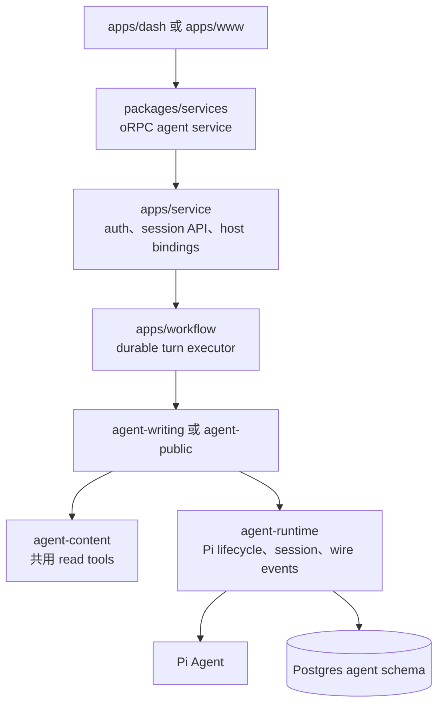
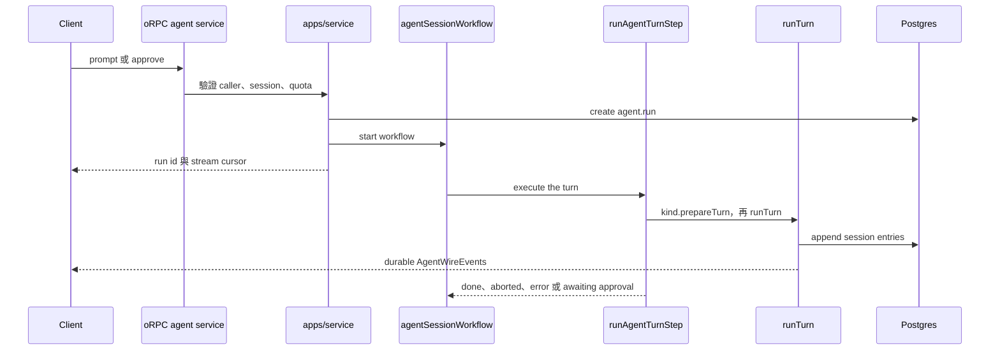
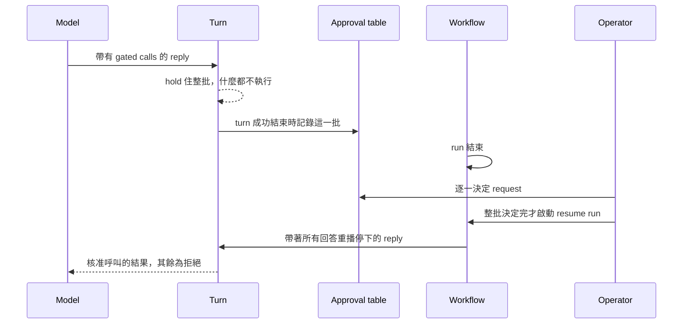

# Agent 架構與 Turn 流程

> 狀態：as-built
>
> 最後更新：2026-09-24
>
> English: [docs/agent-architecture.md](./agent-architecture.md)
>
> 相關文件：[RAG 架構](./rag-architecture.zh.md)、[Workflow deployment](./workflow-deployment.md)

本文件先說明系統邊界，再沿著一個 turn 深入 durable execution、approval、streaming 與 maintenance。

## 1. 系統總覽

目前 stack 採 Pi-first。Pi 的 `Agent` 執行 provider 與 tool loop；`@chia/agent-runtime` 在外層提供 durable session tree、context projection、compaction、navigation 與 client event contract。系統沒有 engine-neutral adapter。

目前有兩個 agent kind：

- `writing`：dashboard 的寫作 agent，僅限設定的 operator 使用。
- `public`：公開站的閱讀 agent，guest session 也能使用。



| 層                         | 擁有者                                               | 責任                                                        |
| -------------------------- | ---------------------------------------------------- | ----------------------------------------------------------- |
| Transport 與 orchestration | `packages/services`、`apps/service`、`apps/workflow` | Auth、oRPC、workflow control、streams 與 host ports         |
| Execution                  | `@chia/agent-runtime`                                | Pi lifecycle、persistence、approvals、models 與 wire events |
| Shared content             | `@chia/agent-content`                                | 唯讀部落格 tools、`ContentReadPort` 與 `ProfileReadPort`    |
| Domain                     | `@chia/agent-writing`、`@chia/agent-public`          | Prompts、tools、policy、model allowlist 與 domain ports     |
| Client                     | `@chia/agent-elements`                               | Session store、queries 與共用 chat UI                       |

穩定的 client 邊界是 `AgentWireEvent`，不是可替換的 model engine。Runtime 內部保留明確的 Pi 命名與型別；kind 用 runtime 自己的詞彙宣告 tools 與 prompts，不 import Pi。

## 2. Agent kind 與 host 邊界

`agent.session.kind` 是持久化的 domain discriminator。Session request 從資料庫解析 kind；client input 只能交叉驗證，不能用另一個 kind 的 tools 驅動既有 session。

每個 host 提供 `AgentKindDefinition`：

- `apps/service/src/agents/` 綁定 API 階段的 capabilities、state 與 credentials。
- `apps/workflow/src/agents/` 綁定執行階段的 ports，提供 `AgentKindExecutor`，也就是 definition 加上 `prepareTurn`。`prepareTurn` 回傳 kind 的 tools、prompts、budget、preflight、approval key，以及 turn 結束後執行的 `settle`（可省略）；model 由 step 解析，session、events、usage 與 approval 持久化也由 step 直接交給 `runTurn`。
- `packages/services/agent/` 擁有共用的 session、run、approval、maintenance、usage 與 admin 行為。

oRPC context 接收一個由 eager `minTier` 與 dynamic definition loader 建立的 `agentFactory`。Guard 能在載入 domain package 或 provider SDK 前拒絕呼叫；dynamic import 已提供 module cache，factory 不另外保存 definition registry 或 service cache。

`AgentKindService` 只包含所有 kind 共用的能力。未來若有 kind-specific procedure，應建立自己的 `agent.<kind>.*` contract 與 port，不擴大 generic service。

### 存取模型

每條 agent route 先解析 `CallerTier`（`@chia/auth/tier`），再由 kind 與 session guard 比對 kind 的 floor 並驗證 ownership。Floor 是 definition 的 `minTier` 經 operator 的 `kind_config.min_tier` override 抬高後的值；override 只能抬高不能降低，kind 不會開放到程式碼沒有支援的 tier。

| Kind      | Definition floor | 內容可見性                     | 可變 domain state    |
| --------- | ---------------- | ------------------------------ | -------------------- |
| `writing` | `Root`           | 設定作者的草稿與已發佈內容     | 共用 draft 與 memory |
| `public`  | `Guest`          | 設定作者的已發佈內容與 profile | 讀者回報             |

Better Auth 的 `get-session` 帶有 `access`：session 自身的 tier、dashboard 等級，以及每個 hosted kind 目前的 floor。前端據此決定要渲染什麼；guards 不讀它，每個請求都重新分級 caller。

Generic 層不攜帶 admin 身分。Writing binding 只在建立 content port 時讀設定作者；public binding 不會收到該身分或任何可寫 port。

Public kind 有共用 content-read tools，沒有 approval tier、memory 或 draft；web 是下文所述的單一 turn 授權。House usage 限定在便宜模型清單；原生 BYOK provider 可以開放，因為費用由訪客承擔。每個 turn 另有限制 tool calls、重複次數與執行時間的 budget。

Kind 可以在 model 執行前 `screen` 使用者輸入的訊息。Public kind 會把訪客的文字與選取內容交給 `GuardProvider` seam（`@chia/ai/guard/provider`，未設定 `GUARD_PROVIDER` 時關閉）評分：注入或不當請求的機率達到 `GUARD_THRESHOLD` 時，該 turn 以 `refused` 結束且訊息不會寫入 session，因此無法從 transcript 影響後續 turn。Screen 在三秒後 fail open；這個 kind 的影響範圍由它的 ports 與額度界定，而不是由 guard 界定。調整門檻或問題措辭前後都要跑一次 `guard-eval`。

Host 只有在 operator 開啟 `webAccess`、已設定 guard provider，且 session 擁有者是已登入帳號（不是 guest）時，才會在該 turn 把 `WebPort` 交給 public kind。它的 `web_search` 與 `fetch_url` 是這個 kind 自己的工具，不是 writing kind 的：只有本 turn 搜尋回傳過的頁面才能讀取，因此訪客或被注入的頁面都無法把 fetch 指向自選的 URL；搜尋與讀取每個 turn 都有上限，因為 Firecrawl 的請求不在 usage ledger 內；搜尋結果與頁面在 model 讀取前先通過 `checkDocument`，被標記或 guard 失敗時一律不提供；通過的內容會以隨機邊界包成不可信文字。聊天 markdown 會把 model 輸出的圖片改成先確認才開啟的連結，否則圖片會在未經同意下載入其 URL。

已登入的 session 擁有者也會在該 turn 取得 `ReportPort`，綁定該擁有者與 session。`report_issue` 每個 turn 針對一篇已發佈文章寫入一筆 `feed_report`：段落、讀者的主張、model 的判斷，以及讀者或 model 能給出的修正文字，全部以引用文字保存，由 operator 審閱。它不會改動訪客讀到的任何內容，每位讀者每天可送出的回報數有上限。Guest 的 prompt 不帶這個工具，改為說明回報需要登入。送出回報會啟動一個 workflow：先執行 `report.triage` task，這是不帶工具、使用 house model 的單次呼叫，儲存判斷與經已發佈內文驗證過的精確替換建議，再以純文字 email 通知 operator。兩個步驟都不會碰 draft；triage 失敗時仍會寄出 email。

## 3. Durable state 與 session tree

Transcript 是一棵樹。`agent.session_entry.parentId` 連接 branch，`agent.session.leafEntryId` 選擇 active leaf。`seq` 記錄所有 branch 的持久化順序；每個 session 同時只有一個 writer，因此此順序可靠。

`PgSessionStorage` 實作 runtime 的 `SessionTree`，測試使用 `InMemorySessionTree`。Entry type 與 context projection 由 runtime 自己持有，兩者都鏡射 Pi 的定義，因此 branch 讀起來與在 Pi harness 下完全一致。Session entry 以 opaque JSON 保存；已淘汰的 entry type 直接忽略，不做資料 migration。Kind-specific state 使用 extension table，不在共用 session row 增加大量 nullable columns。

```text
agent.session            kind、settings、active leaf
agent.session_entry      transcript tree nodes
agent.run                durable run 與 turn marker
agent.tool_approval      approval state 與 audit trail
agent.writing_session    writing kind 的 extension row
agent.writing_session_draft  session 處理過的共用 drafts，各自記錄最後看到的 revision
agent.memory             跨 session 的 memory
agent.kind_config        operator 的 kind overrides
agent.task_config        operator 的 task overrides
agent.usage_ledger       provider-call cost ledger
agent.quota_config       quota 與 running-turn limits
```

Server-side conversational state 都能持久化；client view 則由 server detail 與 wire events 推導：

| State                                  | 儲存位置                        |
| -------------------------------------- | ------------------------------- |
| Transcript 與 branches                 | Postgres session tree           |
| 共用 draft 與 memory                   | Postgres domain tables          |
| Approvals 與 run metadata              | Postgres agent tables           |
| Turn runs、abort pauses、event streams | Workflow backend                |
| Client request state                   | TanStack Query                  |
| Client live turn state                 | 每個 session 一個 zustand store |

## 4. 一個 turn



### Durable driver

每個 turn 都是自己的 workflow run。Prompt 與 operator 對 turn 停下的那批呼叫的回答各自啟動一個 run，執行一次 `runAgentTurnStep` 後結束；turn 之間沒有任何東西停等，run 的 journal 只有一個 turn 長，session 的對話完整存在 Postgres。

一次只跑一個 turn。Turn 執行中送入的 prompt 會被拒絕：admission 在此檢查 quota 與 running cap，排在後面的 turn 會在前一個 turn 費用入帳後才執行，卻不會再被檢查。Approval 未決時同樣拒絕。

Acceptance 先 commit，再通知 workflow。新的 run row 就是紀錄，在 session lock 下寫入作為 session 的 lease；交付在 lock transaction 之外進行，因為 workflow command 無法 rollback。`createAgentRun` 會關閉 session 前一個 run row，World 裡仍存活的前一個 run 也會被 cancel。Workflow service 在執行前拒絕的 start 會把 row 標為 failed；結果不明的 start 保留 lease，因為 workflow 可能已在執行。接著 step 在 session lock 下 claim 自己的 run：row 必須仍是 session 的 active run，marker 寫入與 workflow run id 綁定在同一個交易完成，所以 service 寫不進去的綁定由 executor 修復，abort 與 reconcile 都能找到該 run。中途被 cancel、failed 或取代的 run 不會執行任何東西。Reconcile 只在 run 仍帶著判斷當時讀到的 workflow run id 時才關閉它，所以 executor 在這之間 claim 走的 lease 不會被誤關。Step 拋錯時 marker 保持 running，因為 run 會結束並關閉 row。Row 記錄的是 turn 的結果：error 或 step 拋錯為 `failed`、abort 為 `cancelled`、其餘為 `completed`；executor 的 claim 也記在 marker 上，所以已關閉的 row 也能說出模型有沒有跑過。綁定失敗後會用只有該請求持有的 id 送出 abort；只有確認 turn 已結束才把 row 標為 failed，否則 lease 繼續擋住 session。

Workflow function 只負責 orchestration；DB、provider、timer 與 network 操作留在 steps。`runAgentTurnStep` 設 `maxRetries = 0`，因為 turn 可能已寫入 entry 或執行核准過的 side effect。Provider retry 留在 Pi；失敗的 turn 只能由新訊息重新嘗試。

Start、abort resume 與 cancel 透過 authenticated `WorkflowControl` contract 從 `service` 送到單一 workflow process。Status 與 stream read 直接使用共用 World storage。詳見 [Workflow deployment](./workflow-deployment.md)。

### Runtime lifecycle

Production execution path：

```text
runAgentTurnStep → kind.prepareTurn → runTurn → new Agent
```

Kind 以 `@chia/agent-runtime/tools` 的 `defineTool` 宣告 tools：parameters 是 zod schema，`execute` 以 closure 取得該 turn 的 ports，回傳模型讀的文字與 client 顯示用的 `details`。Tool spec（name、description、parameters）不需要 ports 就能匯入，capabilities 清單讀的是它。Label、tier，以及成功呼叫會改變哪個 kind state，由 policy 的 `toolInfo` 宣告；`state:changed` 依這個宣告發出，不從 tier 推測。Runtime 每個 turn 把 tool 綁成 Pi 的 `AgentTool`：zod schema 轉成 Pi 用來驗證與 coerce 的 JSON Schema，optional 參數對模型呈現為 nullable、模型送來的 `null` 會被丟掉，參數在 `execute` 前再以 zod parse。

`runTurn`：

1. 先把 operator 的訊息寫進 tree，或取出 resume 要回答的那則停下的 reply，再將 active branch 投影為 model messages。
2. 安裝 turn budget、approval gate、volatile context、state-change hook 與 abort signal。
3. 每個完整的 assistant、tool-result message 都先持久化，再發出 wire event。
4. 從 branch 接續執行 Pi 的 `Agent`，並分類 provider、host、abort 與 budget failure。
5. Provider turn 成功後，記錄被 hold 住的整批 approval requests。
6. 只在成功且沒有 pending approval 時 auto-compact。
7. 發出 terminal events，最後 flush durable writer。

Host hook 失敗會記為 internal error 並中止 turn。缺少 volatile context 等必要 host state 時，模型不能繼續執行。

### Prompt 分層

System prompt 只放穩定的規則、skill index 與 approval posture。Public kind 另外把作者已發佈的 profile 以單一 locale、字元上限內渲染進去，因為 profile 有界且只在 operator 編輯時改變。時鐘、draft state 和已存 memory 等 turn-specific 資料，透過 Pi context hook 以一則 volatile user message 提供：每個 turn 只讀一次，放在開啟該 turn 的訊息之後（resume 的 turn 則放在它接續的 reply 之前），該 turn 的每次 provider request 都放在同一位置，且不持久化。Turn 自己造成的變化透過 tool 結果讓模型得知。

Gateway 只把一次 prompt 當作下一次請求的前綴來快取：上一次請求的完整 prompt 是這次的前綴才會命中，否則最多只讀回 system prompt。每次請求都在最後加一則新的 volatile message，因此只有 system prompt 被快取。Snapshot 固定位置後，turn 內第一次之後的每次請求都延伸前一次。不寫進 transcript 可避免變動資料累積，代價是每個 turn 的第一次請求無法命中快取。

### Turn budget

Pi 會在模型持續發出 tool call 時繼續 loop，因此每個 kind 都必須提供 `AgentTurnBudget`。

| Limit              | 超過時的行為                              |
| ------------------ | ----------------------------------------- |
| `maxRepeats`       | 對重複且參數相同的呼叫回傳 tool error。   |
| `maxToolCalls`     | 拒絕後續 tools，要求模型用既有結果作答。  |
| `hardMaxToolCalls` | Abort 並回報 `budget_exhausted`。         |
| `maxDurationMs`    | Deadline 到期時中止 provider generation。 |

Budget check 在 approval check 前執行，因此被 budget 拒絕的呼叫不會建立 approval request。

## 5. Approval 與 abort

### Durable approval handshake

Approval 不依賴 in-memory promise，也不停在 run 上。帶有需要核准呼叫的 reply 會結束該 turn 與它的 run；operator 的回答會啟動自己的 run，照原本請求的參數執行被核准的呼叫。



Tool 的 tier 需要核准就會被 gate；session 的 auto-approve 可能在呼叫等待期間改變，所以在 reply 抵達時逐一套用。一個 reply 的整批呼叫會一起被 hold：每個 gated call 都得到回答前，批內什麼都不執行，被 hold 的呼叫在 tree 裡保持沒有結果。每個 gated call 先經過 turn budget 與 kind 的 preflight；被任一拒絕的呼叫以該拒絕作答，tier 被 session auto-approve 的呼叫直接核准。整批都能由 turn 自行作答時，呼叫就地執行；否則 turn 已作答的呼叫會與 requests 一起記錄為已決定（`decided_by` 為空），並跟著一起回答。

Resume run 會把停下的 reply 重新串流給 Pi，取代第一次 provider 請求，所以 Pi 用與其他 reply 相同的 tool 路徑執行這批呼叫：核准的呼叫再經過一次 budget 與 preflight，以記錄的參數執行；批內其他呼叫照常執行；被拒絕或被檢查擋下的呼叫回傳拒絕內容。重播的 reply 不會再計費，也不會再寫入一次。

Request 會連同它的 run 與 approval key 一起記錄；key 是 kind 定義的呼叫身分：tool、目標，以及 operator 被展示的狀態。Writing kind 把 `commit_draft` 綁到 request 當下的 draft 內容 hash，把 `set_published` 綁到 feed 與目標狀態。Resume 的 turn 會把已核准呼叫的 key 交給 kind，`commit_draft` 提交 key 裡的那份 hash：apply service 在寫入 feed 的同一個交易裡鎖住 draft row 並核對 hash，request 之後被改過的 draft 會以 `CONFLICT` 拒絕。Session auto-approve 時，呼叫提交的是它自己讀到的內容，同樣在該鎖之下。

Decision 只寫一次，寫在 pending row 上。完成一整批的那個 decision 會在同一個交易裡寫入 resume run 的 row，並把該 run 記在整批每一列上；較早的 decision 只記錄自己，不啟動任何東西。對已決定的 row 再呼叫 `approve`，只有在 resume run 關閉時 marker 仍未被 claim（從未執行）才會重送這一批；executor claim 過的 run 不論結果如何，以及結果不明的 run，都不會啟動任何東西。被拒絕的呼叫永遠不會執行：模型讀到的結果是 operator 的留言，transcript 會標記為 `declined`，lesson extraction 從這裡讀取拒絕留言。

Request 只在 provider turn 成功後記錄；失敗的 turn 不留下 undecided rows。記錄完成後 stream 才公告它們，緊接在 `run:end{awaiting_approval}` 之前，卡片從這時起才能操作；重新載入的 pending row 效果相同。

### Abort 路徑

取消 workflow run 無法中斷已執行的 step，因此每個 turn run 另有一個停在 hook 上的小型 durable abort-controller workflow。Turn step 訂閱它的 stream，將 `AbortSignal` 傳給 Pi 與 host ports。

Abort 先 resume controller，在 deadline 內等待該 turn 的 `run:end`，再取消 run 並更新 row。部分 assistant output 會以 aborted 狀態持久化；approval 與 compaction 不執行。

## 6. Events、streaming 與 reconnect

Client 只收到受限的 event contract：

```text
run:start · user · assistant:start · assistant:delta · assistant:end
tool:start · tool:update · tool:end
approval:request · approval:resolved
session:compacted · session:rewound · state:changed · error · run:end
```

主要 invariant：

- `messageId` 在 live 與 replay event 中都是 persisted session-entry ID。
- `user` event 帶 operator 的文字與已標 label 的附件；model 實際讀到的附件區塊只存在於持久化的 message 裡。
- History 與 live turn 共用同一個 `applyEvent` reducer。
- Compaction 改變 model context，不刪除可見 history；transcript replay 仍走完整 leaf ancestry。
- 每個開始的 tool 都有 terminal event；replay 會把中斷的 call 關閉為 aborted。
- Wire error 只暴露分類；provider 與 host 細節留在 server log。
- `tool:end.details` 在 durable storage 前先截短；模型讀取的是原始 tool content。
- Durable stream 寫入失敗只會記錄 log，不會讓 turn 失敗：entries 與 side effects 已經持久化，漏掉事件的 client 重新載入 session 即可。

每個 run 有 coarse event stream 與 batched delta stream。Coarse event 發出前先 flush pending deltas。Turn cursor 同時記錄兩條 stream 的位置，避免 reconnect 時把舊 delta 接到已從 Postgres 載入的 transcript。

### 重新接上 running turn

Server 是權威來源。Client mount 時先讀 `agent.sessions.get`；若 session 有 active turn，再透過 `agent.sessions.chat` attach。

`agent.run.metadata.turn` 保存：

- `seqBefore`：turn 前最後一個 persisted entry。
- 該 turn 的第一個 coarse 與 delta stream position。
- `running` marker。

Turn 執行中，`get` 只 replay 到 `seqBefore`，`attach` 提供後續 events，因此 refresh 不會產生重複訊息。Marker 由 acceptance 與 turn step 維護，因為 Workflow SDK 無法區分正在收尾與正在執行 step 的 run。

## 7. Compaction、navigation 與 fork

Maintenance 直接操作 session tree，不建立 `Agent`。

| Operation | 行為                                                                                 |
| --------- | ------------------------------------------------------------------------------------ |
| Compact   | 將 Pi 產生的 summary 與 retained tail 寫成新 leaf；無內容可壓縮時不呼叫模型。        |
| Navigate  | 原地移動 active leaf，並可摘要被捨棄的 branch。                                      |
| Fork      | 將 branch 複製到新 session，來源不變；kind state 透過 `definition.state.fork` 複製。 |

Turn 執行中或 approval 未決時，navigate、fork 與手動 compaction 都會被拒絕。這些操作與 prompt、approval acceptance 共用 per-session Postgres advisory lock。新 `agent.run` row 在 workflow 啟動前建立，maintenance 能立即看到 lease。

Maintenance 的 model call 有獨立 deadline，並在 lock transaction 中執行。Timeout 會取消 model call 並 rollback，只有 usage ledger row 例外：它寫在 transaction 之外的 connection 上，因為那次呼叫已經計費。Transaction 共用單一 connection，因此內部查詢必須循序執行。

Kind state 不隨 transcript entries 版本化。Rewind 保留目前的 drafts；fork 複製 session 的 draft 參照，兩個 session 繼續處理同一批共用列。

Auto-compaction 只在成功且沒有 pending approval 的 turn 後執行。Compaction 失敗不會把已完成的 turn 改成失敗。

## 8. Identity、models 與 usage

### Guest identity

Better Auth anonymous plugin 會替 guest 建立真正的 user row，因此 guest 能擁有 sessions、approvals 與 usage。Guest 登入時，`transferAgentOwnership` 會在 anonymous row 移除前搬移這些資料，登入不會重置 quota。

一般 session guard 仍要求登入帳號；agent routes 透過 `callerPolicy` 明確接納 guest caller。

### Models 與 credentials

`Models` 依 caller 與 turn 建立。只有 caller 提供 key 時才註冊 BYOK provider。Selected model 與 Pi stream function 使用同一個 credential-bearing collection；禁止使用 process-wide default model function。

每個 domain 擁有自己的 model allowlist。One-shot task 可使用 session model 或 pinned house model，但不能借用無關的 ambient credentials。

### Usage ledger 與 quota

每次被計費的 provider call 都建立一筆 `agent.usage_ledger`，包含 turns、compaction、branch summary、title 與 lesson extraction。成本以整數 micro-dollar 與 provider ID 保存；house spend 與 BYOK spend 共用一本 ledger，以 filter 區分。Session 刪除後 ledger 仍保留。

Usage 記錄採 best-effort，不在 response critical path。Insert 失敗會寫 log，最多漏記一次 call，且對使用者有利。

`Root` 不受限制。其他 tier 共用每週 house-spend allowance 與 running-turn cap。任何 model call 都在 session lock 下先檢查 quota；prompt 與 approval acceptance 另取 per-user advisory lock，再統計使用者跨 sessions 的 active turns。

額度是 soft limit：尚有餘額時可以開始一個 call，最多超出該 turn 的 bounded cost。讀取 usage 或檢查 running cap 前，service 會先用 Workflow World reconcile stale turn marker。

## 9. Writing domain 與 memory

Writing kind 組合 host-owned ports：

| Port          | 責任                                   |
| ------------- | -------------------------------------- |
| `ContentPort` | 讀取作者內容、套用 draft、發佈。       |
| `WebPort`     | 透過 Firecrawl 搜尋與抓取頁面。        |
| `GitHubPort`  | 讀取 kind config 允許的 repositories。 |
| `MemoryPort`  | 持久化與檢索跨 session memory。        |
| `DraftStore`  | 以 CAS 讀寫作者的共用 drafts。         |

只有 commit-tier tool 會寫入正式 feed，且需要 approval。Draft 與 memory write 可逆。破壞性刪除與圖片上傳不提供給 agent。

Web search 只回 snippets；`fetch_url` 抓取單一頁面，並透過 `MemoryPort` 記錄來源。模型只看到頁面開頭的固定長度；被截斷的結果會附上 source memory 的 id 與未完整顯示的 heading path，其餘內容透過 `get_memory` 讀取，不需要重抓。Host port 接收 turn abort signal。Domain package 不直接執行 outbound fetch。

### Connectors

一個 connector 就是 agent 讀取的一個外部系統：`@chia/agent-writing/ports` 裡的一個 port、`WritingToolContext.connectors` 底下的一個必填 key、以它命名的一組 tool，以及 kind config 裡由操作者設定的範圍。沒有 connector registry；新增一個 connector 就是新增一個 port，host 沒綁定就無法建立 turn。GitHub 是第一個：`github_*` tools 只讀 `githubRepos` 列出的 repositories，host port 在任何請求前先檢查 allowlist，一個 turn 內解析過的 ref 會釘在該 commit，讓 tree 與檔案一致、引用帶 sha。Octokit instance 由 `@chia/integrations/github/client` 以參數接收 token 建立，只有 `apps/workflow` 持有它。

### 共用 draft

`feed_draft` 是一篇文章的 working copy，由 dashboard 編輯器、MCP tools 與 writing agent 共用。一個 feed 最多一份 draft；沒有 feed 的 draft 就是尚未建立的新文章。`feed` 只在 draft 被 apply 時改變，因此 draft 寫入不會觸發 feed indexing。

每次寫入都在同一個鎖住 draft 列的 transaction 內完成，前提是逐欄位檢查，而不是比對整份 draft 的 revision：patch 帶著呼叫端最後看到的各欄位值，欄位仍是該值就寫入，已經等於新值就略過，是其他值則整筆以 `CONFLICT` 拒絕。因此一筆寫入可以與另一個寫入者對不同欄位或語言的修改並存。編輯器把內文以自己 diff 推導出的精確 edits 送出，放置在當前文字上，所以同一份內文不同段落的兩個修改都會落地；儲存成功、watch 到變更或寫入被拒絕之後，它把本機修改接到 draft 目前的內容上，只有雙方都改過的欄位才詢問 operator。無法提供基準值的呼叫端（例如 MCP 的 update 工具）以 `expectedRevision` 保護整次呼叫。Agent 的 `edit_draft_content` 與 `replace_section` 都是在鎖內對當前 body 做字串替換：先精確比對，再依序忽略行首尾空白與彎引號、破折號的字型差異（`@chia/utils/text` 的 `MatchMode`），但不放寬字詞內容；section 以 `@chia/ai/embeddings/markdown` 從解析後的 body 得到的 heading path 定址；`write_draft_content` 以 model 看過的各欄位內容為前提（讀取會取代這份 view，寫入只加入它寫的欄位），寧可失敗也不覆蓋 model 沒讀過的 operator 修改。`feed_draft.content_hash` 是 draft 內容的身分，`revision` 只負責排序。`feed_draft_revision` 的每一列都是不可變的快照，分兩種。Apply 就是 commit：該列在寫入 feed 的同一個交易內建立，`feed_draft.applied_revision_id` 指向它，draft 的 hash 與該 commit 不同就代表有未套用的變更。Apply、restore 與 discard 都以 `expectedHash` 為前提。Safety point 由寫入路徑自行保留：寫入者換手、最新一列已超過十分鐘，或整份 draft 即將被取代時，先保留即將被取代的狀態，因此相鄰兩列之間只有後一列的 author 寫過。未釘選的 safety point 每份 draft 有上限；commit 與已釘選的列永不修剪。

Agent 不綁定任何 draft。每個 draft tool 都帶 `draftId`：`list_drafts` 與 `open_draft` 負責找到或建立，operator 則以 prompt 附件（`{ type: "draft", id }`）交付。Kind 的 `attach` 在 session lock 內、turn 入列前驗證附件；runtime 把附件渲染成持久化 user message 的第一個 text block，並在 `user` wire event 上標上 label，live 與 replay 的 transcript 因此一致。Client 端由 `@chia/agent-elements/context` 讓 host 頁面登記目前開啟的記錄；session store 會把這些記錄附在每一則 prompt、建議提問與 slash command 上，operator 不論從哪個入口起 turn，model 都看得到開啟中的 draft。同一個 host 也透過 `onToolEvent` 收到 session 的 `tool:start` 與 `tool:end`，編輯器據此顯示 agent 正在對開啟中的 draft 做什麼，並在 draft-tier 呼叫結束時立刻重新讀取；`feeds.draft:watch` 走 Postgres NOTIFY 仍是該列的權威來源，因為 MCP client 與未掛載的 session 也會寫入它。

### 選取內容

`@chia/agent-runtime/wire/schema` 的 `agentAttachmentInputSchema` 是 prompt 可攜帶內容的唯一定義：以 id 指定的 `draft`、以 id 與 locale 指定的已發布 `feed`、以 id 指定的讀者 `report`，或帶著選取文字（上限 4000 字元）與來源的 `selection`。文章頁在掛載期間持續提供自己的 `feed`，就像編輯器提供 draft 一樣，因此在文章旁送出的每則 prompt 都帶著它，model 會把沒有指明其他對象的問題視為在問這篇文章。來源可以是編輯器裡的 draft（帶 locale 與行號範圍），或公開站上已發布的 feed（帶 locale 與 heading 路徑）。各 kind 的 `attach` 決定接受哪些：writing kind 接受 caller 擁有的 draft 並記錄到 session，也接受 report，但不改變其狀態，狀態由 operator 決定，向 agent 詢問一份 report 不會讓它在下次套用 draft 時被 resolve；public kind 接受已發布的 feed 與其中的選取，未發布的 id 在 turn 入列前就被拒絕。各 kind 的 `renderAttachments` 把文字連同出處引述給 model，writing model 可把它原封不動交給 `edit_draft_content`，public model 可透過 `get_post` 讀取該節。選取文字不會與資料列比對：編輯器送出前先 flush autosave，model 也會重新讀取 draft。

公開站由 `@chia/agent-elements/selection` 量測 DOM 選取並浮出觸發按鈕與選單；粗指標（觸控）裝置上觸發按鈕改放在視窗底部，避開原生選取工具列。選單只提供固定問題，因為訪客的每週額度很小，段落加上已知的問題就是 model 需要的全部。編輯器則把項目掛在 Monaco 自己的右鍵選單上（precondition `editorHasSelection`），文字上方不再疊任何東西：預設動作直接送出一輪，另一項把選取附加到 composer 讓操作者自行提問。動作要嘛把選取提供為一次性的 context item（`once`，下一則 prompt 帶出後即撤回），要嘛在 context store 登記一筆 `AgentContextRequest`。掛在同一個 `AgentContextProvider` 下的 session 一旦能接受 prompt 就會送出待處理的請求，頁面因此能在 drawer 尚未開啟或 session 仍在 hydrate 時發起 turn。

`agent.writing_session_draft` 記錄 session 處理過的每份 draft，以及 turn 結束時觀察到的最高 revision。下一個 turn 的 volatile context 列出 session 最近的 drafts，並逐份把「與該 revision 當時或之前最新保留狀態不同的欄位」列成「operator edits since your last turn」，讓 model 先重讀再編輯。寫入者換手時會保留被接手的狀態，所以 agent 最後寫過的 draft 會從它離開的那一刻開始比較。丟棄 draft 會刪除它與 session 的對應列；仍指名它的 tool call 會收到 not-found 錯誤。

### Memory lifecycle

`agent.memory` 保存三種資料：

| Kind     | 意義                                  | 啟用時機               |
| -------- | ------------------------------------- | ---------------------- |
| `source` | `fetch_url` 讀過的頁面，以 URL 為 key | 立即 active            |
| `fact`   | 模型保存的附來源結論                  | 立即 active            |
| `lesson` | Operator 教過的寫作偏好               | Operator 核准後 active |

所有 memory write 都經過 `packages/services/memory/write.service.ts`，並在需要時排程 RAG indexing。只有 live、active memory 會進索引。詳見 [RAG 架構](./rag-architecture.zh.md#6-agent-memory-resource)。

Source 以 `fetched_at` 記錄每一次抓取，`updated_at` 只在頁面內容改變時才會移動。Fact 與它的 source 共用 `source_url`；source 的 `updated_at` 晚於 fact 自己的 `updated_at` 時，fact 即為過期。過期狀態在讀取時推導，不另外儲存。兩者都會出現在每個 hit 與每次讀取中，模型因此知道頁面有多舊、哪個 fact 需要重新確認。系統不會定期重抓；只有某個 turn 再次抓取該 URL 時才會發現變更。

Fact 與 source 只透過可見的 `search_memory`、`get_memory` tool call 進入模型。Volatile context 會列出本 session 已保存 memory 的受限識別資訊。Active lesson title 則固定加入，因為它們是 standing preferences。

Lesson 有兩個作者、一道閘門。Operator 糾正模型、附理由拒絕 commit 或說出常駐偏好時，模型在 turn 內以 `propose_lesson` 提案；其餘由 `memoryConsolidationWorkflow` 事後提案。兩者都以 `pending` 落地，未經人員審核的 model output 不會成為常駐 prompt instruction。提案可以取代一條 active lesson；核准時在同一個 transaction 裡封存被取代的那條，同一個偏好不會有兩個版本同時進 prompt；若那條已被另一個核准的修訂取代，核准會被拒絕。提案若修訂的是一條 pending lesson，則立即取代：pending 那條封存，新提案繼承它取代的 active lesson 與加強計數，一個偏好只有一個提案待審。`supersedes` 指向其他東西會被拒絕，並告知改怎麼做。之後的 session 若重複回饋到一條 pending lesson，run 會加強它而不是新增一條，待審清單依這個計數排序。

Workflow 是增量的。`agent.writing_session` 記錄上一次 run 讀到的 leaf entry 與時間；一次 run 讀該 leaf 之後的 operator messages 與 assistant prose，加上那個時間之後 operator 在共用 drafts 上的修改（以相鄰保留狀態及 draft 現況之間的 line diff 呈現），排除 tool results 與 render 出的 attachment 區塊；寫入任何 proposal 之前先以 compare-and-set 比對讀到的水位線再推進，所以同一 session 上重疊的兩次 run 只會寫入一組。Host 在每個 writing turn 之後排程一次 run：turn 有 commit 就立即，否則等待閒置延遲，並取消上一個 turn 留下的等待中 run，所以每個 session 只有一個 run 在等。`feeds.draft:apply` 會為每個處理過該 draft 的 session 啟動一次 run，因此從編輯器或 MCP commit 也會閉環。Dashboard 也可以手動啟動。

### 內容可見性

Host 建立 `ContentReadPort` 時就固定 visibility：

- `author` 可讀設定作者的草稿與已發佈內容。
- `public` 只能讀已發佈內容，且不能擴大 filter。

Public kind 只收到 public port，不會收到內容寫入能力；`WebPort` 與 `ReportPort` 只會透過 §2 的單一 turn 授權交給它。它的 `ProfileReadPort` 以同樣方式建立：host 只列出設定作者已發佈的 profile rows，kind 將其渲染進 system prompt，而不是開放成工具。

## 10. Operator 設定

三種 override 分開保存：

| Source                | Row                  | 控制內容                                             |
| --------------------- | -------------------- | ---------------------------------------------------- |
| Agent kind definition | `agent.kind_config`  | 新 session defaults 與 kind-specific preferences     |
| `AGENT_TASKS`         | `agent.task_config`  | One-shot task 的 model、prompt 與 exposed parameters |
| Quota defaults        | `agent.quota_config` | Weekly allowance、time zone、running-turn cap        |

Kind defaults 在建立 session 時複製，後續修改不影響既有 session。Kind `config` 每個 turn 重新讀取，因此 preference 在下一個 turn 生效。Tool tier、approval requirement、turn budget 與 model allowlist 等安全邊界保留在 code。

Tasks 包含 title generation、compaction、branch summary、lesson extraction、post summary 與 report triage。Task 可預設使用 session model 或 house model；operator pinned task model 一律來自 house catalogue。

Admin write 在持久化前先依 code definition 驗證。API view 回傳 `default`、`override`、`effective`，dashboard 不需要重寫 resolution rules。

## 11. 新增 agent kind

1. 新增 `@chia/agent-<kind>`，包含 prompts、tools、policy、model allowlist 與 domain ports。需要讀部落格時組合 `@chia/agent-content`。
2. 只有 kind 需要持久化 state 時才新增 extension table。
3. 加入 service 與 workflow bindings，使用一致的 `minTier` 與 dynamic loaders。
4. 讓 `prepareTurn` 呼叫 domain 的 `prepare<Kind>Turn`；one-shot tasks 註冊到 `AGENT_TASKS`。
5. 共用 `runTurn`、wire events、approval、session storage 與 durable workflow plumbing。

在第二種 execution engine 形成具體需求前，不新增 engine adapter、capability plugin system 或 provider-neutral handle。

## 12. Pi 的 durable harness

Pi 0.85 在 `Agent` class 之外另有一條執行路徑：`createAgentHarness`，一個建立在自有 storage contract 上的 durable operation runtime。本 runtime 沒有採用。這裡記下原因與整合的樣貌，讓下一次升 Pi 時能直接重新評估，不必重推一遍。

Harness 本身就是為 host 排程設計的。Lane API 收斂成四個 durable primitive，每一個都對得上本 runtime 既有的 seam：

| Harness primitive  | 本 runtime                                 |
| ------------------ | ------------------------------------------ |
| `accept`           | 在 lock 下建立 `agent.run` 並啟動 workflow |
| `drive`            | `runAgentTurnStep`                         |
| `requestAbort`     | 每個 run 的 abort-controller workflow      |
| `inspectExecution` | 對 Workflow World 做 turn-marker reconcile |

`drive` 回傳 `settled`、帶 `notBefore` 的 `waiting: retry`，或帶 poll 間隔的 `waiting: deferred`，因此 provider retry 與 deferred response 會變成 workflow sleep，而不是 process 內的等待。

整合會改變的事：

- 每次 transition 都重寫完整的 operation state，turn step 因此可以續跑，`maxRetries = 0` 可以拿掉。
- Tool call 有 intent、effect、settlement 三段 commit，可宣告 `replay: "safe" | "never"` 與 invocation-scoped memo；assistant 串流 frame 會落地，供 partial 回復。
- `message_end` 直接帶 entry id，取代 `runTurn` 在 `message_start` 選定 id 的做法；`LaneSnapshot` 配合 `reduceLaneSnapshot` 取代 coarse 與 delta stream cursor 的 reconnect 機制。
- Approval handshake 對應到 `before_tool` hook：被 hold 的一批以 `block` 加 `terminate` 擋下，resume run 回答那些未完成的呼叫。
- 必須自寫 Postgres 的 `Storage` 與 `SessionRepo`；上游只出貨 Memory、JSONL 與 SQLite。`@earendil-works/pi-agent-core/harness/session/testing` 匯出 conformance suite 可用來驗證。Entry 已與 Pi 的 union 一致；values、lists 與 harness 自己的 usage ledger 是新表。
- `packages/agent-runtime/src/turn.ts` 與 `src/pi/` 大半被 lane 呼叫取代。`AgentWireEvent` 仍是 client 邊界，只是 mapper 改吃 `HarnessEvent`。

以下條件在上游全部成立之前不要啟動：storage format 宣告穩定並具備 migration 機制（規格目前標記 format 4 為 pre-stabilization，可原地改形狀）、`Storage` 介面變更開始進 changelog、未完成的 harness work package（fork、`watchSession`、remote mutation transport）收尾。屆時先依 conformance suite 寫 Postgres backend，再把 `runAgentTurnStep` 換成 `accept` 加 `drive`。

## 13. 參考位置

| Concern                            | Location                                                                                              |
| ---------------------------------- | ----------------------------------------------------------------------------------------------------- |
| Turn、approval、budget、compaction | `packages/agent-runtime/src/turn.ts`、`src/turn/`、`src/compaction.ts`                                |
| Turn 與 tools 的 Pi binding        | `packages/agent-runtime/src/pi/`                                                                      |
| Session tree 與 Postgres storage   | `packages/agent-runtime/src/session/`                                                                 |
| Wire schema、replay、fold          | `packages/agent-runtime/src/wire/`                                                                    |
| 共用 content tools                 | `packages/agent-content/src/`                                                                         |
| Writing 與 public domains          | `packages/agent-writing/src/`、`packages/agent-public/src/`                                           |
| Kind bindings 與 tasks             | `packages/agent-host/src/`、`apps/service/src/agents/`、`apps/workflow/src/agents/`                   |
| Generic oRPC agent service         | `packages/services/agent/`                                                                            |
| Workflow 與 turn step              | `apps/workflow/src/workflows/agent-session.workflow.ts`、`apps/workflow/src/steps/agent-turn.step.ts` |
| Database schema                    | `packages/db/src/schemas/agent.schema.ts`                                                             |
| 共用 client                        | `packages/agent-elements/src/`                                                                        |
