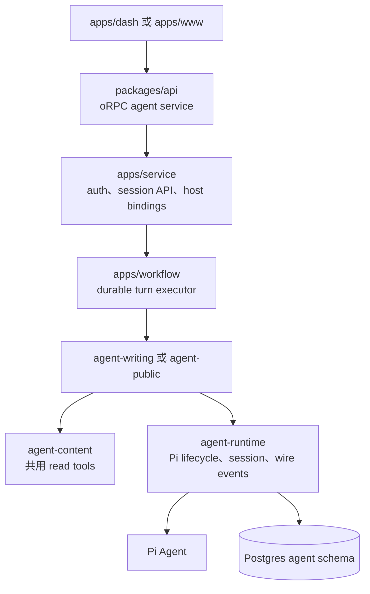
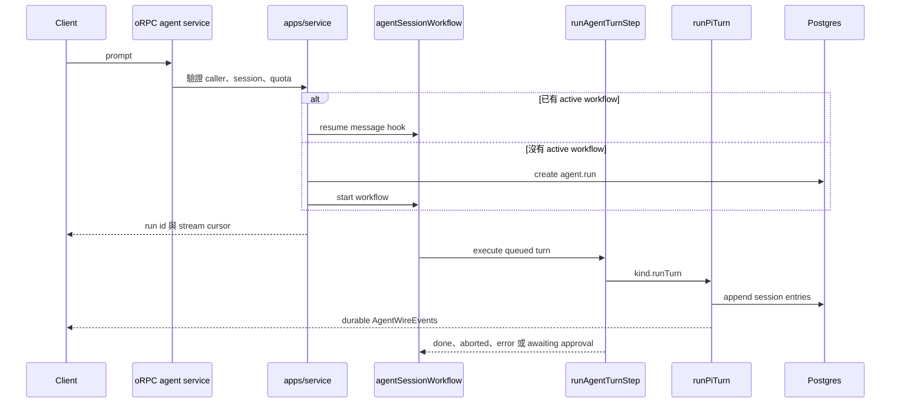
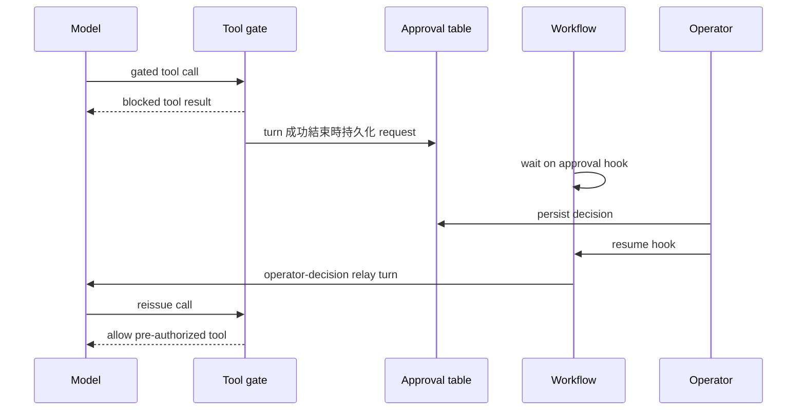

# Agent 架構與 Turn 流程

> 狀態：as-built
>
> 最後更新：2026-09-06
>
> English: [docs/agent-architecture.md](./agent-architecture.md)
>
> 相關文件：[RAG 架構](./rag-architecture.zh.md)、[Workflow deployment](./workflow-deployment.md)

本文件先說明系統邊界，再沿著一個 turn 深入 durable execution、approval、streaming 與 maintenance。

## 1. 系統總覽

目前 stack 採 Pi-first。Pi 的 `Agent` 執行 provider 與 tool loop；`@chia/agent-runtime` 在外層提供 durable session tree、context projection、compaction、navigation 與 client event contract。系統沒有 engine-neutral adapter。

目前有兩個 agent kind：

- `writing`：dashboard 的寫作 agent，僅限設定的 operator 使用。
- `public`：公開站的閱讀 agent，guest session 也能使用。



| 層                         | 擁有者                                          | 責任                                                        |
| -------------------------- | ----------------------------------------------- | ----------------------------------------------------------- |
| Transport 與 orchestration | `packages/api`、`apps/service`、`apps/workflow` | Auth、oRPC、workflow control、streams 與 host ports         |
| Execution                  | `@chia/agent-runtime`                           | Pi lifecycle、persistence、approvals、models 與 wire events |
| Shared content             | `@chia/agent-content`                           | 唯讀部落格 tools、`ContentReadPort` 與 `ProfileReadPort`    |
| Domain                     | `@chia/agent-writing`、`@chia/agent-public`     | Prompts、tools、policy、model allowlist 與 domain ports     |
| Client                     | `@chia/agent-elements`                          | Session store、queries 與共用 chat UI                       |

穩定的 client 邊界是 `AgentWireEvent`，不是可替換的 model engine。Runtime 內部保留明確的 Pi 命名與型別。

## 2. Agent kind 與 host 邊界

`agent.session.kind` 是持久化的 domain discriminator。Session request 從資料庫解析 kind；client input 只能交叉驗證，不能用另一個 kind 的 tools 驅動既有 session。

每個 host 提供 `AgentKindDefinition`：

- `apps/service/src/agents/` 綁定 API 階段的 capabilities、state 與 credentials。
- `apps/workflow/src/agents/` 綁定執行階段的 ports 與 `runTurn`。
- `packages/api/orpc/services/agent/` 擁有共用的 session、run、approval、maintenance、usage 與 admin 行為。

oRPC context 接收一個由 eager `minTier` 與 dynamic definition loader 建立的 `agentFactory`。Guard 能在載入 domain package 或 provider SDK 前拒絕呼叫；dynamic import 已提供 module cache，factory 不另外保存 definition registry 或 service cache。

`AgentKindService` 只包含所有 kind 共用的能力。未來若有 kind-specific procedure，應建立自己的 `agent.<kind>.*` contract 與 port，不擴大 generic service。

### 存取模型

每條 agent route 先解析 `CallerTier`，再由 kind 與 session guard 比對 persisted kind 的 `minTier` 並驗證 ownership。

| Kind      | 最低 tier | 內容可見性                     | 可變 domain state    |
| --------- | --------- | ------------------------------ | -------------------- |
| `writing` | `Root`    | 設定作者的草稿與已發佈內容     | 共用 draft 與 memory |
| `public`  | `Guest`   | 設定作者的已發佈內容與 profile | 無                   |

Generic 層不攜帶 admin 身分。Writing binding 只在建立 content port 時讀設定作者；public binding 不會收到該身分或任何可寫 port。

Public kind 只有共用 content-read tools，沒有 approval tier、web、memory 或 draft。House usage 限定在便宜模型清單；原生 BYOK provider 可以開放，因為費用由訪客承擔。每個 turn 另有限制 tool calls、重複次數與執行時間的 budget。

## 3. Durable state 與 session tree

Transcript 是一棵樹。`agent.session_entry.parentId` 連接 branch，`agent.session.leafEntryId` 選擇 active leaf。`seq` 記錄所有 branch 的持久化順序；每個 session 同時只有一個 writer，因此此順序可靠。

`PgSessionStorage` 實作 runtime 的 `SessionTree`，測試使用 `InMemorySessionTree`。Entry type 與 context projection 由 runtime 自己持有，兩者都鏡射 Pi 的定義，因此 branch 讀起來與在 Pi harness 下完全一致。Session entry 以 opaque JSON 保存；已淘汰的 entry type 直接忽略，不做資料 migration。Kind-specific state 使用 extension table，不在共用 session row 增加大量 nullable columns。

```text
agent.session            kind、settings、active leaf
agent.session_entry      transcript tree nodes
agent.run                durable run 與 turn marker
agent.tool_approval      approval state 與 audit trail
agent.writing_session    writing kind 的 extension row
agent.writing_session_draft  session 處理過的共用 drafts，各自記錄最後看到的 revision
agent.memory             跨 session 的 memory
agent.kind_config        operator 的 kind overrides
agent.task_config        operator 的 task overrides
agent.usage_ledger       provider-call cost ledger
agent.quota_config       quota 與 running-turn limits
```

Server-side conversational state 都能持久化；client view 則由 server detail 與 wire events 推導：

| State                                | 儲存位置                        |
| ------------------------------------ | ------------------------------- |
| Transcript 與 branches               | Postgres session tree           |
| 共用 draft 與 memory                 | Postgres domain tables          |
| Approvals 與 run metadata            | Postgres agent tables           |
| Message inbox、pauses、event streams | Workflow backend                |
| Client request state                 | TanStack Query                  |
| Client live turn state               | 每個 session 一個 zustand store |

## 4. 一個 turn



### Durable driver

每個 session workflow 擁有一個 deterministic `agentMessageHook`。`getConflict()` 在第一個 turn 前註冊它，並避免兩個 active workflow 同時擁有同一個 inbox。Resume hook 的 payload 是 durable workflow event，依順序逐一消費。

Running turn 期間送入的訊息會等待目前 turn 與 approval handshake 結束。Approval 未決、新 workflow 尚未註冊 hook，或文字是保留的 `/end` sentinel 時，enqueue 會被拒絕。

一個 workflow 最多驅動 200 turns。Workflow function 只負責 orchestration；DB、provider、timer 與 network 操作留在 steps。`runAgentTurnStep` 設 `maxRetries = 0`，因為 turn 可能已寫入 entry 或執行核准過的 side effect。Provider retry 留在 Pi；失敗的 turn 只能由新訊息重新嘗試。

Start、hook resume 與 cancel 透過 authenticated `WorkflowControl` contract 從 `service` 送到單一 workflow process。Status 與 stream read 直接使用共用 World storage。詳見 [Workflow deployment](./workflow-deployment.md)。

### Runtime lifecycle

Production execution path：

```text
runAgentTurnStep → kind.runTurn → runPiTurn → new Agent
```

`runPiTurn`：

1. 將 active branch 投影為 model messages，並解析 caller-scoped model。
2. 安裝 turn budget、approval gate、volatile context、state-change hook、abort signal 與 event mapper。
3. 每個完整的 user、assistant、tool-result message 都先持久化，再發出 wire event。
4. 執行 Pi，並分類 provider、host、abort 與 budget failure。
5. Provider turn 成功後，原子持久化 approval requests。
6. 只在成功且沒有 pending approval 時 auto-compact。
7. 發出 terminal events，最後 flush durable writer。

Host hook 失敗會記為 internal error 並中止 turn。缺少 volatile context 等必要 host state 時，模型不能繼續執行。

### Prompt 分層

System prompt 只放穩定的規則、skill index 與 approval posture。Public kind 另外把作者已發佈的 profile 以單一 locale、字元上限內渲染進去，因為 profile 有界且只在 operator 編輯時改變。時鐘、draft state 和已存 memory 等 turn-specific 資料，透過 Pi context hook 加在最後一則 volatile user message；每次 provider request 都重新計算，且不持久化。

這能維持 provider cached prefix 穩定，也避免變動資料累積進 transcript。

### Turn budget

Pi 會在模型持續發出 tool call 時繼續 loop，因此每個 kind 都必須提供 `AgentTurnBudget`。

| Limit              | 超過時的行為                              |
| ------------------ | ----------------------------------------- |
| `maxRepeats`       | 對重複且參數相同的呼叫回傳 tool error。   |
| `maxToolCalls`     | 拒絕後續 tools，要求模型用既有結果作答。  |
| `hardMaxToolCalls` | Abort 並回報 `budget_exhausted`。         |
| `maxDurationMs`    | Deadline 到期時中止 provider generation。 |

Budget check 在 approval check 前執行，因此被 budget 拒絕的呼叫不會建立 approval request。

## 5. Approval 與 abort

### Durable approval handshake

Approval 不依賴 in-memory promise。需要核准的呼叫會結束目前 turn，之後再透過 workflow resume。



以下情況可放行：tier 不需核准、session auto-approves 該 tier、call ID 已核准，或 tool 在 relay turn 被 pre-authorize。Decision 先寫入 DB，再 resume hook。Reject 也會建立 relay turn，讓模型回應 operator comment。

Requests 只在 provider turn 成功後一次持久化。失敗的 turn 不留下 undecided rows，也不會讓 workflow 等待無法 resume 的 hook。Relay message 帶有 operator-decision marker，client 會顯示為 notice，而不是使用者輸入。

Live stream 可以在持久化前先公告 request，讓 UI 及早顯示；但 approval card 必須等 `run:end{awaiting_approval}` 或重新載入的 pending row 確認後才能操作。其他 terminal state 會撤回這筆暫時 request。

### Abort 路徑

取消 workflow run 無法中斷已執行的 step，因此每個 session run 另有一個停在 hook 上的小型 durable abort-controller workflow。Turn step 訂閱它的 stream，將 `AbortSignal` 傳給 Pi 與 host ports。

Abort 先 resume controller，在 deadline 內等待該 turn 的 `run:end`，再取消 session workflow 並更新 run row。部分 assistant output 會以 aborted 狀態持久化；approval 與 compaction 不執行。下一個 prompt 會在既有 transcript 上建立新 workflow。

## 6. Events、streaming 與 reconnect

Client 只收到受限的 event contract：

```text
run:start · user · assistant:start · assistant:delta · assistant:end
tool:start · tool:update · tool:end
approval:request · approval:resolved
session:compacted · session:rewound · state:changed · error · run:end
```

主要 invariant：

- `messageId` 在 live 與 replay event 中都是 persisted session-entry ID。
- `user` event 帶 operator 的文字與已標 label 的附件；model 實際讀到的附件區塊只存在於持久化的 message 裡。
- History 與 live turn 共用同一個 `applyEvent` reducer。
- Compaction 改變 model context，不刪除可見 history；transcript replay 仍走完整 leaf ancestry。
- 每個開始的 tool 都有 terminal event；replay 會把中斷的 call 關閉為 aborted。
- Wire error 只暴露分類；provider 與 host 細節留在 server log。
- `tool:end.details` 在 durable storage 前先截短；模型讀取的是原始 tool content。

每個 run 有 coarse event stream 與 batched delta stream。Coarse event 發出前先 flush pending deltas。Turn cursor 同時記錄兩條 stream 的位置，避免 reconnect 時把舊 delta 接到已從 Postgres 載入的 transcript。

### 重新接上 running turn

Server 是權威來源。Client mount 時先讀 `agent.sessions.get`；若 session 有 active turn，再透過 `agent.sessions.chat` attach。

`agent.run.metadata.turn` 保存：

- `seqBefore`：turn 前最後一個 persisted entry。
- 該 turn 的第一個 coarse 與 delta stream position。
- `running` marker。

Turn 執行中，`get` 只 replay 到 `seqBefore`，`attach` 提供後續 events，因此 refresh 不會產生重複訊息。Marker 由 acceptance 與 turn step 維護，因為 Workflow SDK 無法區分停在 hook 與正在執行 step 的 run。

## 7. Compaction、navigation 與 fork

Maintenance 直接操作 session tree，不建立 `Agent`。

| Operation | 行為                                                                                 |
| --------- | ------------------------------------------------------------------------------------ |
| Compact   | 將 Pi 產生的 summary 與 retained tail 寫成新 leaf；無內容可壓縮時不呼叫模型。        |
| Navigate  | 原地移動 active leaf，並可摘要被捨棄的 branch。                                      |
| Fork      | 將 branch 複製到新 session，來源不變；kind state 透過 `definition.state.fork` 複製。 |

Turn 執行中或 approval 未決時，navigate、fork 與手動 compaction 都會被拒絕。這些操作與 prompt、approval acceptance 共用 per-session Postgres advisory lock。新 `agent.run` row 在 workflow 啟動前建立，maintenance 能立即看到 lease。

Maintenance 的 model call 有獨立 deadline，並在 lock transaction 中執行。Timeout 會取消 model call 並 rollback。Transaction 共用單一 connection，因此內部查詢必須循序執行。

Kind state 不隨 transcript entries 版本化。Rewind 保留目前的 drafts；fork 複製 session 的 draft 參照，兩個 session 繼續處理同一批共用列。

Auto-compaction 只在成功且沒有 pending approval 的 turn 後執行。Compaction 失敗不會把已完成的 turn 改成失敗。

## 8. Identity、models 與 usage

### Guest identity

Better Auth anonymous plugin 會替 guest 建立真正的 user row，因此 guest 能擁有 sessions、approvals 與 usage。Guest 登入時，`transferAgentOwnership` 會在 anonymous row 移除前搬移這些資料，登入不會重置 quota。

一般 session guard 仍要求登入帳號；agent routes 透過 `callerPolicy` 明確接納 guest caller。

### Models 與 credentials

`Models` 依 caller 與 turn 建立。只有 caller 提供 key 時才註冊 BYOK provider。Selected model 與 Pi stream function 使用同一個 credential-bearing collection；禁止使用 process-wide default model function。

每個 domain 擁有自己的 model allowlist。One-shot task 可使用 session model 或 pinned house model，但不能借用無關的 ambient credentials。

### Usage ledger 與 quota

每次被計費的 provider call 都建立一筆 `agent.usage_ledger`，包含 turns、compaction、branch summary、title 與 lesson extraction。成本以整數 micro-dollar 與 provider ID 保存；house spend 與 BYOK spend 共用一本 ledger，以 filter 區分。Session 刪除後 ledger 仍保留。

Usage 記錄採 best-effort，不在 response critical path。Insert 失敗會寫 log，最多漏記一次 call，且對使用者有利。

`Root` 不受限制。其他 tier 共用每週 house-spend allowance 與 running-turn cap。任何 model call 都在 session lock 下先檢查 quota；prompt 與 approval acceptance 另取 per-user advisory lock，再統計使用者跨 sessions 的 active turns。

額度是 soft limit：尚有餘額時可以開始一個 call，最多超出該 turn 的 bounded cost。讀取 usage 或檢查 running cap 前，service 會先用 Workflow World reconcile stale turn marker。

## 9. Writing domain 與 memory

Writing kind 組合 host-owned ports：

| Port          | 責任                             |
| ------------- | -------------------------------- |
| `ContentPort` | 讀取作者內容、套用 draft、發佈。 |
| `WebPort`     | 透過 Firecrawl 搜尋與抓取頁面。  |
| `MemoryPort`  | 持久化與檢索跨 session memory。  |
| `DraftStore`  | 以 CAS 讀寫作者的共用 drafts。   |

只有 commit-tier tool 會寫入正式 feed，且需要 approval。Draft 與 memory write 可逆。破壞性刪除與圖片上傳不提供給 agent。

Web search 只回 snippets；`fetch_url` 抓取單一頁面，並透過 `MemoryPort` 記錄來源。Host port 接收 turn abort signal。Domain package 不直接執行 outbound fetch。

### 共用 draft

`feed_draft` 是一篇文章的 working copy，由 dashboard 編輯器、MCP tools 與 writing agent 共用。一個 feed 最多一份 draft；沒有 feed 的 draft 就是尚未建立的新文章。`feed` 只在 draft 被 apply 時改變，因此 draft 寫入不會觸發 feed indexing。

每次寫入都是對 `feed_draft.revision` 的 compare-and-set，在同一個鎖住該列的 transaction 內完成。編輯器帶著它載入時的 revision，遇到 `CONFLICT` 時把自己改過的欄位合併到較新的 draft 上，或直接採用較新的版本。Agent 的 `edit_draft_content` 在衝突時重讀並重套一次精確字串替換；`write_draft_content` 釘在該 turn 最後觀察到的 revision，寧可失敗也不覆蓋 operator 的修改。`feed_draft_revision` 保存 restore points 與每個 revision 改了哪些欄位；連續的 operator 儲存會合併，且每份 draft 有上限。

Agent 不綁定任何 draft。每個 draft tool 都帶 `draftId`：`list_drafts` 與 `open_draft` 負責找到或建立，operator 則以 prompt 附件（`{ type: "draft", id }`）交付。Kind 的 `attach` 在 session lock 內、turn 入列前驗證附件；runtime 把附件渲染成持久化 user message 的第一個 text block，並在 `user` wire event 上標上 label，live 與 replay 的 transcript 因此一致。Client 端由 `@chia/agent-elements/context` 讓 host 頁面登記目前開啟的記錄；session store 會把這些記錄附在每一則 prompt、建議提問與 slash command 上，operator 不論從哪個入口起 turn，model 都看得到開啟中的 draft。同一個 host 也透過 `onToolEvent` 收到 session 的 `tool:start` 與 `tool:end`，編輯器據此顯示 agent 正在對開啟中的 draft 做什麼，並在 draft-tier 呼叫結束時立刻重新讀取；`feeds.draft:watch` 走 Postgres NOTIFY 仍是該列的權威來源，因為 MCP client 與未掛載的 session 也會寫入它。

`agent.writing_session_draft` 記錄 session 處理過的每份 draft，以及 turn 結束時觀察到的最高 revision。下一個 turn 的 volatile context 列出 session 最近的 drafts，並逐份把高於該 revision 的 operator revisions 列成「operator edits since your last turn」，讓 model 先重讀再編輯。丟棄 draft 會刪除它與 session 的對應列；仍指名它的 tool call 會收到 not-found 錯誤。

### Memory lifecycle

`agent.memory` 保存三種資料：

| Kind     | 意義                                  | 啟用時機               |
| -------- | ------------------------------------- | ---------------------- |
| `source` | `fetch_url` 讀過的頁面，以 URL 為 key | 立即 active            |
| `fact`   | 模型保存的附來源結論                  | 立即 active            |
| `lesson` | 從 feedback 抽出的寫作偏好            | Operator 核准後 active |

所有 memory write 都經過 `packages/api/memories/write.ts`，並在需要時排程 RAG indexing。只有 live、active memory 會進索引。詳見 [RAG 架構](./rag-architecture.zh.md#6-agent-memory-resource)。

Fact 與 source 只透過可見的 `search_memory`、`get_memory` tool call 進入模型。Volatile context 會列出本 session 已保存 memory 的受限識別資訊。Active lesson title 則固定加入，因為它們是 standing preferences。

`memoryConsolidationWorkflow` 在成功的 `commit_draft` turn 後或由 dashboard 手動啟動。它只讀 operator messages 與 assistant prose，排除 tool results，最多產生三條 pending lesson。未經人員審核的 model output 不會成為常駐 prompt instruction。

### 內容可見性

Host 建立 `ContentReadPort` 時就固定 visibility：

- `author` 可讀設定作者的草稿與已發佈內容。
- `public` 只能讀已發佈內容，且不能擴大 filter。

Public kind 只收到 public port，不會收到 `WebPort` 或寫入能力。它的 `ProfileReadPort` 以同樣方式建立：host 只列出設定作者已發佈的 profile rows，kind 將其渲染進 system prompt，而不是開放成工具。

## 10. Operator 設定

三種 override 分開保存：

| Source                | Row                  | 控制內容                                             |
| --------------------- | -------------------- | ---------------------------------------------------- |
| Agent kind definition | `agent.kind_config`  | 新 session defaults 與 kind-specific preferences     |
| `AGENT_TASKS`         | `agent.task_config`  | One-shot task 的 model、prompt 與 exposed parameters |
| Quota defaults        | `agent.quota_config` | Weekly allowance、time zone、running-turn cap        |

Kind defaults 在建立 session 時複製，後續修改不影響既有 session。Kind `config` 每個 turn 重新讀取，因此 preference 在下一個 turn 生效。Tool tier、approval requirement、turn budget 與 model allowlist 等安全邊界保留在 code。

Tasks 包含 title generation、compaction、branch summary 與 lesson extraction。Task 可預設使用 session model 或 house model；operator pinned task model 一律來自 house catalogue。

Admin write 在持久化前先依 code definition 驗證。API view 回傳 `default`、`override`、`effective`，dashboard 不需要重寫 resolution rules。

## 11. 新增 agent kind

1. 新增 `@chia/agent-<kind>`，包含 prompts、tools、policy、model allowlist 與 domain ports。需要讀部落格時組合 `@chia/agent-content`。
2. 只有 kind 需要持久化 state 時才新增 extension table。
3. 加入 service 與 workflow bindings，使用一致的 `minTier` 與 dynamic loaders。
4. 讓 `runTurn` 呼叫 domain 的 `run<Kind>Turn`；one-shot tasks 註冊到 `AGENT_TASKS`。
5. 共用 `runPiTurn`、wire events、approval、session storage 與 durable workflow plumbing。

在第二種 execution engine 形成具體需求前，不新增 engine adapter、capability plugin system 或 provider-neutral handle。

## 12. Pi 的 durable harness

Pi 0.85 在 `Agent` class 之外另有一條執行路徑：`createAgentHarness`，一個建立在自有 storage contract 上的 durable operation runtime。本 runtime 沒有採用。這裡記下原因與整合的樣貌，讓下一次升 Pi 時能直接重新評估，不必重推一遍。

Harness 本身就是為 host 排程設計的。Lane API 收斂成四個 durable primitive，每一個都對得上本 runtime 既有的 seam：

| Harness primitive  | 本 runtime                                             |
| ------------------ | ------------------------------------------------------ |
| `accept`           | 在 lock 下建立 `agent.run` 並啟動 workflow 或喚醒 hook |
| `drive`            | `runAgentTurnStep`                                     |
| `requestAbort`     | 每個 run 的 abort-controller workflow                  |
| `inspectExecution` | 對 Workflow World 做 turn-marker reconcile             |

`drive` 回傳 `settled`、帶 `notBefore` 的 `waiting: retry`，或帶 poll 間隔的 `waiting: deferred`，因此 provider retry 與 deferred response 會變成 workflow sleep，而不是 process 內的等待。

整合會改變的事：

- 每次 transition 都重寫完整的 operation state，turn step 因此可以續跑，`maxRetries = 0` 可以拿掉。
- Tool call 有 intent、effect、settlement 三段 commit，可宣告 `replay: "safe" | "never"` 與 invocation-scoped memo；assistant 串流 frame 會落地，供 partial 回復。
- `message_end` 直接帶 entry id，取代 `runPiTurn` 裡預留 id 的對齊手法；`LaneSnapshot` 配合 `reduceLaneSnapshot` 取代 coarse 與 delta stream cursor 的 reconnect 機制。
- Approval handshake 不變：`before_tool` hook 的 `block` 加 `terminate` 與現在的 tool gate 完全相同。
- 必須自寫 Postgres 的 `Storage` 與 `SessionRepo`；上游只出貨 Memory、JSONL 與 SQLite。`@earendil-works/pi-agent-core/harness/session/testing` 匯出 conformance suite 可用來驗證。Entry 已與 Pi 的 union 一致；values、lists 與 harness 自己的 usage ledger 是新表。
- `packages/agent-runtime/src/pi/` 大半被 lane 呼叫取代。`AgentWireEvent` 仍是 client 邊界，只是 mapper 改吃 `HarnessEvent`。

以下條件在上游全部成立之前不要啟動：storage format 宣告穩定並具備 migration 機制（規格目前標記 format 4 為 pre-stabilization，可原地改形狀）、`Storage` 介面變更開始進 changelog、未完成的 harness work package（fork、`watchSession`、remote mutation transport）收尾。屆時先依 conformance suite 寫 Postgres backend，再把 `runAgentTurnStep` 換成 `accept` 加 `drive`。

## 13. 參考位置

| Concern                               | Location                                                                                              |
| ------------------------------------- | ----------------------------------------------------------------------------------------------------- |
| Pi turn、approval、budget、compaction | `packages/agent-runtime/src/pi/`                                                                      |
| Session tree 與 Postgres storage      | `packages/agent-runtime/src/session/`                                                                 |
| Wire schema、replay、fold             | `packages/agent-runtime/src/wire/`                                                                    |
| 共用 content tools                    | `packages/agent-content/src/`                                                                         |
| Writing 與 public domains             | `packages/agent-writing/src/`、`packages/agent-public/src/`                                           |
| Kind bindings 與 tasks                | `packages/agent-host/src/`、`apps/service/src/agents/`、`apps/workflow/src/agents/`                   |
| Generic oRPC agent service            | `packages/api/orpc/services/agent/`                                                                   |
| Workflow 與 turn step                 | `apps/workflow/src/workflows/agent-session.workflow.ts`、`apps/workflow/src/steps/agent-turn.step.ts` |
| Database schema                       | `packages/db/src/schemas/agent.schema.ts`                                                             |
| 共用 client                           | `packages/agent-elements/src/`                                                                        |
