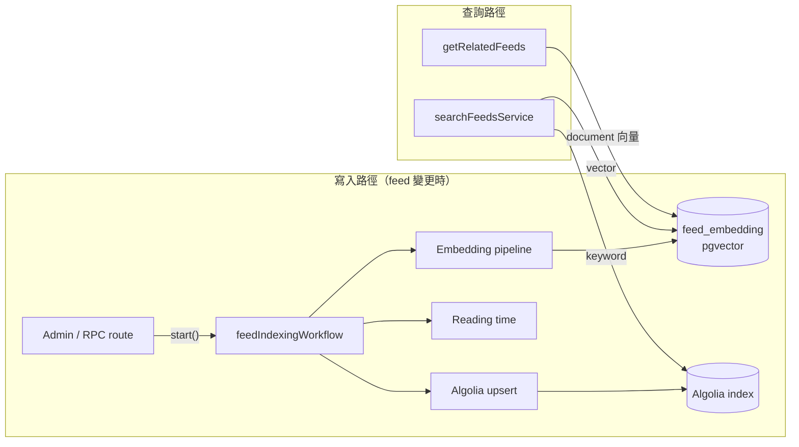
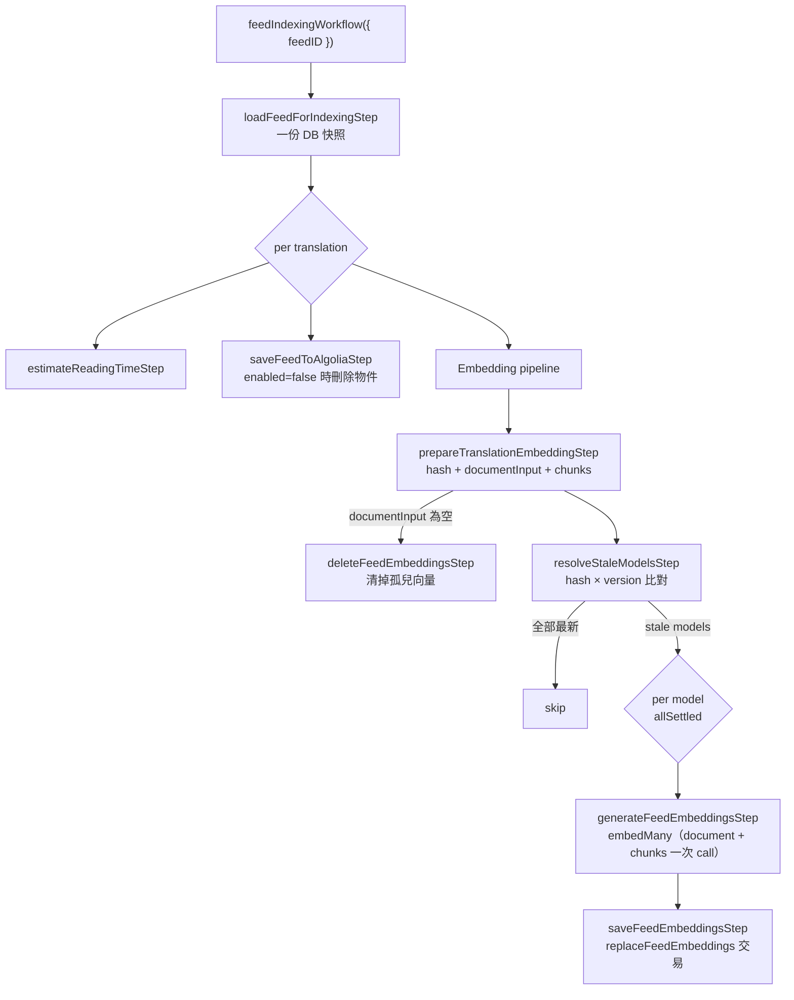

# RAG 架構與 Chunking 設計

> 狀態：現行架構（as-built）  
> 最後更新：2026-07-14  
> 相關規劃：[plans/rag-optimization-plan.md](../plans/rag-optimization-plan.md)

本文件描述部落格的語意檢索架構：embedding 如何產生與儲存、MDX 內容如何切分（chunking）、查詢端如何檢索與聚合，以及 reindex 的操作方式。

## 1. 系統總覽



兩套索引各司其職：

| 索引                             | 用途                                           | 擅長                                |
| -------------------------------- | ---------------------------------------------- | ----------------------------------- |
| **pgvector**（`feed_embedding`） | 管理端語意搜尋、相關文章推薦、未來 RAG context | 概念性查詢、跨語言語意              |
| **Algolia**                      | 公開站台關鍵字搜尋                             | exact term（套件名、CLI、錯誤訊息） |

兩者目前不融合（vector-only baseline）；若評測顯示 exact-term 查詢品質不足，後續以 RRF 融合兩邊結果（見規劃文件）。

## 2. 資料模型

### 2.1 `feed_embedding` table

向量獨立成表，不長在 `feed_translation` 上——換模型、加模型、重新索引都是資料操作，不需要 schema migration。

```
chia_feed_embedding
├── id                   serial PK
├── feed_translation_id  FK → chia_feed_translation（cascade delete）
├── model                text        -- "text-embedding-3-small" | "nomic-embed-text"
├── kind                 text        -- "document" | "chunk"
├── chunk_index          integer     -- document 固定 0；chunk 從 0 遞增
├── chunk_text           text        -- chunk 原文（citation / 預覽用）
├── heading_path         text        -- 例："HNSW > ef_search 調校"
├── token_count          integer     -- cl100k_base 精確計數
├── content_hash         text        -- sha-256(原始內容)，stale 判定用
├── index_version        text        -- 前處理／chunking 策略版本
├── embedding_1536       vector(1536)-- OpenAI 模型寫這欄
└── embedding_512        vector(512) -- Ollama 模型寫這欄
```

- **Unique key**：`(feed_translation_id, model, kind, chunk_index)`
- **HNSW index**：兩個維度欄位各一個（`vector_cosine_ops`）
- pgvector 欄位維度固定，所以每個支援維度一欄；`model` 決定寫哪一欄，由 registry 的 `dimensions` 對應

### 2.2 兩種 kind 的分工

| kind       | 每 translation 數量 | 內容                                                                              | 消費者                                      |
| ---------- | ------------------- | --------------------------------------------------------------------------------- | ------------------------------------------- |
| `document` | 每 model 一列       | title + summary/description + `stripMdx`（**移除** code block）後的全文，主題導向 | 相關文章推薦（`getRelatedFeeds`）           |
| `chunk`    | 每 model N 列       | heading-aware 切分的段落，**保留** code block                                     | 語意搜尋（`searchFeeds`）、未來 RAG context |

前處理刻意分成兩層：document 向量要的是「這篇文章在講什麼」，code 只會稀釋主題訊號；chunk 向量要的是「這一段有什麼」，函式名、CLI 指令、錯誤訊息正是技術查詢會搜的字。

### 2.3 Stale 判定：`content_hash` × `index_version`

兩個欄位職責分離：

- **`content_hash`** = sha-256 of 原始 `{title, description, summary, content}` JSON。內容變了（包含只改 code block）就會變。
- **`index_version`** = `EMBEDDING_INDEX_VERSION` 常數（`packages/ai/src/embeddings/utils.ts`）。前處理、chunking 參數、模型設定變了就手動 bump。

Workflow 只比對 document row 的這兩個值，任一不符 → 該 model 的 document + chunks 全部重算，**就地覆寫**（不做 blue/green 雙版本；查詢端不 filter 版本，舊向量在被覆寫前照常服務）。

## 3. Embedding Model Registry

單一來源：`EMBEDDING_MODEL_REGISTRY`（`packages/ai/src/embeddings/utils.ts`），workflow、搜尋 API、dashboard、DB repo 共用。

| model                    | provider | dims | indexed | canonical | queryEnabled |
| ------------------------ | -------- | ---- | ------- | --------- | ------------ |
| `text-embedding-3-small` | openai   | 1536 | ✅      | ✅        | ✅           |
| `nomic-embed-text`       | ollama   | 512  | ✅      |           | ✅           |
| `text-embedding-3-large` | openai   | 1536 |         |           |              |
| `mxbai-embed-large`      | ollama   | 512  |         |           |              |
| `all-minilm`             | ollama   | 512  |         |           |              |

規則：

- **canonical 唯一**（單元測試把關），供相關文章與預設搜尋使用
- **`indexed`** = indexing workflow 會寫入的模型；**`queryEnabled && indexed`** 才會出現在 dashboard 選單、才能通過搜尋 API 的 validator（否則 400）
- Ollama 模型是 **best-effort**：indexing 時不可用就跳過（不擋 canonical）；查詢時不可用則明確丟 `OllamaUnavailableError`（route 回 503），**不會** silent fallback 到別的模型——cached query embedding 的維度和回報的 provider 都必須與實際查的欄位一致
- 非對稱模型的 task prefix 由 `ollamaEmbedding(s)` 自動加：寫入 `search_document:`、查詢 `search_query:`

## 4. Indexing Pipeline

單一 durable workflow（Vercel Workflow SDK），route 只做一次 `start()`：



設計要點：

1. **快照一致性**：`loadFeedForIndexingStep` 載一次原始欄位（title/description/summary/content），三個分支同一份資料；step 結果被 runtime 持久化，retry 時 replay 同一快照
2. **Batch embedding**：一個 model 的 document + 全部 chunks 組成一個 `inputs[]`，OpenAI 走 AI SDK `embedMany`、Ollama 走 `ollama.embed(string[])`——每篇文章每個 model 只打一次 API
3. **原子寫入**：`replaceFeedEmbeddings` 在單一交易內 upsert document + chunk rows，然後刪掉「舊 index_version 的 rows」和「內容變短後多出來的 chunk rows」（`chunk_index >= chunks.length`），不留孤兒
4. **空內容清理**：translation 的可嵌入文字被清空時，主動刪除該 translation 全部向量，`hasEmbedding` 隨之變 false
5. **錯誤語意**：OpenAI 4xx（非 408/429）→ `FatalError` 不重試；429/5xx/網路 → rethrow 交給 step 自動 retry；Ollama 不可用 → 回 `null` 靜默跳過。分支之間用 `allSettled`，單一 model／分支失敗不擋其他
6. **成功判定**：canonical model 在所有 stale 的地方都寫入成功才算 `success: true`

## 5. Chunking 做法

實作：`packages/ai/src/embeddings/chunking.ts`。

### 5.1 流程

```
MDX 原文
  → cleanMdxKeepStructure()      移除 import/export、JSX tag；保留 heading、list、code fence
                                  （code block ≤24 行完整保留；更長保留前 12 行 + "…"）
  → splitByHeadings()             以 heading 邊界切 section，追蹤 heading path
                                  （code fence 內的 "#" 不會誤判為 heading）
  → 超過 512 tokens 的 section    交給 @langchain/textsplitters 的
                                  RecursiveCharacterTextSplitter.fromLanguage("markdown")
                                  chunkSize 512 / overlap 64，lengthFunction 用 tiktoken
  → 每個 chunk 組 embedding input
```

### 5.2 Chunk 的 embedding input 格式

向量嵌入的不是裸 chunk 文字，而是帶上下文的版本：

```text
Title: PostgreSQL pgvector 使用筆記
Section: HNSW > ef_search 調校

{chunk 原文}
```

`chunk_text` 欄位存的是裸原文（給 citation／預覽），`heading_path` 分開存。

### 5.3 參數與工具

| 項目       | 值／工具                                            | 位置                             |
| ---------- | --------------------------------------------------- | -------------------------------- |
| chunk size | 512 tokens                                          | `EMBEDDING_CHUNK_TOKENS`         |
| overlap    | 64 tokens                                           | `EMBEDDING_CHUNK_OVERLAP_TOKENS` |
| token 計數 | `js-tiktoken`（cl100k_base，text-embedding-3 同款） | `countEmbeddingTokens`           |
| 切分器     | `@langchain/textsplitters`（markdown-aware）        | `chunkMarkdownForEmbedding`      |
| 最小 chunk | < 8 tokens 直接丟棄                                 | `MIN_CHUNK_TOKENS`               |
| 輸入截斷   | 估算超過 7500 tokens 截斷（防 API 8191 上限）       | `truncateForEmbedding`           |

調整任何一項都要 bump `EMBEDDING_INDEX_VERSION`。

## 6. 查詢路徑

### 6.1 語意搜尋（`searchFeeds`）

```
query
  → validator：keyword 必填（≤256）、model 必須 queryEnabled && indexed（否則 400）
  → query embedding cache 查詢（見 6.3）
  → cache miss 才呼叫 provider（查詢端 task prefix：search_query）
  → 維度防禦：embedding.length 必須等於該 model 的 dimensions
  → HNSW 取 top max(limit×6, 30) 個候選（document + chunk rows 都參與）
  → 程式端按 feedId 聚合：每篇文章只留相似度最高的一列
  → 回傳 top N，附 chunkText / headingPath / kind / similarity（citation-ready）
```

聚合放在程式端而非 SQL `DISTINCT ON`，是為了讓 HNSW 走純 order-by-distance 掃描（效率最好的 access path）。threshold 來自 registry 的 `defaultThreshold`（目前 0.3），呼叫端可覆寫。

### 6.2 相關文章（`getRelatedFeeds`）

固定使用 **canonical model 的 document 向量**（`kind = 'document'`），文對文 cosine 相似度，同 locale、published、未刪除，top 3、threshold 0.3。不碰 chunk——主題相似度用主題級向量。

### 6.3 Query embedding cache

- **Key**：`feeds:query-embedding:v1:{model}:{locale}:{sha256(normalizedQuery)}`
  - normalize = trim + 空白摺疊 + lowercase，**保留標點**（`pg-vector` ≠ `pg vector`）
- **TTL**：`24 * 60 * 60 * 1000` 毫秒（Keyv 的 TTL 單位是毫秒）
- **Payload**：`{ model, dimensions, embedding, createdAt }`；讀取時驗證 model、維度、有限數值，壞快取刪除重生，不會讓搜尋失敗

### 6.4 錯誤語意

| 情況                        | 回應                                                                    |
| --------------------------- | ----------------------------------------------------------------------- |
| 未索引模型                  | 400（validator refine + service `UnindexedEmbeddingModelError` 雙保險） |
| Ollama 模型但 Ollama 不可用 | 503（`OllamaUnavailableError`，不 fallback）                            |
| cached embedding 維度不符   | 丟錯（防 stale cache 跨模型污染）                                       |

## 7. Reindex 操作手冊

### 何時 bump `EMBEDDING_INDEX_VERSION`

- 改 `cleanMdxKeepStructure` / `stripMdx` / `buildEmbeddingInput` 的前處理邏輯
- 改 chunk size / overlap / 最小 chunk 門檻
- 換 embedding 模型參數（維度、task prefix 規則）

內容本身的變更**不需要** bump——`content_hash` 會處理。

### 全量 reindex

1. bump `EMBEDDING_INDEX_VERSION`（或首次 migration 後，backfill rows 的 `index_version = 'legacy'` 天然不符）
2. 對每個 feed 觸發 `syncFeedSearchIndex(feedID)`（admin/RPC route 或手動）
3. Workflow 逐一判定 stale → 重算 → `replaceFeedEmbeddings` 覆寫並清掉舊版本 rows
4. 過程中舊向量照常服務搜尋，無停機

### Rollback

把 `EMBEDDING_INDEX_VERSION` 改回舊值重跑即可——版本只參與 stale 判定，不參與查詢 filter，所以任何時刻表裡的向量都是可用的。

## 8. 檔案地圖

| 職責                                                 | 位置                                                                             |
| ---------------------------------------------------- | -------------------------------------------------------------------------------- |
| Model registry / index version / 前處理 / hash       | `packages/ai/src/embeddings/utils.ts`                                            |
| Chunking                                             | `packages/ai/src/embeddings/chunking.ts`                                         |
| OpenAI embedding（單筆 + `embedMany` batch）         | `packages/ai/src/embeddings/openai.ts`                                           |
| Ollama embedding（task prefix、batch）               | `packages/ai/src/embeddings/ollama.ts`                                           |
| Schema（`feed_embedding`）                           | `packages/db/src/schemas/contents.schema.ts`                                     |
| 檢索 / 寫入 repo（search、related、replace、delete） | `packages/db/src/libs/feeds/embedding.ts`                                        |
| Indexing workflow（單一入口）                        | `apps/service/src/workflows/feed-indexing.workflow.ts`                           |
| Embedding steps                                      | `apps/service/src/steps/feed-embeddings.step.ts`                                 |
| Algolia / reading time steps                         | `apps/service/src/steps/algolia-search.step.ts`、`estimate-reading-time.step.ts` |
| 搜尋 service（cache、模型驗證）                      | `apps/service/src/services/feeds.service.ts`                                     |
| Sandbox polyfill（better-all 用）                    | `apps/service/src/utils/workflow-sandbox.polyfill.ts`                            |
| 單元測試（chunking、registry、normalize）            | `packages/ai/__tests__/chunking.spec.mts`                                        |

## 9. 已知限制與後續

- **無檢索品質基準**：golden queries + Recall@5 / MRR 評測 script 未建（規劃 Phase 4），threshold 0.3 尚未校正
- **Vector-only**：exact-term 查詢（套件名、CLI、錯誤訊息）依賴 Algolia 端；若評測顯示不足,解法是 RRF 融合而非調 vector 參數
- **Dashboard 狀態粒度**：`hasEmbedding` 只是 EXISTS 布林，看不出 canonical 是否缺失或部分失敗；且 feed detail 查詢有 300 秒 cache，reindex 後狀態顯示會延遲
- **完整 RAG（grounded generation + citation）未實作**：chunk 檢索結果已含 citation metadata（`chunkText`/`headingPath`），context builder 可直接消費（規劃 Phase 5）
