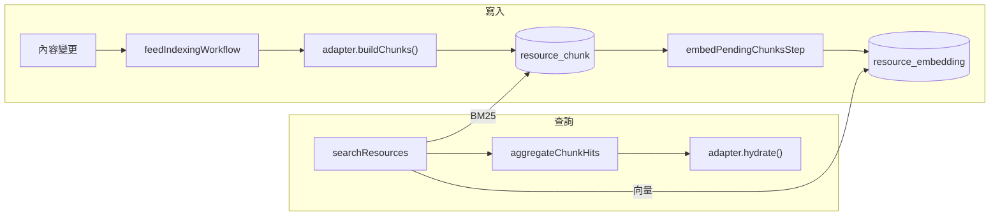
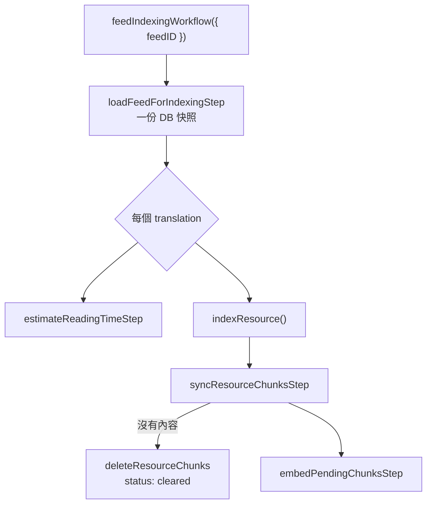

# RAG 架構：Chunk、Embedding 與檢索

> 狀態：現行架構（as-built）
> 最後更新：2026-08-27

本文件說明部落格的檢索系統：內容如何被切成可檢索的單位、向量如何產生與儲存、查詢端如何檢索與排序，以及維護時該從哪裡改。

## 1. 一分鐘總覽

整個系統圍繞**一個抽象**：任何內容都可以被拆成一組 **chunk**，每個 chunk 有文字、可選的向量，以及一份鏡像過來的可見性（locale / published / deleted）。搜尋只認 chunk，不認「文章」。


```mermaid
flowchart LR
    subgraph write["寫入"]
        A[內容變更] --> B[feedIndexingWorkflow]
        B --> C["adapter.buildChunks()"]
        C --> D[(resource_chunk)]
        D --> E[embedPendingChunksStep]
        E --> F[(resource_embedding)]
    end
    subgraph read["查詢"]
        G[searchResources] -->|BM25| D
        G -->|向量| F
        G --> H[aggregateChunkHits]
        H --> I["adapter.hydrate()"]
    end
```

三個要記住的名詞：

| 名詞         | 意思                                                                                                                   |
| ------------ | ---------------------------------------------------------------------------------------------------------------------- |
| **resource** | 一個可被索引的東西。兩種：`feed_translation`（一篇文章的一個語系）與 `agent_memory`（寫作 agent 的一筆長期記憶，§2.4） |
| **chunk**    | resource 的一個可檢索片段。分 `card`（整篇的主題摘要）和 `section`（正文段落）                                         |
| **adapter**  | 一個 resource type 要提供的兩個函式：`buildChunks`（怎麼切）和 `hydrate`（命中後怎麼變成可渲染的摘要）                 |

搜尋和索引的程式碼完全不知道「feed」的存在，只透過 adapter 介面對話。新增一種可搜尋的內容 = 寫一個 adapter + 註冊，不用動索引或檢索邏輯。

## 2. 資料模型

正文本身住在 `chia_feed_translation.content`（先前獨立的 `chia_content` 表已併入）。檢索用的資料在兩張表。

### 2.1 `chia_resource_chunk`

```
chia_resource_chunk
├── id                   bigserial PK
├── feed_translation_id  FK → chia_feed_translation（ON DELETE CASCADE，可為 null）
├── agent_memory_id      FK → agent.memory（ON DELETE CASCADE，可為 null）
├── source_type          text  GENERATED  -- 'feed_translation' | 'agent_memory'
├── source_id            integer GENERATED -- coalesce(feed_translation_id, agent_memory_id)
├── kind                 text        -- 'card' | 'section'
├── chunk_index          integer     -- 在同一個 kind 內從 0 遞增；card 固定 0
├── content              text        -- 送去嵌入、也用於 BM25 和 snippet 的文字
├── heading_path         text        -- 例："HNSW > ef_search"
├── token_count          integer
├── metadata             jsonb       -- 一個 chunk 跨多個 heading 時記 headingPaths
├── content_hash         text        -- sha-256(content)，決定要不要重新嵌入
├── locale / published / deleted     -- 從來源鏡像過來
└── created_at / updated_at
```

兩個設計要點：

**`source_type` / `source_id` 是 generated column。** 每種 resource type 有自己的 nullable FK（才能保有 cascade delete 和外鍵完整性），但 `source_type` / `source_id` 由那些 FK 推導出來，所以查詢端永遠只看這兩欄，不需要知道總共有幾個 key 欄位。`CHECK (num_nonnulls(...) = 1)` 保證恰好一個 FK 有值。

**可見性是鏡像而非 join。** ParadeDB 只有在條件是「被索引那張表的欄位」時才會把它推進 BM25 索引，所以 `locale` / `published` / `deleted` 複製到 chunk 上。索引 workflow 是唯一的寫入者。

其他索引：`UNIQUE (source_type, source_id, kind, chunk_index)`，以及一個 ParadeDB BM25 索引，內容欄位建了兩種 tokenizer：

- `icu` — 會正確分詞繁體中文，並把 `ef_search` 這類 identifier 保持完整。它不在英數字之間的 `.` 斷詞，所以 `hnsw.ef_search` 是一個 token。
- `simple`（alias `body_sub`）— 在每個非英數字元斷開，讓 phrase query 能搜到 dotted path 裡的子片段。

中文查詢只打 `icu` 欄位：`simple` 會把一整串 CJK 當成單一 token。

### 2.2 `chia_resource_embedding`

```
chia_resource_embedding
├── chunk_id       bigint FK → chia_resource_chunk（CASCADE）
├── model          text     -- EmbeddingProvider.id
├── index_version  text
├── embedding      vector(1536)
└── created_at / updated_at
PRIMARY KEY (chunk_id, model)
+ HNSW index（vector_cosine_ops）
```

向量獨立成表，所以重新嵌入不會改寫 chunk 文字，而「哪些 chunk 還沒有向量」就只是一個 left join。

**只有一欄、一個維度。** 之前是 1536 + 512 兩欄，為了讓 Ollama 模型和 OpenAI 並存索引——但沒有任何查詢讀第二欄，代價卻是每個讀寫路徑都要一個維度分支。現在的規則：一個 provider 的向量寬度必須等於 `EMBEDDING_DIMENSIONS`，否則 `resolveEmbeddingProvider` 在解析時就丟錯（見 §4）。換成不同寬度的模型 = 改常數 + 改欄位 + 重建索引。

### 2.3 兩種 chunk kind

| kind      | 每個 resource 幾個 | 內容                                            | 誰在用                       |
| --------- | ------------------ | ----------------------------------------------- | ---------------------------- |
| `card`    | 1                  | title + summary + tags + heading outline        | 相關文章推薦（文對文相似度） |
| `section` | N                  | heading 邊界切出的正文段落，**保留 code block** | 語意／混合搜尋               |

分兩種是因為兩個問題不一樣。「這篇在講什麼」要一個穩定、與文章長度無關的主題向量；「哪一段提到這件事」要的是段落層級的細節，而函式名、CLI 參數、錯誤訊息正是技術查詢會打的字。

**card 的長度是文章*結構*的函數，不是文章*長度*的函數：**

```text
Title: PostgreSQL pgvector 使用筆記
Summary: …（summary → description → excerpt，取第一個有值的）
Tags: pgvector, postgres
Outline:
- 為什麼需要向量檢索
  - HNSW 參數
- ef_search 調校
```

Outline 只取到 H3、最多 40 個 heading。所以一篇 2k token 和一篇 20k token 的文章，只要 outline 一樣，card 的大小就一樣——永遠不會逼近模型的 token 上限。只有在完全沒有 summary 也沒有任何 heading 時，才退而放一段 400 token 的正文摘錄（`buildEmbeddingInput`）。

### 2.4 第二種 resource：`agent_memory`

寫作 agent 的長期記憶（`agent.memory`，見 `docs/agent-architecture.md` §10）走同一條管線：adapter 在 `packages/api/resources/agent-memory.resource.ts`，card 是 `Kind / Title / Source` 三行（與內容長度無關），section 對 `content` 跑既有 chunking。三個與 feed 不同的規則：

- **可見性固定 `{ locale: null, published: false, deleted: false }`。** `scopeFilter` 預設只看 `published = true`，所以公開搜尋、`search_posts`、相關文章推薦都天然看不到記憶；要讀到記憶必須**同時**傳 `includeUnpublished: true` 與 `sourceTypes: ['agent_memory']`，目前只有 agent 的 `search_memory` port 這麼做。`locale` 留 null 因為記憶是跨語系的，查資料常是英文、寫文常是中文。
- **archived 與軟刪除都算「沒有內容」。** `buildChunks` 回 null，`syncResourceChunksStep` 把 chunk 清掉；`hydrate` 用同一個判定，符合 §6.2 的一致性要求。寫入端（`packages/api/memories/write.ts`）每次寫入都觸發一次 `indexResourceWorkflow`，所以 archive 與刪除不需要獨立的移除 workflow。
- **全量 reindex 要自己列舉。** `listReindexTargetsStep` 同時列 feed translation 與記憶（§7）。

## 3. 寫入路徑

### 3.1 觸發

寫入端不直接呼叫索引。`packages/api` 的 handler 呼叫 oRPC context 上的 `hooks.onFeedChanged` / `hooks.onFeedRemoved`，由擁有副作用的 app（`apps/service`）在 `createORPCContext` 裡供給（`feedHooks`）；`feeds/write.ts` 因為也被 workflow step 呼叫（沒有 request），改成把 hooks 當必填參數收：

```
upsertFeed / upsertContent → context.hooks.onFeedChanged(feedID)  → feedIndexingWorkflow
軟刪除                      → context.hooks.onFeedRemoved(ids)     → removeFeedFromSearchIndexWorkflow
```

軟刪除需要獨立的 workflow：硬刪除靠 FK cascade 就夠了，但軟刪除的 row 還在，不主動清掉的話文章下架後仍然搜得到。還原時會重新發 `changed`，chunk 就重建回來。

### 3.2 `feedIndexingWorkflow`


```mermaid
flowchart TD
    A["feedIndexingWorkflow({ feedID })"] --> B[loadFeedForIndexingStep<br/>一份 DB 快照]
    B --> C{每個 translation}
    C --> D[estimateReadingTimeStep]
    C --> E["indexResource()"]
    E --> F[syncResourceChunksStep]
    F -->|沒有內容| G[deleteResourceChunks<br/>status: cleared]
    F --> H[embedPendingChunksStep]
```

- `loadFeedForIndexingStep` 載一次原始欄位（含各語系的 tag 名稱），兩個分支共用同一份快照；step 的結果會被 runtime 持久化，retry 時 replay 同一份資料。
- 兩個分支用 `Promise.allSettled`，單一分支失敗不擋另一個。任何分支耗盡重試後，workflow 會用 `console.error` 印出失敗明細——`syncFeedSearchIndex` 只回傳 run handle、不檢查結果，所以失敗必須在 log 裡看得見。
- `indexResource` 是普通的組合函式而非獨立 workflow，這樣已經在 workflow 裡跑的呼叫端（feed pipeline）可以直接重用，不會產生嵌套的 run。`indexResourceWorkflow` 是給非 feed 來源用的獨立入口。

### 3.3 `syncResourceChunksStep`：只重寫變動的 chunk

```
adapter.buildChunks() → 得到 card + sections，每個都帶 content_hash
  → planChunkReplacement()：以「內容」而非「位置」比對現有 rows
      (kind, index, hash) 全同 → 只更新鏡像的可見性欄位（unchanged）
      (kind, hash) 同、位置不同 → 移動 row，向量保留（moved）
      (kind, index) 同、內容不同 → 原地改寫並刪掉向量（written）
      配不到的新 chunk → insert（written）
      配不到的舊 row   → 刪掉（removed）
```

Identity 是內容不是位置：以前的 key 是 `(kind, chunk_index)`，在文章前面插一段會讓後面所有 chunk 的 index 位移、逐一跟「位置上的前任」比對失敗，整條尾巴重新嵌入。改成 hash 優先配對後，位移只是 move——「改一個段落只花一次 embedding」對插入、刪除、搬動段落都成立。搬動要分兩階段落位（先停到負數 index 再放到目標位），因為 `(source, kind, chunk_index)` 的唯一索引在中間狀態可能撞到還沒搬走的 row。回傳 `{ written, unchanged, moved, removed }`。

### 3.4 `embedPendingChunksStep`：把 backlog 抽乾

```
while (true):
  查「沒有 (model, index_version) 向量的 chunk」最多 32 筆
  沒有了 → 結束
  provider.embed(batch) → saveChunkEmbeddings（upsert）
```

每輪重新查詢而不是對單一快照分頁：查詢本身只會回傳「還沒有向量的 chunk」，所以每次成功寫入都讓 backlog 變小，迴圈保證會收斂。分頁單一次讀取的話，超過一頁的 resource 會回報「已索引」而尾巴其實沒嵌入。若某批寫入 0 筆（理論上不會發生，因為是 upsert）會丟 `FatalError`，避免無限重跑。

錯誤語意：provider 回 4xx（408 / 429 除外）視為永久失敗，包成 `FatalError` 不浪費 step 的重試次數；429 / 5xx / 網路錯誤 rethrow 交給 step 自動重試。

## 4. Embedding Provider

只有一個 seam：`resolveEmbeddingProvider()`。

```ts
interface EmbeddingProvider {
  readonly id: string; // 折進 index key，換 provider 自動使所有舊向量失效
  readonly dimensions: number;
  embed(
    texts: string[],
    task: "search_document" | "search_query"
  ): Promise<number[][]>;
}
```

`task` 是必填：下一個值得試的模型多半是非對稱的（nomic、mxbai、e5、voyage），查詢誤用 document prefix 會安靜地劣化檢索品質，所以每個呼叫端都得聲明自己在搜尋的哪一側。對稱模型（OpenAI text-embedding-3-*）忽略它。

| `EMBEDDING_PROVIDER` | provider | id                       | 維度 |
| -------------------- | -------- | ------------------------ | ---- |
| （未設定／其他）     | OpenAI   | `text-embedding-3-small` | 1536 |
| `ollama`             | Ollama   | `nomic-embed-text`       | 768  |

Ollama 分支目前**會在解析時直接丟錯**，因為 768 ≠ `EMBEDDING_DIMENSIONS`（1536）。這是刻意的：錯誤訊息指向該改的設定，而不是等到 insert 時才拿到一個講 Postgres 欄位的錯誤。三個本地模型的原生寬度分別是 nomic 768、mxbai 1024、all-minilm 384，沒有任何一個能配合 1536——要用就得改 `EMBEDDING_DIMENSIONS`、改 `resource_embedding.embedding` 欄位，然後重建索引。

其他 provider 層的行為：

- **Token 保護**：`guardEmbeddingInput(s)` 是打 API 前的最後一道防線。OpenAI 用 `EMBEDDING_MAX_TOKENS`（8000，text-embedding-3 上限是 8191）；Ollama 用 per-model 的限制（mxbai 512、nomic 8192、all-minilm 256）並預留 32 token 給 task prefix，因為 prefix 是 guard 之後才接上的。
- **Batch 切分**：`generateEmbeddings` 同時尊重「一次幾筆」（32）和「一次幾個 token」（250k）兩個上限。
- **Task prefix**：非對稱的本地模型需要 `search_document:` / `search_query:` 前綴，`ollamaEmbeddings` 依 `embed()` 收到的 task 自動加。
- **Tokenizer 是動態載入且 memoized 的**。`js-tiktoken` 的 cl100k_base 編碼表要 ~32MB 常駐堆積且無法釋放，所以只在「悲觀估算都超過預算」時才載。搜尋查詢上限 256 字元，永遠走估算路徑，不會把編碼表拖進長壽的 web process。估算函式（CJK 算 2 token/字、其他 0.5）刻意高估，「估算過關」就蘊含「精確計數也過關」。

## 5. Chunking

實作在 `packages/ai/src/embeddings/chunking.ts`，目標大小 `SECTION_CHUNK_TOKENS = 512`。

````
MDX 原文
  → cleanMdxKeepStructure()   remark (mdx+gfm) 解析後按節點位置就地移除 import/export、
                              JSX tag（保留 children）、{expression}；保留 heading、list。
                              code fence 一律重建為 ```lang（meta 移除），≤24 行完整保留，
                              更長則保留前 12 行 + "…"。無效 MDX 退回純 markdown 解析
  → splitByHeadings()         以 top-level heading 邊界切 section 並追蹤 heading path
                              （heading 標題取純文字，`code` 與 **bold** 標記會被剝掉——
                              和渲染頁面產生 anchor 的行為一致）
  → withHeadingPrefix()       把完整 heading path 接在每個 section 文字開頭
  → 小的 section 打包在一起（不跨 top-level heading group），
    超過 512 token 的交給 splitOversized()
  → < 8 token 的成品丟棄（MIN_CHUNK_TOKENS）
````

打包不跨 group，**每個 H1 / H2 heading 都是 group 邊界**：全文件貪婪打包會級聯——在開頭插一段文字就改變之後每個 chunk 的組成，所有 hash 全變，`planChunkReplacement`（§3.3）看到的是整篇改寫而不是搬移。邊界規則只看該 heading 自己的 level（刻意不做「相對全文結構」的自適應——那會讓文件他處的編輯改變 group 定義，級聯就回來了），所以一處編輯的重嵌入範圍被限制在它所在的 group。

**Heading path 會烙進 chunk 的 `content` 第一行**（`"HNSW 調校 > 參數"` 這樣的一行）。`splitByHeadings` 會把 heading 行從正文剝掉，而 `content` 同時是 BM25 索引欄位和 embedding 輸入——不烙進去的話，查 heading 的字（"CSRF"、"hydrateRoot"）打不到回答它的那個 section，因為 heading 的字正是正文最不會重複的字。超長 section 切出來的每一片都各自重複這個前綴，因為每一片都是獨立的 chunk。

`splitOversized` 的層級：先段落（`\n{2,}`），還是太大才用句末標點（`。．！？!?;；\n`）。切開的單位重組時會記住自己來自哪一層——同一段落內的句子用 `""` 接回去，不是 `"\n\n"`。chunk 的 `content` 會被存起來並用來產生搜尋 snippet，不是只拿去嵌入，所以重組後的文字必須跟原文一致。

如果一個單位連句末標點都沒有（沒有 `。` 的長中文段落、很寬的表格列），會被切成多個符合預算的片段，而不是整塊送出。整塊送出會讓 provider 收到超長輸入（雖然 guard 會截斷），並且存下來的文字和向量對不上。

**heading path 一路帶著走**（`heading_path` 欄位，跨多個 heading 時放在 `metadata.headingPaths`），這是 citation anchor 的來源。

## 6. 查詢路徑

### 6.1 三種模式

`searchResources({ query, mode, locale, sourceTypes, limit })`，`mode` 來自 API 的 `hybrid | bm25 | semantic`（預設 `hybrid`）。呼叫端不能指定模型——provider 由伺服器端決定，所以不可能要求一組從未被索引的向量。

| mode       | 做法                                                                              |
| ---------- | --------------------------------------------------------------------------------- |
| `bm25`     | 純 ParadeDB，`matchAny(icu) OR phrase(body_sub)`，附帶 `pdb.snippet()` 的高亮片段 |
| `semantic` | 純 cosine 距離，走 HNSW                                                           |
| `hybrid`   | 兩邊各取候選，在**一個 statement 內**用 RRF 融合                                  |

Hybrid 的融合是兩個 CTE 各自 `row_number()` 出排名，`FULL OUTER JOIN`（讓只被一邊找到的 chunk 也能存活），分數是 `Σ 1/(60 + rank)`。融合後的查詢**不會**回傳高亮 snippet：ParadeDB 不允許 `pdb.snippet()` 和 window function 同時出現，需要 `<b>` 高亮就用 `bm25` 模式。不過每個 `ChunkHit` 都帶回 `content`（chunk 原文），所以 hybrid / semantic 的命中仍然看得到「為什麼命中」——agent 的搜尋結果就用它當 snippet 的 fallback。

取數有兩層緩衝，因為 chunk 命中之後還要聚合成 resource：`searchResources` 先要 `max(limit × 6, 30)` 個 chunk，hybrid 內部再讓兩邊各取這個數字的三倍（下限 40）當融合前的候選。

### 6.2 從 chunk 命中到 resource 命中

```
chunk hits
  → aggregateChunkHits()：依 (source_type, source_id) 分組
      分數 = 前 3 高 chunk 的衰減加權和（權重 1, ¼, ¹⁄₁₆）
      bestChunk = 最高分的那個（citation / 預覽用）
  → 依分數排序、slice(limit)
  → adapter.hydrate()：批次取回 title / description / href / locale
```

分數是**衰減加權和**而不是平均或純加總，兩個都試過、都輸給它（`toolings/scripts/rag-eval` 有數據）：平均無法獎勵廣度——多一個相關 chunk 只會拉低或持平分數，通篇相關的文章贏不了單一僥倖段落；純加總在 RRF 的平坦分數下（rank 1 ≈ 0.016、rank 30 ≈ 0.011）會讓長文章三個平庸 chunk 的總分壓過短文章一個 rank-1 chunk。衰減讓最佳 chunk 主導、廣度仍加分。

`hydrate` 是每個 resource type 各自負責的一次批次查詢，並且會過濾掉已刪除的來源。它用的刪除判定必須和 `buildChunks` 索引時用的**同一個**——不一致的話 chunk 進得了結果、hydrate 卻把它丟掉，使用者只會看到少一筆。

### 6.3 Feed 層的視角

`resource` 層的命中是 per translation，但 feed 呼叫端要的是 feed，所以 `packages/api/feeds/search.ts` 多做一層：

- `searchFeedsService` — 把 translation id 解析成 `{ feedId, slug }`，並依 `feedId` 去重（沒指定 locale 時，同一篇文章的兩個語系都會命中）。去重會減少筆數，所以先多抓再 `slice(limit)`。
- `searchPublicFeedsService` — 公開站台搜尋，固定 `bm25`，摘要從 feed 表取，回傳公開站台在渲染的欄位形狀。
- `getRelatedFeedsService` — 相關文章，快取 6 小時。底層 `getRelatedFeeds` 只比對 **card 向量**（主題相似度用主題級向量，section 會在偶然的用詞重疊上命中），排除來源自己，同 locale、published、未刪除，依 feed 去重後再取 limit。

### 6.4 給 LLM 的 context 組裝

`packages/ai/src/embeddings/context.ts` 負責另一個問題：檢索回來的是**文件**，而每份文件該有多少內容進到 model 的 context？

預算是**每次請求**共用的，不是每份文件各自。字元數表達不了這件事——24k 字元大約是 6k token 的英文、但是 16k token 的中文，所以同一個上限對不同文章意義完全不同，而 N 份各自「在限制內」的文件加起來照樣爆掉 context window。

每份文件依序嘗試三種呈現，取第一個放得進配額的：

```
full（原文全文）
  → sections（被檢索命中的 heading 優先，其餘依序塞到放不下為止）
    → outline（summary + heading 列表）
```

單一文件最多只能吃預算的 60%，避免它把後面的文件餓死。連 outline 都放不下時會硬截斷 outline，而不是整份丟掉——至少讓 model 知道這篇文章存在。

**Anchor 一律從未經處理的原文計算**，再依實際留下的 heading 收斂。`GithubSlugger` 會記住它產生過什麼，並把重複的標題加上 `-1`，所以只對子集切 slug 會讓第二個同名標題產生 `#setup` 而頁面上其實是 `#setup-1`。`sections` 呈現輸出的 markdown heading 也只放 leaf title 而不是完整路徑，理由相同：`## HNSW > ef_search` 會被 slug 成 `#hnsw--ef_search`。

## 7. 維護操作

### 什麼時候 bump `EMBEDDING_INDEX_VERSION`

常數在 `packages/ai/src/embeddings/utils.ts`（目前 `"2026-08-16.3"`）。它和 provider id 一起構成「這個向量是用什麼算出來的」，所以以下改動要 bump：

- 改 `cleanMdxKeepStructure` / `stripMdx` / `buildEmbeddingInput` 的前處理
- 改 chunk 目標大小、最小 chunk 門檻、切分策略
- 改 embedding 參數（task prefix 規則等）

**內容本身的變更不需要 bump**——`content_hash` 會處理。**換 provider 也不需要**——`provider.id` 已經在 index key 裡，切換會自動讓所有舊向量失效。

### 全量 reindex

1. bump `EMBEDDING_INDEX_VERSION`
2. dash 的 `rag.reindex:all`（`resourceReindexWorkflow`）：`listReindexTargetsStep` 列出每個 feed translation 與每筆記憶，逐一 `indexResource`
3. 每個 resource 各自判定 → 重寫 chunk → 補嵌入缺向量的部分

`listReindexTargetsStep` 是每種 resource type 的列舉義務：漏掉的 type 在 bump 之後、`embeddings:prune` 之前都還能用舊向量，prune 一跑它的語意檢索就靜默退化成純 BM25，沒有任何錯誤。

過程中舊向量照常服務查詢（查詢端不 filter index version），無停機。Rollback 就是把常數改回去重跑。

### 換 embedding 模型

1. 改 `EMBEDDING_DIMENSIONS`（`utils.ts`）
2. 改 `resource_embedding.embedding` 的欄位維度並產生 migration
3. 清掉 `resource_embedding`（`chunk_id` 有 cascade，chunk 文字不受影響）
4. 跑一次全量 reindex——chunk 的 hash 沒變，所以只會重算向量，不會重寫文字

### 新增一種可索引的 resource

1. `resource_chunk` 加一個 nullable FK，並把它加進 `CHUNK_SOURCE_COLUMNS`、`source_type` / `source_id` 的 generated 運算式和 CHECK
2. `packages/db/src/libs/resources/chunk.ts` 的 `sourceColumns()` 加一個 branch
3. 實作 `ChunkableResource`（`buildChunks` + `hydrate`）
4. 註冊到 `packages/api/resources/registry.ts`
5. `apps/service/src/steps/resource-reindex.step.ts` 的 `listReindexTargetsStep` 列舉新 type，`rag.route.ts` 的 `reindex:all:preview` 把數量加進 `targets`

索引 workflow 和檢索路徑不用動。`indexResourceWorkflow` 已經接受任意已註冊的 `sourceType`。

**Migration 要手寫。** Postgres 不能原地改 generated expression，`source_type` / `source_id` 必須 drop 再 re-add，掛在它們身上的三個索引（unique、btree、BM25）隨之重建；drizzle-kit 產出的 SQL 會漏掉 `NOT NULL`、重複建索引，所以拿它的 snapshot、SQL 自己寫（`20260826191254_agent_memory` 是範本），寫完跑 `db:generate` 確認 diff 為空。

## 8. 檔案地圖

| 職責                                        | 位置                                                                                           |
| ------------------------------------------- | ---------------------------------------------------------------------------------------------- |
| 常數、index version、document card、hash    | `packages/ai/src/embeddings/utils.ts`                                                          |
| Provider seam 與維度守門                    | `packages/ai/src/embeddings/provider.ts`                                                       |
| OpenAI / Ollama 呼叫                        | `packages/ai/src/embeddings/openai.ts`、`ollama.ts`                                            |
| Token 計數、截斷、guard                     | `packages/ai/src/embeddings/tokenizer.ts`                                                      |
| Markdown 結構工具（heading、outline、清理） | `packages/ai/src/embeddings/markdown.ts`                                                       |
| Chunking                                    | `packages/ai/src/embeddings/chunking.ts`                                                       |
| LLM context 組裝與 anchor                   | `packages/ai/src/embeddings/context.ts`                                                        |
| Schema                                      | `packages/db/src/schemas/resources.schema.ts`                                                  |
| Chunk / 向量的讀寫                          | `packages/db/src/libs/resources/chunk.ts`                                                      |
| 檢索 SQL（BM25、dense、hybrid、聚合、相似） | `packages/db/src/libs/resources/search.ts`                                                     |
| Adapter 介面與 registry                     | `packages/api/resources/types.ts`、`registry.ts`                                               |
| Feed translation adapter                    | `packages/api/resources/feed-translation.resource.ts`                                          |
| Agent memory adapter                        | `packages/api/resources/agent-memory.resource.ts`                                              |
| Agent memory 寫入（寫入 + 觸發索引）        | `packages/api/memories/write.ts`、`apps/service/src/services/agent-memory-indexing.service.ts` |
| Resource 層搜尋 service                     | `packages/api/resources/search.ts`                                                             |
| Feed 層搜尋 service（去重、快取）           | `packages/api/feeds/search.ts`                                                                 |
| Indexing workflow / steps                   | `apps/service/src/workflows/feed-indexing.workflow.ts`、`src/steps/resource-index.step.ts`     |
| 軟刪除移除 workflow                         | `apps/service/src/workflows/feed-removal.workflow.ts`                                          |
| Feed hooks / indexing port（context 注入）  | `packages/api/orpc/utils.ts`、`apps/service/src/factories/orpc.factory.ts`                     |

## 9. 已知限制

- **檢索品質基準在 `toolings/scripts/rag-eval`**：golden query + Recall@K / MRR / citation accuracy，動排序相關的程式前先跑一次留 baseline。RRF 的 `k = 60`、top-N 平均的 `N = 3` 仍未校正過。
- **Hybrid 模式沒有 snippet**：ParadeDB 不允許 snippet 和 window function 並存，需要高亮就得用 `bm25` 模式。
- **`feed_translation.published` / `deleted` 是會過期的鏡像**：只有 `createFeed` 會寫，`updateFeed` / `softDeleteFeed` / `restoreFeed` 都不維護。chunk 的可見性是從 `feed` 表算出來的，所以搜尋不受影響，但別把這兩欄當成真相來源。
- **HNSW 索引目前沒被用到**：這個語料量下 planner 對向量查詢選 seq scan + sort（精確結果，`EXPLAIN` 可驗證）。語料成長到 planner 改走 HNSW 時，pgvector 預設的 `hnsw.ef_search = 40` 會把過濾後的候選截到低於 hybrid 要的數量——屆時要在查詢的交易內 `SET LOCAL hnsw.ef_search`（≥ candidateLimit），並考慮 `hnsw.iterative_scan = relaxed_order`（pgvector 0.8+，現行版本支援）。
- **Extension 不由 migration 建立**：`vector` 和 ParadeDB 的 `pg_search` 都得由資料庫本身提供，migration 沒有 `CREATE EXTENSION`。
