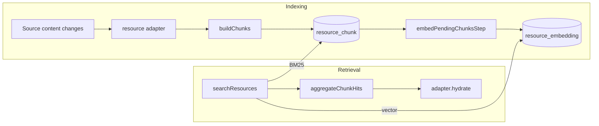
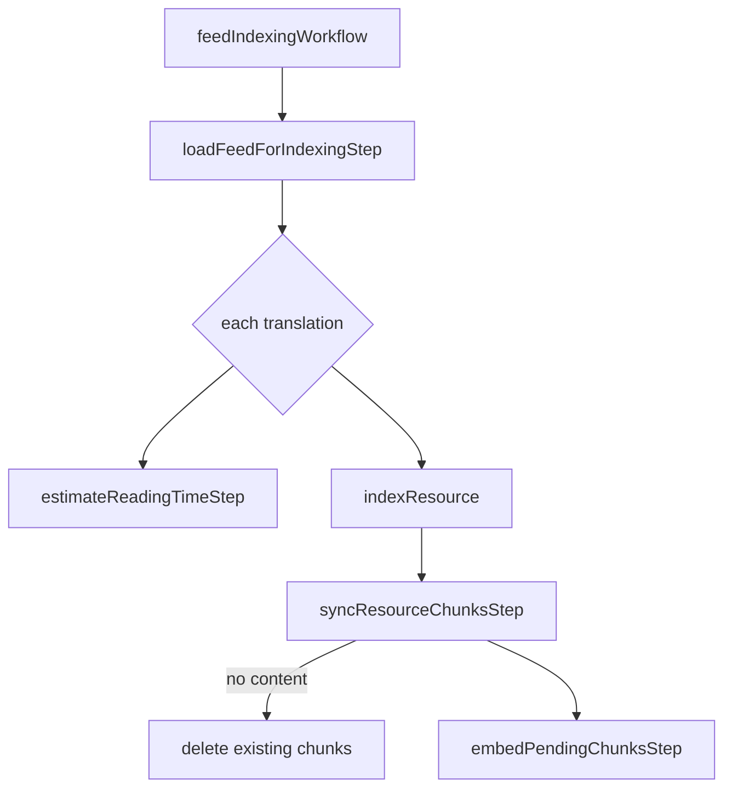

# RAG architecture: chunks, embeddings and retrieval

> Status: as-built
>
> Last updated: 2026-09-01
>
> 中文版：[docs/rag-architecture.zh.md](./rag-architecture.zh.md)

This document explains how content enters the index, how retrieval works, and which invariants must hold when changing models or adding resource types.

## 1. System overview

The retrieval system works only with **resources** and **chunks**. It does not know the business rules of feeds or agent memory. Each resource type supplies an adapter that splits content and hydrates results.


```mermaid
flowchart LR
    subgraph write["Indexing"]
        A[Source content changes] --> B[resource adapter]
        B --> C[buildChunks]
        C --> D[(resource_chunk)]
        D --> E[embedPendingChunksStep]
        E --> F[(resource_embedding)]
    end
    subgraph read["Retrieval"]
        G[searchResources] -->|BM25| D
        G -->|vector| F
        G --> H[aggregateChunkHits]
        H --> I[adapter.hydrate]
    end
```

| Term     | Definition                                                                        |
| -------- | --------------------------------------------------------------------------------- |
| resource | An indexable source. Current types are `feed_translation` and `agent_memory`.     |
| chunk    | The retrieval unit of a resource, either `card` or `section`.                     |
| adapter  | Implements `buildChunks` and `hydrate`, isolating source-specific business logic. |

Core rules:

- Indexing and retrieval depend only on the adapter contract. Adding a resource type must not change the shared retrieval flow.
- A chunk is the BM25 document, embedding input and snippet source. Stored text must match the text represented by its vector.
- `locale`, `published` and `deleted` are mirrored onto chunks so ParadeDB can filter inside the index.
- Chunks and embeddings use separate tables, allowing content and vector versions to change independently.

## 2. Storage model

### 2.1 `chia_resource_chunk`

```text
chia_resource_chunk
├── id
├── feed_translation_id / agent_memory_id   nullable FKs; exactly one is set
├── source_type / source_id                 generated columns
├── kind / chunk_index
├── content / heading_path / token_count / metadata
├── content_hash
├── locale / published / deleted
└── created_at / updated_at
```

Each resource type has its own nullable foreign key to preserve referential integrity and cascading deletion. Queries use the generated `source_type` and `source_id` columns. `CHECK (num_nonnulls(...) = 1)` ensures that each row belongs to one source type.

`UNIQUE (source_type, source_id, kind, chunk_index)` fixes a chunk's position within its resource. `content_hash = sha-256(content)` identifies content so moving a section does not require a new embedding.

ParadeDB indexes `content` with two fields:

- `icu` handles Traditional Chinese while preserving identifiers such as `ef_search`.
- `body_sub` uses the simple tokenizer so phrase queries can match parts of dotted paths.

Chinese queries use only `icu`; the simple tokenizer would treat a full CJK sequence as one token.

### 2.2 `chia_resource_embedding`

```text
chia_resource_embedding
├── chunk_id       FK → resource_chunk, cascade
├── model          EmbeddingProvider.id
├── index_version
├── embedding      vector(1536)
└── created_at / updated_at

PRIMARY KEY (chunk_id, model)
HNSW (vector_cosine_ops)
```

Every provider must currently output `EMBEDDING_DIMENSIONS = 1536`. Switching to a different width requires changing the constant, column and index, then rebuilding all vectors.

### 2.3 Chunk kinds

| Kind      | Count             | Purpose                                                                          |
| --------- | ----------------- | -------------------------------------------------------------------------------- |
| `card`    | One per resource  | Title, summary, tags and heading outline for topic similarity and related posts. |
| `section` | Many per resource | Body text split by headings for semantic and hybrid search.                      |

Card size depends on document structure. The outline includes headings through H3 and stops at 40 headings. A body excerpt of at most 400 tokens is used only when both summary and headings are absent.

## 3. Indexing flow

### 3.1 Triggers and ownership

Write paths notify indexing through lifecycle hooks on the oRPC context. They do not start workflows directly:

```text
feed create/update/restore → onFeedChanged → feedIndexingWorkflow
feed soft delete          → onFeedRemoved → removeFeedFromSearchIndexWorkflow
memory write              → onMemoryChanged → indexResourceWorkflow
```

Foreign-key cascades handle hard deletion. Soft deletion must remove chunks explicitly because the source row still exists and would otherwise remain searchable.

### 3.2 Feed indexing


```mermaid
flowchart TD
    A[feedIndexingWorkflow] --> B[loadFeedForIndexingStep]
    B --> C{each translation}
    C --> D[estimateReadingTimeStep]
    C --> E[indexResource]
    E --> F[syncResourceChunksStep]
    F -->|no content| G[delete existing chunks]
    F --> H[embedPendingChunksStep]
```

The workflow reads one feed snapshot so retries replay the same input. Reading-time and indexing branches use `Promise.allSettled` to isolate failures. Errors that exhaust retries must be logged.

`indexResource` is a composition function reusable inside an existing workflow. `indexResourceWorkflow` is the standalone entry point, avoiding unnecessary nested runs in the feed pipeline.

### 3.3 Chunk replacement

`syncResourceChunksStep` calls the adapter, then matches new and existing chunks by content before position:

```text
same kind + index + hash → update mirrored fields; keep vector
same kind + hash         → move row; keep vector
same kind + index        → rewrite row; delete old vector
unmatched new chunk      → insert
unmatched old chunk      → delete
```

Content determines identity, so inserting, deleting or moving a section does not re-embed every later chunk. Moves first use temporary negative indexes, then settle at their target positions to avoid intermediate unique-constraint collisions.

### 3.4 Embedding backlog

`embedPendingChunksStep` reads at most 32 chunks missing the current `(model, index_version)` vector. After each successful upsert, it queries again until the backlog is empty. Offset pagination over the initial snapshot is invalid because earlier writes would shift later offsets and skip rows.

Error handling:

- Provider 4xx responses other than 408 and 429 are permanent and become `FatalError`.
- 408, 429, 5xx and network errors use step retries.
- A successful batch that writes no rows cannot converge and fails immediately.

## 4. Chunking

The implementation lives in `packages/ai/src/embeddings/chunking.ts`. The section target is 512 tokens.

```text
MDX
  → remove imports, exports, expressions and JSX wrappers; keep text structure and bounded code blocks
  → split on top-level headings while tracking heading paths
  → write the heading path into the first line of each chunk's content
  → pack small sections within the same H1/H2 group
  → split oversized content by paragraph, sentence boundary, then token budget
  → discard results under 8 tokens
```

H1 and H2 headings are stable group boundaries. Packing cannot cross a group; otherwise an edit near the start of a document would change the composition and hash of every later chunk.

The heading path must appear in `content` because headings often contain query terms absent from the body. Every fragment of an oversized section repeats that prefix. Citation anchors are stored separately in `heading_path` or `metadata.headingPaths`.

Code blocks remain complete through 24 lines. Longer blocks keep the first 12 lines and an omission marker. A long unit without sentence boundaries must still be split to the token budget rather than relying on the provider guard to truncate it.

## 5. Retrieval flow

### 5.1 Search modes

`searchResources` supports three modes:

| Mode       | Behavior                                                                           |
| ---------- | ---------------------------------------------------------------------------------- |
| `bm25`     | ParadeDB `icu` matching plus a `body_sub` phrase query, with highlighted snippets. |
| `semantic` | Generate a query embedding with the current provider, then run cosine search.      |
| `hybrid`   | Retrieve BM25 and semantic candidates and merge them with RRF in one statement.    |

Hybrid uses a `FULL OUTER JOIN` to retain results found by only one side and scores them with `Σ 1/(60 + rank)`. ParadeDB cannot combine snippets with window functions, so hybrid results have no highlighting but still return the original chunk text as fallback.

Callers cannot choose the embedding model. Server-side provider configuration controls both queries and indexing. Retrieval over-fetches chunk candidates before resource aggregation so repeated hits from one source do not reduce the final result count below `limit`.

### 5.2 Aggregation and hydration

```text
chunk hits
  → group by source_type + source_id
  → sum the top three chunks with decay weights 1, 1/4, 1/16
  → retain the highest-scoring chunk for citation and preview
  → sort and trim to limit
  → adapter.hydrate restores title, description, href and locale in batches
```

The best chunk dominates the score while other hits add limited breadth. This prevents a long document with many ordinary matches from outranking a short document with one highly relevant match.

`hydrate` must use the same deletion and visibility rules as `buildChunks`. If they disagree, a matched resource can disappear during hydration.

### 5.3 Feed layer

- `searchFeedsService` converts translation results to feeds and deduplicates by `feedId`.
- `searchPublicFeedsService` always uses BM25 and returns the fields required by the public site.
- `getRelatedFeedsService` compares only card embeddings, requires the same locale and published, non-deleted content, and caches results for six hours.

### 5.4 LLM context

`packages/ai/src/embeddings/context.ts` assembles documents within one request-wide token budget. Each document tries these representations in order:

```text
full text → sections prioritizing matched headings → summary + outline
```

One document may use at most 60% of the total budget. If even the outline does not fit, the outline is truncated instead of dropping the document entirely.

Anchors must be computed from the complete original document before filtering to retained headings. Generating slugs from a subset would break the `-1` suffix assigned to repeated headings.

## 6. Agent memory resource

`agent_memory` uses the same adapter, chunking, embedding and retrieval flow:

- `source` stores pages read by `fetch_url`; `fact` and `lesson` are short content.
- Visibility is fixed at `{ locale: null, published: false, deleted: false }`. Search requires both `includeUnpublished: true` and `sourceTypes: ["agent_memory"]`.
- Only live, `active` memory produces chunks. Archived, deleted and pending lessons clear existing chunks.
- Every memory write triggers `indexResourceWorkflow`; full reindex must enumerate memory as well.

Public search, content tools and related posts default to `published = true`, so they cannot read agent memory.

## 7. Embedding provider

Every provider implements one seam:

```ts
interface EmbeddingProvider {
  readonly id: string;
  readonly dimensions: number;
  embed(
    texts: string[],
    task: "search_document" | "search_query"
  ): Promise<number[][]>;
}
```

`task` forces callers to distinguish documents from queries; asymmetric providers add the corresponding prefix. `provider.id` and `EMBEDDING_INDEX_VERSION` together determine whether a vector is current.

OpenAI `text-embedding-3-small` currently emits 1536 dimensions. Available Ollama models emit 384, 768 or 1024 dimensions, so `resolveEmbeddingProvider` rejects them before a database insert can fail.

The provider layer also:

- Truncates input against each model's token limit before the API call, reserving space for task prefixes.
- Splits batches by both 32-input and 250k-token limits.
- Dynamically loads and memoizes `js-tiktoken` only when the pessimistic estimate exceeds the budget, avoiding a permanent encoding-table allocation of about 32 MB in the web process.

## 8. Versioning and maintenance

### Bump `EMBEDDING_INDEX_VERSION`

Bump the version when changing:

- Preprocessing, card input or chunking rules.
- Chunk size, minimum threshold or splitting strategy.
- Embedding parameters such as task prefixes.

Content changes use `content_hash`; provider changes use `provider.id`. Neither requires a version bump.

### Full reindex

1. Bump `EMBEDDING_INDEX_VERSION`.
2. Start `rag.reindex:all` from the dashboard.
3. `listReindexTargetsStep` enumerates every resource, synchronizes its chunks and fills missing vectors.

Old vectors continue serving during the process, so reindexing needs no downtime. Every resource adapter must participate in target enumeration; an omitted type loses semantic search after stale embeddings are pruned.

### Change vector dimensions

1. Change `EMBEDDING_DIMENSIONS`.
2. Generate a migration for the embedding column and index.
3. Clear `resource_embedding` while retaining chunks.
4. Run a full reindex.

### Add a resource type

1. Add a nullable foreign key to `resource_chunk` and update generated columns, the check constraint and indexes.
2. Update the database resource-source mapping.
3. Implement and register a `ChunkableResource` adapter.
4. Add the type to full-reindex and preview target enumeration.

Generated-column expressions cannot be altered in place, so these migrations require manual review. Use `20260826191254_agent_memory` as a template, then run `db:generate`; it should produce no additional diff.

## 9. Constraints and reference

Current constraints:

- Retrieval evaluation lives in `toolings/scripts/rag-eval`. Record a baseline before changing RRF, aggregation or chunking.
- Hybrid mode has no highlighted snippet.
- `feed_translation.published` and `deleted` are not the visibility source of truth. Search uses the feed-derived values mirrored onto chunks.
- At the current corpus size, the planner chooses an exact sequential scan. When it starts using HNSW, tune `hnsw.ef_search` to the candidate limit and evaluate iterative scans.
- The database must already provide the `vector` and ParadeDB `pg_search` extensions; migrations do not create them.

Primary locations:

| Responsibility                   | Location                                                                            |
| -------------------------------- | ----------------------------------------------------------------------------------- |
| Embeddings, chunking and context | `packages/ai/src/embeddings/`                                                       |
| Schema, chunks and retrieval SQL | `packages/db/src/schemas/resources.schema.ts`, `packages/db/src/libs/resources/`    |
| Adapters and resource services   | `packages/api/resources/`                                                           |
| Feed search                      | `packages/api/feeds/search.ts`                                                      |
| Indexing workflows and steps     | `apps/workflow/src/workflows/`, `apps/workflow/src/steps/resource-index.step.ts`    |
| Context hooks and index runs     | `apps/service/src/factories/orpc.factory.ts`, `packages/api/resources/index-run.ts` |
