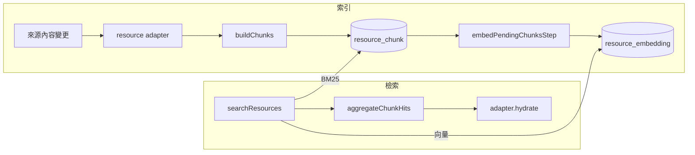
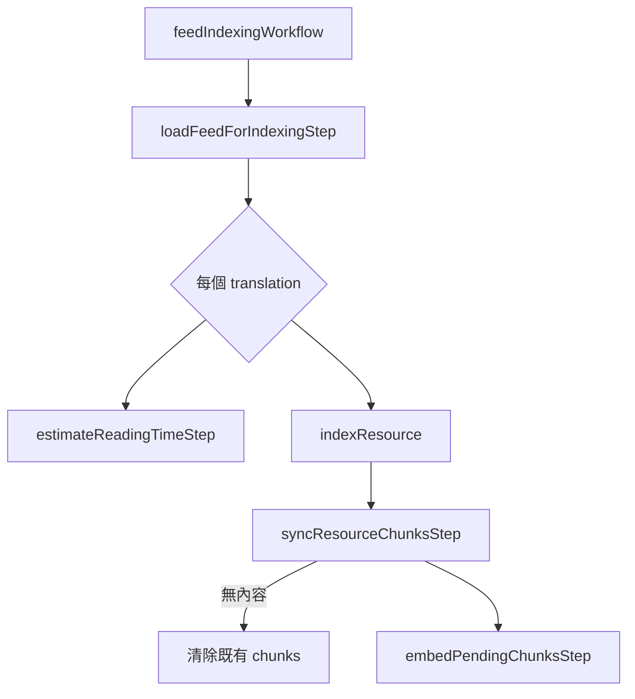

# RAG 架構：Chunk、Embedding 與檢索

> 狀態：現行架構（as-built）
>
> 最後更新：2026-09-01
>
> English: [docs/rag-architecture.md](./rag-architecture.md)

本文件說明內容如何進入索引、如何被檢索，以及更換模型或新增 resource type 時必須維持的規則。

## 1. 系統總覽

檢索系統只處理 **resource** 與 **chunk**，不知道 feed 或 agent memory 的業務細節。每個 resource type 透過 adapter 提供切分與結果還原方式。



| 名詞     | 定義                                                        |
| -------- | ----------------------------------------------------------- |
| resource | 可索引的來源。目前有 `feed_translation` 與 `agent_memory`。 |
| chunk    | resource 的檢索單位，分為 `card` 與 `section`。             |
| adapter  | 實作 `buildChunks` 與 `hydrate`，隔離來源的業務邏輯。       |

核心規則：

- 搜尋與索引只依賴 adapter contract。新增 resource type 不應修改共用檢索流程。
- chunk 同時是 BM25 文件、embedding 輸入和 snippet 來源；存下的文字必須與向量內容一致。
- `locale`、`published`、`deleted` 鏡像到 chunk，讓 ParadeDB 能在索引內過濾。
- chunk 與 embedding 分表，內容變更和向量版本可以獨立管理。

## 2. 儲存模型

### 2.1 `chia_resource_chunk`

```text
chia_resource_chunk
├── id
├── feed_translation_id / agent_memory_id   nullable FK，恰好一個有值
├── source_type / source_id                 generated columns
├── kind / chunk_index
├── content / heading_path / token_count / metadata
├── content_hash
├── locale / published / deleted
└── created_at / updated_at
```

每種 resource type 使用自己的 nullable FK，以保留 referential integrity 與 cascade delete；查詢端統一使用 generated 的 `source_type` 和 `source_id`。`CHECK (num_nonnulls(...) = 1)` 保證一列只屬於一種來源。

`UNIQUE (source_type, source_id, kind, chunk_index)` 固定 resource 內的位置。`content_hash = sha-256(content)` 用來辨識內容，避免段落搬動時重算 embedding。

ParadeDB 為 `content` 建立兩種欄位：

- `icu` 處理繁體中文並保留 `ef_search` 等 identifier。
- `body_sub` 使用 simple tokenizer，讓 phrase query 能命中 dotted path 的片段。

中文查詢只使用 `icu`，避免 simple tokenizer 把整段 CJK 視為單一 token。

### 2.2 `chia_resource_embedding`

```text
chia_resource_embedding
├── chunk_id       FK → resource_chunk, cascade
├── model          EmbeddingProvider.id
├── index_version
├── embedding      vector(1536)
└── created_at / updated_at

PRIMARY KEY (chunk_id, model)
HNSW (vector_cosine_ops)
```

目前所有 provider 必須輸出 `EMBEDDING_DIMENSIONS = 1536`。更換不同維度的模型需要修改常數、欄位與索引，再重建全部向量。

### 2.3 Chunk kind

| Kind      | 數量               | 用途                                                                |
| --------- | ------------------ | ------------------------------------------------------------------- |
| `card`    | 每個 resource 一個 | title、summary、tags 與 heading outline；用於主題相似度與相關文章。 |
| `section` | 每個 resource 多個 | 依 heading 切分的正文；用於語意與混合搜尋。                         |

Card 的大小由文件結構決定：outline 最多取到 H3、最多 40 個 heading。只有 summary 與 heading 都不存在時，才使用最多 400 token 的正文摘錄。

## 3. 索引流程

### 3.1 觸發與責任

寫入端透過 oRPC context 的 lifecycle hooks 通知索引，不直接啟動 workflow：

```text
feed create/update/restore → onFeedChanged → feedIndexingWorkflow
feed soft delete          → onFeedRemoved → removeFeedFromSearchIndexWorkflow
memory write              → onMemoryChanged → indexResourceWorkflow
```

硬刪除由 FK cascade 清除。軟刪除必須主動移除 chunk，否則來源 row 仍在且仍能被搜尋。

### 3.2 Feed indexing



Workflow 只讀一次 feed snapshot，讓 retry 重播相同輸入。Reading-time 與 indexing 分支以 `Promise.allSettled` 隔離失敗；耗盡 retry 的錯誤必須寫入 log。

`indexResource` 是可在既有 workflow 中重用的組合函式；`indexResourceWorkflow` 是獨立入口，避免 feed pipeline 產生不必要的巢狀 run。

### 3.3 Chunk replacement

`syncResourceChunksStep` 先呼叫 adapter，再以內容優先配對新舊 chunk：

```text
kind + index + hash 相同 → 更新鏡像欄位，保留向量
kind + hash 相同         → 搬動 row，保留向量
kind + index 相同        → 改寫 row，刪除舊向量
無對應的新 chunk         → insert
無對應的舊 chunk         → delete
```

身份以內容而非位置決定，因此插入、刪除或搬動段落不會讓後方所有 chunk 重新 embedding。搬動時先暫存到負數 index，再寫入目標位置，避免中途撞到 unique constraint。

### 3.4 Embedding backlog

`embedPendingChunksStep` 每輪讀取最多 32 個缺少目前 `(model, index_version)` 向量的 chunk，成功 upsert 後重新查詢，直到 backlog 為空。不能對初始 snapshot 做 offset pagination，否則前一批寫入後的 offset 會跳過資料。

錯誤分類：

- Provider 4xx（408、429 除外）是永久錯誤，轉成 `FatalError`。
- 408、429、5xx 與網路錯誤交給 step retry。
- 一批成功但寫入零列視為無法收斂，直接失敗。

## 4. Chunking

實作位於 `packages/ai/src/embeddings/chunking.ts`，section 目標大小為 512 token。

```text
MDX
  → 清除 import/export、expression 與 JSX 外殼，保留文字結構和受限 code block
  → 依 top-level heading 切 section 並追蹤 heading path
  → 將 heading path 寫入每個 chunk 的 content 第一行
  → 在同一 H1/H2 group 內打包小段落
  → 依段落、句末標點，再依 token budget 切分超長內容
  → 移除少於 8 token 的成品
```

H1/H2 是穩定的 group 邊界。打包不能跨 group，否則文件前方的編輯會改變後續所有 chunk 組成與 hash。

Heading path 必須寫入 `content`，因為 heading 常包含正文不會重複的查詢詞。超長 section 的每一片都重複此前綴；citation anchor 另外保存在 `heading_path` 或 `metadata.headingPaths`。

Code block 最多完整保留 24 行，超過時保留前 12 行與省略記號。單一無斷句的長內容仍須依 token budget 切分，不能只依靠 provider guard 截斷。

## 5. 檢索流程

### 5.1 搜尋模式

`searchResources` 支援三種模式：

| Mode       | 行為                                                                     |
| ---------- | ------------------------------------------------------------------------ |
| `bm25`     | ParadeDB 的 `icu` match 加 `body_sub` phrase query，並回傳高亮 snippet。 |
| `semantic` | 以目前 provider 產生 query embedding，再做 cosine search。               |
| `hybrid`   | BM25 與 semantic 各取候選，在同一 statement 以 RRF 合併。                |

Hybrid 使用 `FULL OUTER JOIN` 保留只出現在單側的結果，分數為 `Σ 1/(60 + rank)`。ParadeDB 不允許 snippet 與 window function 同時使用，因此 hybrid 不含高亮，但仍回傳 chunk 原文作為 fallback。

呼叫端不能指定 embedding model；查詢與索引都由 server-side provider 決定。搜尋先多取 chunk 候選，再聚合成 resource，避免多個命中來自同一來源時不足 `limit`。

### 5.2 聚合與 hydrate

```text
chunk hits
  → 依 source_type + source_id 分組
  → 以前三個 chunk 的衰減權重 1、1/4、1/16 加總
  → 保留最高分 chunk 作為 citation / preview
  → 排序並截到 limit
  → adapter.hydrate 批次還原 title、description、href、locale
```

最佳 chunk 主導分數，其餘命中提供有限加分，避免長文件靠大量普通結果壓過短文件的高相關結果。

`hydrate` 必須使用與 `buildChunks` 相同的刪除與可見性判定。兩者不一致會讓命中的 resource 在 hydrate 時消失。

### 5.3 Feed 層

- `searchFeedsService` 將 translation 結果轉成 feed，按 `feedId` 去重。
- `searchPublicFeedsService` 固定使用 BM25，回傳公開站台需要的欄位。
- `getRelatedFeedsService` 只比較 card embedding，限定同 locale、published、未刪除，並快取 6 小時。

### 5.4 LLM context

`packages/ai/src/embeddings/context.ts` 以每次請求的共享 token budget 組裝文件。每份文件依序嘗試：

```text
全文 → 命中 heading 優先的 sections → summary + outline
```

單一文件最多使用總預算的 60%。連 outline 都放不下時才截斷 outline，不會直接移除整份文件。

Anchor 必須先從完整原文計算，再依實際保留的 heading 篩選。直接對子集產生 slug 會破壞重複標題的 `-1` 編號。

## 6. Agent memory resource

`agent_memory` 使用同一套 adapter、chunking、embedding 與搜尋流程：

- `source` 保存 `fetch_url` 讀取的頁面；`fact` 和 `lesson` 是短內容。
- 可見性固定為 `{ locale: null, published: false, deleted: false }`。只有同時傳入 `includeUnpublished: true` 與 `sourceTypes: ["agent_memory"]` 才能搜尋。
- 只有 live 且 `active` 的 memory 產生 chunk。Archived、deleted 與 pending lesson 會清除既有 chunk。
- Memory 寫入每次都觸發 `indexResourceWorkflow`；全量 reindex 也必須列舉 memory。

公開搜尋、content tools 與相關文章預設只看 `published = true`，因此不會讀到 agent memory。

## 7. Embedding provider

所有 provider 實作同一個 seam：

```ts
interface EmbeddingProvider {
  readonly id: string;
  readonly dimensions: number;
  embed(
    texts: string[],
    task: "search_document" | "search_query"
  ): Promise<number[][]>;
}
```

`task` 強制呼叫端區分 document 與 query；非對稱模型由 provider 加上對應 prefix。`provider.id` 與 `EMBEDDING_INDEX_VERSION` 一起決定向量是否仍有效。

目前 OpenAI `text-embedding-3-small` 輸出 1536 維。Ollama 的既有模型輸出 384、768 或 1024 維，因此目前會在 `resolveEmbeddingProvider` 階段拒絕，不會等到資料庫 insert 才失敗。

Provider 層還負責：

- 在 API 前依模型 token limit 截斷輸入，並替 task prefix 預留空間。
- 依每批 32 筆與 250k token 兩個上限切 batch。
- 只在悲觀估算超過預算時動態載入並 memoize `js-tiktoken`，避免 web process 常駐約 32 MB 編碼表。

## 8. 版本與維護

### Bump `EMBEDDING_INDEX_VERSION`

以下改動需要 bump：

- 前處理、card input 或 chunking 規則。
- Chunk 大小、門檻與切分策略。
- Task prefix 等 embedding 參數。

內容變更由 `content_hash` 處理；更換 provider 由 `provider.id` 處理，兩者都不需要 bump。

### 全量 reindex

1. Bump `EMBEDDING_INDEX_VERSION`。
2. 從 dashboard 啟動 `rag.reindex:all`。
3. `listReindexTargetsStep` 列出每個 resource，逐一同步 chunk 並補齊向量。

舊向量在過程中繼續服務，所以不需停機。每個 resource adapter 都必須加入 reindex target 列舉；遺漏的 type 在 prune 後會失去 semantic search。

### 更換向量維度

1. 修改 `EMBEDDING_DIMENSIONS`。
2. 產生 migration 修改 embedding 欄位與索引。
3. 清除 `resource_embedding`，保留 chunk。
4. 執行全量 reindex。

### 新增 resource type

1. 在 `resource_chunk` 增加 nullable FK，更新 generated columns、check constraint 與 indexes。
2. 更新 DB resource source mapping。
3. 實作並註冊 `ChunkableResource` adapter。
4. 加入全量 reindex 與 preview 的 target 列舉。

Generated column expression 無法原地修改，相關 migration 必須人工檢查。`20260826191254_agent_memory` 可作為範本；完成後執行 `db:generate`，結果應無額外 diff。

## 9. 限制與參考

現有限制：

- 排序品質基準在 `toolings/scripts/rag-eval`。修改 RRF、聚合或 chunking 前先留 baseline。
- Hybrid 模式沒有高亮 snippet。
- `feed_translation.published` 與 `deleted` 不是可見性的真相來源；搜尋使用 chunk 上由 feed 計算的鏡像。
- 目前語料量讓 planner 選擇精確的 seq scan。開始使用 HNSW 後，需要依 candidate limit 調整 `hnsw.ef_search`，並評估 iterative scan。
- 資料庫必須預先提供 `vector` 與 ParadeDB `pg_search` extension；migration 不建立它們。

主要位置：

| 責任                         | 位置                                                                                |
| ---------------------------- | ----------------------------------------------------------------------------------- |
| Embedding、chunking、context | `packages/ai/src/embeddings/`                                                       |
| Schema、chunk 與搜尋 SQL     | `packages/db/src/schemas/resources.schema.ts`、`packages/db/src/libs/resources/`    |
| Adapter 與 resource service  | `packages/api/resources/`                                                           |
| Feed 搜尋                    | `packages/api/feeds/search.ts`                                                      |
| Indexing workflows 與 steps  | `apps/workflow/src/workflows/`、`apps/workflow/src/steps/resource-index.step.ts`    |
| Context hooks 與 index run   | `apps/service/src/factories/orpc.factory.ts`、`packages/api/resources/index-run.ts` |
