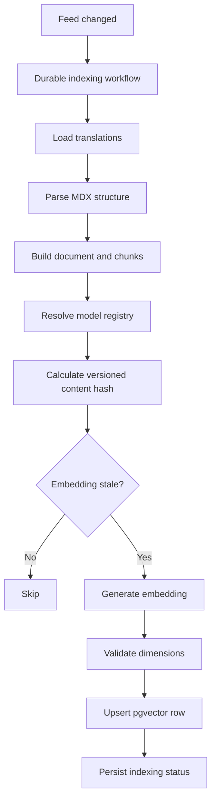
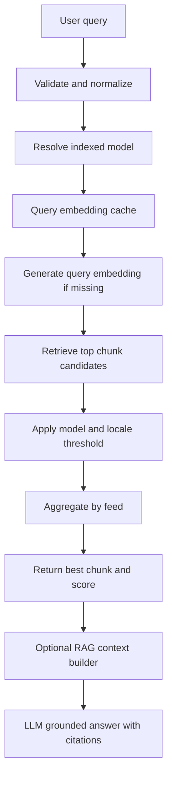

# RAG 架構優化規劃

> 狀態：Phase 0–3 已實作，待 migration + reindex；Phase 4–5 未開始  
> 建立日期：2026-07-14  
> 最後更新：2026-07-14  
> 範圍：Feed embedding、向量檢索、chunking、RAG context 與品質評測

## 0. 執行狀態

| Phase                                | 狀態                    | 備註                                                            |
| ------------------------------------ | ----------------------- | --------------------------------------------------------------- |
| Phase 0：正確性修正                  | ✅ 已實作               | registry、cache key/TTL、擋未索引模型、keyword 必填             |
| Phase 1：索引版本與狀態              | ✅ 已實作（簡化版）     | `kind` + `index_version`；**未採用雙版本切換**，見下方決策      |
| Phase 2：Chunking 與索引             | ✅ 已實作               | `@langchain/textsplitters` + `js-tiktoken` + AI SDK `embedMany` |
| Phase 3：Vector-only Chunk Retrieval | ✅ 已實作               | top-N 候選 → 程式端 feed 聚合                                   |
| Migration                            | 🔶 SQL 已備妥，尚未執行 | `20260714093921_feeds_index_refactor`（含 legacy backfill）     |
| 全量 reindex                         | ⬜ 待 migration 後執行  | 對全部 feed 觸發 `syncFeedSearchIndex`                          |
| Phase 4：評測與可觀測性              | ⬜ 未開始               | 降級為 golden queries + vitest script，待 reindex 完成          |
| Phase 5：完整 RAG                    | ⬜ 未開始               |                                                                 |

### 與原規劃的差異（實作決策）

1. **不做雙版本 blue/green index 切換**（原 6.3）。以部落格規模，reindex 是分鐘級、美分級成本；改為 `index_version` 納入 stale 判定後**就地覆寫**，查詢端不 filter 版本。Rollback = 調回版本號重跑 workflow。
2. **`content_hash` 改為 hash 原始內容**（title/description/summary/content 的 JSON），而非處理後文字——preprocessing/chunking 改版由 `index_version` 表達，內容變更（含只改 code block）由 hash 表達，兩者職責分離。原 6.3 的複合 fingerprint 不採用。
3. **Preprocessing 分兩層**：`stripMdx`（移除 code）保留給 document-level 向量（related feeds 的主題比對）；chunk 走新的 `cleanMdxKeepStructure`（保留 heading 結構與 code block，≤24 行完整、更長保留前 12 行）。
4. **現成套件取代自建**：chunk 切分用 `@langchain/textsplitters`（markdown-aware）；token 計數用 `js-tiktoken`（cl100k_base）；batch embedding 用 AI SDK `embedMany`（document + chunks 單次 API call，原第 10 節的 batch input 需求一併解決）。
5. **Workflow observability 不自建**，直接用 Workflow SDK 內建（`npx workflow inspect` / Vercel dashboard）。Phase 4 只自建 golden queries 評測 script。
6. **後續提醒**：第 8 節 regression dataset 的 exact-term 類查詢（package 名、CLI、error message）是 vector search 弱項；若 Phase 4 評測證實，解法是補 RRF hybrid（與既有 Algolia 融合，約 50 行），而非繼續調 vector 參數。

### 主要落點

- Registry：`packages/ai/src/embeddings/utils.ts`（`EMBEDDING_MODEL_REGISTRY`、`EMBEDDING_INDEX_VERSION`）
- Chunking：`packages/ai/src/embeddings/chunking.ts`
- Retrieval / 寫入：`packages/db/src/libs/feeds/embedding.ts`（`searchFeeds`、`getRelatedFeeds`、`replaceFeedEmbeddings`）
- Pipeline：`apps/service/src/workflows/feed-embeddings.workflow.ts` + `steps/feed-embeddings.step.ts`
- Query cache：`apps/service/src/services/feeds.service.ts`
- Migration：`packages/db/.drizzle/migrations/20260714093921_feeds_index_refactor/migration.sql`

## 1. 背景

目前專案已具備語意搜尋與相關文章推薦的基礎：

- Feed 更新後由 durable workflow 建立 embedding。
- 每個 translation 可依 model 與 chunk 儲存獨立向量。
- PostgreSQL + pgvector 使用 HNSW 與 cosine similarity 搜尋。
- `text-embedding-3-small` 作為 canonical model。
- `nomic-embed-text` 作為 optional local model。
- 使用 content hash 跳過未變更內容。
- Algolia 負責公開關鍵字搜尋，向量搜尋主要用於管理端搜尋與相關文章。

目前較準確的定位是「語意搜尋與推薦」，尚未完成完整的 Retrieval-Augmented Generation，因為檢索結果還沒有統一經過 context builder 注入 LLM，也沒有 citation、grounding 與 insufficient-evidence 行為。

## 2. 本輪目標

1. 修正 embedding model、索引資料與搜尋入口之間的一致性問題。
2. 修正 query embedding cache 的 key 與 TTL。
3. 為 embedding 加入可控的索引版本，支援安全 reindex。
4. 將 doc-level embedding 擴充為 structure-aware chunk embedding。
5. 建立 vector-only chunk retrieval 與 feed aggregation。
6. 建立可量化的中英文檢索評測與可觀測性。
7. 為後續完整 RAG 的 context、citation 與安全邊界建立介面。

## 3. 非目標

本輪明確不處理：

- Hybrid Retrieval（Algolia/BM25 與向量結果融合）。
- 取代或移除既有 Algolia 公開搜尋。
- Agent、工具呼叫或多步推理流程。
- 未經評測就全面更換 embedding model。
- 未經 `EXPLAIN ANALYZE` 驗證就提前進行資料表 partition。
- 直接使用大型 LLM rerank 所有搜尋結果。

Hybrid Retrieval 可在 vector-only baseline 穩定、評測資料齊全後另案規劃。

## 4. 已知問題

### 4.1 可選模型與已建立索引的模型不一致（✅ 已修正）

管理端目前會顯示所有 `TextEmbeddingModel` 與 `OllamaEmbeddingModel`，但 indexing workflow 實際只建立：

- `text-embedding-3-small`
- `nomic-embed-text`

選擇其他模型時仍可能產生 query embedding 與 API 成本，但 DB 沒有對應 document embedding，最終只會回傳空結果。

### 4.2 Cache key 可能碰撞（✅ 已修正）

搜尋服務使用 `snakeCase(keyword)` 組成 cache key。標點、大小寫與部分技術詞經正規化後可能產生相同 key，導致不同查詢錯用同一個 embedding。

### 4.3 Cache TTL 單位錯誤（✅ 已修正）

Keyv TTL 使用毫秒；目前的 `60 * 60 * 24` 約為 86.4 秒，而不是 24 小時。

### 4.4 Content hash 缺少索引版本（✅ 已修正，見執行狀態決策 2）

目前 hash 只反映處理後文字，無法完整涵蓋：

- model dimensions
- task prefix
- chunking 策略
- preprocessing 版本
- embedding provider/model revision

設定變更後可能無法可靠觸發 reindex。

### 4.5 Embedding 狀態資訊不足（🔶 部分改善）

Dashboard 的 `hasEmbedding` 只表示 translation 存在任一 embedding，無法判斷 canonical model 是否存在、是否過期或 workflow 是否部分失敗。

### 4.6 Doc-level embedding 會遺失長文章後段資訊（✅ 已修正）

整篇文章目前只建立單一向量，且超過上限時直接截斷。後半段內容與局部技術細節無法被有效檢索。

### 4.7 技術內容 preprocessing 過度移除 code block（✅ 已修正）

`stripMdx()` 會移除完整 fenced code block，可能連同函式名稱、套件名稱、CLI 指令與錯誤訊息一起移除。

### 4.8 缺少 retrieval 品質基準（⬜ 未處理，Phase 4）

目前沒有 golden queries 與 Recall@K、MRR、nDCG 等基準，因此無法客觀比較模型、chunk size、threshold 或 reranker 的效果。

## 5. 目標架構

### 5.1 索引流程



### 5.2 查詢流程

本輪採 vector-only retrieval：



Algolia 公開搜尋維持現狀，不與上述向量結果融合。

## 6. 設計方案

### 6.1 建立統一 Embedding Model Registry

建立單一 registry，供 workflow、搜尋 API、Dashboard 與 DB validation 共用。

建議欄位：

```ts
interface EmbeddingModelConfig {
  model: EmbeddingModel;
  provider: "openai" | "ollama";
  dimensions: 512 | 1536;
  indexed: boolean;
  canonical: boolean;
  queryEnabled: boolean;
  documentTask: "search_document";
  queryTask: "search_query";
  indexVersion: string;
  defaultThreshold: number;
}
```

規則：

- Dashboard 只顯示 `queryEnabled && indexed` 的模型。
- 搜尋 API 對未索引模型回傳明確的 400 或 422，不再安靜回傳空陣列。
- Workflow 由 registry 取得待索引模型，不再維護另一份陣列。
- 啟動或測試時驗證模型 dimensions 與實際輸出一致。
- canonical model 必須唯一。

### 6.2 修正 Query Embedding Cache

Cache key：

```text
feeds:query-embedding:{cacheVersion}:{model}:{locale}:{sha256(normalizedQuery)}
```

規則：

- 保留語意相關標點，不使用 `snakeCase()` 當唯一識別。
- TTL 使用明確的毫秒常數：`24 * 60 * 60 * 1000`。
- cached value 建議包含 `model`、`dimensions`、`embedding` 與 `createdAt`。
- 讀取時驗證 JSON、array、有限數值與 dimensions。
- 壞快取應刪除並重新生成，不應直接造成搜尋失敗。

### 6.3 Versioned Embedding Index

建議將 embedding 指紋定義為：

```text
sha256(indexVersion + model + dimensions + preprocessingVersion + chunkText)
```

DB 建議增加：

- `index_version text not null`
- `kind text not null`，值為 `document` 或 `chunk`
- 可選：`heading_path text`
- 可選：`token_count integer`

`kind` 用來避免 `chunkIndex = 0` 同時代表 document row 與第一個 chunk。

Reindex 規則：

- model、dimensions、preprocessing 或 chunking 策略改變時提升 `indexVersion`。
- workflow 比對 model + kind + chunkIndex + indexVersion + contentHash。
- 新版本全部 ready 後才切換搜尋版本。
- 舊版本延後清理，保留短期 rollback 能力。

### 6.4 Structure-aware Chunking

第一版建議：

- 依 Markdown/MDX heading 邊界切分。
- 目標 chunk size：300～600 tokens。
- overlap：50～100 tokens。
- 每個 chunk 注入文章 title 與 heading path。
- 避免在段落、list item 或 code block 中間切斷。
- translation locale 作為 metadata 與 DB filter。
- chunk text 寫入既有 `chunkText`。

Embedding input 範例：

```text
Title: PostgreSQL pgvector 使用筆記
Section: HNSW > ef_search 調校

{chunk content}
```

Document row 可保留作為 related feeds 的文章級向量；chunk rows 用於精細搜尋與未來 RAG context。

### 6.5 技術內容處理

調整 MDX preprocessing：

- 移除 import/export 與純 UI markup。
- 保留 heading、paragraph、list、table 的有效文字。
- 短 code block 保留完整內容。
- 長 code block至少保留：
  - language
  - identifiers
  - comments
  - command/error lines
- 可將大型 code block拆成 `code` chunk，但第一版不新增額外 embedding kind。

### 6.6 Vector-only Chunk Retrieval

第一版檢索流程：

1. 取得 top 20～30 chunk candidates。
2. 過濾 model、indexVersion、locale、published、deleted 狀態。
3. 使用 model registry 的 calibrated threshold。
4. 依 `feedId` 聚合，避免同一篇文章佔滿結果。
5. 每篇文章保留最佳 chunk；可選擇加權第二個 chunk。
6. 回傳 top 5 feeds 與 best matching chunk。

建議 response 至少包含：

```ts
interface RetrievalItem {
  feedId: number;
  translationId: number;
  slug: string;
  locale: Locale;
  title: string;
  chunkIndex: number;
  chunkText: string;
  similarity: number;
  model: EmbeddingModel;
  indexVersion: string;
}
```

Threshold 不應跨模型共用固定值；先以 registry 預設值啟動，再用 golden queries 校正。

### 6.7 RAG Context Builder

Context builder 與向量搜尋解耦，輸入為 `RetrievalItem[]`，輸出為有 token budget 的 context blocks。

每個 block 包含：

- source ID
- feed ID
- title
- slug
- locale
- heading path
- chunk text

規則：

- 設定總 context token budget。
- 限制單篇文章可佔用的 chunk 數量。
- 低於最低證據門檻時不進行 grounded generation。
- 文章內容視為不可信資料，不允許覆蓋 system instructions。
- 回答必須附 source ID，API 再映射為 citation。
- 證據不足時回傳明確的 insufficient-evidence 狀態。

完整 RAG generation endpoint 可在 vector retrieval 穩定後實作，不阻塞前面階段。

## 7. 分階段執行計畫

### Phase 0：正確性修正（✅ 已完成）

工作項目：

- 建立 embedding model registry。
- Workflow 與 Dashboard 改用 registry。
- 阻擋未索引模型的搜尋請求。
- 驗證每個啟用模型的實際 dimensions。
- 修正 cache key、TTL 與 cache payload validation。
- 將搜尋 keyword 改為必填並限制合理長度。

主要檔案：

- `packages/ai/src/embeddings/utils.ts`
- `packages/ai/src/embeddings/openai.ts`
- `packages/ai/src/embeddings/ollama.ts`
- `apps/service/src/services/feeds.service.ts`
- `apps/service/src/validators/feeds.validator.ts`
- `apps/service/src/workflows/feed-embeddings.workflow.ts`
- `apps/dash/src/components/feed/search-feed.tsx`

驗收標準：

- UI 不再顯示未建立索引的模型。
- API 無法對未索引模型執行昂貴但無結果的 query embedding。
- 不同原始 query 不會因 `snakeCase()` 共用 cache。
- Query embedding cache TTL 為 24 小時。
- Cache dimensions 不正確時會自動失效並重建。

### Phase 1：索引版本與狀態（✅ 已完成，簡化版）

工作項目：

- 增加 `indexVersion` 與 `kind` schema。
- 將版本納入 stale 判定。
- 建立新版本 backfill 流程。
- 改善 Dashboard embedding 狀態。
- 保存 canonical model 的 ready/stale/missing/failed 狀態。

主要檔案：

- `packages/db/src/schemas/contents.schema.ts`
- `packages/db/src/libs/feeds/embedding.ts`
- `packages/db/src/libs/feeds/index.ts`
- `apps/service/src/steps/feed-embeddings.step.ts`
- `apps/service/src/workflows/feed-embeddings.workflow.ts`
- `apps/dash/src/components/feed/meta-chip.tsx`

驗收標準：

- 提升 index version 後可觸發完整 reindex。
- 新版本失敗時搜尋仍可使用舊版本。
- Dashboard 能區分 canonical embedding 缺失與 optional embedding 存在。

### Phase 2：Chunking 與索引（✅ 已完成）

工作項目：

- 建立 MDX structure parser 與 chunker。
- 改善 code block preprocessing。
- 對每個 translation 建立 document row 與 chunk rows。
- 刪除內容縮短後多出的舊 chunk rows。
- 為 chunker、hash 與 workflow 補測試。

主要檔案：

- `packages/ai/src/embeddings/utils.ts`
- 建議新增 `packages/ai/src/embeddings/chunking.ts`
- `apps/service/src/steps/feed-embeddings.step.ts`
- `apps/service/src/workflows/feed-embeddings.workflow.ts`
- `packages/db/src/libs/feeds/embedding.ts`

驗收標準：

- 長文章後半段內容可被檢索。
- Chunk 邊界不會任意截斷 heading、paragraph 或 code block。
- Feed 內容縮短後不保留孤兒 chunk。
- 相同內容與版本不會重複呼叫 embedding provider。

### Phase 3：Vector-only Chunk Retrieval（✅ 已完成）

工作項目：

- 新增 chunk search repository function。
- 取得候選 chunks 並依 feed 聚合。
- 回傳 best chunk 與 citation metadata。
- 相關文章仍使用 document embedding。
- 依 model/locale 校正 threshold。

主要檔案：

- `packages/db/src/libs/feeds/embedding.ts`
- `apps/service/src/services/feeds.service.ts`
- `apps/service/src/routes/feeds.route.ts`
- `packages/api/services/validators.ts`

驗收標準：

- 一篇文章不會重複佔滿 top results。
- 搜尋結果包含最佳 matching chunk。
- Published、deleted、locale、model 與 indexVersion filters 正確。
- 查詢效能達到定義的 P95 目標。

### Phase 4：評測與可觀測性（⬜ 未開始）

工作項目：

- 建立中英文 golden query dataset。
- 實作離線 retrieval evaluation command。
- 記錄 workflow 成功率、freshness lag 與 provider failure。
- 記錄搜尋 latency、zero-result rate、model 與 result count。
- 使用 `EXPLAIN ANALYZE` 檢查 HNSW query plan。

評測指標：

- Recall@5
- MRR
- nDCG@5
- zero-result rate
- P50/P95 retrieval latency
- indexing freshness lag
- embedding request count/cost
- workflow failure rate

驗收標準：

- 每次調整 model、chunk size 或 threshold 都能產生可比較報告。
- 可區分中文與英文查詢品質。
- 可辨識 indexing failure 與 retrieval zero-result 的原因。

### Phase 5：完整 RAG（後續）（⬜ 未開始）

工作項目：

- 建立 context builder。
- 將 retrieval 接到獨立的 grounded generation endpoint。
- 加入 citation、insufficient-evidence 與 prompt injection 防護。
- 視評測結果決定是否加入 multilingual reranker。

此階段不包含 Hybrid Retrieval。

## 8. 測試策略

### Unit tests

- Model registry 唯一 canonical model。
- Model dimensions 與 provider response validation。
- Query normalization 與 cache key 無碰撞案例。
- Cache TTL 與壞 payload fallback。
- MDX chunk boundaries。
- Code block preservation。
- Versioned hash。
- Feed aggregation。

### Integration tests

- PostgreSQL + pgvector cosine search。
- model、locale、published、deleted、indexVersion filters。
- Workflow stale detection 與 upsert。
- 內容縮短時刪除多餘 chunks。
- Ollama unavailable 不阻塞 canonical model。
- OpenAI transient error retry 與 permanent error handling。

### Regression dataset

至少涵蓋：

- 中文概念查詢。
- 英文概念查詢。
- package/function exact term。
- CLI command。
- error message。
- 同義詞。
- 答案位於長文章後半段。
- 查無證據。

## 9. Migration 與 Rollback

### Migration

1. 新增 nullable 欄位或使用安全 default。
2. 部署可同時讀取舊版與新版的程式。
3. 啟動新版 backfill。
4. 驗證 coverage、錯誤率與 retrieval metrics。
5. 切換 active index version。
6. 觀察穩定後清理舊 rows。

### Rollback

- Active index version 可切回舊版。
- Backfill 不覆蓋舊版本向量。
- 新增 schema 在穩定前不刪除舊欄位或舊索引。
- RAG generation 與 retrieval API 解耦，可單獨停用 generation。

## 10. 效能注意事項

啟用 chunking 後 row 數量會顯著增加，需要觀察：

- HNSW index size。
- `model` 與 `indexVersion` filter 是否造成 ANN under-fetch。
- `hnsw.ef_search` 與 iterative scan。
- workflow fan-out 是否觸發 provider rate limit。
- 單次 reindex 成本。

在資料量與 query plan 證明有需求前，不先進行 partition。必要時再評估：

- model-specific partial HNSW index。
- 依 model partition。
- bounded workflow concurrency。
- batch embedding input。

## 11. 完成定義

本輪核心優化完成需同時滿足：

- 模型選項、索引模型與查詢模型一致。
- Query embedding cache 正確且可驗證。
- 索引設定變更可透過 version 安全 reindex。
- 長文章使用 structure-aware chunks 建立向量。
- 向量搜尋可回傳聚合後的最佳文章與 matching chunk。
- 有中英文 golden queries 與基準報告。
- 主要失敗、延遲與 freshness 可觀測。
- Hybrid Retrieval 未被納入或暗中耦合到本輪實作。

## 12. 建議執行順序

1. Phase 0：先消除錯誤結果與不必要成本。
2. Phase 1：建立可 rollback 的版本化索引基礎。
3. Phase 2：實作 chunking 與 backfill。
4. Phase 3：切換至 vector-only chunk retrieval。
5. Phase 4：用評測結果校正 threshold 與 chunk 參數。
6. Phase 5：確認 retrieval 品質後再接完整 RAG generation。
