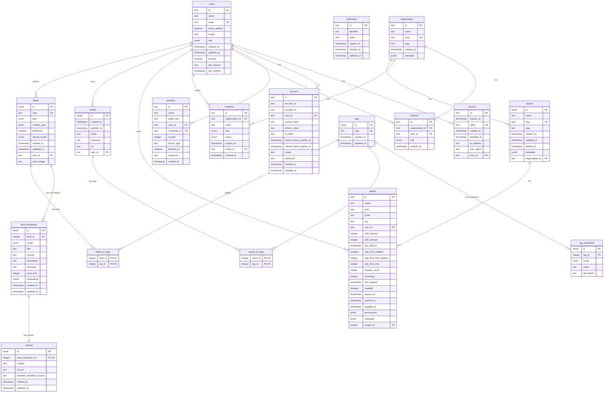

# DB Schema

## Entity Relationship Diagram



## Tables Overview

### Users & Authentication

| Table          | Description                             |
| -------------- | --------------------------------------- |
| `users`        | User accounts with roles and ban status |
| `session`      | Active user sessions with tokens        |
| `account`      | OAuth provider accounts linked to users |
| `verification` | Email/phone verification tokens         |
| `passkey`      | WebAuthn/FIDO2 passkey credentials      |

### Organization & Projects

| Table          | Description                          |
| -------------- | ------------------------------------ |
| `organization` | Organizations/teams                  |
| `member`       | Organization membership (user ↔ org) |
| `invitation`   | Pending organization invitations     |
| `project`      | Projects within organizations        |
| `apikey`       | API keys for projects/users          |

### Content Management (i18n Support)

| Table              | Description                                   |
| ------------------ | --------------------------------------------- |
| `tags`             | Language-agnostic tag identifiers             |
| `tag_translation`  | Localized tag names and descriptions          |
| `assets`           | Uploaded files/media                          |
| `feeds`            | Articles/notes (language-agnostic metadata)   |
| `feed_translation` | Localized feed content (title, excerpt, etc.) |
| `content`          | Full article content per translation          |
| `feed_meta`        | SEO metadata for feeds                        |
| `assets_to_tags`   | Asset ↔ Tag junction table                    |
| `feeds_to_tags`    | Feed ↔ Tag junction table                     |

## i18n Architecture

The content system uses a **translation table pattern** for full internationalization support:

```
Feed (language-agnostic)
  └── FeedTranslation (per locale: en, zh-tw)
        └── Content (full article body)
```

### Query Example

```typescript
// Get feed with Chinese translation
const feed = await db.query.feeds.findFirst({
  where: eq(feeds.slug, "my-article"),
  with: {
    translations: {
      where: eq(feedTranslations.locale, "zh-tw"),
      with: { content: true },
    },
  },
});
```

## Enums

| Enum                | Values                                       |
| ------------------- | -------------------------------------------- |
| `role`              | `admin`, `user`, `root`                      |
| `feed_type`         | `post`, `note`                               |
| `content_type`      | `mdx`, `notion`, `tiptap`, `plate`           |
| `i18n`              | `en`, `zh-tw`                                |
| `invitation_status` | `pending`, `accepted`, `rejected`, `expired` |
| `member_role`       | `owner`, `admin`, `member`                   |
